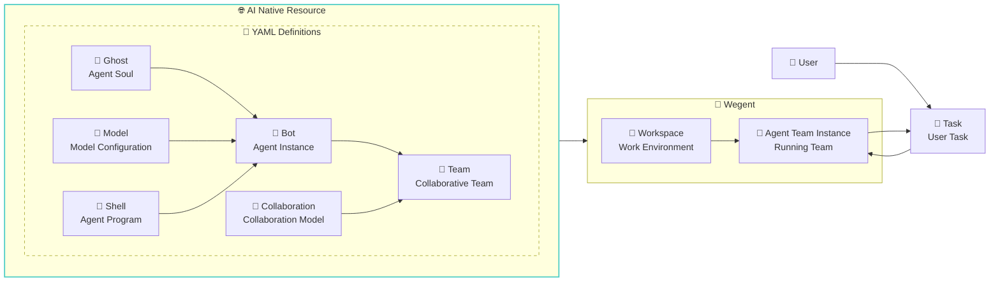
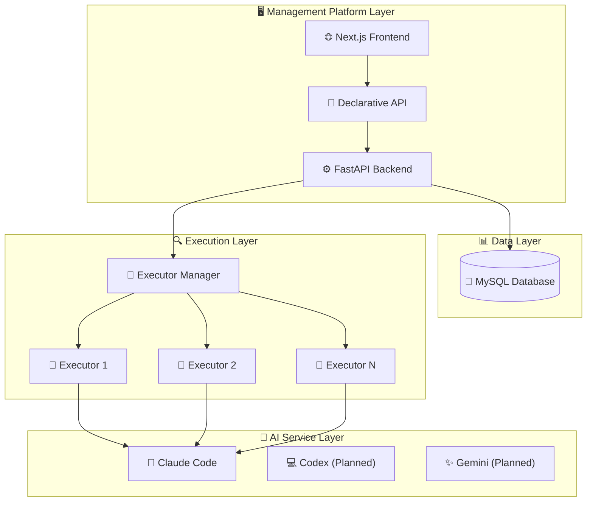

# Wegent

[](https://python.org)
[](https://fastapi.tiangolo.com)
[](https://nextjs.org)
[](https://docker.com)
[](https://claude.ai)

> 🚀 An open-source platform to define, organize, and run Agentic AI

## 📖 Overview

Wegent is an open-source AI native operating system that enables you to define, organize, and run intelligent agents at scale. Built on Kubernetes-style declarative API and CRD (Custom Resource Definition) design patterns, Wegent provides a standardized framework for creating and managing AI agent ecosystems.



### 🎯 Key Concepts

- **👻 Ghost**: The "soul" of an agent - defines personality, capabilities, and behavior patterns
- **🧠 Model**: AI model configuration - defines environment variables and model parameters
- **🐚 Shell**: The "environment" - runtime configuration that references a Model
- **🤖 Bot**: A complete agent instance combining Ghost + Shell + Model
- **👥 Team**: Composed of multiple Bots + Collaboration Model, defining how agents work together
- **🤝 Collaboration**: Defines the interaction patterns between Bots in a Team (like Workflow)
- **💼 Workspace**: Isolated work environments for tasks and projects
- **🎯 Task**: Executable units of work assigned to teams

### ✨ Why Wegent?

- **🌟 Standardized**: Universal AI agent runtime specifications, like Kubernetes for containers
- **🔧 Declarative**: Define and manage agents through simple YAML configurations
- **🤝 Collaborative**: Built-in support for multi-agent teamwork and orchestration

## 🚀 Quick Start

### Prerequisites

- Docker and Docker Compose
- Git

### Installation

1. **Clone the repository**
   ```bash
   git clone https://github.com/wecode-ai/wegent.git
   cd wegent
   ```

2. **Start the platform**
   ```bash
   docker-compose up -d
   ```

3. **Access the web interface**
   - Open http://localhost:3000 in your browser

### [Create Your First Agent Team](docs/backend/example.yaml)

## 🏗️ Architecture



## ✨ Features

- **Multi-Model Support**: Currently supports Claude Code, with plans for Codex and Gemini
- **Flexible Configuration**: Customizable agent personalities and capabilities
- **Task Orchestration**: Intelligent scheduling and execution

## 🛠️ Development

### Project Structure

```
wegent/
├── backend/          # FastAPI backend service
├── frontend/         # Next.js web interface
├── executor/         # Task execution engine
├── executor_manager/ # Execution orchestration
├── shared/           # Common utilities and models
└── docker/           # Container configurations
```

### Development Setup

1. **Backend Development**
   ```bash
   cd backend
   pip install -r requirements.txt
   uvicorn app.main:app --host 0.0.0.0 --port 8000 --reload
   ```

2. **Frontend Development**
   ```bash
   cd frontend
   npm install
   npm run dev
   ```

3. **Run Tests**
   ```bash
   # Backend tests
   cd backend && python -m pytest
   
   # Frontend tests
   cd frontend && npm test
   ```


## 🤝 Contributing

We welcome contributions! Please see our [Contributing Guide](CONTRIBUTING.md) for details.

### Development Workflow

1. Fork the repository
2. Create a feature branch
3. Make your changes
4. Add tests
5. Submit a pull request

## 📞 Support

- 🐛 Issues: [GitHub Issues](https://github.com/wecode-ai/wegent/issues)

---

<p align="center">Made with ❤️ by WeCode-AI Team</p>
