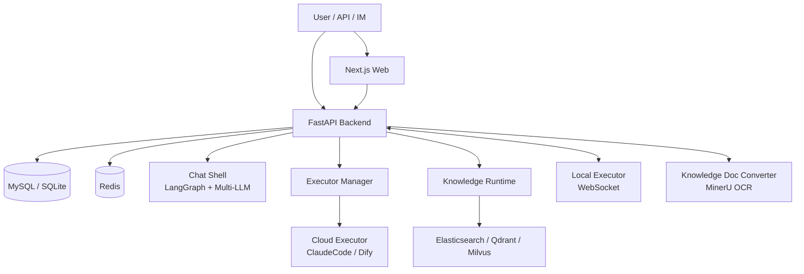

# Wegent

> A self-hostable AI workspace for chat, coding, knowledge bases, automation, and local execution.

English | [简体中文](README_zh.md)

[](https://python.org)
[](https://fastapi.tiangolo.com)
[](https://nextjs.org)
[](https://docker.com)
[](https://claude.ai)
[](https://ai.google.dev)
[](https://github.com/wecode-ai/wegent/releases)

<div align="center">

[Quick Start](#-quick-start) · [Core Scenarios](#core-scenarios) · [How It Grows](#how-it-grows) · [Documentation](https://wecode-ai.github.io/wegent-docs/) · [Development Guide](https://wecode-ai.github.io/wegent-docs/docs/category/developer-guide)

</div>

---

## Why Wegent

Wegent is a self-hostable AI workspace for managing chat, coding tasks, knowledge bases, automation, and local execution in one place. You can ask questions over your own materials, hand code repositories to AI, turn recurring information checks into automated feeds, and let your team use the same assistants from DingTalk, Telegram, or other tools. When a task needs local repositories or intranet access, it can run on your own machine.

- **Start privately**: Launch a self-hosted workspace with one command and begin with chat and knowledge Q&A.
- **Grow into team workflows**: Share common assistants, models, tools, and knowledge bases instead of configuring them repeatedly.
- **Choose where work runs**: Run coding tasks, automation, and local-device jobs in the environment that fits the job.
- **Fit existing tools**: Bring AI into your current workflow through APIs or IM bots.

---

## 🚀 Quick Start

Prerequisite: Docker and Docker Compose.

```bash
curl -fsSL https://raw.githubusercontent.com/wecode-ai/Wegent/main/install.sh | bash -s -- --standalone
```

This starts the default Standalone mode: one container with SQLite for local trials and lightweight deployments.

Then open http://localhost:3000 in your browser.

### Deployment Modes

| Mode | Best For |
|------|----------|
| **Standalone** (default) | Single container + SQLite, best for personal trials and lightweight deployments |
| **Standard** | Multi-container + MySQL + Redis, best for teams and production |
| **Development** | Source startup + hot reload, best for development and extensions |

```bash
# Standalone mode (default)
curl -fsSL https://raw.githubusercontent.com/wecode-ai/Wegent/main/install.sh | bash -s -- --standalone

# Standard mode
curl -fsSL https://raw.githubusercontent.com/wecode-ai/Wegent/main/install.sh | bash -s -- --standard

# Development mode
git clone https://github.com/wecode-ai/Wegent.git && cd Wegent && ./start.sh
```

<details>
<summary><b>Common Commands</b></summary>

```bash
# Standalone mode
docker logs -f wegent-standalone
docker restart wegent-standalone

# Standard mode
docker compose logs -f
docker compose down
docker compose up -d

# Development mode
./start.sh --status
./start.sh --restart
./start.sh --stop
```

</details>

See [Standalone Mode](docs/en/deployment/standalone-mode.md) and [Quick Start](docs/en/getting-started/quick-start.md) for details.

---

## Core Scenarios

### Chat, Group Chat, and File Handling


Set up a private AI chat entrypoint. Wegent supports multiple models, multi-turn history, group chat with @mentions, file parsing, clarifying questions, answer checking, and long-term memory. When needed, AI can also read files, run commands, or generate diagrams.

### Let AI Work on Code Repositories


Let AI work on code in isolated environments. Wegent connects to GitHub, GitLab, Gitea, and Gerrit so agents can clarify requirements, create branches, modify code, run tests, commit changes, and open pull requests.

### Track Information and Publish Feeds


Turn AI into a continuously running task trigger. Set schedules or event triggers so AI can summarize information, analyze webpages, filter notifications, and publish results as a feed.

### Knowledge Q&A


Upload documents, import webpages, or sync DingTalk multi-dimensional tables to build team knowledge bases. Wegent handles parsing, conversion, indexing, and retrieval so AI can answer with your own materials.

### Local Device Execution


Install a local runner on your own machine and connect it securely to Wegent. Tasks can switch between cloud environments and local devices, which is useful when AI needs access to local repositories, intranet resources, or dedicated development environments.

### Team Tools and Existing Systems

Connect Wegent agents to DingTalk, Telegram, and other IM tools, or call them from existing applications through an API.

---

## How It Grows

You do not need to learn every concept upfront. Wegent can start as a private AI workspace: choose a model, create an assistant, upload materials, and chat. As your team starts reusing these capabilities, you can turn common assistants, knowledge bases, coding tasks, and IM entrypoints into shared workflows.

| Stage | How You Can Use Wegent |
|-------|------------------------|
| **Personal use** | Start the service and create your own AI assistants and knowledge bases |
| **Team collaboration** | Share common assistants, model settings, knowledge bases, and coding tasks |
| **Automated workflows** | Let AI handle work through schedules, event triggers, or IM bots |
| **Deep integration** | Connect Wegent to existing systems through APIs, tools, and configuration files |

<details>
<summary><b>Core concepts for customization and extension</b></summary>

Internally, Wegent splits an AI assistant into reusable pieces:

```text
Ghost (prompt + MCP + Skills)
  + Shell (Chat / ClaudeCode / Dify)
  + Model (Claude / OpenAI / Gemini / DeepSeek / GLM, etc.)
  = Bot

Multiple Bots + collaboration mode = Team (the user-facing Agent)
Team + Workspace = Task (a traceable execution)
```

These relationships can be created in the web UI or managed with YAML. The web wizard supports "describe requirements → AI follow-up questions → live prompt tuning → one-click creation."

</details>

---

## Deployment and Integration

Wegent can grow from a personal trial to a team deployment:

- **Personal trial**: Standalone mode starts one container, suitable for a laptop or lightweight server.
- **Team deployment**: Standard mode uses dedicated database, cache, and execution services for long-running use.
- **Local devices**: Connect your own machine as a place to run tasks that need local repositories or intranet access.
- **Existing systems**: Connect Wegent to team tools through APIs or IM bots.

<details>
<summary><b>Technical component overview</b></summary>


```mermaid
graph TB
    User["User / API / IM"] --> Frontend["Next.js Web"]
    User --> Backend["FastAPI Backend"]
    Frontend --> Backend

    Backend --> MySQL[("MySQL / SQLite")]
    Backend --> Redis[("Redis")]
    Backend --> ChatShell["Chat Shell<br/>LangGraph + Multi-LLM"]
    Backend --> ExecutorManager["Executor Manager"]
    Backend --> KnowledgeRuntime["Knowledge Runtime"]

    ExecutorManager --> CloudExecutor["Cloud Executor<br/>ClaudeCode / Dify"]
    Backend <--> LocalExecutor["Local Executor<br/>WebSocket"]
    KnowledgeRuntime --> VectorStore["Elasticsearch / Qdrant / Milvus"]
    Backend --> DocConverter["Knowledge Doc Converter<br/>MinerU OCR"]
```

</details>

---

## For Developers and Team Admins

- **Application integration**: Call Wegent agents from your own apps through `/api/v1/responses`.
- **External tools**: Use MCP to let AI call existing tools and services.
- **Reusable capabilities**: Package specialized abilities as Skills and load them only when needed.
- **Flexible runtimes**: Use different runtime engines for chat, coding tasks, multi-agent work, and external app proxying.
- **Central model management**: OpenAI, Claude, Gemini, DeepSeek, GLM, and protocol-compatible model services.
- **Team sharing and permissions**: Groups, shared agents, shared models, shared Skills, and admin management.
- **Observability**: OpenTelemetry support across backend, frontend, and execution services.

---

## Built-in Assistants

| Assistant | Purpose |
|-----------|---------|
| `chat-team` | General AI assistant with Mermaid diagram support |
| `translator` | Multi-language translation |
| `dev-team` | Git workflow: branch, code, commit, PR |
| `wiki-team` | Codebase Wiki documentation generation |

---

## Documentation

- [Quick Start](docs/en/getting-started/quick-start.md)
- [Installation Guide](docs/en/getting-started/installation.md)
- [Core Concepts](docs/en/concepts/core-concepts.md)
- [Skill System](docs/en/concepts/skill-system.md)
- [YAML Specification](docs/en/reference/yaml-specification.md)
- [OpenAPI Responses API](docs/en/reference/openapi-responses-api.md)
- [Developer Guide](docs/en/developer-guide/README.md)

---

## Contributing

We welcome contributions! Please see our [Contributing Guide](CONTRIBUTING.md) for details.

## Support

- 🐛 Issues: [GitHub Issues](https://github.com/wecode-ai/wegent/issues)
- 💬 Discord: [Join our community](https://discord.gg/MVzJzyqEUp)

## Contributors

Thanks to the following developers for their contributions and efforts to make this project better. 💪

<!-- readme: contributors -start -->
<table>
<tr>
    <td align="center">
        <a href="https://github.com/qdaxb">
            
            <br />
            <sub><b>Axb</b></sub>
        </a>
    </td>
    <td align="center">
        <a href="https://github.com/Micro66">
            
            <br />
            <sub><b>MicroLee</b></sub>
        </a>
    </td>
    <td align="center">
        <a href="https://github.com/feifei325">
            
            <br />
            <sub><b>Feifei</b></sub>
        </a>
    </td>
    <td align="center">
        <a href="https://github.com/FicoHu">
            
            <br />
            <sub><b>FicoHu</b></sub>
        </a>
    </td>
    <td align="center">
        <a href="https://github.com/cc-yafei">
            
            <br />
            <sub><b>YaFei Liu</b></sub>
        </a>
    </td>
    <td align="center">
        <a href="https://github.com/icycrystal4">
            
            <br />
            <sub><b>Icycrystal4</b></sub>
        </a>
    </td>
    <td align="center">
        <a href="https://github.com/kissghosts">
            
            <br />
            <sub><b>Yanhe</b></sub>
        </a>
    </td>
    <td align="center">
        <a href="https://github.com/parabala">
            
            <br />
            <sub><b>Parabala</b></sub>
        </a>
    </td></tr>
<tr>
    <td align="center">
        <a href="https://github.com/johnny0120">
            
            <br />
            <sub><b>Johnny0120</b></sub>
        </a>
    </td>
    <td align="center">
        <a href="https://github.com/moqimoqidea">
            
            <br />
            <sub><b>Moqimoqidea</b></sub>
        </a>
    </td>
    <td align="center">
        <a href="https://github.com/yixiangxx">
            
            <br />
            <sub><b>Yi Xiang</b></sub>
        </a>
    </td>
    <td align="center">
        <a href="https://github.com/joyway1978">
            
            <br />
            <sub><b>Joyway78</b></sub>
        </a>
    </td>
    <td align="center">
        <a href="https://github.com/sunnights">
            
            <br />
            <sub><b>Jake Zhang</b></sub>
        </a>
    </td>
    <td align="center">
        <a href="https://github.com/cocowh">
            
            <br />
            <sub><b>Birch</b></sub>
        </a>
    </td>
    <td align="center">
        <a href="https://github.com/2561056571">
            
            <br />
            <sub><b>Xuemin</b></sub>
        </a>
    </td>
    <td align="center">
        <a href="https://github.com/fengkuizhi">
            
            <br />
            <sub><b>Fengkuizhi</b></sub>
        </a>
    </td></tr>
<tr>
    <td align="center">
        <a href="https://github.com/jnhu76">
            
            <br />
            <sub><b>Jm.hu</b></sub>
        </a>
    </td>
    <td align="center">
        <a href="https://github.com/kerwin612">
            
            <br />
            <sub><b>Kerwin Bryant</b></sub>
        </a>
    </td>
    <td align="center">
        <a href="https://github.com/RockysGit">
            
            <br />
            <sub><b>RockysGit</b></sub>
        </a>
    </td>
    <td align="center">
        <a href="https://github.com/maquan0927">
            
            <br />
            <sub><b>Just Quan</b></sub>
        </a>
    </td>
    <td align="center">
        <a href="https://github.com/DavidLeeUX">
            
            <br />
            <sub><b>Kva</b></sub>
        </a>
    </td>
    <td align="center">
        <a href="https://github.com/junbaor">
            
            <br />
            <sub><b>Junbaor</b></sub>
        </a>
    </td>
    <td align="center">
        <a href="https://github.com/fingki">
            
            <br />
            <sub><b>Fingki</b></sub>
        </a>
    </td>
    <td align="center">
        <a href="https://github.com/flyhope">
            
            <br />
            <sub><b>李枨煊</b></sub>
        </a>
    </td></tr>
<tr>
    <td align="center">
        <a href="https://github.com/jolestar">
            
            <br />
            <sub><b>Jolestar</b></sub>
        </a>
    </td>
    <td align="center">
        <a href="https://github.com/code-wangdi">
            
            <br />
            <sub><b>Code-wangdi</b></sub>
        </a>
    </td>
    <td align="center">
        <a href="https://github.com/haosenwang1018">
            
            <br />
            <sub><b>Sense_wang</b></sub>
        </a>
    </td>
    <td align="center">
        <a href="https://github.com/LiDaiyan">
            
            <br />
            <sub><b>Li Daiyan</b></sub>
        </a>
    </td>
    <td align="center">
        <a href="https://github.com/qwertyerge">
            
            <br />
            <sub><b>Erdawang</b></sub>
        </a>
    </td>
    <td align="center">
        <a href="https://github.com/DeadLion">
            
            <br />
            <sub><b>Jasper Zhong</b></sub>
        </a>
    </td>
    <td align="center">
        <a href="https://github.com/rayzhang0603">
            
            <br />
            <sub><b>Ray</b></sub>
        </a>
    </td>
    <td align="center">
        <a href="https://github.com/RichardoMrMu">
            
            <br />
            <sub><b>RichardoMu</b></sub>
        </a>
    </td></tr>
<tr>
    <td align="center">
        <a href="https://github.com/Ged0">
            
            <br />
            <sub><b>_</b></sub>
        </a>
    </td>
    <td align="center">
        <a href="https://github.com/andrewzq777">
            
            <br />
            <sub><b>Andrewzq777</b></sub>
        </a>
    </td>
    <td align="center">
        <a href="https://github.com/ch15084">
            
            <br />
            <sub><b>Ch15084</b></sub>
        </a>
    </td>
    <td align="center">
        <a href="https://github.com/gdouyang">
            
            <br />
            <sub><b>Gdouyang</b></sub>
        </a>
    </td>
    <td align="center">
        <a href="https://github.com/graindt">
            
            <br />
            <sub><b>Graindt</b></sub>
        </a>
    </td>
    <td align="center">
        <a href="https://github.com/qingchengliu">
            
            <br />
            <sub><b>Qingcheng</b></sub>
        </a>
    </td>
    <td align="center">
        <a href="https://github.com/salt-hai">
            
            <br />
            <sub><b>Salt-hai</b></sub>
        </a>
    </td>
    <td align="center">
        <a href="https://github.com/wxcfox">
            
            <br />
            <sub><b>Wxcfox</b></sub>
        </a>
    </td></tr>
</table>
<!-- readme: contributors -end -->

---

<p align="center">Made with ❤️ by WeCode-AI Team</p>
