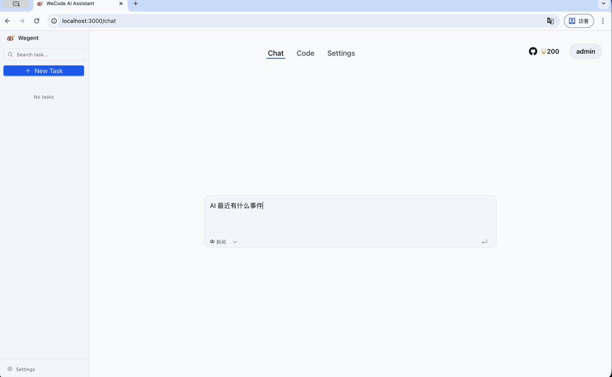

# Wegent

> 🚀 An open-source AI-native operating system to define, organize, and run intelligent agent teams

English | [简体中文](README_zh.md)

[](https://python.org)
[](https://fastapi.tiangolo.com)
[](https://nextjs.org)
[](https://docker.com)
[](https://claude.ai)
[](https://ai.google.dev)
[](https://github.com/wecode-ai/wegent/releases)

<div align="center">

**YAML-driven agent teams | 4 collaboration modes | Real-time group chat | Sandboxed execution**



[Quick Start](#-quick-start) · [Documentation](docs/en/README.md) · [Development Guide](docs/en/guides/developer/setup.md)

</div>

---

## ✨ Core Scenarios

### 💬 Chat Mode
Multi-LLM (Claude/OpenAI/Gemini) · Multimodal · Web Search · Deep Thinking
**Collaboration**: 4 modes · Group chat · Task sharing · On-demand Skills
**Integration**: MCP tools · OpenAI-compatible API · Export PDF/DOCX

### 💻 Code Mode
**Git Integration**: GitHub / GitLab / Gitea / Gitee / Gerrit
**Execution**: ClaudeCode · Agno · Sandboxed isolation · Parallel execution
**Assist**: Requirement clarification · Wiki generation · Error correction

### 📚 Knowledge Mode *(Experimental)*
**RAG**: Vector/Keyword/Hybrid retrieval · Elasticsearch/Qdrant
**Documents**: PDF · Markdown · DOCX · Code files

---

## 🔧 Extensibility

**Agent Wizard** - 4-step creation: Describe → AI clarifies → Live test → One-click create
**YAML Config** - Kubernetes-style CRD, pure config for Ghost/Bot/Team/Skill
**MCP Tools** - Model Context Protocol for external tools and services
**Execution Engines** - ClaudeCode (Docker) · Agno (Docker) · Dify (API) · Chat (Direct)

---

## 🔐 Deployment & Operations
OIDC/SSO · Namespace isolation · API Key management · OpenTelemetry · Admin panel · i18n (en/zh) · Dark Mode

---

## 🚀 Quick Start

```bash
git clone https://github.com/wecode-ai/wegent.git && cd wegent
docker-compose up -d
# Open http://localhost:3000
```

> Optional: Enable RAG features with `docker compose --profile rag up -d`

---

## 📦 Built-in Agents

| Team | Purpose |
|------|---------|
| chat-team | General AI assistant + Mermaid diagrams |
| translator | Multi-language translation |
| dev-team | Git workflow: branch → code → commit → PR |
| wiki-team | Codebase Wiki documentation generation |

---

## 🏗️ Architecture

`Frontend (Next.js)` → `Backend (FastAPI)` → `Executor Manager` → `Executors (ClaudeCode/Agno/Dify/Chat)`

> **Core Concepts**: Ghost (prompt) + Shell (environment) + Model = Bot → Multiple Bots + Collaboration = Team
> See [Core Concepts](docs/en/concepts/core-concepts.md) | [YAML Spec](docs/en/reference/yaml-specification.md)

---

## 🤝 Contributing

We welcome contributions! Please see our [Contributing Guide](CONTRIBUTING.md) for details.

## 📞 Support

- 🐛 Issues: [GitHub Issues](https://github.com/wecode-ai/wegent/issues)

## 👥 Contributors

Thanks to the following developers for their contributions and efforts to make this project better. 💪

<!-- readme: contributors -start -->
<table>
<tr>
    <td align="center">
        <a href="https://github.com/qdaxb">
            
            <br />
            <sub><b>Axb</b></sub>
        </a>
    </td>
    <td align="center">
        <a href="https://github.com/feifei325">
            
            <br />
            <sub><b>Feifei</b></sub>
        </a>
    </td>
    <td align="center">
        <a href="https://github.com/Micro66">
            
            <br />
            <sub><b>MicroLee</b></sub>
        </a>
    </td>
    <td align="center">
        <a href="https://github.com/cc-yafei">
            
            <br />
            <sub><b>YaFei Liu</b></sub>
        </a>
    </td>
    <td align="center">
        <a href="https://github.com/johnny0120">
            
            <br />
            <sub><b>Johnny0120</b></sub>
        </a>
    </td>
    <td align="center">
        <a href="https://github.com/moqimoqidea">
            
            <br />
            <sub><b>Moqimoqidea</b></sub>
        </a>
    </td>
    <td align="center">
        <a href="https://github.com/kissghosts">
            
            <br />
            <sub><b>Yanhe</b></sub>
        </a>
    </td>
    <td align="center">
        <a href="https://github.com/2561056571">
            
            <br />
            <sub><b>Xuemin</b></sub>
        </a>
    </td></tr>
<tr>
    <td align="center">
        <a href="https://github.com/junbaor">
            
            <br />
            <sub><b>Junbaor</b></sub>
        </a>
    </td>
    <td align="center">
        <a href="https://github.com/joyway1978">
            
            <br />
            <sub><b>Joyway78</b></sub>
        </a>
    </td>
    <td align="center">
        <a href="https://github.com/fengkuizhi">
            
            <br />
            <sub><b>Fengkuizhi</b></sub>
        </a>
    </td>
    <td align="center">
        <a href="https://github.com/jolestar">
            
            <br />
            <sub><b>Jolestar</b></sub>
        </a>
    </td>
    <td align="center">
        <a href="https://github.com/andrewzq777">
            
            <br />
            <sub><b>Andrewzq777</b></sub>
        </a>
    </td>
    <td align="center">
        <a href="https://github.com/graindt">
            
            <br />
            <sub><b>Graindt</b></sub>
        </a>
    </td></tr>
</table>
<!-- readme: contributors -end -->

---

<p align="center">Made with ❤️ by WeCode-AI Team</p>
