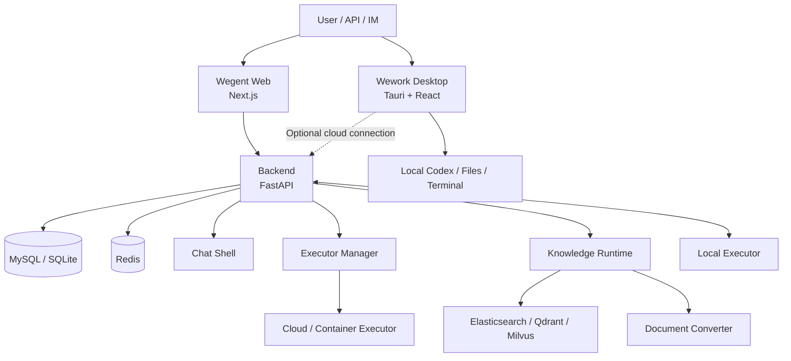

# Wegent

> An open-source, self-hostable platform for building and running AI agent teams.

English | [简体中文](README_zh.md)

[](https://github.com/wecode-ai/Wegent/actions/workflows/test.yml)
[](LICENSE)
[](https://github.com/wecode-ai/Wegent/issues)

Wegent helps teams create and share AI agents that perform real work across chat, coding, knowledge, and automation. Manage team capabilities on the web, and use Wework when agents need to work directly with local projects and development environments.

<div align="center">

**[Deploy Wegent](#quick-start)** · **[Download Wework](https://github.com/wecode-ai/Wegent/releases?q=Wework+macOS+DMG+build&expanded=true)** · **[Documentation](https://wecode-ai.github.io/wegent-docs/)**

</div>


## What You Can Build

| Scenario | What Wegent provides |
| --- | --- |
| **Team AI assistants** | A private chat entry point with shared models, knowledge, skills, group collaboration, and file handling |
| **AI coding** | Change code, run tests, commit updates, and open pull requests in isolated or local environments |
| **Knowledge assistants** | Parse and index documents, webpages, and enterprise data for grounded answers |
| **Continuous automation** | Track information, analyze webpages, filter notifications, and publish feeds from schedules and events |
| **Local and private-network execution** | Work with local code, CLIs, browsers, dedicated development environments, and intranet resources |
| **Existing system integration** | Bring agents into applications and team tools through APIs, MCP, and IM bots |

## Choose How You Work

| Use Wegent Web | Use Wework |
| --- | --- |
| Create and share agents, models, knowledge bases, and automation | Open local projects and let AI use files, terminals, CLIs, and development environments |
| Manage users, permissions, and execution devices | Use local Codex, local models, and the local executor |
| Serve teams through the browser, APIs, and IM | Focus on daily AI coding and local workflows |

Wework can connect to a team deployment of Wegent to use shared models, cloud devices, and remote tasks while working locally.

**[Deploy Wegent](#quick-start)** · **[Download Wework](https://github.com/wecode-ai/Wegent/releases?q=Wework+macOS+DMG+build&expanded=true)**

## Why Choose Wegent

| Capability | Benefit |
| --- | --- |
| **Reuse capabilities** | Combine models, knowledge, tools, and skills into agents that work across many tasks |
| **Let bots collaborate** | Organize bots to divide research, analysis, coding, and review work |
| **Run tasks in the right place** | Choose cloud, containers, local devices, or private environments based on where code and data live |
| **Reach teams from every entry point** | Use the same agent capabilities from the web, Wework, APIs, and IM |

## Quick Start

### Deploy Wegent Web

Prerequisite: Docker. Run Wegent in a single container with SQLite:

```bash
curl -fsSL https://raw.githubusercontent.com/wecode-ai/Wegent/main/install.sh | bash -s -- --standalone
```

After it starts:

1. Open http://localhost:3000.
2. Follow the setup flow to create the administrator password.
3. Configure a model and API key in Settings.
4. Choose a built-in agent and send your first message.

Common management commands:

```bash
wegent-standalone status
wegent-standalone logs
wegent-standalone restart
wegent-standalone stop
```

If the command is not in your current `PATH`, use `~/.local/bin/wegent-standalone`.

### Use Wework

Download Wework and open a local project to start AI coding. Wework includes local execution and can also connect to a team deployment of Wegent from Settings.

While a task runs, Wework keeps the latest tool activity visible. The tool list shows about 3.5 rows by default and remains scrollable; the latest row and any running tool use a shimmer cue, while command output, search details, and file changes can be expanded individually. Intermediate narrative text closes only the current tool segment, which remains summarized as called tools. Once the final answer starts, the processing timeline collapses into a separated processed row and expands back into the same tool list.

**[Download Wework Desktop](https://github.com/wecode-ai/Wegent/releases?q=Wework+macOS+DMG+build&expanded=true)**

### Wegent Web Deployment Options

| Option | Best for | Start here |
| --- | --- | --- |
| **Standalone** | Personal trials and lightweight self-hosting | Use the install command above |
| **Standard** | Team deployments with MySQL, Redis, and dedicated services | [Installation Guide](docs/en/getting-started/installation.md) |
| **Development** | Contributing and extending Wegent | [Development Setup](docs/en/developer-guide/setup.md) |

Standalone can also use `host`, `container`, or `hybrid` executor modes. See [Standalone Mode](docs/en/deployment/standalone-mode.md) for details.

## Agent Model

<details>
<summary>See how Wegent organizes agents and tasks</summary>

Wegent manages capabilities, collaboration, and runtime context separately so they can be reused across tasks and environments.

```text
Ghost (prompt + MCP + skills)
  + Shell (Chat / ClaudeCode / Agno / Dify)
  + Model
  = Bot

Multiple Bots + collaboration mode = Team (the user-facing Agent)
Team + Workspace = Task (a traceable execution)
```

Manage these resources through the UI, YAML, or APIs. See [Core Concepts](docs/en/concepts/core-concepts.md) and the [YAML Specification](docs/en/reference/yaml-specification.md) for details.

</details>

## Architecture

<details>
<summary>View Wegent's technical components</summary>


```mermaid
graph TB
    User["User / API / IM"] --> Frontend["Wegent Web<br/>Next.js"]
    User --> Wework["Wework Desktop<br/>Tauri + React"]
    Frontend --> Backend["Backend<br/>FastAPI"]
    Wework -. "Optional cloud connection" .-> Backend
    Wework --> LocalWork["Local Codex / Files / Terminal"]

    Backend --> Database[("MySQL / SQLite")]
    Backend --> Redis[("Redis")]
    Backend --> ChatShell["Chat Shell"]
    Backend --> ExecutorManager["Executor Manager"]
    Backend --> KnowledgeRuntime["Knowledge Runtime"]

    ExecutorManager --> CloudExecutor["Cloud / Container Executor"]
    Backend <--> LocalExecutor["Local Executor"]
    KnowledgeRuntime --> VectorStore["Elasticsearch / Qdrant / Milvus"]
    KnowledgeRuntime --> DocConverter["Document Converter"]
```

</details>

### Repository Map

| Directory | Responsibility |
| --- | --- |
| `frontend/` | Wegent Web product |
| `backend/` | REST API and core business logic |
| `wework/` | Tauri desktop workbench |
| `executor/` | Agent task execution environments |
| `executor_manager/` | Executor scheduling and orchestration |
| `chat_shell/` | Chat runtime |
| `knowledge_runtime/` | Knowledge retrieval services |
| `knowledge_doc_converter/` | Document parsing and conversion |
| `shared/` | Modules shared across services |

## Documentation

- [Quick Start](docs/en/getting-started/quick-start.md)
- [Installation and Deployment](docs/en/getting-started/installation.md)
- [Core Concepts](docs/en/concepts/core-concepts.md)
- [User Guide](docs/en/user-guide/README.md)
- [OpenAPI Responses API](docs/en/reference/openapi-responses-api.md)
- [Developer Guide](docs/en/developer-guide/README.md)
- [Troubleshooting](docs/en/troubleshooting.md)

## Get Involved

Bug reports, documentation improvements, code contributions, and new ways of using Wegent are all welcome.

- [Contributing Guide](CONTRIBUTING.md)
- [Security Policy](SECURITY.md)
- [GitHub Issues](https://github.com/wecode-ai/Wegent/issues)
- [Discord Community](https://discord.gg/MVzJzyqEUp)
- [License](LICENSE)

## Contributors

Thanks to everyone who helps Wegent grow.

<!-- readme: contributors -start -->
<table>
	<tbody>
		<tr>
            <td align="center">
                <a href="https://github.com/qdaxb">
                    
                    <br />
                    <sub><b>Axb</b></sub>
                </a>
            </td>
            <td align="center">
                <a href="https://github.com/Micro66">
                    
                    <br />
                    <sub><b>MicroLee</b></sub>
                </a>
            </td>
            <td align="center">
                <a href="https://github.com/feifei325">
                    
                    <br />
                    <sub><b>Feifei</b></sub>
                </a>
            </td>
            <td align="center">
                <a href="https://github.com/FicoHu">
                    
                    <br />
                    <sub><b>FicoHu</b></sub>
                </a>
            </td>
            <td align="center">
                <a href="https://github.com/icycrystal4">
                    
                    <br />
                    <sub><b>Icycrystal4</b></sub>
                </a>
            </td>
            <td align="center">
                <a href="https://github.com/cc-yafei">
                    
                    <br />
                    <sub><b>YaFei Liu</b></sub>
                </a>
            </td>
            <td align="center">
                <a href="https://github.com/kissghosts">
                    
                    <br />
                    <sub><b>Yanhe</b></sub>
                </a>
            </td>
            <td align="center">
                <a href="https://github.com/johnny0120">
                    
                    <br />
                    <sub><b>Johnny0120</b></sub>
                </a>
            </td>
		</tr>
		<tr>
            <td align="center">
                <a href="https://github.com/parabala">
                    
                    <br />
                    <sub><b>Parabala</b></sub>
                </a>
            </td>
            <td align="center">
                <a href="https://github.com/moqimoqidea">
                    
                    <br />
                    <sub><b>Moqimoqidea</b></sub>
                </a>
            </td>
            <td align="center">
                <a href="https://github.com/yixiangxx">
                    
                    <br />
                    <sub><b>Yi Xiang</b></sub>
                </a>
            </td>
            <td align="center">
                <a href="https://github.com/joyway1978">
                    
                    <br />
                    <sub><b>Joyway78</b></sub>
                </a>
            </td>
            <td align="center">
                <a href="https://github.com/sunnights">
                    
                    <br />
                    <sub><b>Jake Zhang</b></sub>
                </a>
            </td>
            <td align="center">
                <a href="https://github.com/cocowh">
                    
                    <br />
                    <sub><b>Birch</b></sub>
                </a>
            </td>
            <td align="center">
                <a href="https://github.com/2561056571">
                    
                    <br />
                    <sub><b>Xuemin</b></sub>
                </a>
            </td>
            <td align="center">
                <a href="https://github.com/fengkuizhi">
                    
                    <br />
                    <sub><b>Fengkuizhi</b></sub>
                </a>
            </td>
		</tr>
		<tr>
            <td align="center">
                <a href="https://github.com/jnhu76">
                    
                    <br />
                    <sub><b>Jm.hu</b></sub>
                </a>
            </td>
            <td align="center">
                <a href="https://github.com/kerwin612">
                    
                    <br />
                    <sub><b>Kerwin Bryant</b></sub>
                </a>
            </td>
            <td align="center">
                <a href="https://github.com/maquan0927">
                    
                    <br />
                    <sub><b>Just Quan</b></sub>
                </a>
            </td>
            <td align="center">
                <a href="https://github.com/RockysGit">
                    
                    <br />
                    <sub><b>RockysGit</b></sub>
                </a>
            </td>
            <td align="center">
                <a href="https://github.com/DavidLeeUX">
                    
                    <br />
                    <sub><b>Kva</b></sub>
                </a>
            </td>
            <td align="center">
                <a href="https://github.com/junbaor">
                    
                    <br />
                    <sub><b>Junbaor</b></sub>
                </a>
            </td>
            <td align="center">
                <a href="https://github.com/fingki">
                    
                    <br />
                    <sub><b>Fingki</b></sub>
                </a>
            </td>
            <td align="center">
                <a href="https://github.com/flyhope">
                    
                    <br />
                    <sub><b>李枨煊</b></sub>
                </a>
            </td>
		</tr>
		<tr>
            <td align="center">
                <a href="https://github.com/hustfisher">
                    
                    <br />
                    <sub><b>fishermen</b></sub>
                </a>
            </td>
            <td align="center">
                <a href="https://github.com/jolestar">
                    
                    <br />
                    <sub><b>Jolestar</b></sub>
                </a>
            </td>
            <td align="center">
                <a href="https://github.com/code-wangdi">
                    
                    <br />
                    <sub><b>Code-wangdi</b></sub>
                </a>
            </td>
            <td align="center">
                <a href="https://github.com/haosenwang1018">
                    
                    <br />
                    <sub><b>Sense_wang</b></sub>
                </a>
            </td>
            <td align="center">
                <a href="https://github.com/LiDaiyan">
                    
                    <br />
                    <sub><b>Li Daiyan</b></sub>
                </a>
            </td>
            <td align="center">
                <a href="https://github.com/sdadunderscoresdad">
                    
                    <br />
                    <sub><b>+7</b></sub>
                </a>
            </td>
            <td align="center">
                <a href="https://github.com/qwertyerge">
                    
                    <br />
                    <sub><b>Erdawang</b></sub>
                </a>
            </td>
            <td align="center">
                <a href="https://github.com/DeadLion">
                    
                    <br />
                    <sub><b>Jasper Zhong</b></sub>
                </a>
            </td>
		</tr>
		<tr>
            <td align="center">
                <a href="https://github.com/rayzhang0603">
                    
                    <br />
                    <sub><b>Ray</b></sub>
                </a>
            </td>
            <td align="center">
                <a href="https://github.com/RichardoMrMu">
                    
                    <br />
                    <sub><b>RichardoMu</b></sub>
                </a>
            </td>
            <td align="center">
                <a href="https://github.com/Ged0">
                    
                    <br />
                    <sub><b>_</b></sub>
                </a>
            </td>
            <td align="center">
                <a href="https://github.com/andrewzq777">
                    
                    <br />
                    <sub><b>Andrewzq777</b></sub>
                </a>
            </td>
            <td align="center">
                <a href="https://github.com/ch15084">
                    
                    <br />
                    <sub><b>Ch15084</b></sub>
                </a>
            </td>
            <td align="center">
                <a href="https://github.com/gdouyang">
                    
                    <br />
                    <sub><b>Gdouyang</b></sub>
                </a>
            </td>
            <td align="center">
                <a href="https://github.com/graindt">
                    
                    <br />
                    <sub><b>Graindt</b></sub>
                </a>
            </td>
            <td align="center">
                <a href="https://github.com/qingchengliu">
                    
                    <br />
                    <sub><b>Qingcheng</b></sub>
                </a>
            </td>
		</tr>
		<tr>
            <td align="center">
                <a href="https://github.com/salt-hai">
                    
                    <br />
                    <sub><b>Salt-hai</b></sub>
                </a>
            </td>
            <td align="center">
                <a href="https://github.com/wxcfox">
                    
                    <br />
                    <sub><b>Wxcfox</b></sub>
                </a>
            </td>
		</tr>
	<tbody>
</table>
<!-- readme: contributors -end -->

---

<p align="center">Made with ❤️ by WeCode-AI Team</p>
