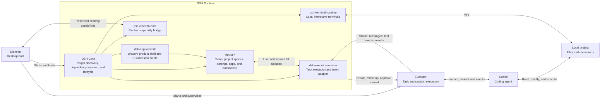

# Wegent

> An open-source AI work system spanning your local desktop, cloud agents, and remote machines.

English | [简体中文](README_zh.md)

[](https://github.com/wecode-ai/Wegent/actions/workflows/test.yml)
[](LICENSE)
[](https://github.com/wecode-ai/Wegent/issues)
    <a href="https://linux.do" alt="LINUX DO">
        </a>

Wegent includes a desktop workbench and a self-hostable web platform. Wegent Desktop works with local projects, files, commands, tests, and code changes. Wegent Web provides browser-based agents, knowledge, automation, and administration. Wegent Backend connects these applications to shared project spaces, models, and execution devices.

[Download the latest Wegent Desktop](https://github.com/wecode-ai/Wegent/releases/latest) · [Documentation](https://wecode-ai.github.io/wegent-docs/) · [Contributing](CONTRIBUTING.md)

## Wegent Desktop

Wegent Desktop organizes local coding work by project and task. The task view keeps the conversation, tool activity, tests, changed files, and diffs together; the project-space view provides the board, shared files, automation, and execution status.


<p align="center"><sub>Running and reviewing a local coding task in Wegent Desktop.</sub></p>


<p align="center"><sub>A project space in Wegent Desktop with its task board, shared files, automation, and execution status.</sub></p>

## Features

- **Desktop workbench** — Organize local projects, tasks, sessions, files, tool activity, tests, and diffs.
- **Reusable agents** — Combine models, prompts, Skills, knowledge, tools, and collaboration settings.
- **Project spaces** — Share task boards, files, discussions, automation, execution history, and deliveries.
- **Multiple execution targets** — Run tasks locally, on remote work machines, or with server-managed executors.
- **Self-hosting** — Deploy Wegent Web and Backend for team access, APIs, permissions, scheduling, and knowledge services.

## Why Wegent

**The local coding experience built on Codex is the foundation of Wegent Desktop.** It works directly with the code, files, commands, and development environment in your projects. Connect it to Wegent Backend when coding work needs to move beyond one computer or one person. Once connected, the desktop workbench and Web use the same projects, tasks, and execution devices.

- **Run tasks on the right device** — Keep using the code, files, commands, and development environment already on a local machine, or run a task for the same project on a remote work machine or server-managed executor.
- **Move a project forward as a team** — Project spaces connect task boards, shared files, discussions, execution status, and deliveries instead of leaving conversations and code changes on separate computers.
- **Automate repeated project work** — Project spaces can configure automation and execution queues to keep routine work moving.
- **Keep services and data under team control** — Self-host Web and Backend for shared access, permissions, model configuration, scheduling, knowledge services, and remote-device management.

If work always stays on one computer, Wegent Desktop provides a familiar Codex coding experience. Connect it to Wegent to extend that experience when tasks must move across people, devices, or a self-hosted environment.

## Wegent Web

Wegent Web provides the browser interface for remote agents. Agents can use configured models, knowledge, Skills, and tools while Wegent Backend manages their tasks and execution.


<p align="center"><sub>A Wegent remote agent uses tools to generate a Gantt chart.</sub></p>

## How it works

Wework is the Wegent desktop workbench. Electron owns desktop windows, system capabilities, and process management. DeepSeek Harness (DSH) is the embedded application and plugin runtime, and the Wework product UI is composed from a set of DSH plugins. Executor manages tasks and sessions, then drives Codex to perform the actual work in local projects.


```mermaid
flowchart LR
    Electron["Electron<br/>Desktop host"]

    subgraph DSH["DSH Runtime"]
        direction TB
        Core["DSH Core<br/>Plugin discovery, dependency injection, and lifecycle"]
        App["dsh-app-wework<br/>Wework product shell and UI extension points"]
        UI["dsh-ui-*<br/>Tasks, project spaces, settings, apps, and automation"]
        ElectronPlugin["dsh-electron-host<br/>Electron capability bridge"]
        ExecutorPlugin["dsh-executor-runtime<br/>Task execution and event adapter"]
        TerminalPlugin["dsh-terminal-runtime<br/>Local interactive terminals"]

        Core --> App
        Core --> UI
        Core --> ElectronPlugin
        Core --> ExecutorPlugin
        Core --> TerminalPlugin
        App --> UI
    end

    Executor["Executor<br/>Task and session execution"]
    Codex["Codex<br/>Coding agent"]
    Workspace["Local project<br/>Files and commands"]

    Electron -->|"Starts and hosts"| Core
    Electron -->|"Starts and supervises"| Executor
    ElectronPlugin <-->|"Restricted desktop capabilities"| Electron
    UI <-->|"User actions and UI updates"| ExecutorPlugin
    ExecutorPlugin -->|"Create, follow up, approve, cancel"| Executor
    Executor -->|"Status, messages, tool events, results"| ExecutorPlugin
    Executor <-->|"Launch, control, and events"| Codex
    Codex <-->|"Read, modify, and execute"| Workspace
    TerminalPlugin <-->|"PTY"| Workspace
```

DSH does not execute coding tasks itself. `dsh-app-wework` defines the product shell and extension points, `dsh-ui-*` provides the product modules, `dsh-electron-host` bridges restricted Electron capabilities, `dsh-executor-runtime` communicates bidirectionally with Executor throughout execution, and `dsh-terminal-runtime` manages local interactive terminals. Executor is the task execution layer, while Codex is the concrete coding agent it drives.

Wework can also connect to Wegent Backend for shared project spaces, models, and remote execution devices. Wegent Web is a separate browser interface built on the same Backend.

## Quick start

### Wegent Desktop

1. [Download the latest Wegent Desktop installer](https://github.com/wecode-ai/Wegent/releases/latest) and install it.
2. Open the app and add or select a local project.
3. Create a task and describe the work to perform.
4. Review the agent activity, command output, and file changes.

### Wegent Web and Backend

To start the self-hosted web application and Backend in standalone mode with Docker:

```bash
curl -fsSL https://raw.githubusercontent.com/wecode-ai/Wegent/main/install.sh | bash -s -- --standalone
```

Open http://localhost:3000 and follow the setup flow to create the administrator password and configure a model. See the [Installation Guide](docs/en/wegent/getting-started/installation.md) and [Standalone Mode](docs/en/wegent/deployment/standalone-mode.md) for other deployment options.

## Development

Requires Node.js 20+ and pnpm:

```bash
pnpm install
pnpm --filter wework dev
```

To run the macOS desktop app:

```bash
pnpm --filter wework dev:mac
```

See [wework/README.md](wework/README.md) for desktop development, build, and release instructions. `wework/` is the current desktop application source directory.

## Repository map

| Directory                  | Responsibility                                     |
| -------------------------- | -------------------------------------------------- |
| `wework/`                  | Wegent Desktop (Electron, Vite, React)             |
| `executor/`                | Local and remote agent task execution environments |
| `frontend/`                | Wegent platform web administration                 |
| `backend/`                 | REST API and core business logic                   |
| `executor_manager/`        | Executor scheduling and orchestration              |
| `chat_shell/`              | Chat runtime                                       |
| `knowledge_runtime/`       | Knowledge retrieval services                       |
| `knowledge_doc_converter/` | Document parsing and conversion                    |
| `shared/`                  | Modules shared across services                     |

## Documentation

- [Wegent Desktop documentation](docs/en/wework/README.md)
- [Desktop development and release](wework/README.md)
- [Wegent quick start](docs/en/wegent/getting-started/quick-start.md)
- [Installation and deployment](docs/en/wegent/getting-started/installation.md)
- [Core concepts](docs/en/wegent/concepts/core-concepts.md)
- [Developer guide](docs/en/wegent/developer-guide/README.md)
- [Troubleshooting](docs/en/wegent/troubleshooting.md)

## Contributing

Bug reports, documentation improvements, code contributions, and new ways of using Wegent are all welcome.

- [Contributing Guide](CONTRIBUTING.md)
- [Security Policy](SECURITY.md)
- [GitHub Issues](https://github.com/wecode-ai/Wegent/issues)
- DingTalk Community: “wework社区交流”, group ID `190890002451`
- [Discord Community](https://discord.gg/MVzJzyqEUp)
- [License](LICENSE)

## Contributors

Thanks to everyone who helps Wegent grow.

<!-- readme: contributors -start -->
<table>
	<tbody>
		<tr>
            <td align="center">
                <a href="https://github.com/qdaxb">
                    
                    <br />
                    <sub><b>Axb</b></sub>
                </a>
            </td>
            <td align="center">
                <a href="https://github.com/feifei325">
                    
                    <br />
                    <sub><b>Feifei</b></sub>
                </a>
            </td>
            <td align="center">
                <a href="https://github.com/Micro66">
                    
                    <br />
                    <sub><b>MicroLee</b></sub>
                </a>
            </td>
            <td align="center">
                <a href="https://github.com/FicoHu">
                    
                    <br />
                    <sub><b>FicoHu</b></sub>
                </a>
            </td>
            <td align="center">
                <a href="https://github.com/icycrystal4">
                    
                    <br />
                    <sub><b>Icycrystal4</b></sub>
                </a>
            </td>
            <td align="center">
                <a href="https://github.com/kissghosts">
                    
                    <br />
                    <sub><b>Yanhe</b></sub>
                </a>
            </td>
            <td align="center">
                <a href="https://github.com/cc-yafei">
                    
                    <br />
                    <sub><b>YaFei Liu</b></sub>
                </a>
            </td>
            <td align="center">
                <a href="https://github.com/moqimoqidea">
                    
                    <br />
                    <sub><b>Moqimoqidea</b></sub>
                </a>
            </td>
		</tr>
		<tr>
            <td align="center">
                <a href="https://github.com/johnny0120">
                    
                    <br />
                    <sub><b>Johnny0120</b></sub>
                </a>
            </td>
            <td align="center">
                <a href="https://github.com/parabala">
                    
                    <br />
                    <sub><b>Parabala</b></sub>
                </a>
            </td>
            <td align="center">
                <a href="https://github.com/sunnights">
                    
                    <br />
                    <sub><b>Jake Zhang</b></sub>
                </a>
            </td>
            <td align="center">
                <a href="https://github.com/joyway1978">
                    
                    <br />
                    <sub><b>Joyway78</b></sub>
                </a>
            </td>
            <td align="center">
                <a href="https://github.com/yixiangxx">
                    
                    <br />
                    <sub><b>Yi Xiang</b></sub>
                </a>
            </td>
            <td align="center">
                <a href="https://github.com/luckjun529-lang">
                    
                    <br />
                    <sub><b>junlong chen</b></sub>
                </a>
            </td>
            <td align="center">
                <a href="https://github.com/cocowh">
                    
                    <br />
                    <sub><b>Birch</b></sub>
                </a>
            </td>
            <td align="center">
                <a href="https://github.com/sdadunderscoresdad">
                    
                    <br />
                    <sub><b>+7</b></sub>
                </a>
            </td>
		</tr>
		<tr>
            <td align="center">
                <a href="https://github.com/2561056571">
                    
                    <br />
                    <sub><b>Xuemin</b></sub>
                </a>
            </td>
            <td align="center">
                <a href="https://github.com/lvmowei">
                    
                    <br />
                    <sub><b>lvmowei</b></sub>
                </a>
            </td>
            <td align="center">
                <a href="https://github.com/fengkuizhi">
                    
                    <br />
                    <sub><b>Fengkuizhi</b></sub>
                </a>
            </td>
            <td align="center">
                <a href="https://github.com/jnhu76">
                    
                    <br />
                    <sub><b>Jm.hu</b></sub>
                </a>
            </td>
            <td align="center">
                <a href="https://github.com/hustfisher">
                    
                    <br />
                    <sub><b>fishermen</b></sub>
                </a>
            </td>
            <td align="center">
                <a href="https://github.com/earthAlone2026">
                    
                    <br />
                    <sub><b>xiaoqiang</b></sub>
                </a>
            </td>
            <td align="center">
                <a href="https://github.com/maquan0927">
                    
                    <br />
                    <sub><b>Just Quan</b></sub>
                </a>
            </td>
            <td align="center">
                <a href="https://github.com/DavidLeeUX">
                    
                    <br />
                    <sub><b>Kva</b></sub>
                </a>
            </td>
		</tr>
		<tr>
            <td align="center">
                <a href="https://github.com/kerwin612">
                    
                    <br />
                    <sub><b>Kerwin Bryant</b></sub>
                </a>
            </td>
            <td align="center">
                <a href="https://github.com/RockysGit">
                    
                    <br />
                    <sub><b>RockysGit</b></sub>
                </a>
            </td>
            <td align="center">
                <a href="https://github.com/qwertyerge">
                    
                    <br />
                    <sub><b>Erdawang</b></sub>
                </a>
            </td>
            <td align="center">
                <a href="https://github.com/junbaor">
                    
                    <br />
                    <sub><b>Junbaor</b></sub>
                </a>
            </td>
            <td align="center">
                <a href="https://github.com/Twelveeee">
                    
                    <br />
                    <sub><b>Twelveeee</b></sub>
                </a>
            </td>
            <td align="center">
                <a href="https://github.com/fingki">
                    
                    <br />
                    <sub><b>Fingki</b></sub>
                </a>
            </td>
            <td align="center">
                <a href="https://github.com/flyhope">
                    
                    <br />
                    <sub><b>李枨煊</b></sub>
                </a>
            </td>
            <td align="center">
                <a href="https://github.com/friendfei">
                    
                    <br />
                    <sub><b>friendfei</b></sub>
                </a>
            </td>
		</tr>
		<tr>
            <td align="center">
                <a href="https://github.com/jolestar">
                    
                    <br />
                    <sub><b>Jolestar</b></sub>
                </a>
            </td>
            <td align="center">
                <a href="https://github.com/code-wangdi">
                    
                    <br />
                    <sub><b>Code-wangdi</b></sub>
                </a>
            </td>
            <td align="center">
                <a href="https://github.com/haosenwang1018">
                    
                    <br />
                    <sub><b>Sense_wang</b></sub>
                </a>
            </td>
            <td align="center">
                <a href="https://github.com/LiDaiyan">
                    
                    <br />
                    <sub><b>Li Daiyan</b></sub>
                </a>
            </td>
            <td align="center">
                <a href="https://github.com/DeadLion">
                    
                    <br />
                    <sub><b>Jasper Zhong</b></sub>
                </a>
            </td>
            <td align="center">
                <a href="https://github.com/rayzhang0603">
                    
                    <br />
                    <sub><b>Ray</b></sub>
                </a>
            </td>
            <td align="center">
                <a href="https://github.com/RichardoMrMu">
                    
                    <br />
                    <sub><b>RichardoMu</b></sub>
                </a>
            </td>
            <td align="center">
                <a href="https://github.com/Ged0">
                    
                    <br />
                    <sub><b>_</b></sub>
                </a>
            </td>
		</tr>
		<tr>
            <td align="center">
                <a href="https://github.com/andrewzq777">
                    
                    <br />
                    <sub><b>Andrewzq777</b></sub>
                </a>
            </td>
            <td align="center">
                <a href="https://github.com/ch15084">
                    
                    <br />
                    <sub><b>Ch15084</b></sub>
                </a>
            </td>
            <td align="center">
                <a href="https://github.com/gdouyang">
                    
                    <br />
                    <sub><b>Gdouyang</b></sub>
                </a>
            </td>
            <td align="center">
                <a href="https://github.com/graindt">
                    
                    <br />
                    <sub><b>Graindt</b></sub>
                </a>
            </td>
            <td align="center">
                <a href="https://github.com/qingchengliu">
                    
                    <br />
                    <sub><b>Qingcheng</b></sub>
                </a>
            </td>
            <td align="center">
                <a href="https://github.com/Qinxl0921">
                    
                    <br />
                    <sub><b>qinxll</b></sub>
                </a>
            </td>
            <td align="center">
                <a href="https://github.com/salt-hai">
                    
                    <br />
                    <sub><b>Salt-hai</b></sub>
                </a>
            </td>
            <td align="center">
                <a href="https://github.com/wxcfox">
                    
                    <br />
                    <sub><b>Wxcfox</b></sub>
                </a>
            </td>
		</tr>
	<tbody>
</table>
<!-- readme: contributors -end -->

---

<p align="center">Made with ❤️ by WeCode-AI Team</p>
