# Wegent
> 🚀 An open-source platform to define, organize, and run Agentic AI

English | [简体中文](README_zh.md)

[](https://python.org)
[](https://fastapi.tiangolo.com)
[](https://nextjs.org)
[](https://docker.com)
[](https://claude.ai)

<div align="center">

### 🚀 **Build Your Own AI Agent Workforce**

*From coding assistants to news analysts - deploy intelligent agents that actually work*

[Quick Start](#-quick-start) · [Use Cases](#-what-can-you-build) · [Documentation](docs/en/resource-definition-formats.md) · [Development Guide](docs/en/develop-guide.md)

</div>

---

## 💡 What Can You Build?

Wegent empowers you to create powerful AI applications through intelligent agent orchestration:

### 🖥️ **Web-Based Coding Assistant**
Build a full-featured development environment in your browser 


### 📰 **News Intelligence Platform**
Create a smart news aggregation and analysis system 

### 🔧 **Custom Agent Applications**
The possibilities are endless - build agents for:
- **Data Analysis**: Automated report generation and visualization
- **Content Creation**: Blog posts, social media, and marketing materials
- **Customer Support**: Intelligent chatbots with contextual understanding
- **DevOps Automation**: CI/CD pipeline management and monitoring
- **Research Assistant**: Literature review and knowledge synthesis

---

## 📖 What is Wegent?

Wegent is an open-source AI native operating system that enables you to define, organize, and run intelligent agents at scale. Built on Kubernetes-style declarative API and CRD (Custom Resource Definition) design patterns, Wegent provides a standardized framework for creating and managing AI agent ecosystems.



```mermaid
graph LR
    subgraph AIResource ["🌐 AI Native Resource"]
        subgraph YAMLDef ["📄 YAML Definitions"]
            Ghost["👻 Ghost<br/>Agent Soul"]
            Model["🧠 Model<br/>Model Configuration"]
            Shell["🐚 Shell<br/>Agent Program"]
            Bot["🤖 Bot<br/>Agent Instance"]
            CollabModel["🤝 Collaboration<br/>Collaboration Model"]
            Team["👥 Team<br/>Collaborative Team"]
        end
     end
    
    subgraph Wegent ["🚀 Wegent"]
        Workspace["💼 Workspace<br/>Work Environment"]
        TeamInstance["👥 Agent Team Instance<br/>Running Team"]
    end
   
      User["👤 User"]
      Task["🎯 Task<br/>User Task"]
    %% CRD Resource Relationships
    Ghost --> Bot
    Model --> Bot
    Shell --> Bot
    Bot --> Team
    CollabModel --> Team
    Shell --> Team
    
    %% Team Definition to Instance
    AIResource --> Wegent
    Workspace --> TeamInstance
    
    %% User Interaction Flow
    User --> Task
    Task --> TeamInstance
    TeamInstance --> Task
    
    %% Styling
    classDef yamlBox stroke-dasharray: 5 5
    classDef runtimeBox stroke:#ff6b6b,stroke-width:2px
    classDef resourceBox stroke:#4ecdc4,stroke-width:2px
    
    class YAMLDef yamlBox
    class Runtime runtimeBox
    class AIResource resourceBox

```

### 🎯 Key Concepts

- **👻 Ghost**: The "soul" of an agent - defines personality, capabilities, and behavior patterns
- **🧠 Model**: AI model configuration - defines environment variables and model parameters
- **🐚 Shell**: The "executable" - A program capable of launching an agent
- **🤖 Bot**: A complete agent instance combining Ghost + Shell + Model
- **👥 Team**: Composed of multiple Bots + Collaboration Model, defining how agents work together
- **🤝 Collaboration**: Defines the interaction patterns between Bots in a Team (like Workflow)
- **💼 Workspace**: Isolated work environments for tasks and projects
- **🎯 Task**: Executable units of work assigned to teams

> 💡 **Detailed YAML Configuration Documentation**:
- [Complete YAML configuration examples and field descriptions](docs/en/resource-definition-formats.md)

### ✨ Why Wegent?

- **Standardized**: Universal AI agent runtime specifications, like Kubernetes for containers
- **Declarative**: Define and manage agents through simple YAML configurations
- **Collaborative**: Built-in support for multi-agent teamwork and orchestration
- **Multi-Model Support**: Currently supports Claude Code, with plans for Codex and Gemini
- **Flexible Configuration**: Customizable agent personalities and capabilities
- **Task Orchestration**: Intelligent scheduling and execution

## 🚀 Quick Start

### Prerequisites

- Docker and Docker Compose
- Git

1. **Clone the repository**
   ```bash
   git clone https://github.com/wecode-ai/wegent.git
   cd wegent
   ```

2. **Start the platform**
   ```bash
   docker-compose up -d
   ```

3. **Access the web interface**
   - Open http://localhost:3000 in your browser

4. **Configure GitHub Access Tokens**
   - Follow the page instructions to configure your GitHub access token
5. **Configure Bot**

   Wegent ships with a built-in development bot. For the Claude Code runtime, set the following environment variables:

   ```json
   {
     "env": {
       "ANTHROPIC_MODEL": "openrouter,anthropic/claude-sonnet-4",
       "ANTHROPIC_AUTH_TOKEN": "sk-xxxxxx",
       "ANTHROPIC_BASE_URL": "http://xxxxx",
       "ANTHROPIC_SMALL_FAST_MODEL": "openrouter,anthropic/claude-3.5-haiku"
     }
   }
   ```

   Note: Some runtimes may use `ANTHROPIC_API_KEY` instead of `ANTHROPIC_AUTH_TOKEN`. See docs for details.

6. **Run task**

   On the task page, select your project and branch, describe your development requirements, such as implementing a bubble sort algorithm using Python

## 🏗️ Architecture

```mermaid
graph TB
    subgraph "🖥️ Management Platform Layer"
        Frontend["🌐 Next.js Frontend"]
        Backend["⚙️ FastAPI Backend"]
        API["🚀 Declarative API"]
    end
    
    subgraph "📊 Data Layer"
        MySQL[("💾 MySQL Database")]
    end
    
    subgraph "🔍 Execution Layer"
        ExecutorManager["💯 Executor Manager"]
        Executor1["🚀 Executor 1"]
        Executor2["🚀 Executor 2"]
        ExecutorN["🚀 Executor N"]
    end
    
    subgraph "🤖 Agent Layer"
        Claude["🧠 Claude Code"]
        Ango["💻 Agno"]
        DifyPlanned["✨ Dify (Planned)"]
    end
  
    
    %% System Interactions
    Frontend --> API
    API --> Backend
    Backend --> MySQL
    Backend --> ExecutorManager
    ExecutorManager --> Executor1
    ExecutorManager --> Executor2
    ExecutorManager --> ExecutorN
    
    %% AI Program Integration (Currently only supports Claude Code)
    Executor1 --> Claude
    Executor2 --> Claude
    ExecutorN --> Ango
```



## 🛠️ Development

For detailed development setup instructions, please see the [Development Guide](docs/en/develop-guide.md).

### Project Structure

```
wegent/
├── backend/          # FastAPI backend service
├── frontend/         # Next.js web interface
├── executor/         # Task execution engine
├── executor_manager/ # Execution orchestration
├── shared/           # Common utilities and models
└── docker/           # Container configurations
```

### Quick Development Setup

1. **Backend Development**
   ```bash
   cd backend
   pip install -r requirements.txt
   uvicorn app.main:app --host 0.0.0.0 --port 8000 --reload
   ```

2. **Frontend Development**
   ```bash
   cd frontend
   npm install
   npm run dev
   ```

3. **Run Tests**
   ```bash
   # Backend tests
   cd backend && python -m pytest

   # Frontend tests
   cd frontend && npm test
   ```

For comprehensive setup instructions including database configuration, environment variables, and troubleshooting, refer to the [Development Guide](docs/en/develop-guide.md).


## 🤝 Contributing

We welcome contributions! Please see our [Contributing Guide](CONTRIBUTING.md) for details.

### Development Workflow

1. Fork the repository
2. Create a feature branch
3. Make your changes
4. Add tests
5. Submit a pull request

## 📞 Support

- 🐛 Issues: [GitHub Issues](https://github.com/wecode-ai/wegent/issues)

## 👥 Contributors

Thanks to the following developers for their contributions and efforts to make this project better. 💪

<table>
  <tr>
    <td align="center">
      <a href="https://github.com/qdaxb">
        
        <br />
        <sub><b>qdaxb</b></sub>
      </a>
    </td>
    <td align="center">
      <a href="https://github.com/cc-yafei">
        
        <br />
        <sub><b>cc-yafei</b></sub>
      </a>
    </td>
    <td align="center">
      <a href="https://github.com/fengkuizhi">
        
        <br />
        <sub><b>fengkuizhi</b></sub>
      </a>
    </td>
    <td align="center">
      <a href="https://github.com/feifei325">
        
        <br />
        <sub><b>feifei325</b></sub>
      </a>
    </td>
    <td align="center">
      <a href="https://github.com/Micro66">
        
        <br />
        <sub><b>Micro66</b></sub>
      </a>
    </td>
    <td align="center">
      <a href="https://github.com/moqimoqidea">
        
        <br />
        <sub><b>moqimoqidea</b></sub>
      </a>
    </td>
  </tr>
</table>

---

<p align="center">Made with ❤️ by WeCode-AI Team</p>
