# Wegent

[](https://python.org)
[](https://fastapi.tiangolo.com)
[](https://nextjs.org)
[](https://docker.com)
[](https://claude.ai)

> 🚀 An open-source platform to define, organize, and run Agentic AI

## 📖 Overview

Wegent is an open-source AI native operating system that enables you to define, organize, and run intelligent agents at scale. Built on Kubernetes-style declarative API and CRD (Custom Resource Definition) design patterns, Wegent provides a standardized framework for creating and managing AI agent ecosystems.



```mermaid
graph LR
    subgraph AIResource ["🌐 AI Native Resource"]
        subgraph YAMLDef ["📄 YAML Definitions"]
            Ghost["👻 Ghost<br/>Agent Soul"]
            Model["🧠 Model<br/>Model Configuration"]
            Shell["🐚 Shell<br/>Agent Program"]
            Bot["🤖 Bot<br/>Agent Instance"]
            CollabModel["🤝 Collaboration<br/>Collaboration Model"]
            Team["👥 Team<br/>Collaborative Team"]
        end
     end
    
    subgraph Wegent ["🚀 Wegent"]
        Workspace["💼 Workspace<br/>Work Environment"]
        TeamInstance["👥 Agent Team Instance<br/>Running Team"]
    end
   
      User["👤 User"]
      Task["🎯 Task<br/>User Task"]
    %% CRD Resource Relationships
    Ghost --> Bot
    Model --> Bot
    Shell --> Bot
    Bot --> Team
    CollabModel --> Team
    Shell --> Team
    
    %% Team Definition to Instance
    AIResource --> Wegent
    Workspace --> TeamInstance
    
    %% User Interaction Flow
    User --> Task
    Task --> TeamInstance
    TeamInstance --> Task
    
    %% Styling
    classDef yamlBox stroke-dasharray: 5 5
    classDef runtimeBox stroke:#ff6b6b,stroke-width:2px
    classDef resourceBox stroke:#4ecdc4,stroke-width:2px
    
    class YAMLDef yamlBox
    class Runtime runtimeBox
    class AIResource resourceBox

```

### 🎯 Key Concepts

- **👻 Ghost**: The "soul" of an agent - defines personality, capabilities, and behavior patterns
- **🧠 Model**: AI model configuration - defines environment variables and model parameters
- **🐚 Shell**: The "executable" - A program capable of launching an agent
- **🤖 Bot**: A complete agent instance combining Ghost + Shell + Model
- **👥 Team**: Composed of multiple Bots + Collaboration Model, defining how agents work together
- **🤝 Collaboration**: Defines the interaction patterns between Bots in a Team (like Workflow)
- **💼 Workspace**: Isolated work environments for tasks and projects
- **🎯 Task**: Executable units of work assigned to teams

### ✨ Why Wegent?

- **Standardized**: Universal AI agent runtime specifications, like Kubernetes for containers
- **Declarative**: Define and manage agents through simple YAML configurations
- **Collaborative**: Built-in support for multi-agent teamwork and orchestration
- **Multi-Model Support**: Currently supports Claude Code, with plans for Codex and Gemini
- **Flexible Configuration**: Customizable agent personalities and capabilities
- **Task Orchestration**: Intelligent scheduling and execution

## 🚀 Quick Start

### Prerequisites

- Docker and Docker Compose
- Git

1. **Clone the repository**
   ```bash
   git clone https://github.com/wecode-ai/wegent.git
   cd wegent
   ```

2. **Start the platform**
   ```bash
   docker-compose up -d
   ```

3. **Access the web interface**
   - Open http://localhost:3000 in your browser

4. **Configure GitHub Access Tokens**
   - Follow the page instructions to configure your GitHub access token
5. **Configure Bot**
   
   Wegent comes with a built-in development bot. Simply configure your Claude API key to start using it:
   
   ```bash
    {
        "env": {
            "ANTHROPIC_MODEL": "claude-4.1-opus",
            "ANTHROPIC_API_KEY": "xxxxxx",
            "ANTHROPIC_BASE_URL": "sk-xxxxxx",
            "ANTHROPIC_SMALL_FAST_MODEL": "claude-3.5-haiku"
        }
    }
   ```bash

5. **Run task**

   On the task page, select your project and branch, describe your development requirements, such as implementing a bubble sort algorithm using Python

## 🏗️ Architecture

```mermaid
graph TB
    subgraph "🖥️ Management Platform Layer"
        Frontend["🌐 Next.js Frontend"]
        Backend["⚙️ FastAPI Backend"]
        API["🚀 Declarative API"]
    end
    
    subgraph "📊 Data Layer"
        MySQL[("💾 MySQL Database")]
    end
    
    subgraph "🔍 Execution Layer"
        ExecutorManager["💯 Executor Manager"]
        Executor1["🚀 Executor 1"]
        Executor2["🚀 Executor 2"]
        ExecutorN["🚀 Executor N"]
    end
    
    subgraph "🤖 Agent Layer"
        Claude["🧠 Claude Code"]
        AngoPlanned["💻 Agno (Planned)"]
        DifyPlanned["✨ Dify (Planned)"]
    end
  
    
    %% System Interactions
    Frontend --> API
    API --> Backend
    Backend --> MySQL
    Backend --> ExecutorManager
    ExecutorManager --> Executor1
    ExecutorManager --> Executor2
    ExecutorManager --> ExecutorN
    
    %% AI Program Integration (Currently only supports Claude Code)
    Executor1 --> Claude
    Executor2 --> Claude
    ExecutorN --> Claude
```



## 🛠️ Development

### Project Structure

```
wegent/
├── backend/          # FastAPI backend service
├── frontend/         # Next.js web interface
├── executor/         # Task execution engine
├── executor_manager/ # Execution orchestration
├── shared/           # Common utilities and models
└── docker/           # Container configurations
```

### Development Setup

1. **Backend Development**
   ```bash
   cd backend
   pip install -r requirements.txt
   uvicorn app.main:app --host 0.0.0.0 --port 8000 --reload
   ```

2. **Frontend Development**
   ```bash
   cd frontend
   npm install
   npm run dev
   ```

3. **Run Tests**
   ```bash
   # Backend tests
   cd backend && python -m pytest
   
   # Frontend tests
   cd frontend && npm test
   ```


## 🤝 Contributing

We welcome contributions! Please see our [Contributing Guide](CONTRIBUTING.md) for details.

### Development Workflow

1. Fork the repository
2. Create a feature branch
3. Make your changes
4. Add tests
5. Submit a pull request

## 📞 Support

- 🐛 Issues: [GitHub Issues](https://github.com/wecode-ai/wegent/issues)

---

<p align="center">Made with ❤️ by WeCode-AI Team</p>
