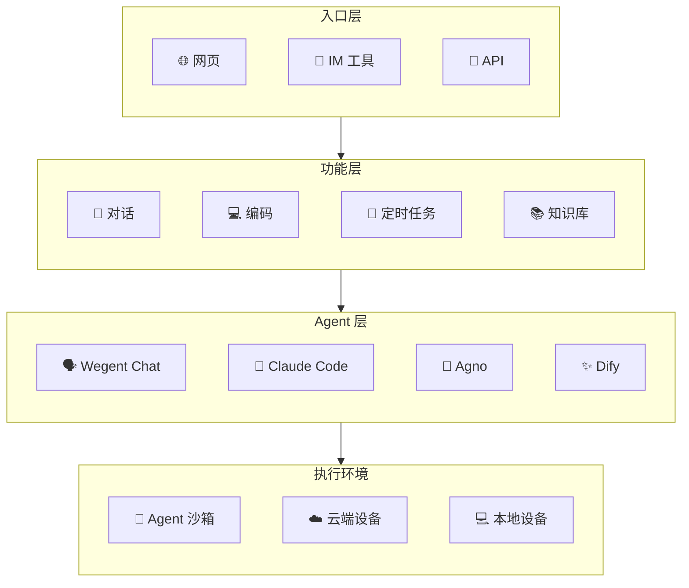

# Wegent

> 🚀 一个开源的 AI 原生操作系统，用于定义、组织和运行智能体团队

[English](README.md) | 简体中文

[](https://python.org)
[](https://fastapi.tiangolo.com)
[](https://nextjs.org)
[](https://docker.com)
[](https://claude.ai)
[](https://ai.google.dev)
[](https://github.com/wecode-ai/wegent/releases)

<div align="center">


[快速开始](#-快速开始) · [文档](https://wecode-ai.github.io/wegent-docs/zh/) · [开发指南](https://wecode-ai.github.io/wegent-docs/zh/docs/category/developer-guide)

</div>

---

## 🏗️ 架构概览



---

## ✨ 核心功能

### 💬 对话模式


一个完全开源的聊天 Agent，具备以下能力：

- **多模型支持**：兼容 Claude、OpenAI、Gemini、DeepSeek、GLM 等主流模型
- **对话历史**：支持新建对话和多轮对话，支持对话历史的保存和分享
- **多人对话**：支持 AI 群聊，AI 可以根据群聊历史通过 @提及 进行回复
- **附件解析**：可在单聊、群聊中给 AI 发送 txt、pdf、ppt、doc、图片格式的附件
- **追问模式**：模型通过启发式问题帮你澄清思路
- **纠错模式**：自动调用多个模型矫正回答
- **长期记忆**：支持集成 mem0 实现对话的长期记忆
- **运行沙箱**：支持通过沙箱执行命令或修改文件，兼容 E2B 协议
- **扩展能力**：可通过配置的方式自定义提示词、MCP 和 Skill（自带绘制图表技能）

### 💻 编码模式


一个云端的 Claude Code 编码执行引擎：

- **多模型配置**：配置各种兼容 Claude 协议的模型
- **并发执行**：可在云端同时执行多个编码任务
- **需求澄清**：AI 会结合代码和提问，帮你梳理需求后生成规格文档
- **Git 集成**：支持与 GitHub/GitLab/Gitea/Gerrit 进行集成，直接从代码仓库克隆、修改后创建 PR
- **MCP/Skill 支持**：支持通过配置为 Agent 集成 MCP/Skill
- **多轮对话**：支持多轮对话追问

### 📡 关注模式


一个云端的 AI 任务触发器：

- **全能力访问**：任务可以使用对话和编码的全部能力
- **定时/事件触发**：设定定时或基于事件执行 AI 任务，如每天 9 点汇总今天的 AI 新闻
- **信息流展示**：展示基于 AI 任务生成的信息流
- **事件过滤**：支持事件过滤，如"只有明天要下雨了才通知我"

### 📚 知识模式


一个云端 AI 文档仓库：

- **文档管理**：上传、管理 txt/doc/ppt/xls 等等格式的文档到知识库
- **网页导入**：支持导入网页、钉钉多维表到知识库
- **NotebookLM 模式**：支持在笔记本里直接选择文档进行提问
- **在线编辑**：笔记本模式支持在线编辑文本文件
- **对话集成**：支持在单聊、群聊中让 AI 引用知识库进行回答

### 🖥️ 设备模式

>
在本地设备上运行 AI 任务，完全掌控：

- **本地执行器**：在自己的设备上安装并运行 Wegent 执行器
- **多设备管理**：注册和管理多个本地设备
- **槽位调度**：为每个设备配置并发任务槽位数
- **安全连接**：通过认证的 WebSocket 连接到 Wegent 后端

### 💬 IM 集成

将 AI 智能体集成到你常用的 IM 工具中：

- **钉钉机器人**：将智能体部署为钉钉机器人，支持团队协作
- **Telegram 机器人**：连接智能体到 Telegram，支持个人或群组对话

### 🔧 定制化

上面的所有功能都是可定制的：

- **自定义智能体**：支持在网页中创建自定义智能体，可直接在页面上配置提示词、MCP、Skill 和多智能体协作
- **智能体创建向导**：4 步创建：描述需求 → AI 追问 → 实时微调 → 一键创建
- **组织管理**：支持人员创建和加入组，组内可共享智能体、模型、Skill 等等

---

## 🔧 扩展能力
- **智能体生成向导**: 4 步创建: 描述需求 → AI 追问 → 实时微调 → 一键创建
- **协作模式**：支持开箱即用的 4 种多 Agent 协作模式（顺序/并行/路由/循环）
- **支持 Skill**：动态加载技能包，提升 Token 效率
- **MCP 工具**：Model Context Protocol，调用外部工具和服务
- **执行引擎**：支持 ClaudeCode / Agno 沙箱隔离执行，Dify API 代理，Chat 直连模式
- **YAML 配置**：Kubernetes 风格 CRD，定义 Ghost / Bot / Team / Skill
- **API**：对外提供 OpenAI 兼容接口，方便与其他系统集成

---

## 🚀 快速开始

```bash
curl -fsSL https://raw.githubusercontent.com/wecode-ai/Wegent/main/install.sh | bash
```

然后在浏览器中访问 http://localhost:3000

> 可选：启用 RAG 功能 `docker compose --profile rag up -d`

---

## 📦 预置智能体

| 团队 | 用途 |
|------|------|
| chat-team | 通用 AI 助手 + Mermaid 图表 |
| translator | 多语言翻译 |
| dev-team | Git 工作流：分支 → 编码 → 提交 → PR |
| wiki-team | 代码库 Wiki 文档生成 |

---

## 🤝 贡献

我们欢迎贡献！详情请参阅 [贡献指南](CONTRIBUTING.md)。

## 📞 支持

- 🐛 问题反馈：[GitHub Issues](https://github.com/wecode-ai/wegent/issues)
- 💬 Discord：[加入社区](https://discord.gg/MVzJzyqEUp)

## 👥 贡献者

感谢以下开发者的贡献，让这个项目变得更好 💪

<!-- readme: contributors -start -->
<table>
<tr>
    <td align="center">
        <a href="https://github.com/qdaxb">
            
            <br />
            <sub><b>Axb</b></sub>
        </a>
    </td>
    <td align="center">
        <a href="https://github.com/feifei325">
            
            <br />
            <sub><b>Feifei</b></sub>
        </a>
    </td>
    <td align="center">
        <a href="https://github.com/Micro66">
            
            <br />
            <sub><b>MicroLee</b></sub>
        </a>
    </td>
    <td align="center">
        <a href="https://github.com/cc-yafei">
            
            <br />
            <sub><b>YaFei Liu</b></sub>
        </a>
    </td>
    <td align="center">
        <a href="https://github.com/FicoHu">
            
            <br />
            <sub><b>FicoHu</b></sub>
        </a>
    </td>
    <td align="center">
        <a href="https://github.com/johnny0120">
            
            <br />
            <sub><b>Johnny0120</b></sub>
        </a>
    </td>
    <td align="center">
        <a href="https://github.com/kissghosts">
            
            <br />
            <sub><b>Yanhe</b></sub>
        </a>
    </td>
    <td align="center">
        <a href="https://github.com/yixiangxx">
            
            <br />
            <sub><b>Yi Xiang</b></sub>
        </a>
    </td></tr>
<tr>
    <td align="center">
        <a href="https://github.com/joyway1978">
            
            <br />
            <sub><b>Joyway78</b></sub>
        </a>
    </td>
    <td align="center">
        <a href="https://github.com/moqimoqidea">
            
            <br />
            <sub><b>Moqimoqidea</b></sub>
        </a>
    </td>
    <td align="center">
        <a href="https://github.com/2561056571">
            
            <br />
            <sub><b>Xuemin</b></sub>
        </a>
    </td>
    <td align="center">
        <a href="https://github.com/parabala">
            
            <br />
            <sub><b>Parabala</b></sub>
        </a>
    </td>
    <td align="center">
        <a href="https://github.com/icycrystal4">
            
            <br />
            <sub><b>Icycrystal4</b></sub>
        </a>
    </td>
    <td align="center">
        <a href="https://github.com/maquan0927">
            
            <br />
            <sub><b>Just Quan</b></sub>
        </a>
    </td>
    <td align="center">
        <a href="https://github.com/junbaor">
            
            <br />
            <sub><b>Junbaor</b></sub>
        </a>
    </td>
    <td align="center">
        <a href="https://github.com/fingki">
            
            <br />
            <sub><b>Fingki</b></sub>
        </a>
    </td></tr>
<tr>
    <td align="center">
        <a href="https://github.com/fengkuizhi">
            
            <br />
            <sub><b>Fengkuizhi</b></sub>
        </a>
    </td>
    <td align="center">
        <a href="https://github.com/jolestar">
            
            <br />
            <sub><b>Jolestar</b></sub>
        </a>
    </td>
    <td align="center">
        <a href="https://github.com/qwertyerge">
            
            <br />
            <sub><b>Erdawang</b></sub>
        </a>
    </td>
    <td align="center">
        <a href="https://github.com/sunnights">
            
            <br />
            <sub><b>Jake Zhang</b></sub>
        </a>
    </td>
    <td align="center">
        <a href="https://github.com/DeadLion">
            
            <br />
            <sub><b>Jasper Zhong</b></sub>
        </a>
    </td>
    <td align="center">
        <a href="https://github.com/andrewzq777">
            
            <br />
            <sub><b>Andrewzq777</b></sub>
        </a>
    </td>
    <td align="center">
        <a href="https://github.com/graindt">
            
            <br />
            <sub><b>Graindt</b></sub>
        </a>
    </td>
    <td align="center">
        <a href="https://github.com/salt-hai">
            
            <br />
            <sub><b>Salt-hai</b></sub>
        </a>
    </td></tr>
</table>
<!-- readme: contributors -end -->

---

<p align="center">由 WeCode-AI 团队用 ❤️ 制作</p>
