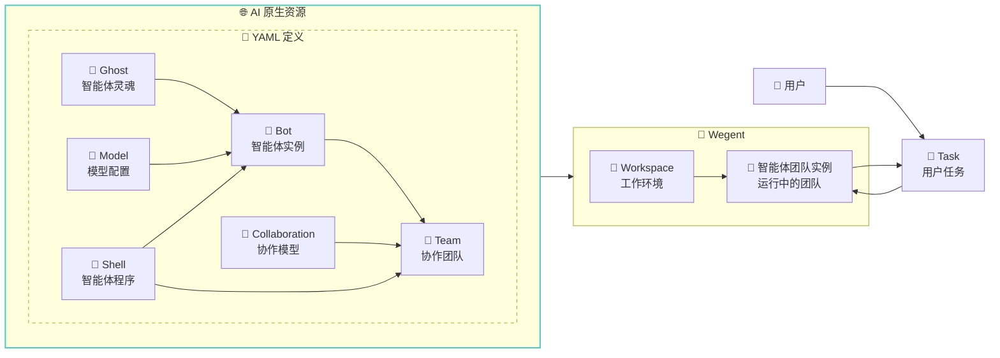
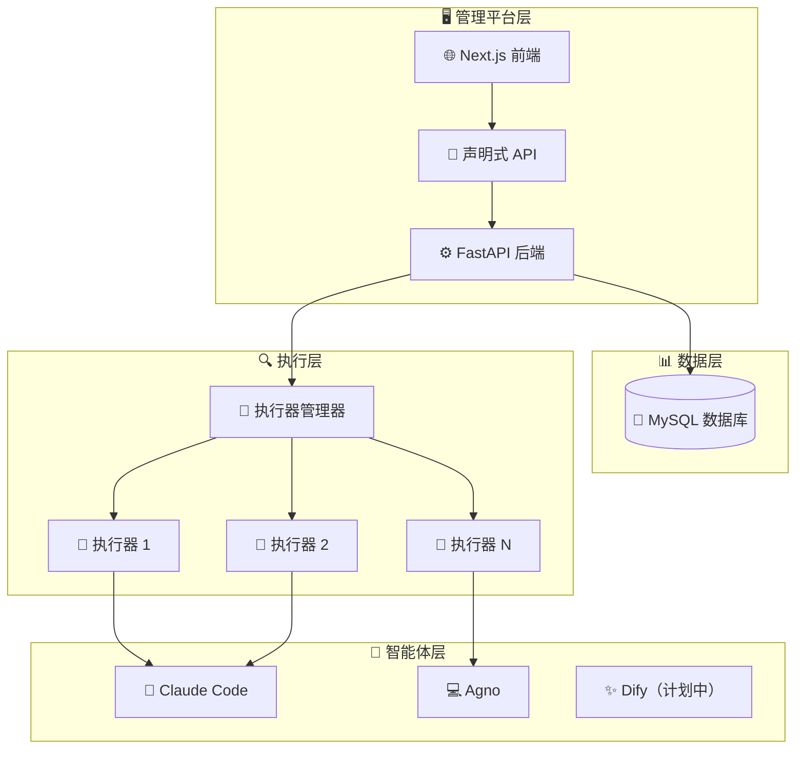

# Wegent
> 🚀 一个定义、组织和运行智能体 AI的开源平台

[English](README.md) | 简体中文

[](https://python.org)
[](https://fastapi.tiangolo.com)
[](https://nextjs.org)
[](https://docker.com)
[](https://claude.ai)

<div align="center">

### 🚀 **构建你的 AI 智能体工作团队**

*从编程助手到新闻分析 - 部署真正能干活的智能代理*

[快速开始](#-快速开始) · [应用场景](#-你能构建什么) · [文档](docs/zh/资源定义格式.md) · [开发指南](docs/zh/develop-guide.md)

</div>

---

## 💡 你能构建什么？

Wegent 让你通过智能体编排创建强大的 AI 应用：

### 🖥️ **网页版编程助手**
在浏览器中构建全功能开发环境


### 📰 **新闻智能平台**
创建智能新闻聚合和分析系统

### 🔧 **自定义智能体应用**
可能性无限 - 为以下场景构建智能体：
- **数据分析**：自动化报告生成和可视化
- **内容创作**：博客文章、社交媒体和营销素材
- **客户支持**：具有上下文理解的智能聊天机器人
- **DevOps 自动化**：CI/CD 流水线管理和监控
- **研究助手**：文献综述和知识合成

---

## 📖 什么是 Wegent？

Wegent 是一个开源的 AI 原生操作系统，使您能够大规模定义、组织和运行智能代理。基于 Kubernetes 风格的声明式 API 和 CRD（自定义资源定义）设计模式，Wegent 为创建和管理 AI 智能体生态系统提供了标准化框架。



### 🎯 核心概念

- **👻 Ghost**：智能体的"灵魂" - 定义个性、能力和行为模式
- **🧠 Model**：AI 模型配置 - 定义环境变量和模型参数
- **🐚 Shell**："可执行程序" - 能够启动智能体的程序
- **🤖 Bot**：完整的智能体实例，结合了 Ghost + Shell + Model
- **👥 Team**：由多个 Bot + 协作模型组成，定义智能体如何协同工作
- **🤝 Collaboration**：定义团队中 Bot 之间的交互模式（类似工作流）
- **💼 Workspace**：用于任务和项目的隔离工作环境
- **🎯 Task**：分配给团队的可执行工作单元

> 💡 **详细的 YAML 配置文档**:
- [完整的 YAML 配置示例和字段说明](docs/zh/资源定义格式.md)

### ✨ 为什么选择 Wegent？

- **标准化**：通用的 AI 智能体运行时规范，就像容器的 Kubernetes
- **声明式**：通过简单的 YAML 配置定义和管理智能体
- **协作式**：内置多智能体团队协作和编排支持
- **多模型支持**：目前支持 Claude Code，计划支持 Codex 和 Gemini
- **灵活配置**：可自定义智能体个性和能力
- **任务编排**：智能调度和执行

## 🚀 快速开始

### 前置要求

- Docker 和 Docker Compose
- Git

1. **克隆仓库**
   ```bash
   git clone https://github.com/wecode-ai/wegent.git
   cd wegent
   ```

2. **启动平台**
   ```bash
   docker-compose up -d
   ```

3. **访问 Web 界面**
   - 在浏览器中打开 http://localhost:3000

4. **配置 GitHub 访问令牌**
   - 按照页面说明配置您的 GitHub 访问令牌

5. **配置 Bot**

   Wegent 内置了一个开发 Bot。对于 Claude Code 运行时，请设置以下环境变量：

   ```json
   {
     "env": {
       "ANTHROPIC_MODEL": "openrouter,anthropic/claude-sonnet-4",
       "ANTHROPIC_AUTH_TOKEN": "sk-xxxxxx",
       "ANTHROPIC_BASE_URL": "http://xxxxx",
       "ANTHROPIC_SMALL_FAST_MODEL": "openrouter,anthropic/claude-3.5-haiku"
     }
   }
   ```

   注：部分运行时可能使用 `ANTHROPIC_API_KEY` 而非 `ANTHROPIC_AUTH_TOKEN`，具体以文档说明为准。

6. **运行任务**

   在任务页面，选择您的项目和分支，描述您的开发需求，例如使用 Python 实现冒泡排序算法

## 🏗️ 架构



## 🛠️ 开发

详细的开发环境搭建说明请参阅 [开发指南](docs/zh/develop-guide.md)。

### 项目结构

```
wegent/
├── backend/          # FastAPI 后端服务
├── frontend/         # Next.js Web 界面
├── executor/         # 任务执行引擎
├── executor_manager/ # 执行编排
├── shared/           # 通用工具和模型
└── docker/           # 容器配置
```

### 快速开发环境设置

1. **后端开发**
   ```bash
   cd backend
   pip install -r requirements.txt
   uvicorn app.main:app --host 0.0.0.0 --port 8000 --reload
   ```

2. **前端开发**
   ```bash
   cd frontend
   npm install
   npm run dev
   ```

3. **运行测试**
   ```bash
   # 后端测试
   cd backend && python -m pytest

   # 前端测试
   cd frontend && npm test
   ```

完整的开发环境搭建说明（包括数据库配置、环境变量设置和故障排查）请参阅 [开发指南](docs/zh/develop-guide.md)。


## 🤝 贡献

我们欢迎贡献！详情请参阅我们的[贡献指南](CONTRIBUTING.md)。

### 开发工作流

1. Fork 仓库
2. 创建功能分支
3. 进行更改
4. 添加测试
5. 提交 Pull Request

## 📞 支持

- 🐛 问题反馈：[GitHub Issues](https://github.com/wecode-ai/wegent/issues)

## 👥 贡献者

感谢以下开发者对本项目的贡献，为了让项目变得更好 💪

<table>
  <tr>
    <td align="center">
      <a href="https://github.com/qdaxb">
        
        <br />
        <sub><b>qdaxb</b></sub>
      </a>
    </td>
    <td align="center">
      <a href="https://github.com/cc-yafei">
        
        <br />
        <sub><b>cc-yafei</b></sub>
      </a>
    </td>
    <td align="center">
      <a href="https://github.com/fengkuizhi">
        
        <br />
        <sub><b>fengkuizhi</b></sub>
      </a>
    </td>
    <td align="center">
      <a href="https://github.com/feifei325">
        
        <br />
        <sub><b>feifei325</b></sub>
      </a>
    </td>
    <td align="center">
      <a href="https://github.com/Micro66">
        
        <br />
        <sub><b>Micro66</b></sub>
      </a>
    </td>
    <td align="center">
      <a href="https://github.com/moqimoqidea">
        
        <br />
        <sub><b>moqimoqidea</b></sub>
      </a>
    </td>
  </tr>
</table>

---

<p align="center">由 WeCode-AI 团队用 ❤️ 制作</p>
