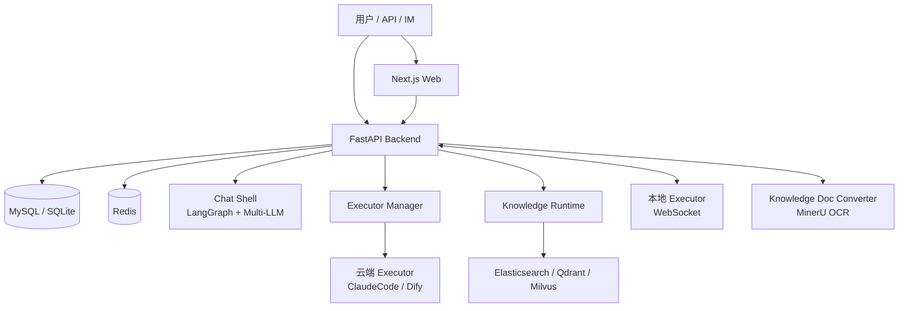

# Wegent

> 可自部署的 AI 工作台：把对话、代码、知识库、自动化和本地执行放到一个入口里。

[English](README.md) | 简体中文

[](https://python.org)
[](https://fastapi.tiangolo.com)
[](https://nextjs.org)
[](https://docker.com)
[](https://claude.ai)
[](https://ai.google.dev)
[](https://github.com/wecode-ai/wegent/releases)

<div align="center">

[快速开始](#-快速开始) · [核心场景](#核心场景) · [工作方式](#工作方式) · [文档](https://wecode-ai.github.io/wegent-docs/zh/) · [开发指南](https://wecode-ai.github.io/wegent-docs/zh/docs/category/developer-guide)

</div>

---

## 为什么选择 Wegent

Wegent 是一个可自部署的 AI 工作台，用来统一管理对话、代码任务、知识库、自动化和本地执行。你可以把资料放进知识库直接提问，把代码仓库交给 AI 处理，把每天要关注的信息做成自动追踪，也可以让团队在钉钉、Telegram 里调用同一批助手。需要访问本机仓库或内网资源时，任务还能跑在自己的电脑上。

- **个人可快速开始**：一条命令启动私有工作台，先用对话和知识库解决日常问题。
- **团队可逐步沉淀**：常用助手、模型、工具和知识库可以共享，避免每个人重复配置。
- **任务不被限制在云端**：代码任务、自动化任务和本地执行可以按场景选择运行位置。
- **容易接进现有流程**：通过 API 或 IM 机器人，把 AI 放到已经在用的工具里。

---

## 🚀 快速开始

前置要求：已安装 Docker 和 Docker Compose。

```bash
curl -fsSL https://raw.githubusercontent.com/wecode-ai/Wegent/main/install.sh | bash -s -- --standalone
```

这会启动默认的 Standalone 模式：单容器 + SQLite，适合本地试用和轻量部署。

启动后访问 http://localhost:3000。

### 部署模式

| 模式 | 适合场景 |
|------|----------|
| **Standalone**（默认） | 单容器 + SQLite，适合个人试用和轻量部署 |
| **Standard** | 多容器 + MySQL + Redis，适合团队和生产环境 |
| **Development** | 源码启动 + 热重载，适合开发和二次扩展 |

```bash
# Standalone 模式（默认）
curl -fsSL https://raw.githubusercontent.com/wecode-ai/Wegent/main/install.sh | bash -s -- --standalone

# Standard 模式
curl -fsSL https://raw.githubusercontent.com/wecode-ai/Wegent/main/install.sh | bash -s -- --standard

# 开发模式
git clone https://github.com/wecode-ai/Wegent.git && cd Wegent && ./start.sh
```

<details>
<summary><b>常用命令</b></summary>

```bash
# Standalone 模式
docker logs -f wegent-standalone
docker restart wegent-standalone

# Standard 模式
docker compose logs -f
docker compose down
docker compose up -d

# 开发模式
./start.sh --status
./start.sh --restart
./start.sh --stop
```

</details>

> 详细部署说明见 [Standalone 模式文档](docs/zh/deployment/standalone-mode.md) 和 [快速开始文档](docs/zh/getting-started/quick-start.md)。

---

## 核心场景

### 对话、群聊与文件处理


搭建一个可私有化的 AI 对话入口。它支持多模型、多轮历史、群聊 @ 提及、文件解析、追问澄清、回答校验和长期记忆。需要时，AI 也可以读取文件、执行命令或生成图表。

### 让 AI 处理代码仓库


让 AI 在隔离环境中处理代码任务。Wegent 可以连接 GitHub、GitLab、Gitea、Gerrit，完成需求澄清、分支创建、代码修改、测试、提交和 PR 创建等流程。

### 自动追踪信息并生成信息流


把 AI 变成持续运行的任务触发器。你可以设置定时规则或事件触发，让 AI 定期汇总信息、分析网页、筛选通知，并把结果沉淀为信息流。

### 知识库问答


上传文档、导入网页或同步钉钉多维表，构建团队知识库。Wegent 会负责解析、转换、索引和检索，让 AI 在回答时引用你的资料。

### 本地设备执行


在自己的电脑上安装本地执行程序，并安全连接到 Wegent。任务可以在云端隔离环境和本地设备之间切换，适合需要访问本机仓库、内网资源或专属开发环境的场景。

### 接入团队沟通工具和已有系统

把 Wegent 智能体接入钉钉、Telegram 等 IM 工具，也可以通过 API 接入已有应用，让团队在原来的工作流里直接调用 AI。

---

## 从简单开始，再逐步扩展

你不需要一开始就理解所有概念。Wegent 可以先当作一个私有 AI 工作台使用：选模型、创建助手、上传资料、开始对话。等团队开始复用这些能力时，再逐步把常用助手、知识库、代码任务和 IM 入口沉淀下来。

| 阶段 | 你可以怎么用 |
|------|--------------|
| **个人使用** | 快速启动服务，创建自己的 AI 助手和知识库 |
| **团队协作** | 共享常用助手、模型配置、知识库和代码任务 |
| **自动化工作流** | 用定时任务、事件触发或 IM 机器人让 AI 主动处理工作 |
| **深度集成** | 通过 API、工具扩展和配置文件接入已有系统 |

<details>
<summary><b>核心概念（给需要自定义和扩展的人）</b></summary>

Wegent 内部把一个 AI 助手拆成几块可复用配置：

```text
Ghost（提示词 + MCP + Skills）
  + Shell（Chat / ClaudeCode / Dify）
  + Model（Claude / OpenAI / Gemini / DeepSeek / GLM 等）
  = Bot（机器人）

多个 Bot + 协作模式 = Team（用户看到的智能体）
Team + Workspace = Task（一次可追踪的执行）
```

这些关系可以通过 Web UI 创建，也可以用 YAML 管理。Web UI 里的创建向导支持“描述需求 → AI 追问 → 实时微调 → 一键创建”。

</details>

---

## 部署和接入

Wegent 可以从个人试用逐步扩展到团队部署：

- **个人试用**：Standalone 模式单容器启动，适合本机或轻量服务器。
- **团队部署**：Standard 模式使用独立数据库、缓存和执行服务，适合长期运行。
- **本地设备**：把自己的电脑接入为执行环境，处理需要本机仓库或内网资源的任务。
- **已有系统**：通过 API 或 IM 机器人，把 Wegent 接到团队现有工具里。

<details>
<summary><b>技术组件概览</b></summary>


```mermaid
graph TB
    User["用户 / API / IM"] --> Frontend["Next.js Web"]
    User --> Backend["FastAPI Backend"]
    Frontend --> Backend

    Backend --> MySQL[("MySQL / SQLite")]
    Backend --> Redis[("Redis")]
    Backend --> ChatShell["Chat Shell<br/>LangGraph + Multi-LLM"]
    Backend --> ExecutorManager["Executor Manager"]
    Backend --> KnowledgeRuntime["Knowledge Runtime"]

    ExecutorManager --> CloudExecutor["云端 Executor<br/>ClaudeCode / Dify"]
    Backend <--> LocalExecutor["本地 Executor<br/>WebSocket"]
    KnowledgeRuntime --> VectorStore["Elasticsearch / Qdrant / Milvus"]
    Backend --> DocConverter["Knowledge Doc Converter<br/>MinerU OCR"]
```

</details>

---

## 给开发者和团队管理员

- **接入自己的应用**：通过 `/api/v1/responses` 调用 Wegent 中的智能体。
- **连接外部工具**：通过 MCP 让 AI 调用已有工具和服务。
- **复用复杂能力**：把特定能力打包成 Skill，需要时再加载。
- **选择适合的运行方式**：对话、代码任务、多智能体协作和外部应用代理可以分别使用不同运行引擎。
- **统一管理模型**：支持 OpenAI、Claude、Gemini、DeepSeek、GLM 以及兼容协议的模型服务。
- **团队共享和权限**：支持组织、共享智能体、共享模型、共享 Skills 和管理后台。
- **可观测性**：后端、前端和执行服务支持 OpenTelemetry 配置。

---

## 预置助手

| 助手 | 用途 |
|------|------|
| `chat-team` | 通用 AI 助手，支持 Mermaid 图表 |
| `translator` | 多语言翻译 |
| `dev-team` | Git 工作流：分支、编码、提交、PR |
| `wiki-team` | 代码库 Wiki 文档生成 |

---

## 文档

- [快速开始](docs/zh/getting-started/quick-start.md)
- [安装指南](docs/zh/getting-started/installation.md)
- [核心概念](docs/zh/concepts/core-concepts.md)
- [Skill 系统](docs/zh/concepts/skill-system.md)
- [YAML 规范](docs/zh/reference/yaml-specification.md)
- [OpenAPI Responses API](docs/zh/reference/openapi-responses-api.md)
- [开发指南](docs/zh/developer-guide/README.md)

---

## 贡献

我们欢迎贡献！详情请参阅 [贡献指南](CONTRIBUTING.md)。

## 支持

- 🐛 问题反馈：[GitHub Issues](https://github.com/wecode-ai/wegent/issues)
- 💬 Discord：[加入社区](https://discord.gg/MVzJzyqEUp)

## 贡献者

感谢以下开发者的贡献，让这个项目变得更好 💪

<!-- readme: contributors -start -->
<table>
<tr>
    <td align="center">
        <a href="https://github.com/qdaxb">
            
            <br />
            <sub><b>Axb</b></sub>
        </a>
    </td>
    <td align="center">
        <a href="https://github.com/Micro66">
            
            <br />
            <sub><b>MicroLee</b></sub>
        </a>
    </td>
    <td align="center">
        <a href="https://github.com/feifei325">
            
            <br />
            <sub><b>Feifei</b></sub>
        </a>
    </td>
    <td align="center">
        <a href="https://github.com/FicoHu">
            
            <br />
            <sub><b>FicoHu</b></sub>
        </a>
    </td>
    <td align="center">
        <a href="https://github.com/cc-yafei">
            
            <br />
            <sub><b>YaFei Liu</b></sub>
        </a>
    </td>
    <td align="center">
        <a href="https://github.com/icycrystal4">
            
            <br />
            <sub><b>Icycrystal4</b></sub>
        </a>
    </td>
    <td align="center">
        <a href="https://github.com/kissghosts">
            
            <br />
            <sub><b>Yanhe</b></sub>
        </a>
    </td>
    <td align="center">
        <a href="https://github.com/parabala">
            
            <br />
            <sub><b>Parabala</b></sub>
        </a>
    </td></tr>
<tr>
    <td align="center">
        <a href="https://github.com/johnny0120">
            
            <br />
            <sub><b>Johnny0120</b></sub>
        </a>
    </td>
    <td align="center">
        <a href="https://github.com/moqimoqidea">
            
            <br />
            <sub><b>Moqimoqidea</b></sub>
        </a>
    </td>
    <td align="center">
        <a href="https://github.com/yixiangxx">
            
            <br />
            <sub><b>Yi Xiang</b></sub>
        </a>
    </td>
    <td align="center">
        <a href="https://github.com/joyway1978">
            
            <br />
            <sub><b>Joyway78</b></sub>
        </a>
    </td>
    <td align="center">
        <a href="https://github.com/sunnights">
            
            <br />
            <sub><b>Jake Zhang</b></sub>
        </a>
    </td>
    <td align="center">
        <a href="https://github.com/cocowh">
            
            <br />
            <sub><b>Birch</b></sub>
        </a>
    </td>
    <td align="center">
        <a href="https://github.com/2561056571">
            
            <br />
            <sub><b>Xuemin</b></sub>
        </a>
    </td>
    <td align="center">
        <a href="https://github.com/fengkuizhi">
            
            <br />
            <sub><b>Fengkuizhi</b></sub>
        </a>
    </td></tr>
<tr>
    <td align="center">
        <a href="https://github.com/jnhu76">
            
            <br />
            <sub><b>Jm.hu</b></sub>
        </a>
    </td>
    <td align="center">
        <a href="https://github.com/kerwin612">
            
            <br />
            <sub><b>Kerwin Bryant</b></sub>
        </a>
    </td>
    <td align="center">
        <a href="https://github.com/RockysGit">
            
            <br />
            <sub><b>RockysGit</b></sub>
        </a>
    </td>
    <td align="center">
        <a href="https://github.com/maquan0927">
            
            <br />
            <sub><b>Just Quan</b></sub>
        </a>
    </td>
    <td align="center">
        <a href="https://github.com/DavidLeeUX">
            
            <br />
            <sub><b>Kva</b></sub>
        </a>
    </td>
    <td align="center">
        <a href="https://github.com/junbaor">
            
            <br />
            <sub><b>Junbaor</b></sub>
        </a>
    </td>
    <td align="center">
        <a href="https://github.com/fingki">
            
            <br />
            <sub><b>Fingki</b></sub>
        </a>
    </td>
    <td align="center">
        <a href="https://github.com/flyhope">
            
            <br />
            <sub><b>李枨煊</b></sub>
        </a>
    </td></tr>
<tr>
    <td align="center">
        <a href="https://github.com/jolestar">
            
            <br />
            <sub><b>Jolestar</b></sub>
        </a>
    </td>
    <td align="center">
        <a href="https://github.com/code-wangdi">
            
            <br />
            <sub><b>Code-wangdi</b></sub>
        </a>
    </td>
    <td align="center">
        <a href="https://github.com/haosenwang1018">
            
            <br />
            <sub><b>Sense_wang</b></sub>
        </a>
    </td>
    <td align="center">
        <a href="https://github.com/LiDaiyan">
            
            <br />
            <sub><b>Li Daiyan</b></sub>
        </a>
    </td>
    <td align="center">
        <a href="https://github.com/qwertyerge">
            
            <br />
            <sub><b>Erdawang</b></sub>
        </a>
    </td>
    <td align="center">
        <a href="https://github.com/DeadLion">
            
            <br />
            <sub><b>Jasper Zhong</b></sub>
        </a>
    </td>
    <td align="center">
        <a href="https://github.com/rayzhang0603">
            
            <br />
            <sub><b>Ray</b></sub>
        </a>
    </td>
    <td align="center">
        <a href="https://github.com/RichardoMrMu">
            
            <br />
            <sub><b>RichardoMu</b></sub>
        </a>
    </td></tr>
<tr>
    <td align="center">
        <a href="https://github.com/Ged0">
            
            <br />
            <sub><b>_</b></sub>
        </a>
    </td>
    <td align="center">
        <a href="https://github.com/andrewzq777">
            
            <br />
            <sub><b>Andrewzq777</b></sub>
        </a>
    </td>
    <td align="center">
        <a href="https://github.com/ch15084">
            
            <br />
            <sub><b>Ch15084</b></sub>
        </a>
    </td>
    <td align="center">
        <a href="https://github.com/gdouyang">
            
            <br />
            <sub><b>Gdouyang</b></sub>
        </a>
    </td>
    <td align="center">
        <a href="https://github.com/graindt">
            
            <br />
            <sub><b>Graindt</b></sub>
        </a>
    </td>
    <td align="center">
        <a href="https://github.com/qingchengliu">
            
            <br />
            <sub><b>Qingcheng</b></sub>
        </a>
    </td>
    <td align="center">
        <a href="https://github.com/salt-hai">
            
            <br />
            <sub><b>Salt-hai</b></sub>
        </a>
    </td>
    <td align="center">
        <a href="https://github.com/wxcfox">
            
            <br />
            <sub><b>Wxcfox</b></sub>
        </a>
    </td></tr>
</table>
<!-- readme: contributors -end -->

---

<p align="center">由 WeCode-AI 团队用 ❤️ 制作</p>
