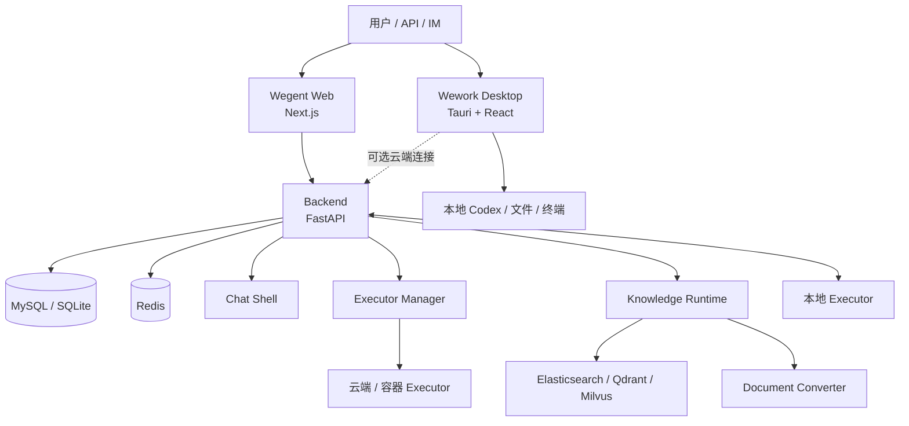

# Wegent

> 开源、可自部署的智能体工作平台。

[English](README.md) | 简体中文

[](https://github.com/wecode-ai/Wegent/actions/workflows/test.yml)
[](LICENSE)
[](https://github.com/wecode-ai/Wegent/issues)

Wegent 让团队创建和共享能够实际执行任务的 AI 智能体，用于对话、代码开发、知识库和自动化工作。通过 Web 管理团队能力，通过 Wework 让智能体直接在本地项目和开发环境中工作。

<div align="center">

**[部署 Wegent](#快速开始)** · **[下载 Wework](https://github.com/wecode-ai/Wegent/releases?q=Wework+macOS+DMG+build&expanded=true)** · **[查看文档](https://wecode-ai.github.io/wegent-docs/zh/)**

</div>


## 可以用 Wegent 做什么

| 场景 | Wegent 可以做什么 |
| --- | --- |
| **团队 AI 助手** | 提供可私有部署的对话入口，共享模型、知识和 Skills，支持群聊协作与文件处理 |
| **AI Coding** | 在隔离环境或本地电脑中修改代码、运行测试、提交变更并创建 Pull Request |
| **企业知识助手** | 解析和索引文档、网页与企业数据，让智能体基于自己的资料回答问题 |
| **持续自动化** | 通过定时和事件触发追踪信息、分析网页、筛选通知并发布信息流 |
| **本地与内网执行** | 使用本地代码、CLI、浏览器、专用开发环境和内网资源完成任务 |
| **已有系统集成** | 通过 API、MCP 和 IM 机器人把智能体接入现有应用与团队工具 |

## 选择使用方式

| 使用 Wegent Web | 使用 Wework |
| --- | --- |
| 创建和共享智能体、模型、知识库与自动化任务 | 打开本地项目，让 AI 使用文件、终端、CLI 和开发环境 |
| 统一管理用户、权限和执行设备 | 使用本机 Codex、本地模型和本地 Executor |
| 通过浏览器、API 和 IM 服务团队 | 面向日常 AI Coding 和本地工作流 |

Wework 可以连接到团队部署的 Wegent，在本地工作时使用共享模型、云端设备和远程任务。

**[部署 Wegent](#快速开始)** · **[下载 Wework](https://github.com/wecode-ai/Wegent/releases?q=Wework+macOS+DMG+build&expanded=true)**

## 为什么选择 Wegent

| 特点 | 带来的价值 |
| --- | --- |
| **能力可以复用** | 模型、知识、工具和 Skills 可以组合成智能体，在不同任务中重复使用 |
| **多个机器人可以协作** | 按任务组织机器人分工完成检索、分析、编码和审查 |
| **任务在合适的位置运行** | 根据代码和数据所在位置选择云端、容器、本地设备或内网环境 |
| **同一套能力服务多个入口** | 从 Web、Wework、API 和 IM 调用团队沉淀的智能体能力 |

## 快速开始

### 部署 Wegent Web

前置要求：Docker。执行以下命令启动单容器 + SQLite 的 Standalone 模式：

```bash
curl -fsSL https://raw.githubusercontent.com/wecode-ai/Wegent/main/install.sh | bash -s -- --standalone
```

启动后：

1. 打开 http://localhost:3000。
2. 按页面引导设置管理员密码。
3. 在设置中配置一个模型和 API Key。
4. 选择预置智能体并发送第一条消息。

常用管理命令：

```bash
wegent-standalone status
wegent-standalone logs
wegent-standalone restart
wegent-standalone stop
```

如果命令不在当前 `PATH` 中，可以使用 `~/.local/bin/wegent-standalone`。

### 使用 Wework

下载并安装 Wework，打开一个本地项目即可开始 AI Coding。Wework 自带本地执行能力，也可以在设置中连接团队部署的 Wegent。

任务执行期间，Wework 会持续展示最新工具调用；工具列表默认显示约 3.5 行并可滚动，命令输出、搜索详情和文件变更可逐项展开。最终回答开始后，处理过程会收起为带分隔线的“已处理”条目，展开后仍使用相同的工具列表。

**[下载 Wework Desktop](https://github.com/wecode-ai/Wegent/releases?q=Wework+macOS+DMG+build&expanded=true)**

### Wegent Web 部署方式

| 方式 | 适合场景 | 入口 |
| --- | --- | --- |
| **Standalone** | 个人体验和轻量自部署 | 上方一键安装命令 |
| **Standard** | 使用 MySQL、Redis 和独立服务的团队部署 | [安装指南](docs/zh/getting-started/installation.md) |
| **Development** | 参与开发和二次扩展 | [开发环境搭建](docs/zh/developer-guide/setup.md) |

Standalone 还可以选择 `host`、`container` 或 `hybrid` Executor 模式，详见 [Standalone 模式](docs/zh/deployment/standalone-mode.md)。

## 智能体模型

<details>
<summary>了解 Wegent 如何组织智能体与任务</summary>

Wegent 将能力、协作关系和运行上下文分开管理，使它们可以在不同任务和环境中复用。

```text
Ghost（提示词 + MCP + Skills）
  + Shell（Chat / ClaudeCode / Agno / Dify）
  + Model
  = Bot（机器人）

多个 Bot + 协作模式 = Team（界面中的“智能体”）
Team + Workspace = Task（一次可追踪的执行）
```

这些资源可以通过界面、YAML 和 API 管理。详细说明见 [核心概念](docs/zh/concepts/core-concepts.md)和 [YAML 规范](docs/zh/reference/yaml-specification.md)。

</details>

## 架构概览

<details>
<summary>查看 Wegent 技术组件</summary>


```mermaid
graph TB
    User["用户 / API / IM"] --> Frontend["Wegent Web<br/>Next.js"]
    User --> Wework["Wework Desktop<br/>Tauri + React"]
    Frontend --> Backend["Backend<br/>FastAPI"]
    Wework -. "可选云端连接" .-> Backend
    Wework --> LocalWork["本地 Codex / 文件 / 终端"]

    Backend --> Database[("MySQL / SQLite")]
    Backend --> Redis[("Redis")]
    Backend --> ChatShell["Chat Shell"]
    Backend --> ExecutorManager["Executor Manager"]
    Backend --> KnowledgeRuntime["Knowledge Runtime"]

    ExecutorManager --> CloudExecutor["云端 / 容器 Executor"]
    Backend <--> LocalExecutor["本地 Executor"]
    KnowledgeRuntime --> VectorStore["Elasticsearch / Qdrant / Milvus"]
    KnowledgeRuntime --> DocConverter["Document Converter"]
```

</details>

### 仓库结构

| 目录 | 职责 |
| --- | --- |
| `frontend/` | Wegent Web 产品 |
| `backend/` | REST API 和核心业务逻辑 |
| `wework/` | Tauri 桌面工作台 |
| `executor/` | 智能体任务执行环境 |
| `executor_manager/` | Executor 调度与编排 |
| `chat_shell/` | 对话运行时 |
| `knowledge_runtime/` | 知识检索服务 |
| `knowledge_doc_converter/` | 文档解析与转换 |
| `shared/` | 跨服务共享模块 |

## 文档

- [快速开始](docs/zh/getting-started/quick-start.md)
- [安装与部署](docs/zh/getting-started/installation.md)
- [核心概念](docs/zh/concepts/core-concepts.md)
- [用户指南](docs/zh/user-guide/README.md)
- [OpenAPI Responses API](docs/zh/reference/openapi-responses-api.md)
- [开发者指南](docs/zh/developer-guide/README.md)
- [故障排查](docs/zh/troubleshooting.md)

## 参与项目

欢迎提交问题、改进文档、贡献代码或分享新的使用方式。

- [贡献指南](CONTRIBUTING.md)
- [安全策略](SECURITY.md)
- [问题反馈](https://github.com/wecode-ai/Wegent/issues)
- [Discord 社区](https://discord.gg/MVzJzyqEUp)
- [开源许可证](LICENSE)

## 贡献者

感谢所有帮助 Wegent 持续成长的贡献者。

<!-- readme: contributors -start -->
<table>
	<tbody>
		<tr>
            <td align="center">
                <a href="https://github.com/qdaxb">
                    
                    <br />
                    <sub><b>Axb</b></sub>
                </a>
            </td>
            <td align="center">
                <a href="https://github.com/Micro66">
                    
                    <br />
                    <sub><b>MicroLee</b></sub>
                </a>
            </td>
            <td align="center">
                <a href="https://github.com/feifei325">
                    
                    <br />
                    <sub><b>Feifei</b></sub>
                </a>
            </td>
            <td align="center">
                <a href="https://github.com/FicoHu">
                    
                    <br />
                    <sub><b>FicoHu</b></sub>
                </a>
            </td>
            <td align="center">
                <a href="https://github.com/icycrystal4">
                    
                    <br />
                    <sub><b>Icycrystal4</b></sub>
                </a>
            </td>
            <td align="center">
                <a href="https://github.com/cc-yafei">
                    
                    <br />
                    <sub><b>YaFei Liu</b></sub>
                </a>
            </td>
            <td align="center">
                <a href="https://github.com/kissghosts">
                    
                    <br />
                    <sub><b>Yanhe</b></sub>
                </a>
            </td>
            <td align="center">
                <a href="https://github.com/johnny0120">
                    
                    <br />
                    <sub><b>Johnny0120</b></sub>
                </a>
            </td>
		</tr>
		<tr>
            <td align="center">
                <a href="https://github.com/parabala">
                    
                    <br />
                    <sub><b>Parabala</b></sub>
                </a>
            </td>
            <td align="center">
                <a href="https://github.com/moqimoqidea">
                    
                    <br />
                    <sub><b>Moqimoqidea</b></sub>
                </a>
            </td>
            <td align="center">
                <a href="https://github.com/yixiangxx">
                    
                    <br />
                    <sub><b>Yi Xiang</b></sub>
                </a>
            </td>
            <td align="center">
                <a href="https://github.com/joyway1978">
                    
                    <br />
                    <sub><b>Joyway78</b></sub>
                </a>
            </td>
            <td align="center">
                <a href="https://github.com/sunnights">
                    
                    <br />
                    <sub><b>Jake Zhang</b></sub>
                </a>
            </td>
            <td align="center">
                <a href="https://github.com/cocowh">
                    
                    <br />
                    <sub><b>Birch</b></sub>
                </a>
            </td>
            <td align="center">
                <a href="https://github.com/2561056571">
                    
                    <br />
                    <sub><b>Xuemin</b></sub>
                </a>
            </td>
            <td align="center">
                <a href="https://github.com/fengkuizhi">
                    
                    <br />
                    <sub><b>Fengkuizhi</b></sub>
                </a>
            </td>
		</tr>
		<tr>
            <td align="center">
                <a href="https://github.com/jnhu76">
                    
                    <br />
                    <sub><b>Jm.hu</b></sub>
                </a>
            </td>
            <td align="center">
                <a href="https://github.com/kerwin612">
                    
                    <br />
                    <sub><b>Kerwin Bryant</b></sub>
                </a>
            </td>
            <td align="center">
                <a href="https://github.com/maquan0927">
                    
                    <br />
                    <sub><b>Just Quan</b></sub>
                </a>
            </td>
            <td align="center">
                <a href="https://github.com/RockysGit">
                    
                    <br />
                    <sub><b>RockysGit</b></sub>
                </a>
            </td>
            <td align="center">
                <a href="https://github.com/DavidLeeUX">
                    
                    <br />
                    <sub><b>Kva</b></sub>
                </a>
            </td>
            <td align="center">
                <a href="https://github.com/junbaor">
                    
                    <br />
                    <sub><b>Junbaor</b></sub>
                </a>
            </td>
            <td align="center">
                <a href="https://github.com/fingki">
                    
                    <br />
                    <sub><b>Fingki</b></sub>
                </a>
            </td>
            <td align="center">
                <a href="https://github.com/flyhope">
                    
                    <br />
                    <sub><b>李枨煊</b></sub>
                </a>
            </td>
		</tr>
		<tr>
            <td align="center">
                <a href="https://github.com/hustfisher">
                    
                    <br />
                    <sub><b>fishermen</b></sub>
                </a>
            </td>
            <td align="center">
                <a href="https://github.com/jolestar">
                    
                    <br />
                    <sub><b>Jolestar</b></sub>
                </a>
            </td>
            <td align="center">
                <a href="https://github.com/code-wangdi">
                    
                    <br />
                    <sub><b>Code-wangdi</b></sub>
                </a>
            </td>
            <td align="center">
                <a href="https://github.com/haosenwang1018">
                    
                    <br />
                    <sub><b>Sense_wang</b></sub>
                </a>
            </td>
            <td align="center">
                <a href="https://github.com/LiDaiyan">
                    
                    <br />
                    <sub><b>Li Daiyan</b></sub>
                </a>
            </td>
            <td align="center">
                <a href="https://github.com/sdadunderscoresdad">
                    
                    <br />
                    <sub><b>+7</b></sub>
                </a>
            </td>
            <td align="center">
                <a href="https://github.com/qwertyerge">
                    
                    <br />
                    <sub><b>Erdawang</b></sub>
                </a>
            </td>
            <td align="center">
                <a href="https://github.com/DeadLion">
                    
                    <br />
                    <sub><b>Jasper Zhong</b></sub>
                </a>
            </td>
		</tr>
		<tr>
            <td align="center">
                <a href="https://github.com/rayzhang0603">
                    
                    <br />
                    <sub><b>Ray</b></sub>
                </a>
            </td>
            <td align="center">
                <a href="https://github.com/RichardoMrMu">
                    
                    <br />
                    <sub><b>RichardoMu</b></sub>
                </a>
            </td>
            <td align="center">
                <a href="https://github.com/Ged0">
                    
                    <br />
                    <sub><b>_</b></sub>
                </a>
            </td>
            <td align="center">
                <a href="https://github.com/andrewzq777">
                    
                    <br />
                    <sub><b>Andrewzq777</b></sub>
                </a>
            </td>
            <td align="center">
                <a href="https://github.com/ch15084">
                    
                    <br />
                    <sub><b>Ch15084</b></sub>
                </a>
            </td>
            <td align="center">
                <a href="https://github.com/gdouyang">
                    
                    <br />
                    <sub><b>Gdouyang</b></sub>
                </a>
            </td>
            <td align="center">
                <a href="https://github.com/graindt">
                    
                    <br />
                    <sub><b>Graindt</b></sub>
                </a>
            </td>
            <td align="center">
                <a href="https://github.com/qingchengliu">
                    
                    <br />
                    <sub><b>Qingcheng</b></sub>
                </a>
            </td>
		</tr>
		<tr>
            <td align="center">
                <a href="https://github.com/salt-hai">
                    
                    <br />
                    <sub><b>Salt-hai</b></sub>
                </a>
            </td>
            <td align="center">
                <a href="https://github.com/wxcfox">
                    
                    <br />
                    <sub><b>Wxcfox</b></sub>
                </a>
            </td>
		</tr>
	<tbody>
</table>
<!-- readme: contributors -end -->

---

<p align="center">Made with ❤️ by WeCode-AI Team</p>
