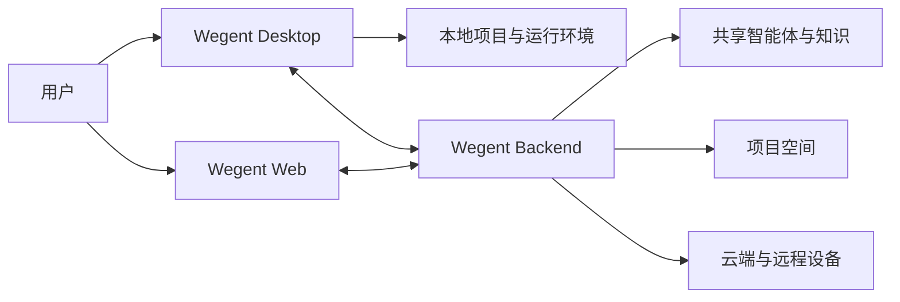

# Wegent

> 一套跨越本地桌面、云端智能体与远程工作机的开源 AI 工作系统。

[English](README.md) | 简体中文

[](https://github.com/wecode-ai/Wegent/actions/workflows/test.yml)
[](LICENSE)
[](https://github.com/wecode-ai/Wegent/issues)

Wegent 包含桌面工作台和可自托管的 Web 平台。Wegent Desktop 用于处理本地项目、文件、命令、测试和代码变更；Wegent Web 提供网页端智能体、知识库、自动化和管理功能；Wegent Backend 为这些应用提供共享项目空间、模型和执行设备。

[下载 Wegent Desktop](https://github.com/wecode-ai/Wegent/releases) · [查看文档](https://wecode-ai.github.io/wegent-docs/zh/) · [参与贡献](CONTRIBUTING.md)

## Wegent Desktop

Wegent Desktop 按项目和任务组织本地编码工作。任务界面集中展示会话、工具活动、测试、变更文件和 Diff；项目空间界面提供任务看板、共享文件、自动化和执行状态。


<p align="center"><sub>在 Wegent Desktop 中执行并审查本地编码任务。</sub></p>


<p align="center"><sub>Wegent Desktop 中的项目空间，包括任务看板、共享文件、自动化和执行状态。</sub></p>

## 核心功能

- **桌面工作台**：组织本地项目、任务、会话、文件、工具活动、测试和 Diff。
- **可复用智能体**：组合模型、提示词、Skills、知识、工具和协作配置。
- **项目空间**：共享任务看板、文件、讨论、自动化、执行记录和交付物。
- **多种执行位置**：在本机、远程工作机或服务端执行器中运行任务。
- **自托管服务**：部署 Wegent Web 和 Backend，管理团队访问、API、权限、调度和知识服务。

## 为什么选择 Wegent

**基于 Codex 的本地编码体验是 Wegent Desktop 的基础。**它直接在你的项目中使用本地代码、文件、命令和开发环境；当编码工作需要跨越一台电脑或一个人时，再连接 Wegent Backend。连接后，本地工作台和 Web 使用同一套项目、任务和设备资源。

- **让任务在合适的设备上运行**：继续使用本地已有的代码、文件、命令和开发环境，也可以选择远程工作机或服务端执行器运行同一个项目的任务。
- **让团队围绕同一个项目推进**：项目空间将任务看板、共享文件、讨论、执行状态和交付物关联起来，而不只是在各自的电脑上保存会话和代码变更。
- **把重复流程交给自动化**：项目空间可配置自动化与执行队列，用于持续推进项目中的例行工作。
- **由团队掌握服务和数据**：Web 和 Backend 可以自托管，用于共享访问、权限、模型配置、调度、知识服务和远程设备管理。

如果工作始终只在一台电脑上完成，Wegent Desktop 提供熟悉的 Codex 编码体验；当任务需要在多人、多设备或自托管环境之间流转时，连接 Wegent 可在此基础上继续扩展。

## Wegent Web

Wegent Web 提供远程智能体的网页界面。智能体使用配置好的模型、知识、Skills 和工具，Wegent Backend 负责管理任务和执行。


<p align="center"><sub>Wegent 远程智能体调用工具生成甘特图。</sub></p>

## 工作方式

Wegent Desktop 直接使用本地项目和本机运行时，也可以连接 Wegent Backend 使用共享资源和执行设备。Wegent Web 是基于同一 Backend 的独立网页界面。


```mermaid
flowchart LR
    User["用户"] --> Desktop["Wegent Desktop"]
    User --> Web["Wegent Web"]
    Desktop --> Local["本地项目与运行环境"]
    Desktop <--> Backend["Wegent Backend"]
    Web <--> Backend
    Backend --> Agents["共享智能体与知识"]
    Backend --> Space["项目空间"]
    Backend --> Remote["云端与远程设备"]
```

## 快速开始

### Wegent Desktop

1. 从 [Releases 下载 Wegent Desktop](https://github.com/wecode-ai/Wegent/releases) 并安装。
2. 打开应用，添加或选择一个本地项目。
3. 创建任务并描述需要执行的工作。
4. 查看智能体活动、命令输出和文件变更。

### Wegent Web 和 Backend

使用 Docker 以 Standalone 模式启动自托管 Web 应用和 Backend：

```bash
curl -fsSL https://raw.githubusercontent.com/wecode-ai/Wegent/main/install.sh | bash -s -- --standalone
```

启动后打开 http://localhost:3000，按页面引导设置管理员密码并配置模型。更多部署方式见 [安装指南](docs/zh/wegent/getting-started/installation.md) 和 [Standalone 模式](docs/zh/wegent/deployment/standalone-mode.md)。

## 开发

需要 Node.js 20+ 和 pnpm：

```bash
pnpm install
pnpm --filter wework dev
```

运行 macOS 桌面应用：

```bash
pnpm --filter wework dev:mac
```

桌面端的开发、构建和发布说明见 [wework/README.md](wework/README.md)；`wework/` 是当前桌面应用源码目录。

## 仓库结构

| 目录                       | 职责                                 |
| -------------------------- | ------------------------------------ |
| `wework/`                  | Wegent Desktop（Electron、Vite、React） |
| `executor/`                | 本地与远程的智能体任务执行环境       |
| `frontend/`                | Wegent 平台 Web 管理界面             |
| `backend/`                 | REST API 和核心业务逻辑              |
| `executor_manager/`        | 执行器调度与编排                     |
| `chat_shell/`              | 对话运行时                           |
| `knowledge_runtime/`       | 知识检索服务                         |
| `knowledge_doc_converter/` | 文档解析与转换                       |
| `shared/`                  | 跨服务共享模块                       |

## 文档

- [Wegent Desktop 文档](docs/zh/wework/README.md)
- [桌面端开发与发布](wework/README.md)
- [Wegent 快速开始](docs/zh/wegent/getting-started/quick-start.md)
- [安装与部署](docs/zh/wegent/getting-started/installation.md)
- [核心概念](docs/zh/wegent/concepts/core-concepts.md)
- [开发者指南](docs/zh/wegent/developer-guide/README.md)
- [故障排查](docs/zh/wegent/troubleshooting.md)

## 参与贡献

欢迎提交问题、改进文档、贡献代码或分享新的使用方式。

- [贡献指南](CONTRIBUTING.md)
- [安全策略](SECURITY.md)
- [问题反馈](https://github.com/wecode-ai/Wegent/issues)
- [Discord 社区](https://discord.gg/MVzJzyqEUp)
- [开源许可证](LICENSE)

## 贡献者

感谢所有帮助 Wegent 持续成长的贡献者。

<!-- readme: contributors -start -->
<table>
	<tbody>
		<tr>
            <td align="center">
                <a href="https://github.com/qdaxb">
                    
                    <br />
                    <sub><b>Axb</b></sub>
                </a>
            </td>
            <td align="center">
                <a href="https://github.com/Micro66">
                    
                    <br />
                    <sub><b>MicroLee</b></sub>
                </a>
            </td>
            <td align="center">
                <a href="https://github.com/feifei325">
                    
                    <br />
                    <sub><b>Feifei</b></sub>
                </a>
            </td>
            <td align="center">
                <a href="https://github.com/FicoHu">
                    
                    <br />
                    <sub><b>FicoHu</b></sub>
                </a>
            </td>
            <td align="center">
                <a href="https://github.com/icycrystal4">
                    
                    <br />
                    <sub><b>Icycrystal4</b></sub>
                </a>
            </td>
            <td align="center">
                <a href="https://github.com/kissghosts">
                    
                    <br />
                    <sub><b>Yanhe</b></sub>
                </a>
            </td>
            <td align="center">
                <a href="https://github.com/cc-yafei">
                    
                    <br />
                    <sub><b>YaFei Liu</b></sub>
                </a>
            </td>
            <td align="center">
                <a href="https://github.com/moqimoqidea">
                    
                    <br />
                    <sub><b>Moqimoqidea</b></sub>
                </a>
            </td>
		</tr>
		<tr>
            <td align="center">
                <a href="https://github.com/johnny0120">
                    
                    <br />
                    <sub><b>Johnny0120</b></sub>
                </a>
            </td>
            <td align="center">
                <a href="https://github.com/parabala">
                    
                    <br />
                    <sub><b>Parabala</b></sub>
                </a>
            </td>
            <td align="center">
                <a href="https://github.com/sunnights">
                    
                    <br />
                    <sub><b>Jake Zhang</b></sub>
                </a>
            </td>
            <td align="center">
                <a href="https://github.com/joyway1978">
                    
                    <br />
                    <sub><b>Joyway78</b></sub>
                </a>
            </td>
            <td align="center">
                <a href="https://github.com/yixiangxx">
                    
                    <br />
                    <sub><b>Yi Xiang</b></sub>
                </a>
            </td>
            <td align="center">
                <a href="https://github.com/cocowh">
                    
                    <br />
                    <sub><b>Birch</b></sub>
                </a>
            </td>
            <td align="center">
                <a href="https://github.com/luckjun529-lang">
                    
                    <br />
                    <sub><b>junlong chen</b></sub>
                </a>
            </td>
            <td align="center">
                <a href="https://github.com/sdadunderscoresdad">
                    
                    <br />
                    <sub><b>+7</b></sub>
                </a>
            </td>
		</tr>
		<tr>
            <td align="center">
                <a href="https://github.com/2561056571">
                    
                    <br />
                    <sub><b>Xuemin</b></sub>
                </a>
            </td>
            <td align="center">
                <a href="https://github.com/fengkuizhi">
                    
                    <br />
                    <sub><b>Fengkuizhi</b></sub>
                </a>
            </td>
            <td align="center">
                <a href="https://github.com/lvmowei">
                    
                    <br />
                    <sub><b>lvmowei</b></sub>
                </a>
            </td>
            <td align="center">
                <a href="https://github.com/jnhu76">
                    
                    <br />
                    <sub><b>Jm.hu</b></sub>
                </a>
            </td>
            <td align="center">
                <a href="https://github.com/maquan0927">
                    
                    <br />
                    <sub><b>Just Quan</b></sub>
                </a>
            </td>
            <td align="center">
                <a href="https://github.com/kerwin612">
                    
                    <br />
                    <sub><b>Kerwin Bryant</b></sub>
                </a>
            </td>
            <td align="center">
                <a href="https://github.com/DavidLeeUX">
                    
                    <br />
                    <sub><b>Kva</b></sub>
                </a>
            </td>
            <td align="center">
                <a href="https://github.com/earthAlone2026">
                    
                    <br />
                    <sub><b>xiaoqiang</b></sub>
                </a>
            </td>
		</tr>
		<tr>
            <td align="center">
                <a href="https://github.com/RockysGit">
                    
                    <br />
                    <sub><b>RockysGit</b></sub>
                </a>
            </td>
            <td align="center">
                <a href="https://github.com/junbaor">
                    
                    <br />
                    <sub><b>Junbaor</b></sub>
                </a>
            </td>
            <td align="center">
                <a href="https://github.com/qwertyerge">
                    
                    <br />
                    <sub><b>Erdawang</b></sub>
                </a>
            </td>
            <td align="center">
                <a href="https://github.com/Twelveeee">
                    
                    <br />
                    <sub><b>Twelveeee</b></sub>
                </a>
            </td>
            <td align="center">
                <a href="https://github.com/fingki">
                    
                    <br />
                    <sub><b>Fingki</b></sub>
                </a>
            </td>
            <td align="center">
                <a href="https://github.com/hustfisher">
                    
                    <br />
                    <sub><b>fishermen</b></sub>
                </a>
            </td>
            <td align="center">
                <a href="https://github.com/flyhope">
                    
                    <br />
                    <sub><b>李枨煊</b></sub>
                </a>
            </td>
            <td align="center">
                <a href="https://github.com/jolestar">
                    
                    <br />
                    <sub><b>Jolestar</b></sub>
                </a>
            </td>
		</tr>
		<tr>
            <td align="center">
                <a href="https://github.com/code-wangdi">
                    
                    <br />
                    <sub><b>Code-wangdi</b></sub>
                </a>
            </td>
            <td align="center">
                <a href="https://github.com/haosenwang1018">
                    
                    <br />
                    <sub><b>Sense_wang</b></sub>
                </a>
            </td>
            <td align="center">
                <a href="https://github.com/LiDaiyan">
                    
                    <br />
                    <sub><b>Li Daiyan</b></sub>
                </a>
            </td>
            <td align="center">
                <a href="https://github.com/DeadLion">
                    
                    <br />
                    <sub><b>Jasper Zhong</b></sub>
                </a>
            </td>
            <td align="center">
                <a href="https://github.com/rayzhang0603">
                    
                    <br />
                    <sub><b>Ray</b></sub>
                </a>
            </td>
            <td align="center">
                <a href="https://github.com/RichardoMrMu">
                    
                    <br />
                    <sub><b>RichardoMu</b></sub>
                </a>
            </td>
            <td align="center">
                <a href="https://github.com/Ged0">
                    
                    <br />
                    <sub><b>_</b></sub>
                </a>
            </td>
            <td align="center">
                <a href="https://github.com/andrewzq777">
                    
                    <br />
                    <sub><b>Andrewzq777</b></sub>
                </a>
            </td>
		</tr>
		<tr>
            <td align="center">
                <a href="https://github.com/ch15084">
                    
                    <br />
                    <sub><b>Ch15084</b></sub>
                </a>
            </td>
            <td align="center">
                <a href="https://github.com/gdouyang">
                    
                    <br />
                    <sub><b>Gdouyang</b></sub>
                </a>
            </td>
            <td align="center">
                <a href="https://github.com/graindt">
                    
                    <br />
                    <sub><b>Graindt</b></sub>
                </a>
            </td>
            <td align="center">
                <a href="https://github.com/qingchengliu">
                    
                    <br />
                    <sub><b>Qingcheng</b></sub>
                </a>
            </td>
            <td align="center">
                <a href="https://github.com/Qinxl0921">
                    
                    <br />
                    <sub><b>qinxll</b></sub>
                </a>
            </td>
            <td align="center">
                <a href="https://github.com/salt-hai">
                    
                    <br />
                    <sub><b>Salt-hai</b></sub>
                </a>
            </td>
            <td align="center">
                <a href="https://github.com/wxcfox">
                    
                    <br />
                    <sub><b>Wxcfox</b></sub>
                </a>
            </td>
		</tr>
	<tbody>
</table>
<!-- readme: contributors -end -->

---

<p align="center">Made with ❤️ by WeCode-AI Team</p>
