# Wegent

[English](README.md) | 简体中文

[](https://python.org)
[](https://fastapi.tiangolo.com)
[](https://nextjs.org)
[](https://docker.com)
[](https://claude.ai)

> 🚀 一个定义、组织和运行智能体 AI的开源平台

##  概述

Wegent 是一个开源的 AI 原生操作系统，使您能够大规模定义、组织和运行智能代理。基于 Kubernetes 风格的声明式 API 和 CRD（自定义资源定义）设计模式，Wegent 为创建和管理 AI 智能体生态系统提供了标准化框架。

```mermaid
graph LR
    subgraph AIResource ["🌐 AI 原生资源"]
        subgraph YAMLDef ["📄 YAML 定义"]
            Ghost["👻 Ghost<br/>智能体灵魂"]
            Model["🧠 Model<br/>模型配置"]
            Shell["🐚 Shell<br/>智能体程序"]
            Bot["🤖 Bot<br/>智能体实例"]
            CollabModel["🤝 Collaboration<br/>协作模型"]
            Team["👥 Team<br/>协作团队"]
        end
     end

    subgraph Wegent ["🚀 Wegent"]
        Workspace["💼 Workspace<br/>工作环境"]
        TeamInstance["👥 智能体团队实例<br/>运行中的团队"]
    end

      User["👤 用户"]
      Task["🎯 Task<br/>用户任务"]
    %% CRD 资源关系
    Ghost --> Bot
    Model --> Bot
    Shell --> Bot
    Bot --> Team
    CollabModel --> Team
    Shell --> Team

    %% 团队定义到实例
    AIResource --> Wegent
    Workspace --> TeamInstance

    %% 用户交互流程
    User --> Task
    Task --> TeamInstance
    TeamInstance --> Task

    %% 样式
    classDef yamlBox stroke-dasharray: 5 5
    classDef runtimeBox stroke:#ff6b6b,stroke-width:2px
    classDef resourceBox stroke:#4ecdc4,stroke-width:2px

    class YAMLDef yamlBox
    class Runtime runtimeBox
    class AIResource resourceBox

```



### 🎯 核心概念

- **👻 Ghost**：智能体的"灵魂" - 定义个性、能力和行为模式
- **🧠 Model**：AI 模型配置 - 定义环境变量和模型参数
- **🐚 Shell**："可执行程序" - 能够启动智能体的程序
- **🤖 Bot**：完整的智能体实例，结合了 Ghost + Shell + Model
- **👥 Team**：由多个 Bot + 协作模型组成，定义智能体如何协同工作
- **🤝 Collaboration**：定义团队中 Bot 之间的交互模式（类似工作流）
- **💼 Workspace**：用于任务和项目的隔离工作环境
- **🎯 Task**：分配给团队的可执行工作单元

### ✨ 为什么选择 Wegent？

- **标准化**：通用的 AI 智能体运行时规范，就像容器的 Kubernetes
- **声明式**：通过简单的 YAML 配置定义和管理智能体
- **协作式**：内置多智能体团队协作和编排支持
- **多模型支持**：目前支持 Claude Code，计划支持 Codex 和 Gemini
- **灵活配置**：可自定义智能体个性和能力
- **任务编排**：智能调度和执行

### 演示与截图

#### 演示视频

> Wegent 的快速预览，展示智能体创建和团队协作。


### 截图

#### 🤖 新建 Bot


#### 👥 新建团队


## 🚀 快速开始

### 前置要求

- Docker 和 Docker Compose
- Git

1. **克隆仓库**
   ```bash
   git clone https://github.com/wecode-ai/wegent.git
   cd wegent
   ```

2. **启动平台**
   ```bash
   docker-compose up -d
   ```

3. **访问 Web 界面**
   - 在浏览器中打开 http://localhost:3000

4. **配置 GitHub 访问令牌**
   - 按照页面说明配置您的 GitHub 访问令牌

5. **配置 Bot**
   
   Wegent 内置了一个开发 Bot。只需配置您的 Claude API 密钥即可开始使用：
   
   ```bash
    {
        "env": {
            "ANTHROPIC_MODEL": "claude-4.1-opus",
            "ANTHROPIC_API_KEY": "xxxxxx",
            "ANTHROPIC_BASE_URL": "sk-xxxxxx",
            "ANTHROPIC_SMALL_FAST_MODEL": "claude-3.5-haiku"
        }
    }
   ```

6. **运行任务**

   在任务页面，选择您的项目和分支，描述您的开发需求，例如使用 Python 实现冒泡排序算法

## 🏗️ 架构

```mermaid
graph TB
    subgraph "🖥️ 管理平台层"
        Frontend["🌐 Next.js 前端"]
        Backend["⚙️ FastAPI 后端"]
        API["🚀 声明式 API"]
    end
    
    subgraph "📊 数据层"
        MySQL[("💾 MySQL 数据库")]
    end
    
    subgraph "🔍 执行层"
        ExecutorManager["💯 执行器管理器"]
        Executor1["🚀 执行器 1"]
        Executor2["🚀 执行器 2"]
        ExecutorN["🚀 执行器 N"]
    end
    
    subgraph "🤖 智能体层"
        Claude["🧠 Claude Code"]
        AngoPlanned["💻 Agno（计划中）"]
        DifyPlanned["✨ Dify（计划中）"]
    end
  
    
    %% 系统交互
    Frontend --> API
    API --> Backend
    Backend --> MySQL
    Backend --> ExecutorManager
    ExecutorManager --> Executor1
    ExecutorManager --> Executor2
    ExecutorManager --> ExecutorN
    
    %% AI 程序集成（目前仅支持 Claude Code）
    Executor1 --> Claude
    Executor2 --> Claude
    ExecutorN --> Claude
```



## 🛠️ 开发

### 项目结构

```
wegent/
├── backend/          # FastAPI 后端服务
├── frontend/         # Next.js Web 界面
├── executor/         # 任务执行引擎
├── executor_manager/ # 执行编排
├── shared/           # 通用工具和模型
└── docker/           # 容器配置
```

### 开发环境设置

1. **后端开发**
   ```bash
   cd backend
   pip install -r requirements.txt
   uvicorn app.main:app --host 0.0.0.0 --port 8000 --reload
   ```

2. **前端开发**
   ```bash
   cd frontend
   npm install
   npm run dev
   ```

3. **运行测试**
   ```bash
   # 后端测试
   cd backend && python -m pytest
   
   # 前端测试
   cd frontend && npm test
   ```


## 🤝 贡献

我们欢迎贡献！详情请参阅我们的[贡献指南](CONTRIBUTING.md)。

### 开发工作流

1. Fork 仓库
2. 创建功能分支
3. 进行更改
4. 添加测试
5. 提交 Pull Request

## 📞 支持

- 🐛 问题反馈：[GitHub Issues](https://github.com/wecode-ai/wegent/issues)

---

<p align="center">由 WeCode-AI 团队用 ❤️ 制作</p>