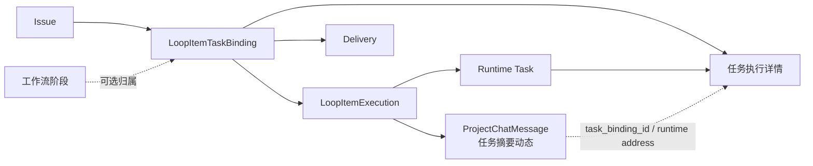
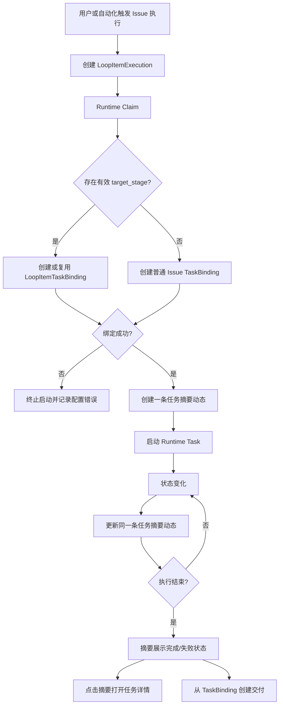
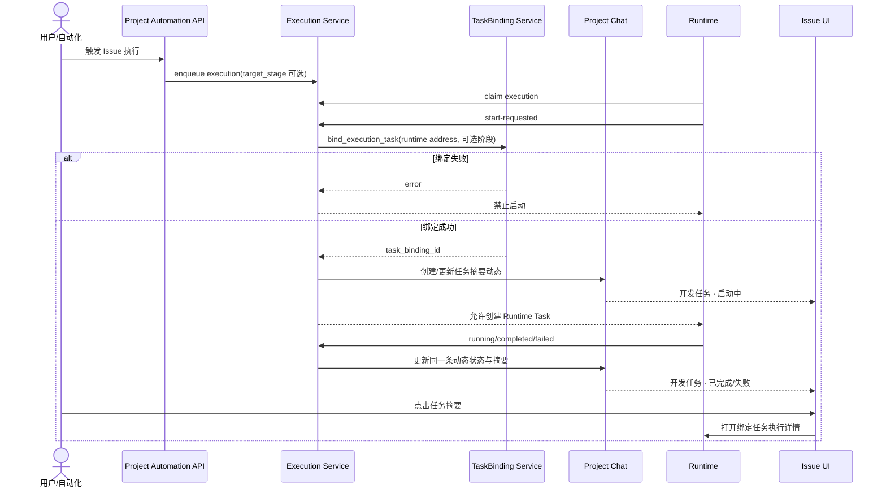

# Issue 任务摘要动态架构

## 目标

Issue 中：

- **任务**是实际执行实体，必须绑定所属 Issue；工作流阶段是可选归属。
- **动态**是 Issue 进展时间线。
- 每次任务执行只维护一条系统任务摘要动态；状态变化更新原动态。
- AI 后续可发布独立的进展动态，但完整执行会话只保留在任务详情。

## 架构图

### 数据职责

| 数据                  | 职责                                          | 必要关联                                     |
| --------------------- | --------------------------------------------- | -------------------------------------------- |
| `LoopItemExecution`   | 执行状态与调度事实                            | `loop_item_id`                               |
| `LoopItemTaskBinding` | Runtime Task 属于哪个 Issue，可选属于哪个阶段 | Issue、Runtime 地址；`workflow_node_id` 可空 |
| `ProjectChatMessage`  | Issue 动态中的任务摘要                        | Runtime 地址，最终关联 TaskBinding           |
| `Delivery`            | 任务交付结果                                  | `source_task_binding_id`                     |

## 执行流程图

## 时序图

## Review

### 必须保持的不变量

1. 所有 Issue 执行在 Runtime 启动前必须存在有效 TaskBinding。
2. 是否属于阶段由工作流上下文决定，不能由 `executor_type` 决定。
3. 没有 `target_stage` 时仍然创建 TaskBinding，且 `workflow_node_id` 为空。
4. 一次执行只有一条系统任务摘要动态，启动、运行和结束更新同一条记录。
5. 动态只展示摘要和状态；完整输出、工具调用和后续对话进入任务详情。
6. Delivery 必须使用同一条 TaskBinding，不能从未绑定的动态反推来源。

### 当前实现差异

- 直接阶段执行使用 `generic_robot`。
- 阶段绑定当前只接受 `project_robot`，导致 `generic_robot` 被静默跳过。
- Project Chat 仍会创建执行消息，因此出现“动态有执行、阶段任务为 0”。
- 动态卡片当前直接渲染完整 AI 内容，信息职责与任务详情重叠。

### Review 结论

方案可实施。修复应落在主链路：

1. 阶段上下文驱动 TaskBinding。
2. 绑定成功后才允许 Runtime 启动。
3. 复用现有单条执行消息的幂等更新能力。
4. 前端把执行消息投影为任务摘要卡片，并通过绑定打开任务详情。

不采用隐藏动态、交付时临时补绑定或根据正文猜测任务等兜底方案。
