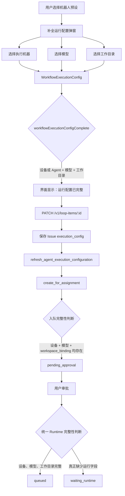
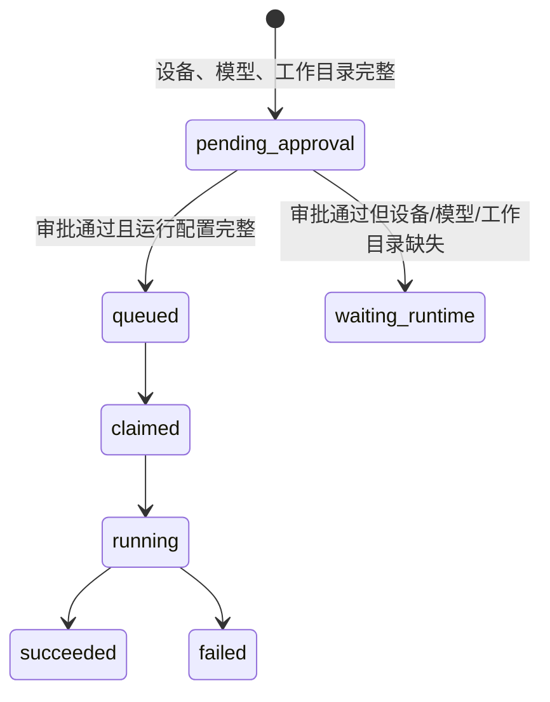

# Runtime 绑定与审批状态异常架构图

## 结论

Runtime 已绑定。异常来自“配置完整性”存在两套不一致的判断标准：

- 配置弹窗与执行入队：`execution_device_id + model + workspace_binding` 即为完整。
- 人工审批：额外强制要求 `runtime_profile_id`。

用户直接选择设备和模型时，`runtime_profile_id` 可以合法为空。因此任务在创建时配置完整，
但审批后被错误改成 `waiting_runtime`。

## 修复状态

已新增统一的后端判定 `runtime_configuration_complete`，以下入口共用同一规则：

- 项目机器人入队
- 工作流通用机器人入队
- 人工审批

统一条件为：

```text
execution_device_id
+ runtime_selection.model
+ workspace_binding（调用链声明需要时）
```

`runtime_profile_id` 不再参与“是否可执行”的判断。

## 当前调用链



## 数据证据

2026-08-24 的 Wework 前端日志记录了完整选择：

```json
{
  "runtimeProfileId": null,
  "deviceId": "cloud-device-dev",
  "model": "wecode-moonshot-kimi-k2.7-code-highspeed(公网)",
  "modelType": "public",
  "workspaceBinding": {
    "type": "standalone"
  }
}
```

这证明设备、模型和工作目录均已绑定，仅 `runtime_profile_id` 为空。

## 冲突代码

配置完整性：

```text
(agent_id 或 execution_device_id) && model && workspace_binding
```

审批完整性：

```text
runtime_profile_id && execution_environment && execution_device_id
```

审批判断既遗漏了 `model`，又把本应可选的 `runtime_profile_id` 当成必填字段。

## 正确状态机



## 修复原则

审批不能重新发明 Runtime 完整性规则。现已复用入队时的统一判定，并基于执行快照判断：

```text
execution_device_id + runtime_selection.model + 有效 workspace_binding
```

`runtime_profile_id` 只表示配置来源，不应作为 Runtime 是否可执行的必要条件。
