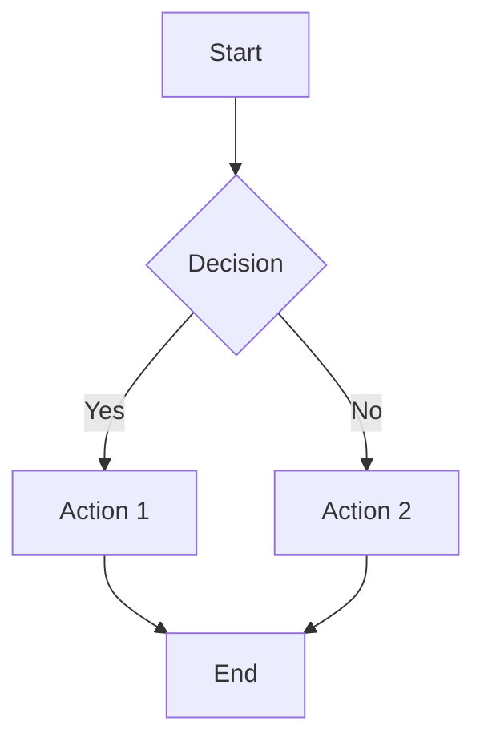

# Diagram Visualization with Mermaid

When you need to visualize concepts, workflows, architectures, or relationships, use Mermaid diagram syntax.

## IMPORTANT: Two-Step Workflow

To create mermaid diagrams, follow this two-step workflow:

1. **Step 1: Validate with `render_mermaid` tool** - Use the tool to validate your mermaid syntax
2. **Step 2: Output mermaid code block** - After successful validation, output the mermaid code block in your response

This ensures:

- Syntax is validated before displaying to the user
- The diagram is automatically saved in the conversation history
- The diagram can be referenced later in the conversation

### Step 1: Use render_mermaid Tool

Call the `render_mermaid` tool with the following parameters:

| Parameter      | Type   | Required | Description                                               |
| -------------- | ------ | -------- | --------------------------------------------------------- |
| `code`         | string | Yes      | The mermaid diagram code (without the ```mermaid wrapper) |
| `diagram_type` | string | No       | Diagram type hint (flowchart, sequence, etc.)             |
| `title`        | string | No       | Optional title for the diagram                            |

### Example Tool Call

```json
{
  "name": "render_mermaid",
  "arguments": {
    "code": "flowchart TD\n    A[Start] --> B{Decision}\n    B -->|Yes| C[Action 1]\n    B -->|No| D[Action 2]\n    C --> E[End]\n    D --> E",
    "title": "Decision Flow"
  }
}
```

### Step 2: Output Mermaid Code Block

When the `render_mermaid` tool returns success, it will include the mermaid code that you should output. Simply include the mermaid code block in your response:



This mermaid code block will be:

- Rendered as a diagram for the user to see
- Saved in the conversation history
- Available for future reference

### Error Handling and Retry

If the diagram has syntax errors, the tool will return detailed error information including:

- Error message from the mermaid parser
- Line number where the error occurred (if available)
- Suggestions for fixing the error

**When you receive an error, you should:**

1. Read the error message carefully
2. Identify the problematic line
3. Fix the syntax issue
4. Call `render_mermaid` again with the corrected code
5. Only output the mermaid code block after successful validation

Example error response:

```
Mermaid diagram rendering failed.

Error: Parse error on line 3: Unexpected token 'invalid'

Suggestions:
- Check the syntax at line 3
- Ensure all node IDs use alphanumeric characters and underscores
- Verify arrow syntax (-->, ---, -.->)

Please fix the error and try again.
```

---

## ⚠️ CRITICAL: Automatic Retry and Error Handling

### Automatic Correction System

The `render_mermaid` tool includes an **automatic correction system** that:

1. Detects syntax errors in your Mermaid code
2. Automatically attempts to fix common issues using AI
3. Retries rendering up to **3 times**

This means most syntax errors will be automatically corrected without your intervention. However, if all automatic retries fail, you will receive a special response.

### When All Retries Fail

If you receive a response containing `"final_instruction"`, this means:

- All automatic correction attempts have **FAILED**
- The syntax error is too complex for automatic fixing
- The system has exhausted all retry attempts

### ⛔ MANDATORY ACTIONS When Retries Fail

**YOU MUST follow these rules when receiving a `final_instruction` response:**

1. **NEVER** output any mermaid code block
2. **NEVER** try to render the diagram again
3. **MUST** explain to the user that the diagram could not be rendered
4. **MUST** show the error details so the user can help fix it
5. **MUST** provide actionable suggestions for the user

### Example Response When All Retries Fail

When you receive a response with `final_instruction`, respond to the user like this:

```
I apologize, but I was unable to render the Mermaid diagram after multiple attempts.
The automatic correction system tried to fix the syntax errors but was unsuccessful.

**Error Details:**
- Error: [error message from response]
- Line: [line number if available]

**Original Code:**
[show the original code for reference]

**What you can do:**
1. Check the Mermaid syntax documentation at https://mermaid.js.org/
2. Simplify the diagram structure
3. Provide a corrected version of the code
4. Try a different diagram type that might better suit your needs

Would you like me to help you troubleshoot the specific syntax issue?
```

### Why This Matters

- The automatic retry system is designed to handle most common errors
- If it fails after 3 attempts, the error is likely fundamental
- Outputting broken mermaid code will result in rendering errors for the user
- Following the `final_instruction` ensures a good user experience

---

### Complete Workflow Summary

1. **Generate** the mermaid code based on user requirements
2. **Call** `render_mermaid` tool with the code to validate syntax
3. **If failed**: Read the error, fix the code, and retry from step 2
4. **If successful**: Output the mermaid code block in your response

**IMPORTANT**: Only output the mermaid code block AFTER successful validation with the `render_mermaid` tool.

---

## Diagram Types & References

Use the `read_mermaid_reference` tool to read the specific documentation for syntax details and examples. Pass the filename (e.g., `flowchart.md`) as the `reference` argument.

### Core Structure & Logic

- **Flowchart** (`flowchart.md`): Process flows, decision trees, workflows
- **Sequence** (`sequenceDiagram.md`): Interaction sequences between participants
- **Class** (`classDiagram.md`): Class structures and object-oriented relationships
- **State** (`stateDiagram.md`): State machines and state transitions
- **Entity Relationship** (`erDiagram.md`): Database schemas and relationships
- **Block** (`block.md`): Block diagrams for high-level structure
- **ZenUML** (`zenuml.md`): Alternative sequence diagram syntax

### Project & Planning

- **Gantt** (`gantt.md`): Project timelines and schedules
- **Kanban** (`kanban.md`): Work items and project status boards
- **Timeline** (`timeline.md`): Chronological events visualization
- **User Journey** (`journey.md`): User flows and experience mapping
- **Requirement** (`requirementDiagram.md`): Requirements traceability and risk
- **GitGraph** (`gitgraph.md`): Git branching and merging visualization

### Data & Statistics

- **Pie Chart** (`pie.md`): Proportional data distribution
- **XY Chart** (`xyChart.md`): Bar and line charts
- **Quadrant** (`quadrantChart.md`): Strategic planning matrices (2x2)
- **Radar** (`radar.md`): Multivariate data comparison
- **Sankey** (`sankey.md`): Flow volume visualization
- **Treemap** (`treemap.md`): Hierarchical data treemaps

### System & Architecture

- **Architecture** (`architecture.md`): Cloud and system architecture diagrams
- **C4 Context** (`c4.md`): C4 model for software architecture
- **Packet** (`packet.md`): Network packet structure visualization

### General

- **Common Examples** (`examples.md`): Collection of various diagram examples

---

## Best Practices

- **Focus**: Keep diagrams focused on one concept or workflow.
- **Labels**: Use meaningful labels. For Chinese characters, always wrap in quotes (e.g., `A["用户"]`).
- **Complexity**: Split complex diagrams into multiple smaller ones.
- **IDs**: Use English alphanumeric characters for node IDs (e.g., `Start`, `User`, `DB`) to avoid parsing errors.
- **Testing**: Always validate with the `render_mermaid` tool.

## Common Issues

1. **Syntax Errors**: Missing arrows, brackets, or unquoted special characters.
2. **Large Diagrams**: Hard to read and render; break them down.
3. **Node IDs**: Using Chinese or special characters in IDs can cause failures. Use `ID["Label"]` format.
4. **Rendering**: If a diagram fails to render, try simplifying the structure or checking for valid syntax versions.
