# Diagram Visualization with Mermaid

When you need to visualize concepts, workflows, architectures, or relationships, use Mermaid diagram syntax.

## IMPORTANT: Two-Step Workflow

To create mermaid diagrams, follow this two-step workflow:

1. **Step 1: Validate with `render_mermaid` tool** - Use the tool to validate your mermaid syntax
2. **Step 2: Output mermaid code block** - After successful validation, output the mermaid code block in your response

This ensures:
- Syntax is validated before displaying to the user
- The diagram is automatically saved in the conversation history
- The diagram can be referenced later in the conversation

### Step 1: Use render_mermaid Tool

Call the `render_mermaid` tool with the following parameters:

| Parameter | Type | Required | Description |
|-----------|------|----------|-------------|
| `code` | string | Yes | The mermaid diagram code (without the ```mermaid wrapper) |
| `diagram_type` | string | No | Diagram type hint (flowchart, sequence, etc.) |
| `title` | string | No | Optional title for the diagram |

### Example Tool Call

```json
{
  "name": "render_mermaid",
  "arguments": {
    "code": "flowchart TD\n    A[Start] --> B{Decision}\n    B -->|Yes| C[Action 1]\n    B -->|No| D[Action 2]\n    C --> E[End]\n    D --> E",
    "title": "Decision Flow"
  }
}
```

### Step 2: Output Mermaid Code Block

When the `render_mermaid` tool returns success, it will include the mermaid code that you should output. Simply include the mermaid code block in your response:

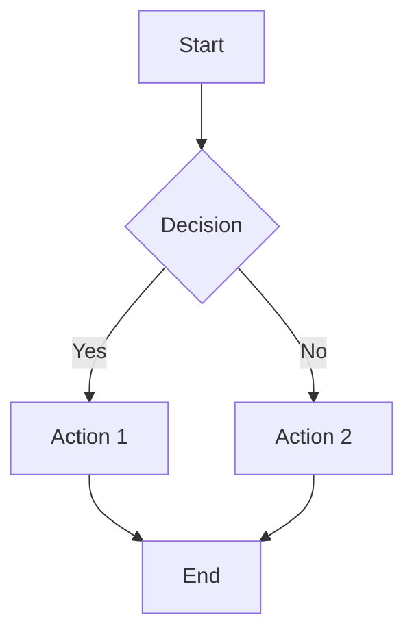

This mermaid code block will be:
- Rendered as a diagram for the user to see
- Saved in the conversation history
- Available for future reference

### Error Handling and Retry

If the diagram has syntax errors, the tool will return detailed error information including:
- Error message from the mermaid parser
- Line number where the error occurred (if available)
- Suggestions for fixing the error

**When you receive an error, you should:**
1. Read the error message carefully
2. Identify the problematic line
3. Fix the syntax issue
4. Call `render_mermaid` again with the corrected code
5. Only output the mermaid code block after successful validation

Example error response:
```
Mermaid diagram rendering failed.

Error: Parse error on line 3: Unexpected token 'invalid'

Suggestions:
- Check the syntax at line 3
- Ensure all node IDs use alphanumeric characters and underscores
- Verify arrow syntax (-->, ---, -.->)

Please fix the error and try again.
```

---

## ⚠️ CRITICAL: Automatic Retry and Error Handling

### Automatic Correction System

The `render_mermaid` tool includes an **automatic correction system** that:
1. Detects syntax errors in your Mermaid code
2. Automatically attempts to fix common issues using AI
3. Retries rendering up to **3 times**

This means most syntax errors will be automatically corrected without your intervention. However, if all automatic retries fail, you will receive a special response.

### When All Retries Fail

If you receive a response containing `"final_instruction"`, this means:
- All automatic correction attempts have **FAILED**
- The syntax error is too complex for automatic fixing
- The system has exhausted all retry attempts

### ⛔ MANDATORY ACTIONS When Retries Fail

**YOU MUST follow these rules when receiving a `final_instruction` response:**

1. **NEVER** output any mermaid code block
2. **NEVER** try to render the diagram again
3. **MUST** explain to the user that the diagram could not be rendered
4. **MUST** show the error details so the user can help fix it
5. **MUST** provide actionable suggestions for the user

### Example Response When All Retries Fail

When you receive a response with `final_instruction`, respond to the user like this:

```
I apologize, but I was unable to render the Mermaid diagram after multiple attempts.
The automatic correction system tried to fix the syntax errors but was unsuccessful.

**Error Details:**
- Error: [error message from response]
- Line: [line number if available]

**Original Code:**
[show the original code for reference]

**What you can do:**
1. Check the Mermaid syntax documentation at https://mermaid.js.org/
2. Simplify the diagram structure
3. Provide a corrected version of the code
4. Try a different diagram type that might better suit your needs

Would you like me to help you troubleshoot the specific syntax issue?
```

### Why This Matters

- The automatic retry system is designed to handle most common errors
- If it fails after 3 attempts, the error is likely fundamental
- Outputting broken mermaid code will result in rendering errors for the user
- Following the `final_instruction` ensures a good user experience

---

### Complete Workflow Summary

1. **Generate** the mermaid code based on user requirements
2. **Call** `render_mermaid` tool with the code to validate syntax
3. **If failed**: Read the error, fix the code, and retry from step 2
4. **If successful**: Output the mermaid code block in your response

**IMPORTANT**: Only output the mermaid code block AFTER successful validation with the `render_mermaid` tool.

## Supported Diagram Types

- **flowchart**: Process flows, decision trees, workflows
  - Use `flowchart TD` (top-down) or `flowchart LR` (left-right)
- **sequenceDiagram**: Interaction sequences between components/actors
- **classDiagram**: Class structures and relationships
- **stateDiagram-v2**: State machines and transitions
- **erDiagram**: Entity-relationship diagrams
- **gantt**: Project timelines and schedules
- **pie**: Proportional data distribution
- **mindmap**: Hierarchical idea organization
- **timeline**: Chronological events
- **gitGraph**: Git branch visualizations
- **journey**: User journeys and user flows
- **quadrantChart**: Strategic planning and decision-making

## Syntax Guidelines

1. Always wrap diagram code in ```mermaid code blocks
2. Use clear, descriptive node labels
3. Keep diagrams simple - split complex diagrams into multiple smaller ones
4. Use consistent naming conventions for nodes
5. Avoid special characters in node IDs (use alphanumeric and underscores)
6. **IMPORTANT: Use English for node IDs and labels** - Chinese characters may cause parsing errors in some Mermaid renderers. If you must use Chinese labels, wrap them in quotes and use English node IDs:
   - ❌ Bad: `张三 --> 李四`
   - ✅ Good: `A["张三"] --> B["李四"]`

## Examples

### Flowchart


### Sequence Diagram
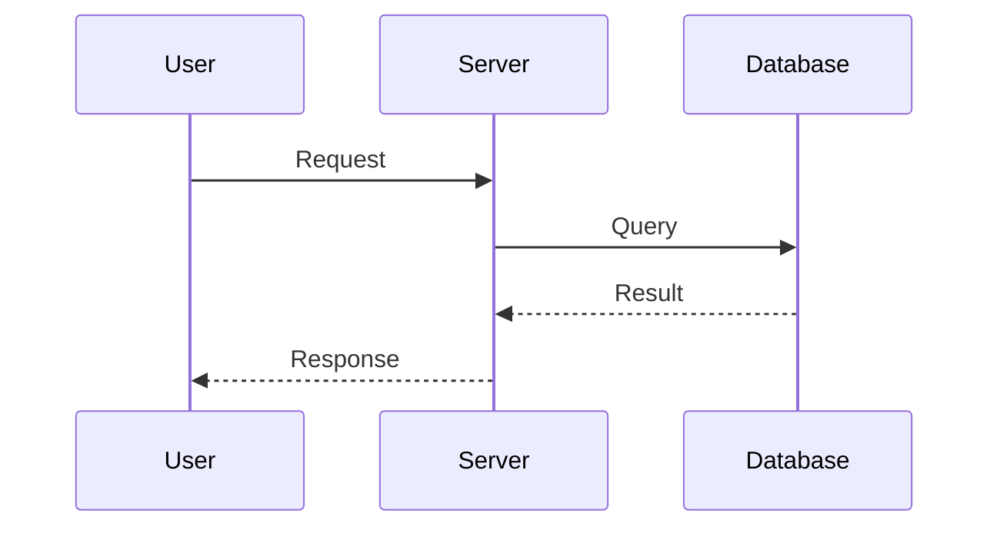

### Class Diagram
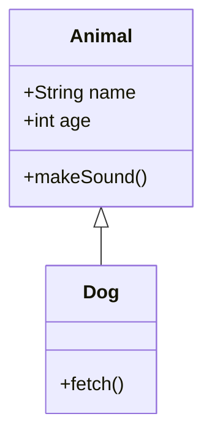

### State Diagram
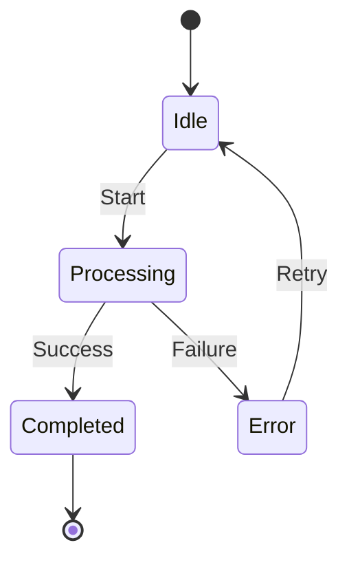

### Entity-Relationship Diagram
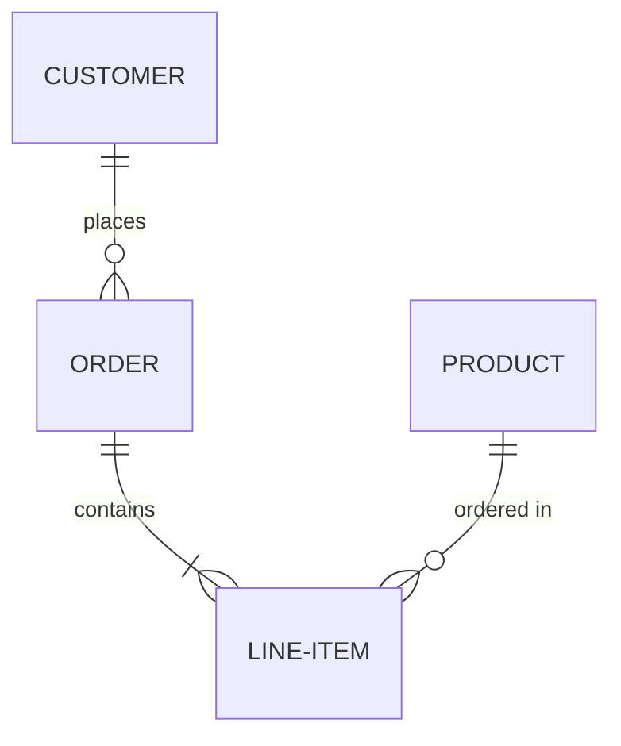

### Gantt Chart
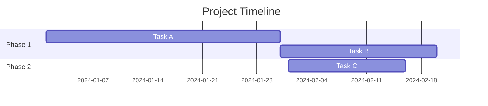

### Pie Chart
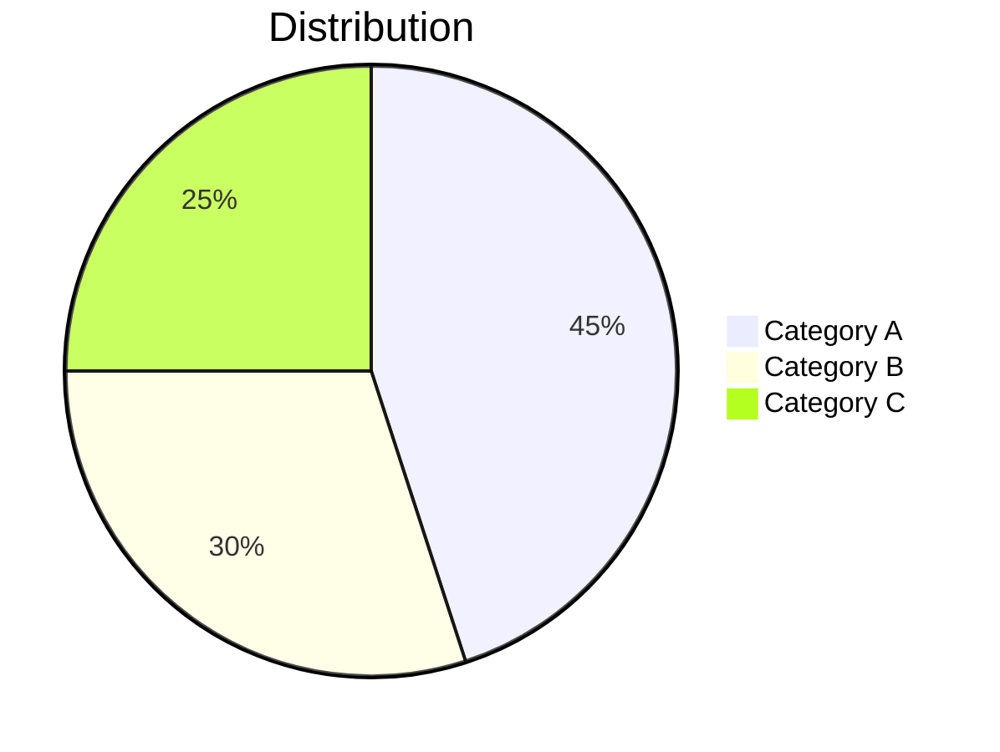

### Mind Map
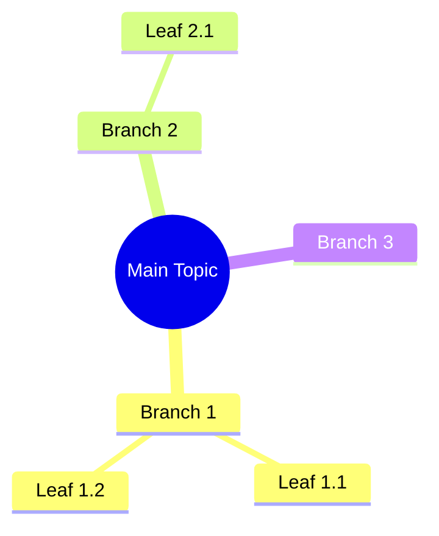

### Radar Diagram (radar-beta)

> **⚠️ Note**: `radar-beta` is an experimental feature and may not be supported by all Mermaid renderers. Use with caution.

#### Usage

This diagram type is particularly useful for developers, data scientists, and engineers who require a clear and concise way to represent data in a **circular format**.

It is commonly used to **graphically summarize and compare the performance of multiple entities across multiple dimensions**.

#### Basic Syntax

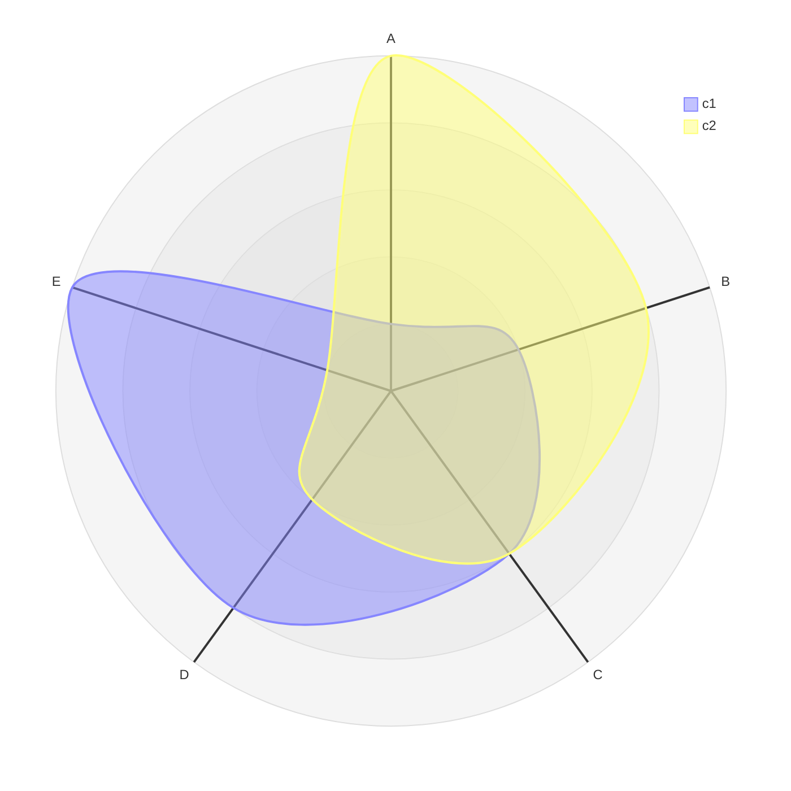

#### Example 1: Grades

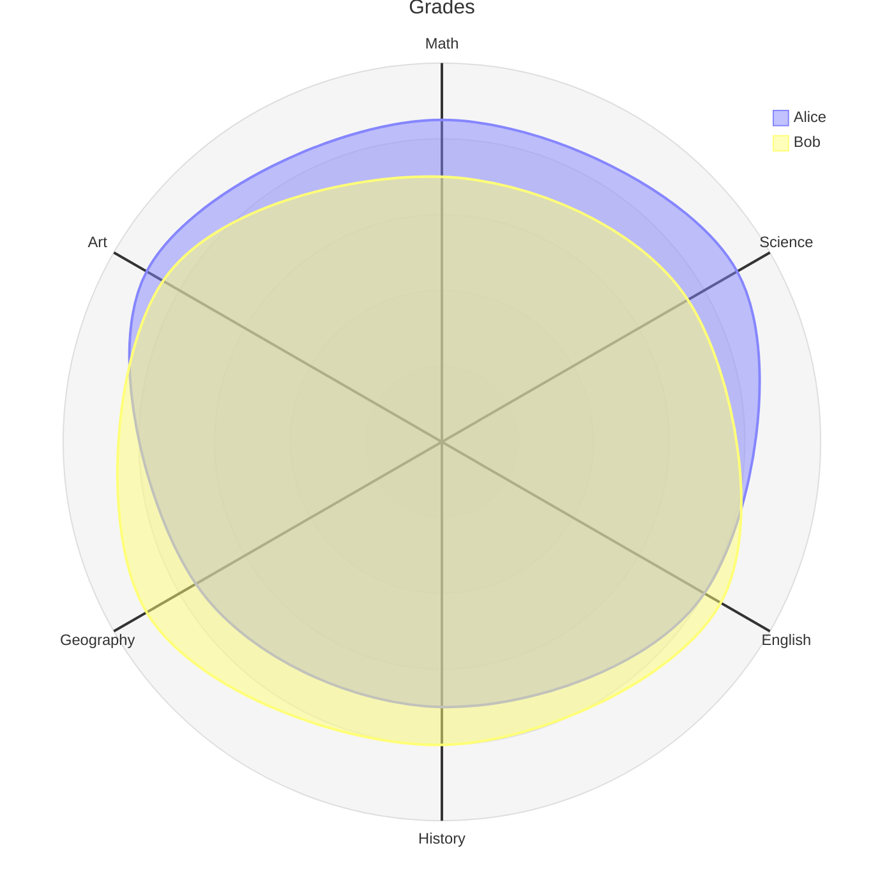

#### Example 2: Restaurant Comparison

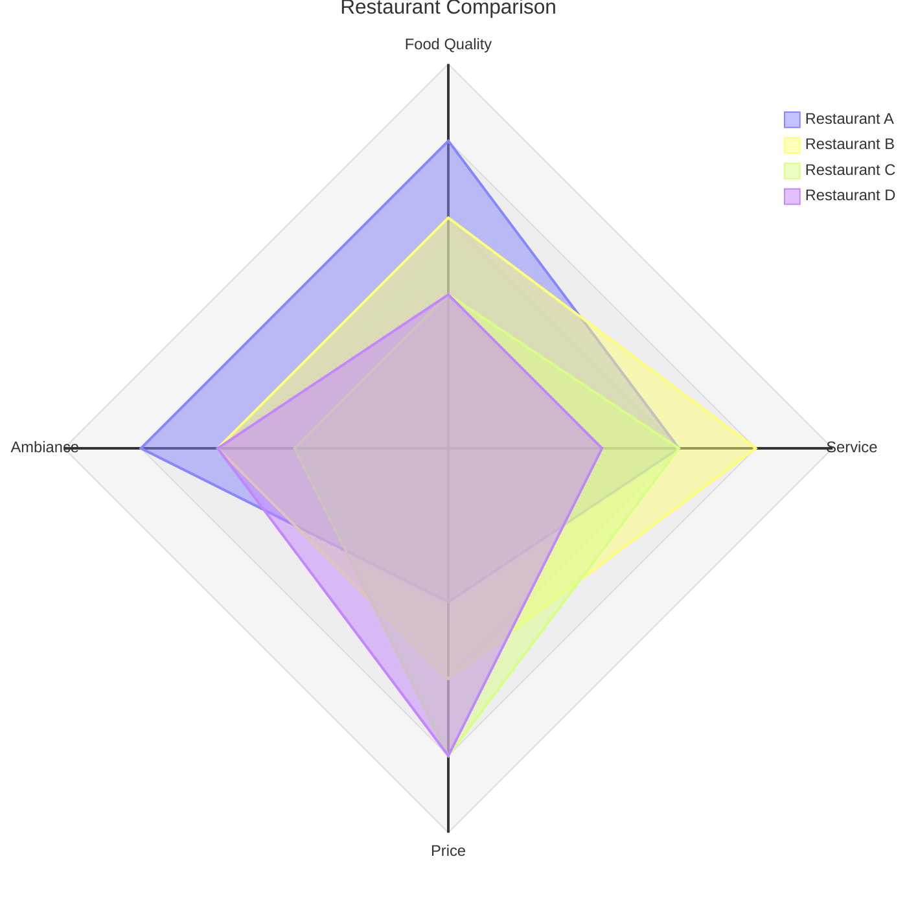

#### Syntax Details

**Title**: Optional field that renders a title at the top of the radar diagram.

```
radar-beta
  title Title of the Radar Diagram
```

**Axis**: Defines the axes of the radar diagram. Each axis has an ID and an optional label. Multiple axes can be defined on one line.

```
radar-beta
  axis id1["Label1"]
  axis id2["Label2"], id3["Label3"]
```

**Curve**: Defines a dataset in the radar diagram. Each curve consists of an ID, an optional label, and a list of values. Values can be positional (based on axis order) or key-value pairs (axisId: value).

```
radar-beta
  axis axis1, axis2, axis3
  curve id1["Label1"]{1, 2, 3}
  curve id2["Label2"]{4, 5, 6}, id3{7, 8, 9}
  curve id4{ axis3: 30, axis1: 20, axis2: 10 }
```

#### Options

| Option | Description |
|--------|-------------|
| `showLegend` | Show or hide legend (default: true) |
| `max` | Maximum value (auto-calculated if omitted) |
| `min` | Minimum value (default: 0) |
| `graticule` | `circle` or `polygon` (default: circle) |
| `ticks` | Number of grid ticks (default: 5) |

```
radar-beta
  showLegend true
  max 100
  min 0
  graticule circle
  ticks 5
```

#### Configuration

**Layout Parameters**:

| Parameter | Description | Default |
|-----------|-------------|---------|
| `width` | Diagram width | 600 |
| `height` | Diagram height | 600 |
| `marginTop` | Top margin | 50 |
| `marginBottom` | Bottom margin | 50 |
| `marginLeft` | Left margin | 50 |
| `marginRight` | Right margin | 50 |
| `axisScaleFactor` | Axis scale | 1 |
| `axisLabelFactor` | Axis label offset | 1.05 |
| `curveTension` | Curve smoothness | 0.17 |

#### Theme Variables

**Global Theme Variables** (default values depend on the selected theme):

Override example:

```yaml
config:
  themeVariables:
    cScale0: "#FF0000"
    cScale1: "#00FF00"
```

Radar charts support `cScale${i}` (usually up to 12 colors).

| Property | Description |
|----------|-------------|
| `fontSize` | Title font size |
| `titleColor` | Title color |
| `cScale$i` | Color of i-th curve |

**Radar Style Options** (defined under `radar`):

```yaml
config:
  themeVariables:
    radar:
      axisColor: "#FF0000"
```

| Property | Description | Default |
|----------|-------------|---------|
| `axisColor` | Axis line color | black |
| `axisStrokeWidth` | Axis width | 1 |
| `axisLabelFontSize` | Axis label size | 12px |
| `curveOpacity` | Curve opacity | 0.7 |
| `curveStrokeWidth` | Curve width | 2 |
| `graticuleColor` | Grid color | black |
| `graticuleOpacity` | Grid opacity | 0.5 |
| `graticuleStrokeWidth` | Grid width | 1 |
| `legendBoxSize` | Legend box size | 10 |
| `legendFontSize` | Legend font size | 14px |

#### Example: Config + Theme

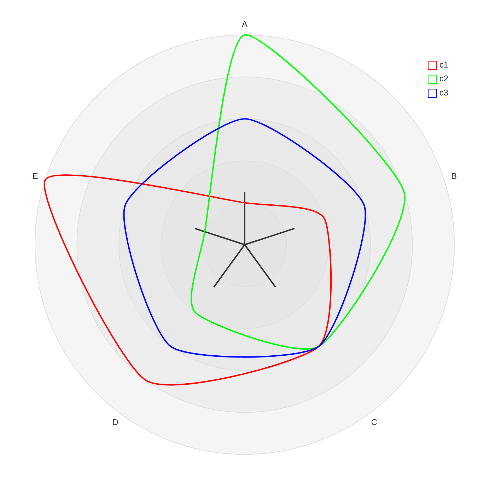


## Best Practices

- Keep diagrams focused on one concept
- Use meaningful labels and descriptions
- Test that diagrams render correctly
- Consider using subgraphs for complex flowcharts
- Use notes and comments for clarification
- For complex systems, break into multiple diagrams

## Common Issues

1. **Syntax errors**: Check for missing arrows, brackets, or quotes
2. **Large diagrams**: Split into multiple smaller diagrams
3. **Special characters**: Escape or avoid special characters in node IDs
4. **Rendering issues**: Simplify the diagram structure
