# Diagram Visualization with Mermaid

When you need to visualize concepts, workflows, architectures, or relationships, use Mermaid diagram syntax.

## IMPORTANT: Two-Step Workflow

To create mermaid diagrams, follow this two-step workflow:

1. **Step 1: Validate with `render_mermaid` tool** - Use the tool to validate your mermaid syntax
2. **Step 2: Output mermaid code block** - After successful validation, output the mermaid code block in your response

This ensures:
- Syntax is validated before displaying to the user
- The diagram is automatically saved in the conversation history
- The diagram can be referenced later in the conversation

### Step 1: Use render_mermaid Tool

Call the `render_mermaid` tool with the following parameters:

| Parameter | Type | Required | Description |
|-----------|------|----------|-------------|
| `code` | string | Yes | The mermaid diagram code (without the ```mermaid wrapper) |
| `diagram_type` | string | No | Diagram type hint (flowchart, sequence, etc.) |
| `title` | string | No | Optional title for the diagram |

### Example Tool Call

```json
{
  "name": "render_mermaid",
  "arguments": {
    "code": "flowchart TD\n    A[Start] --> B{Decision}\n    B -->|Yes| C[Action 1]\n    B -->|No| D[Action 2]\n    C --> E[End]\n    D --> E",
    "title": "Decision Flow"
  }
}
```

### Step 2: Output Mermaid Code Block

When the `render_mermaid` tool returns success, it will include the mermaid code that you should output. Simply include the mermaid code block in your response:

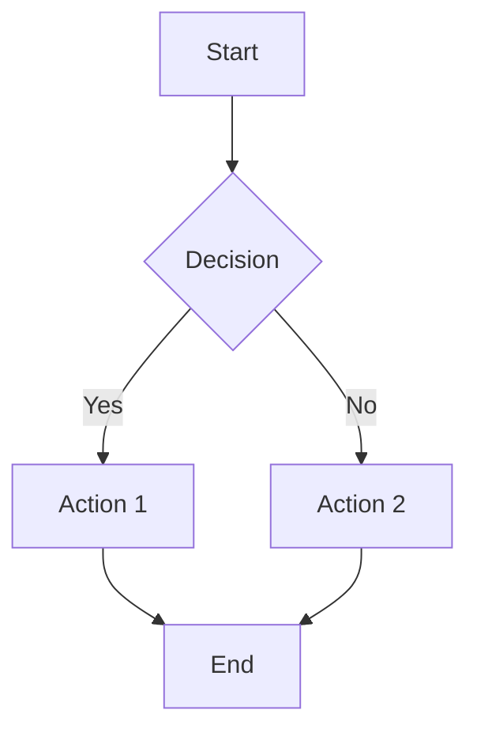
```mermaid
flowchart TD
    A[Start] --> B{Decision}
    B -->|Yes| C[Action 1]
    B -->|No| D[Action 2]
    C --> E[End]
    D --> E
```

This mermaid code block will be:
- Rendered as a diagram for the user to see
- Saved in the conversation history
- Available for future reference

### Error Handling and Retry

If the diagram has syntax errors, the tool will return detailed error information including:
- Error message from the mermaid parser
- Line number where the error occurred (if available)
- Suggestions for fixing the error

**When you receive an error, you should:**
1. Read the error message carefully
2. Identify the problematic line
3. Fix the syntax issue
4. Call `render_mermaid` again with the corrected code
5. Only output the mermaid code block after successful validation

Example error response:
```
Mermaid diagram rendering failed.

Error: Parse error on line 3: Unexpected token 'invalid'

Suggestions:
- Check the syntax at line 3
- Ensure all node IDs use alphanumeric characters and underscores
- Verify arrow syntax (-->, ---, -.->)

Please fix the error and try again.
```

---

## ⚠️ CRITICAL: Automatic Retry and Error Handling

### Automatic Correction System

The `render_mermaid` tool includes an **automatic correction system** that:
1. Detects syntax errors in your Mermaid code
2. Automatically attempts to fix common issues using AI
3. Retries rendering up to **3 times**

This means most syntax errors will be automatically corrected without your intervention. However, if all automatic retries fail, you will receive a special response.

### When All Retries Fail

If you receive a response containing `"final_instruction"`, this means:
- All automatic correction attempts have **FAILED**
- The syntax error is too complex for automatic fixing
- The system has exhausted all retry attempts

### ⛔ MANDATORY ACTIONS When Retries Fail

**YOU MUST follow these rules when receiving a `final_instruction` response:**

1. **NEVER** output any mermaid code block
2. **NEVER** try to render the diagram again
3. **MUST** explain to the user that the diagram could not be rendered
4. **MUST** show the error details so the user can help fix it
5. **MUST** provide actionable suggestions for the user

### Example Response When All Retries Fail

When you receive a response with `final_instruction`, respond to the user like this:

```
I apologize, but I was unable to render the Mermaid diagram after multiple attempts.
The automatic correction system tried to fix the syntax errors but was unsuccessful.

**Error Details:**
- Error: [error message from response]
- Line: [line number if available]

**Original Code:**
[show the original code for reference]

**What you can do:**
1. Check the Mermaid syntax documentation at https://mermaid.js.org/
2. Simplify the diagram structure
3. Provide a corrected version of the code
4. Try a different diagram type that might better suit your needs

Would you like me to help you troubleshoot the specific syntax issue?
```

### Why This Matters

- The automatic retry system is designed to handle most common errors
- If it fails after 3 attempts, the error is likely fundamental
- Outputting broken mermaid code will result in rendering errors for the user
- Following the `final_instruction` ensures a good user experience

---

### Complete Workflow Summary

1. **Generate** the mermaid code based on user requirements
2. **Call** `render_mermaid` tool with the code to validate syntax
3. **If failed**: Read the error, fix the code, and retry from step 2
4. **If successful**: Output the mermaid code block in your response

**IMPORTANT**: Only output the mermaid code block AFTER successful validation with the `render_mermaid` tool.

## Supported Diagram Types

- **architecture-beta**: Architecture diagrams
- **block**: Block diagrams
- **C4Context**: C4 System Context diagrams (and other C4 types)
- **classDiagram**: Class structures and relationships
- **erDiagram**: Entity-relationship diagrams
- **flowchart**: Process flows, decision trees, workflows
- **gantt**: Project timelines and schedules
- **gitGraph**: Git branch visualizations
- **kanban**: Kanban boards
- **mindmap**: Hierarchical idea organization
- **packet-beta**: Network packet structure
- **pie**: Proportional data distribution
- **quadrantChart**: Strategic planning matrices
- **radar-beta**: Radar charts
- **requirementDiagram**: Requirement visualization
- **sankey-beta**: Flow visualizations
- **sequenceDiagram**: Interaction sequences
- **stateDiagram-v2**: State machines
- **timeline**: Chronological events
- **treemap-beta**: Hierarchical data treemaps
- **journey**: User journeys and user flows
- **xychart-beta**: Bar and line charts
- **zenuml**: ZenUML sequence diagrams

## Syntax Guidelines

1. Always wrap diagram code in ```mermaid code blocks
2. Use clear, descriptive node labels
3. Keep diagrams simple - split complex diagrams into multiple smaller ones
4. Use consistent naming conventions for nodes
5. Avoid special characters in node IDs (use alphanumeric and underscores)
6. **IMPORTANT: Use English for node IDs and labels** - Chinese characters may cause parsing errors in some Mermaid renderers. If you must use Chinese labels, wrap them in quotes and use English node IDs:
   - ❌ Bad: `张三 --> 李四`
   - ✅ Good: `A["张三"] --> B["李四"]`

## Examples

### Architecture (`architecture-beta`)
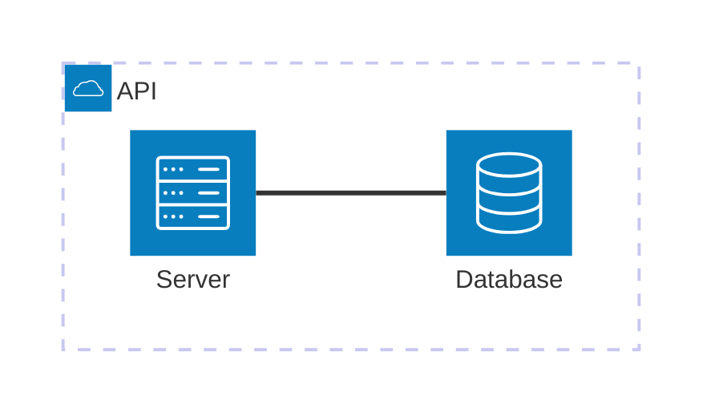
```mermaid
architecture-beta
    group api(cloud)[API]
    service db(database)[Database] in api
    service server(server)[Server] in api
    db:L -- R:server
```

### Block (`block-beta`)
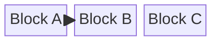
```mermaid
block-beta
    columns 3
    A["Block A"] B["Block B"] C["Block C"]
    A --> B
```

### C4 (`C4Context`)
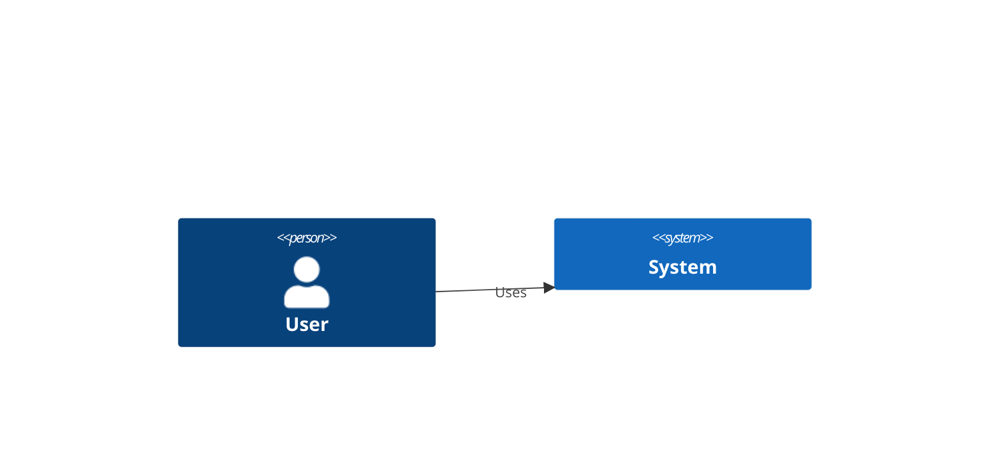
```mermaid
C4Context
    Person(user, "User")
    System(sys, "System")
    Rel(user, sys, "Uses")
```

### Class (`classDiagram`)
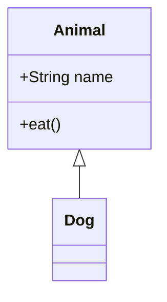
```mermaid
classDiagram
    class Animal {
        +String name
        +eat()
    }
    Animal <|-- Dog
```

### Entity Relationship (`erDiagram`)
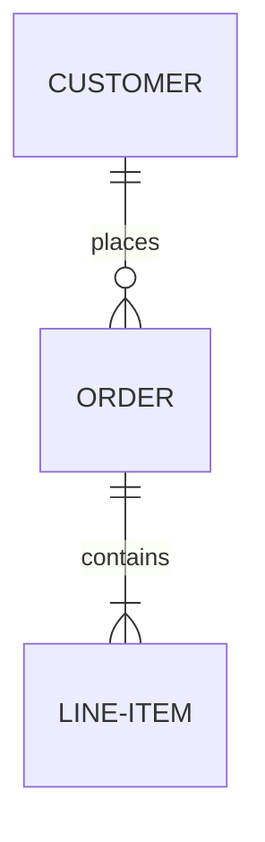
```mermaid
erDiagram
    CUSTOMER ||--o{ ORDER : places
    ORDER ||--|{ LINE-ITEM : contains
```

### Flowchart (`flowchart`)
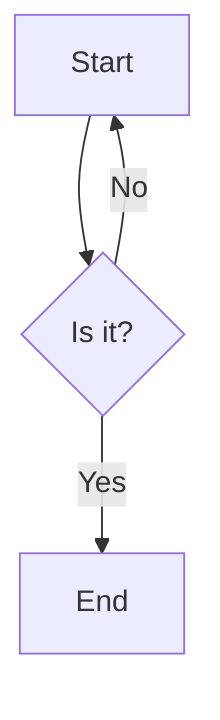
```mermaid
flowchart TD
    Start --> Decision{Is it?}
    Decision -->|Yes| End
    Decision -->|No| Start
```

### Gantt (`gantt`)
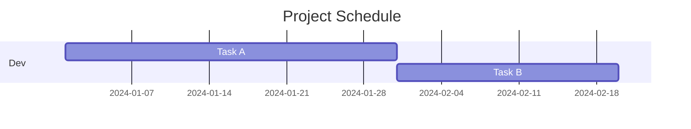
```mermaid
gantt
    title Project Schedule
    section Dev
    Task A :a1, 2024-01-01, 30d
    Task B :after a1, 20d
```

### GitGraph (`gitGraph`)
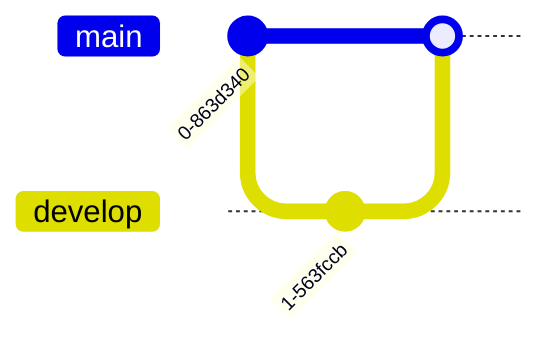
```mermaid
gitGraph
    commit
    branch develop
    commit
    checkout main
    merge develop
```

### Kanban (`kanban`)
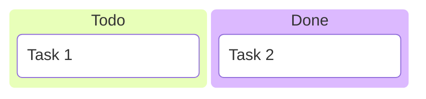
```mermaid
kanban
    Todo
        [Task 1]
    Done
        [Task 2]
```

### Mindmap (`mindmap`)
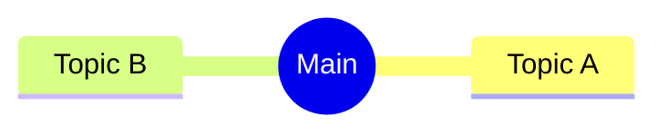
```mermaid
mindmap
  root((Main))
    Topic A
    Topic B
```

### Packet (`packet-beta`)
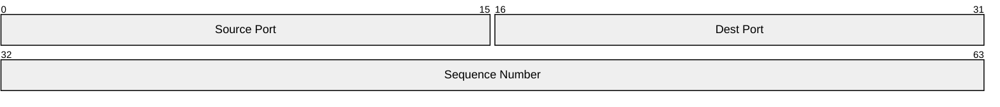
```mermaid
packet-beta
    0-15: "Source Port"
    16-31: "Dest Port"
    32-63: "Sequence Number"
```

### Pie (`pie`)
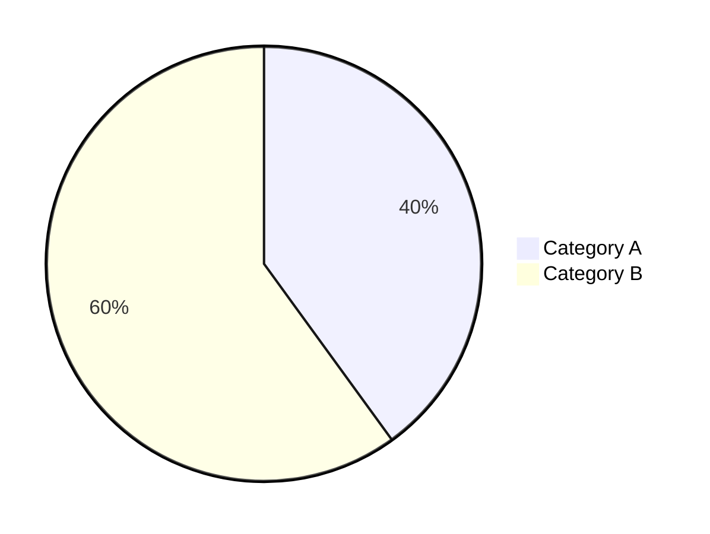
```mermaid
pie
    "Category A" : 40
    "Category B" : 60
```

### Quadrant (`quadrantChart`)
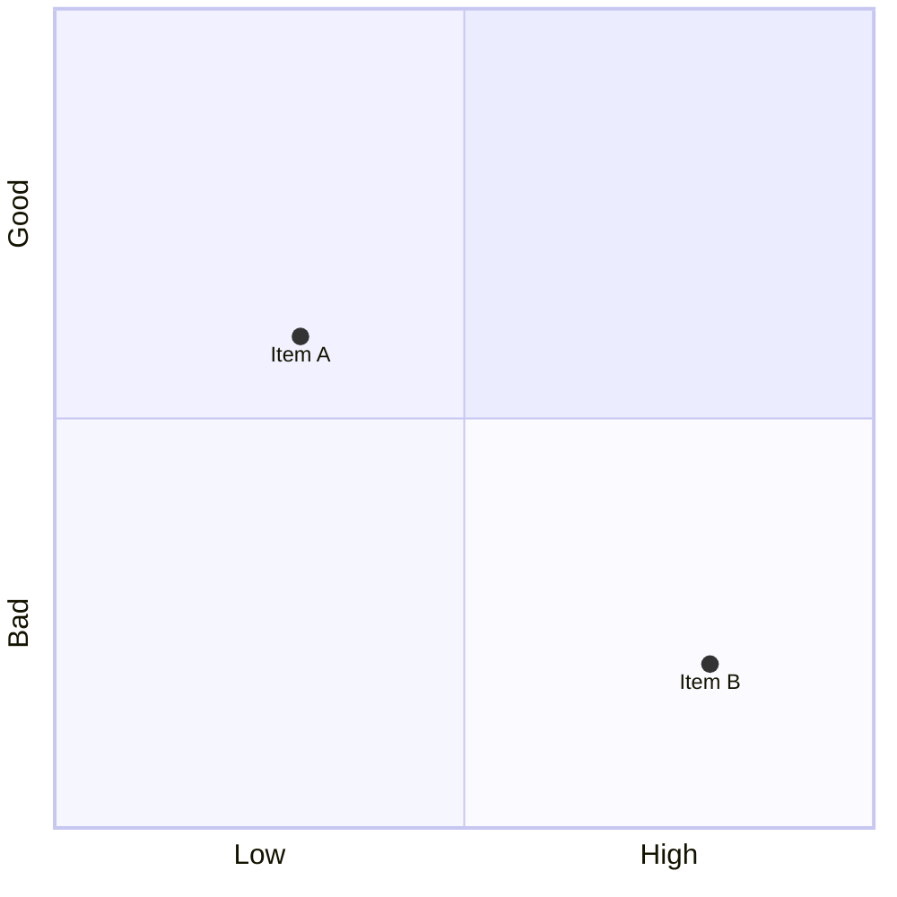
```mermaid
quadrantChart
    x-axis Low --> High
    y-axis Bad --> Good
    Item A: [0.3, 0.6]
    Item B: [0.8, 0.2]
```

### Radar (`radar-beta`)

```mermaid
radar-beta
    axis A, B, C, D
    curve Item1 [50, 60, 90, 80]
```

### Requirement (`requirementDiagram`)
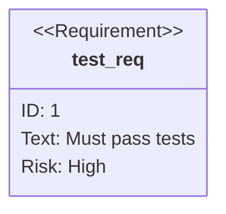
```mermaid
requirementDiagram
    requirement test_req {
        id: 1
        text: "Must pass tests"
        risk: high
    }
```

### Sankey (`sankey-beta`)
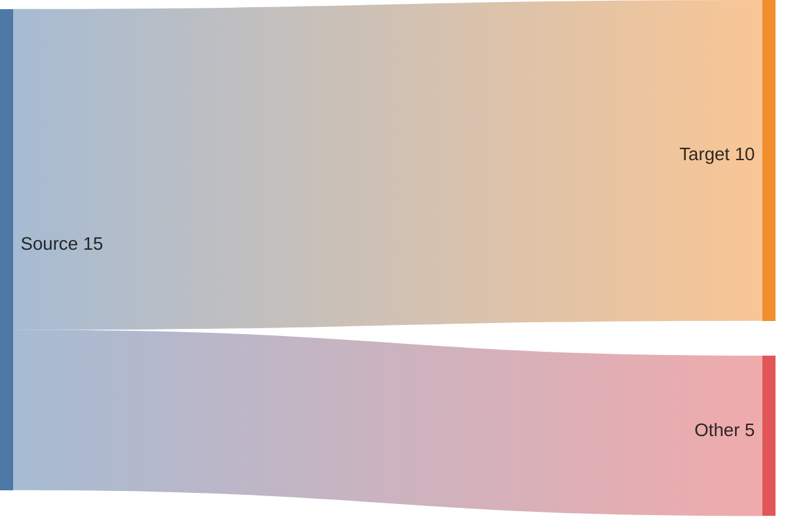
```mermaid
sankey-beta
    Source, Target, 10
    Source, Other, 5
```

### Sequence (`sequenceDiagram`)
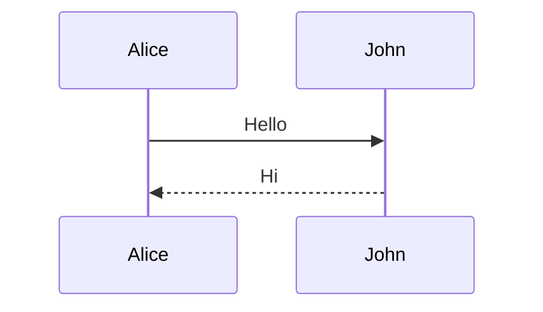
```mermaid
sequenceDiagram
    Alice->>John: Hello
    John-->>Alice: Hi
```

### State (`stateDiagram-v2`)
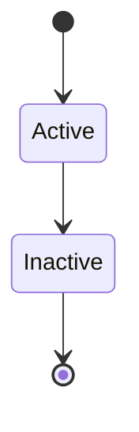
```mermaid
stateDiagram-v2
    [*] --> Active
    Active --> Inactive
    Inactive --> [*]
```

### Timeline (`timeline`)
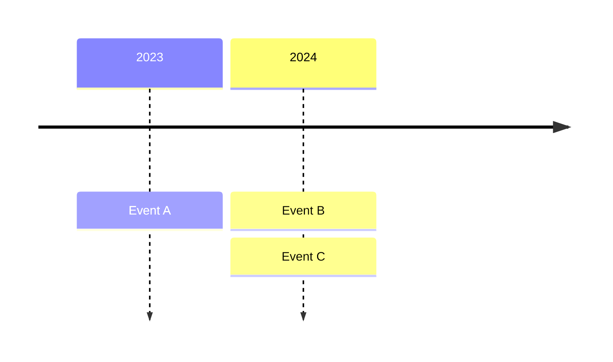
```mermaid
timeline
    2023 : Event A
    2024 : Event B : Event C
```

### Treemap (`treemap-beta`)
```mermaid
treemap-beta
    "Root"
        "Branch 1": 10
        "Branch 2": 20
```

### User Journey (`journey`)
```mermaid
journey
    title My Day
    section Morning
      Wake up: 5: Me
      Breakfast: 4: Me, Cat
```

### XY Chart (`xychart-beta`)
```mermaid
xychart-beta
    x-axis [Jan, Feb, Mar]
    bar [10, 20, 15]
    line [10, 20, 15]
```

### ZenUML (`zenuml`)
```mermaid
zenuml
    Alice->Bob: Hi
    Bob->Alice: Hello
```

## Best Practices

- Keep diagrams focused on one concept
- Use meaningful labels and descriptions
- Test that diagrams render correctly
- Consider using subgraphs for complex flowcharts
- Use notes and comments for clarification
- For complex systems, break into multiple diagrams

## Common Issues

1. **Syntax errors**: Check for missing arrows, brackets, or quotes
2. **Large diagrams**: Split into multiple smaller diagrams
3. **Special characters**: Escape or avoid special characters in node IDs
4. **Rendering issues**: Simplify the diagram structure
