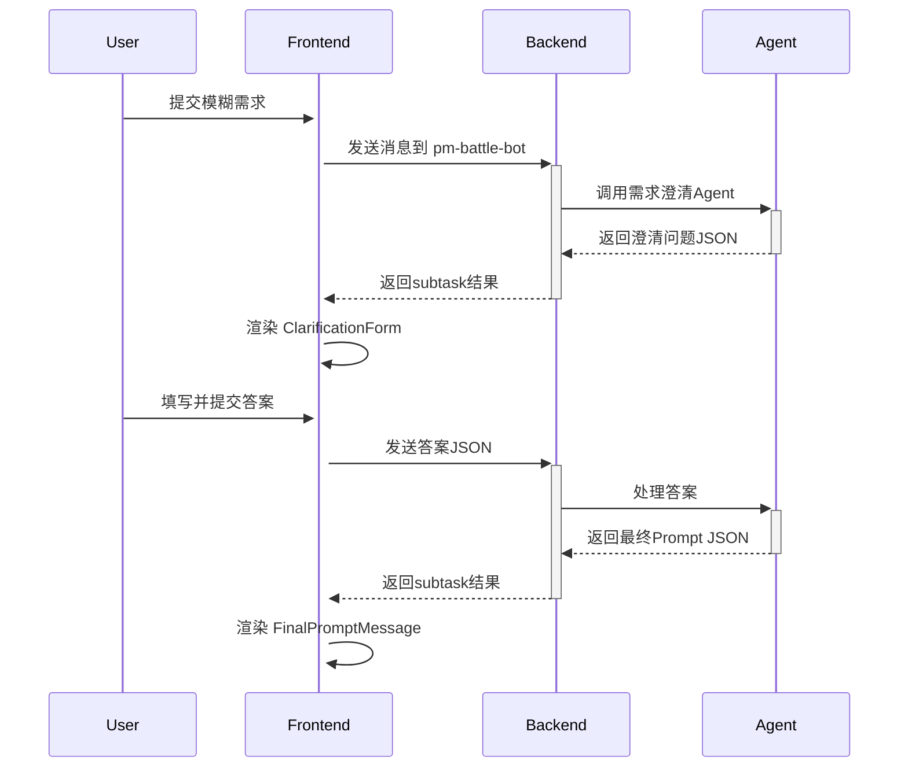

# "与产品经理搏斗" 需求澄清模式使用指南

## 功能概述

"与产品经理搏斗"是 Wegent 系统的交互式需求澄清模式，帮助用户通过结构化问答将模糊需求精炼为清晰的开发任务。

## 快速开始

### 1. 数据库初始化

如果是新安装的系统，运行 `backend/init.sql` 会自动创建以下实体：

- **pm-battle-ghost**: 需求澄清系统提示词
- **pm-battle-bot**: 需求澄清Bot
- **pm-battle-team**: 需求澄清团队

### 2. 在前端选择团队

1. 进入 Code 页面
2. 在 Team 选择器中选择 **pm-battle-team**
3. 输入模糊需求，例如："我想添加一个用户登录功能"

### 3. 交互流程

#### 步骤 1: 提交初始需求
```
用户输入: "我想添加一个登录功能"
```

#### 步骤 2: 回答澄清问题
系统会展示 3-5 个澄清问题，例如：
- 需要支持哪些登录方式？（多选）
- 是否需要"记住我"功能？（单选）
- 登录失败后如何处理？（单选）

每个问题都支持：
- **预设选项选择**: 点击单选/多选框
- **自定义输入**: 点击"自定义输入"按钮切换到文本输入模式

#### 步骤 3: 提交答案
填写完所有问题后，点击"提交答案"按钮。

#### 步骤 4: 获取最终 Prompt
系统会根据你的回答生成精炼的需求描述，你可以：
- **复制 Prompt**: 点击"复制提示词"按钮
- **创建新任务**: 点击"使用此提示词创建新任务"直接创建 Code 任务

## 技术架构

### 前端组件

```
MessagesArea.tsx
├── ClarificationForm.tsx        # 澄清问题表单容器
│   └── ClarificationQuestion.tsx # 单个问题渲染
└── FinalPromptMessage.tsx       # 最终 Prompt 展示
```

### 数据流



### 数据结构

#### 澄清问题格式 (Agent → Frontend)

```json
{
  "type": "clarification",
  "questions": [
    {
      "question_id": "q1",
      "question_text": "需要支持哪些登录方式？",
      "question_type": "multiple_choice",
      "options": [
        {
          "value": "email",
          "label": "邮箱/密码",
          "recommended": true
        },
        {
          "value": "oauth",
          "label": "OAuth (Google, GitHub等)"
        },
        {
          "value": "phone",
          "label": "手机号+短信验证码"
        }
      ]
    }
  ]
}
```

**问题类型说明**:
- `single_choice`: 单选（Radio）
- `multiple_choice`: 多选（Checkbox）
- `text_input`: 文本输入（TextArea）

**选项属性**:
- `recommended: true`: 该选项会被默认选中

#### 用户答案格式 (Frontend → Agent)

```json
{
  "type": "clarification_answer",
  "answers": [
    {
      "question_id": "q1",
      "answer_type": "choice",
      "value": ["email", "oauth"]
    },
    {
      "question_id": "q2",
      "answer_type": "custom",
      "value": "用户自定义输入的文本"
    }
  ]
}
```

#### 最终 Prompt 格式 (Agent → Frontend)

```json
{
  "type": "final_prompt",
  "prompt": "实现用户登录功能，支持邮箱密码和OAuth两种认证方式..."
}
```

## 自定义 Bot

### 修改 system_prompt

如果需要调整澄清问题的风格或逻辑，可以修改 `pm-battle-ghost` 的 `systemPrompt`：

1. 在设置页面找到 "pm-battle-ghost"
2. 编辑 system_prompt
3. 保存更改

### 创建新的需求澄清 Bot

1. 创建新的 Ghost，参考 `pm-battle-ghost` 的 system_prompt 结构
2. 创建新的 Bot，引用新的 Ghost
3. 创建新的 Team，引用新的 Bot
4. 在前端选择新的 Team 使用

## 最佳实践

### Agent 端（编写 system_prompt）

1. **问题设计**:
   - 每轮 3-5 个问题，避免过多
   - 使用 `recommended: true` 引导用户
   - 优先使用选择题，减少用户输入成本

2. **输出规范**:
   - 严格输出 JSON，不要添加额外说明文本
   - 确保 JSON 格式正确，可被前端解析
   - `question_id` 使用简单的标识符（如 q1, q2）

3. **追问策略**:
   - 根据答案判断是否需要继续澄清
   - 不要无限追问，3-5轮后生成最终 Prompt
   - 最终 Prompt 应详细、可执行

### 前端使用

1. **选择合适的 Team**:
   - 需求澄清阶段：选择 `pm-battle-team`
   - 代码生成阶段：切换到 `dev-team`

2. **回答技巧**:
   - 优先选择推荐选项，除非有特殊需求
   - 善用"自定义输入"补充细节
   - 确保所有问题都已回答再提交

3. **使用最终 Prompt**:
   - 复制 Prompt 可用于其他工具
   - 直接创建新任务可无缝切换到开发流程

## 故障排查

### 问题1: 澄清问题没有显示

**可能原因**:
- Agent 没有输出符合格式的 JSON
- JSON 中 `type` 字段不是 `"clarification"`

**解决方案**:
- 检查 Agent 的 system_prompt
- 查看浏览器控制台是否有 JSON 解析错误

### 问题2: 提交答案后没有响应

**可能原因**:
- 网络问题
- Agent 处理答案时出错

**解决方案**:
- 刷新页面重新尝试
- 检查后端日志

### 问题3: 最终 Prompt 没有特殊样式

**可能原因**:
- Agent 输出的 JSON 中 `type` 不是 `"final_prompt"`

**解决方案**:
- 确认 Agent system_prompt 中最终输出格式正确

## 后续增强方向

- [ ] 支持问题之间的依赖关系（如根据 q1 的答案决定是否显示 q2）
- [ ] 支持更多问题类型（日期选择、数字输入、文件上传等）
- [ ] 添加澄清历史记录，可查看和复用之前的澄清结果
- [ ] 支持导出澄清过程为文档

## 参考资料

- [Wegent 系统架构](../docs/architecture.md)
- [Bot 配置指南](../docs/bot-configuration.md)
- [Task 机制说明](../docs/task-mechanism.md)
