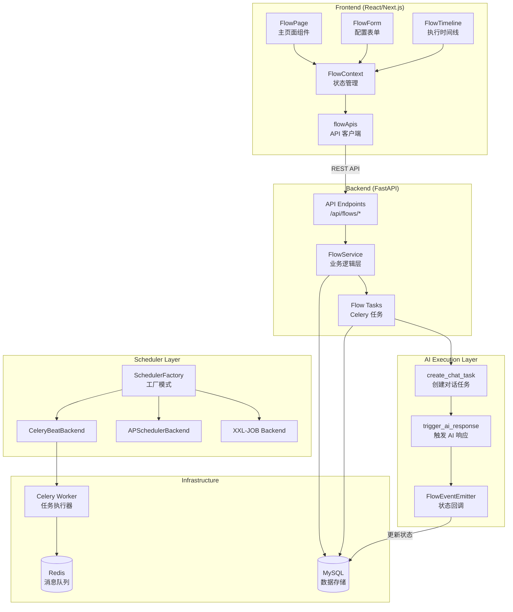
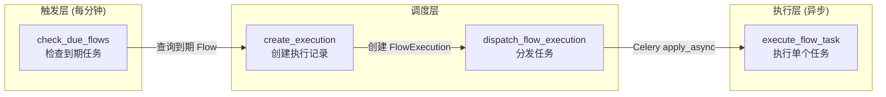
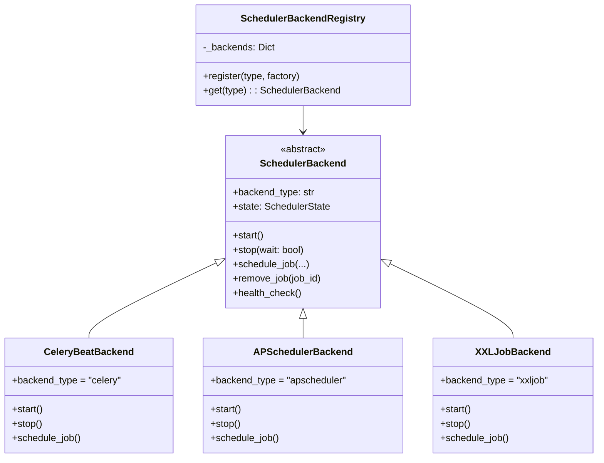
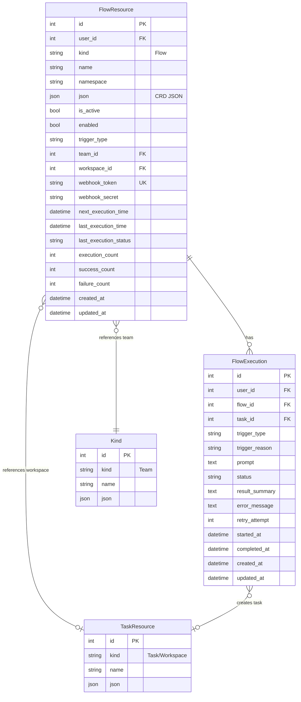
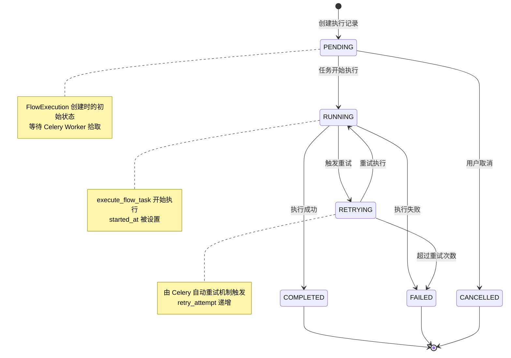
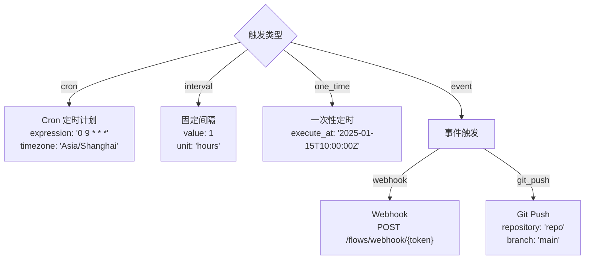
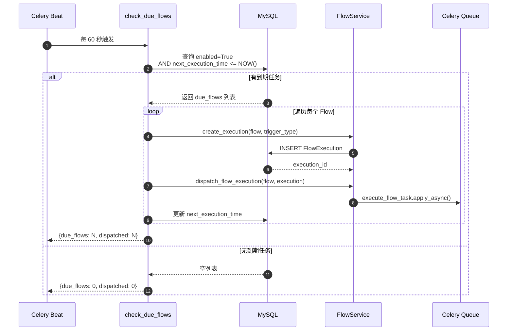
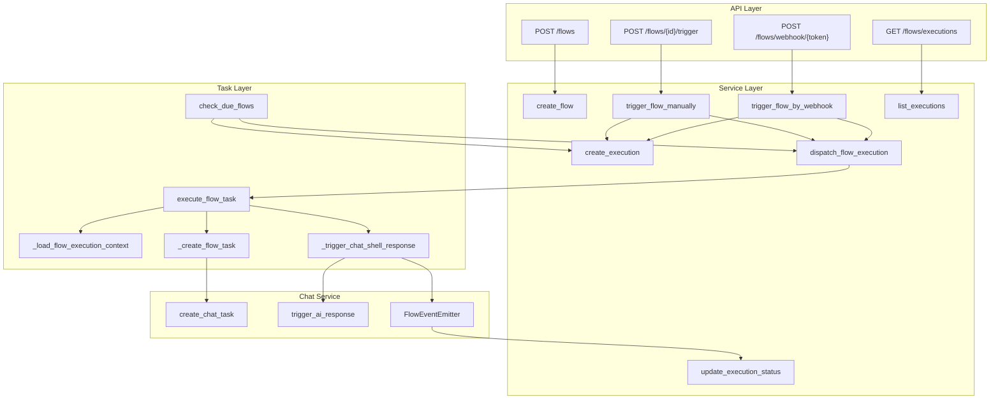

# AI Flow (智能流) 定时任务架构设计文档

> 基于 Wegent 项目 `wegent/feat-ai-flow-module_fork` 分支与 `main` 分支的代码差异分析

---

## 目录

1. [概述](#1-概述)
2. [系统架构](#2-系统架构)
3. [核心设计思想](#3-核心设计思想)
4. [数据模型](#4-数据模型)
5. [调度机制](#5-调度机制)
6. [全链路调用分析](#6-全链路调用分析)
7. [API 接口设计](#7-api-接口设计)
8. [前端架构](#8-前端架构)
9. [可靠性设计](#9-可靠性设计)
10. [监控指标](#10-监控指标)

---

## 1. 概述

### 1.1 什么是 AI Flow

AI Flow (智能流) 是一个 **智能定时任务调度系统**，允许用户创建自动化的 AI 任务流程。它支持多种触发方式（定时、间隔、事件），能够在指定时间自动执行 AI 对话任务。

### 1.2 核心能力

| 能力 | 说明 |
|------|------|
| **多触发类型** | Cron 定时、固定间隔、一次性定时、Webhook 事件 |
| **多调度后端** | Celery Beat (默认)、APScheduler、XXL-JOB (企业级) |
| **模板变量** | 支持 `{{date}}`、`{{time}}`、`{{webhook_data}}` 等动态变量 |
| **执行追踪** | 完整的执行时间线、状态流转、错误记录 |
| **重试机制** | 可配置重试次数、指数退避、死信队列 |
| **安全认证** | Webhook HMAC-SHA256 签名验证 |

### 1.3 代码变更统计

```
76 files changed
12,656 insertions(+)
380 deletions(-)
```

**主要新增模块：**
- `backend/app/services/flow.py` - 核心业务逻辑 (1123 行)
- `backend/app/tasks/flow_tasks.py` - Celery 任务定义 (956 行)
- `backend/app/core/scheduler/` - 调度器抽象层 (1614 行)
- `frontend/src/features/flows/` - 前端组件 (2000+ 行)

---

## 2. 系统架构

### 2.1 整体架构图



### 2.2 分层架构

```
┌─────────────────────────────────────────────────────────────────────┐
│                      Presentation Layer                              │
│  ┌─────────────┐  ┌─────────────┐  ┌─────────────┐                  │
│  │  FlowPage   │  │  FlowForm   │  │FlowTimeline │  React/Next.js   │
│  └─────────────┘  └─────────────┘  └─────────────┘                  │
└───────────────────────────┬─────────────────────────────────────────┘
                            │ REST API / WebSocket
┌───────────────────────────┴─────────────────────────────────────────┐
│                        API Layer (FastAPI)                           │
│  ┌─────────────────────────────────────────────────────────────────┐│
│  │  /flows, /flows/{id}, /flows/executions, /flows/webhook/{token} ││
│  └─────────────────────────────────────────────────────────────────┘│
└───────────────────────────┬─────────────────────────────────────────┘
                            │
┌───────────────────────────┴─────────────────────────────────────────┐
│                       Service Layer                                  │
│  ┌─────────────────────────────────────────────────────────────────┐│
│  │  FlowService: CRUD, 触发管理, 执行调度, 状态更新                 ││
│  └─────────────────────────────────────────────────────────────────┘│
└───────────────────────────┬─────────────────────────────────────────┘
                            │
┌───────────────────────────┴─────────────────────────────────────────┐
│                      Task Layer (Celery)                             │
│  ┌─────────────────────┐  ┌─────────────────────────────────────┐  │
│  │  check_due_flows    │  │  execute_flow_task                  │  │
│  │  (每分钟检查)       │  │  (异步执行单个 Flow)                │  │
│  └─────────────────────┘  └─────────────────────────────────────┘  │
└───────────────────────────┬─────────────────────────────────────────┘
                            │
┌───────────────────────────┴─────────────────────────────────────────┐
│                    Scheduler Backend Layer                           │
│  ┌────────────────┐  ┌────────────────┐  ┌────────────────┐        │
│  │  Celery Beat   │  │  APScheduler   │  │   XXL-JOB      │        │
│  │  (默认)        │  │  (轻量级)      │  │  (企业级)      │        │
│  └────────────────┘  └────────────────┘  └────────────────┘        │
└───────────────────────────┬─────────────────────────────────────────┘
                            │
┌───────────────────────────┴─────────────────────────────────────────┐
│                     Infrastructure Layer                             │
│  ┌────────────────┐  ┌────────────────┐  ┌────────────────┐        │
│  │     MySQL      │  │     Redis      │  │ Celery Worker  │        │
│  └────────────────┘  └────────────────┘  └────────────────┘        │
└─────────────────────────────────────────────────────────────────────┘
```

---

## 3. 核心设计思想

### 3.1 CRD (Custom Resource Definition) 风格数据模型

借鉴 Kubernetes CRD 设计，Flow 配置以 JSON 形式存储，支持灵活扩展：

```python
# Flow CRD 结构示例
{
    "apiVersion": "agent.wecode.io/v1",
    "kind": "Flow",
    "metadata": {
        "name": "daily-report",
        "namespace": "default",
        "displayName": "每日报告"
    },
    "spec": {
        "displayName": "每日报告",
        "taskType": "collection",
        "trigger": {
            "type": "cron",
            "cron": {
                "expression": "0 9 * * *",
                "timezone": "Asia/Shanghai"
            }
        },
        "teamRef": {"name": "report-team", "namespace": "default"},
        "promptTemplate": "今天是 {{date}}，请生成项目日报",
        "retryCount": 1,
        "timeoutSeconds": 600,
        "enabled": true
    },
    "status": {
        "state": "Available",
        "lastExecutionTime": "2025-01-15T01:00:00Z",
        "lastExecutionStatus": "COMPLETED",
        "executionCount": 30,
        "successCount": 28,
        "failureCount": 2
    }
}
```

### 3.2 触发与执行分离



**设计优势：**
1. **解耦**: 触发检查与实际执行分离，互不阻塞
2. **可靠**: 执行记录先创建，即使执行失败也有追踪
3. **可扩展**: 多 Worker 并发执行，水平扩展能力

### 3.3 调度器抽象工厂模式



**核心代码路径：**
- `backend/app/core/scheduler/base.py:52` - 抽象基类定义
- `backend/app/core/scheduler/factory.py:32` - 工厂注册器
- `backend/app/core/scheduler/celery_backend.py:19` - Celery 实现

### 3.4 UTC 时间统一存储

所有时间戳使用 **UTC 时间** 存储，支持用户时区配置：

```python
# backend/app/services/flow.py:988-1029
def calculate_next_execution_time(self, trigger_type, trigger_config):
    """计算下次执行时间 (返回 UTC)"""
    utc_tz = ZoneInfo("UTC")
    now_utc = datetime.now(utc_tz)

    if trigger_type == FlowTriggerType.CRON:
        user_tz = ZoneInfo(trigger_config.get("timezone", "UTC"))
        # 1. 转换当前时间到用户时区
        now_user_tz = now_utc.astimezone(user_tz)
        # 2. 在用户时区计算下次执行
        iter = croniter(cron_expr, now_user_tz)
        next_user_tz = iter.get_next(datetime)
        # 3. 转回 UTC 存储
        return next_user_tz.astimezone(utc_tz).replace(tzinfo=None)
```

---

## 4. 数据模型

### 4.1 ER 图



### 4.2 FlowResource 表结构

```sql
-- backend/alembic/versions/q7r8s9t0u1v2_add_flow_tables.py

CREATE TABLE flows (
    id INT AUTO_INCREMENT PRIMARY KEY,
    user_id INTEGER NOT NULL,
    kind VARCHAR(50) DEFAULT 'Flow' NOT NULL,
    name VARCHAR(255) NOT NULL,
    namespace VARCHAR(255) DEFAULT 'default' NOT NULL,
    json JSON NOT NULL,
    is_active BOOLEAN DEFAULT TRUE NOT NULL,
    enabled BOOLEAN DEFAULT TRUE NOT NULL,
    trigger_type VARCHAR(50) NOT NULL,
    team_id INTEGER,
    workspace_id INTEGER,
    webhook_token VARCHAR(255) UNIQUE,
    webhook_secret VARCHAR(255),
    next_execution_time TIMESTAMP,
    last_execution_time TIMESTAMP,
    last_execution_status VARCHAR(50),
    execution_count INTEGER DEFAULT 0 NOT NULL,
    success_count INTEGER DEFAULT 0 NOT NULL,
    failure_count INTEGER DEFAULT 0 NOT NULL,
    created_at TIMESTAMP DEFAULT NOW() NOT NULL,
    updated_at TIMESTAMP DEFAULT NOW() NOT NULL
);

-- 索引设计
CREATE UNIQUE INDEX ix_flows_user_kind_name_ns
    ON flows(user_id, kind, name, namespace);
CREATE INDEX ix_flows_enabled_next_exec
    ON flows(enabled, next_execution_time);
CREATE INDEX ix_flows_user_active
    ON flows(user_id, is_active);
```

### 4.3 执行状态流转



**状态定义：** `backend/app/schemas/flow.py:38-46`

```python
class FlowExecutionStatus(str, Enum):
    PENDING = "PENDING"      # 等待执行
    RUNNING = "RUNNING"      # 执行中
    COMPLETED = "COMPLETED"  # 执行成功
    FAILED = "FAILED"        # 执行失败
    RETRYING = "RETRYING"    # 重试中
    CANCELLED = "CANCELLED"  # 已取消
```

---

## 5. 调度机制

### 5.1 触发类型



**触发类型定义：** `backend/app/schemas/flow.py:22-28`

```python
class FlowTriggerType(str, Enum):
    CRON = "cron"           # 定时计划 (支持时区)
    INTERVAL = "interval"   # 固定间隔 (分钟/小时/天)
    ONE_TIME = "one_time"   # 一次性定时
    EVENT = "event"         # 事件触发 (Webhook/Git Push)
```

### 5.2 调度后端选择

| 后端 | 适用场景 | 特点 |
|------|----------|------|
| **Celery Beat** | 默认推荐 | 成熟稳定，支持嵌入式模式 |
| **APScheduler** | 轻量级部署 | 纯 Python，无外部依赖 |
| **XXL-JOB** | 企业级分布式 | 中心化管理，可视化界面 |

配置方式：
```python
# backend/app/core/config.py
SCHEDULER_BACKEND = "celery"  # celery / apscheduler / xxljob
EMBEDDED_CELERY_ENABLED = True  # 嵌入式模式 (Worker/Beat 作为线程)
```

### 5.3 check_due_flows 工作流程



**核心代码：** `backend/app/tasks/flow_tasks.py:338-439`

---

## 6. 全链路调用分析

### 6.1 手动触发执行 - 完整调用链

```
用户点击 "立即执行" 按钮
    │
    ▼
Frontend: FlowList.tsx
    │ onClick={() => handleTrigger(flow.id)}
    │
    ▼
Frontend: flowApis.ts:triggerFlow(flowId)
    │ POST /api/flows/{id}/trigger
    │
    ▼
Backend: flows.py:316-332 - trigger_flow()
    │ @router.post("/{flow_id}/trigger")
    │
    ▼
Service: flow.py:423-456 - trigger_flow_manually()
    │ 1. 查询 FlowResource
    │ 2. 调用 create_execution()
    │ 3. 调用 _dispatch_flow_execution()
    │
    ▼
Service: flow.py:694-732 - create_execution()
    │ 1. 解析 Flow CRD JSON
    │ 2. 解析 prompt 模板变量
    │ 3. INSERT FlowExecution (status=PENDING)
    │
    ▼
Service: flow.py:734-792 - dispatch_flow_execution()
    │ if use_sync:
    │     threading.Thread(execute_flow_task_sync)
    │ else:
    │     execute_flow_task.apply_async()
    │
    ▼
Task: flow_tasks.py:487-637 - execute_flow_task()
    │ 1. _load_flow_execution_context()
    │ 2. _generate_task_title()
    │ 3. _create_flow_task() [async]
    │ 4. _add_flow_labels_to_task()
    │ 5. _link_task_to_execution()
    │ 6. _trigger_chat_shell_response() [async]
    │
    ▼
Task: flow_tasks.py:201-248 - _create_flow_task()
    │ from app.services.chat.storage import create_chat_task
    │ 创建 Task + UserSubtask + AssistantSubtask
    │
    ▼
Task: flow_tasks.py:284-312 - _trigger_chat_shell_response()
    │ from app.services.chat.trigger import trigger_ai_response
    │ 使用 FlowEventEmitter 作为事件发射器
    │
    ▼
Emitter: emitter.py:297-427 - FlowEventEmitter
    │ emit_chat_done() -> 更新 FlowExecution 为 COMPLETED
    │ emit_chat_error() -> 更新 FlowExecution 为 FAILED
```

### 6.2 Webhook 触发执行 - 完整调用链

```
外部系统调用 Webhook
    │ POST /api/flows/webhook/{token}
    │ Header: X-Webhook-Signature: sha256=<hex>
    │ Body: {"key": "value"}
    │
    ▼
Backend: flows.py:151-234 - trigger_flow_webhook()
    │ 1. 根据 token 查询 Flow
    │ 2. 验证 HMAC-SHA256 签名
    │ 3. 解析 payload
    │
    ▼
Service: flow.py:475-501 - trigger_flow_by_webhook()
    │ create_execution(extra_variables={"webhook_data": payload})
    │
    ▼
Service: flow.py:794-824 - _resolve_prompt_template()
    │ 替换 {{webhook_data}} 为 JSON 字符串
    │
    ▼
(后续流程同手动触发)
```

### 6.3 定时触发执行 - 完整调用链

```
Celery Beat 定时触发 (每 60 秒)
    │
    ▼
Task: flow_tasks.py:338 - check_due_flows()
    │
    ▼
Database Query:
    │ SELECT * FROM flows
    │ WHERE is_active = TRUE
    │   AND enabled = TRUE
    │   AND next_execution_time <= NOW()
    │   AND trigger_type IN ('cron', 'interval', 'one_time')
    │
    ▼
Loop: 遍历每个到期 Flow
    │
    ├─► flow_service.create_execution()
    │       trigger_type = "cron" / "interval" / "one_time"
    │       trigger_reason = "Scheduled (cron: 0 9 * * *)"
    │
    ├─► flow_service.dispatch_flow_execution()
    │       execute_flow_task.apply_async(args=[flow_id, execution_id])
    │
    └─► _update_next_execution_time()
            if one_time: flow.enabled = False
            else: flow.next_execution_time = 计算下次时间
```

### 6.4 关键函数调用路径图



---

## 7. API 接口设计

### 7.1 接口列表

| 方法 | 路径 | 功能 | 文件位置 |
|------|------|------|----------|
| GET | `/flows` | 列出 Flow 配置 | flows.py:40-68 |
| POST | `/flows` | 创建 Flow | flows.py:71-87 |
| GET | `/flows/{id}` | 获取单个 Flow | flows.py:241-254 |
| PUT | `/flows/{id}` | 更新 Flow | flows.py:257-274 |
| DELETE | `/flows/{id}` | 删除 Flow (软删除) | flows.py:277-292 |
| POST | `/flows/{id}/toggle` | 启用/禁用 Flow | flows.py:295-313 |
| POST | `/flows/{id}/trigger` | 手动触发执行 | flows.py:316-332 |
| GET | `/flows/executions` | 列出执行记录 | flows.py:94-126 |
| GET | `/flows/executions/{id}` | 获取执行详情 | flows.py:129-145 |
| POST | `/flows/webhook/{token}` | Webhook 触发 | flows.py:151-234 |

### 7.2 请求/响应示例

**创建 Flow:**

```http
POST /api/flows
Content-Type: application/json

{
  "name": "daily-standup-report",
  "display_name": "每日站会报告",
  "description": "每天早上 9 点自动生成站会报告",
  "task_type": "collection",
  "trigger_type": "cron",
  "trigger_config": {
    "expression": "0 9 * * *",
    "timezone": "Asia/Shanghai"
  },
  "team_id": 123,
  "workspace_id": 456,
  "prompt_template": "今天是 {{date}}，请根据最近的 Git 提交生成站会报告",
  "retry_count": 1,
  "timeout_seconds": 300,
  "enabled": true
}
```

**响应:**

```json
{
  "id": 1,
  "user_id": 100,
  "name": "daily-standup-report",
  "namespace": "default",
  "display_name": "每日站会报告",
  "task_type": "collection",
  "trigger_type": "cron",
  "trigger_config": {
    "expression": "0 9 * * *",
    "timezone": "Asia/Shanghai"
  },
  "team_id": 123,
  "workspace_id": 456,
  "prompt_template": "今天是 {{date}}，请根据最近的 Git 提交生成站会报告",
  "retry_count": 1,
  "timeout_seconds": 300,
  "enabled": true,
  "webhook_url": null,
  "next_execution_time": "2025-01-16T01:00:00",
  "execution_count": 0,
  "success_count": 0,
  "failure_count": 0,
  "created_at": "2025-01-15T10:00:00",
  "updated_at": "2025-01-15T10:00:00"
}
```

### 7.3 Webhook 签名验证

```python
# 生成签名 (客户端)
import hmac, hashlib

body = b'{"event": "push", "ref": "refs/heads/main"}'
secret = "your_webhook_secret"
signature = "sha256=" + hmac.new(
    secret.encode(),
    body,
    hashlib.sha256
).hexdigest()

# 请求头
headers = {
    "Content-Type": "application/json",
    "X-Webhook-Signature": signature
}
```

---

## 8. 前端架构

### 8.1 组件结构

```
frontend/src/features/flows/
├── components/
│   ├── FlowPage.tsx          # 主页面容器
│   ├── FlowForm.tsx          # 创建/编辑表单 (556 行)
│   ├── FlowList.tsx          # Flow 列表展示 (340 行)
│   ├── FlowTimeline.tsx      # 执行时间线 (335 行)
│   ├── CronSchedulePicker.tsx # Cron 表达式选择器 (445 行)
│   └── index.ts              # 导出文件
├── contexts/
│   └── flowContext.tsx       # 状态管理 Context (223 行)
└── types/
    └── (复用 /src/types/flow.ts)
```

### 8.2 状态管理

```typescript
// frontend/src/features/flows/contexts/flowContext.tsx

interface FlowContextType {
  // Flows 配置
  flows: Flow[]
  flowsLoading: boolean
  flowsTotal: number
  selectedFlow: Flow | null
  refreshFlows: () => Promise<void>

  // 执行记录 (时间线)
  executions: FlowExecution[]
  executionsLoading: boolean
  executionsTotal: number
  refreshExecutions: () => Promise<void>

  // 筛选器
  executionFilter: {
    flowId?: number
    status?: FlowExecutionStatus[]
    startDate?: string
    endDate?: string
  }

  // 活动标签页
  activeTab: 'timeline' | 'config'
}
```

### 8.3 API 客户端

```typescript
// frontend/src/apis/flow.ts

export const flowApis = {
  // Flow CRUD
  getFlows: (params) => api.get('/flows', { params }),
  getFlow: (id) => api.get(`/flows/${id}`),
  createFlow: (data) => api.post('/flows', data),
  updateFlow: (id, data) => api.put(`/flows/${id}`, data),
  deleteFlow: (id) => api.delete(`/flows/${id}`),

  // Flow 操作
  toggleFlow: (id, enabled) => api.post(`/flows/${id}/toggle?enabled=${enabled}`),
  triggerFlow: (id) => api.post(`/flows/${id}/trigger`),

  // 执行记录
  getExecutions: (params, flowId?, status?, startDate?, endDate?) =>
    api.get('/flows/executions', { params: { ...params, flow_id: flowId, status, start_date: startDate, end_date: endDate } }),
  getExecution: (id) => api.get(`/flows/executions/${id}`),
}
```

---

## 9. 可靠性设计

### 9.1 分布式锁 (防止重复调度)

```python
# backend/app/core/distributed_lock.py

class DistributedLock:
    """
    Redis-based distributed lock for multi-instance coordination.

    Uses Redis SET NX (set if not exists) with expiration for safe locking.
    This prevents multiple Celery workers from processing the same periodic
    task concurrently.
    """

    def acquire(self, lock_name: str, expire_seconds: int = 60) -> bool:
        """Acquire a distributed lock using Redis SET NX."""
        lock_key = f"wegent:lock:{lock_name}"
        return self.redis_client.set(lock_key, "1", nx=True, ex=expire_seconds)

    @contextmanager
    def acquire_context(self, lock_name: str, expire_seconds: int = 60):
        """Context manager for acquiring and releasing a lock."""
        acquired = self.acquire(lock_name, expire_seconds)
        try:
            yield acquired
        finally:
            if acquired:
                self.release(lock_name)

# 在 check_due_flows 中使用
@celery_app.task
def check_due_flows(self):
    with distributed_lock.acquire_context("check_due_flows", expire_seconds=120) as acquired:
        if not acquired:
            return {"status": "skipped", "reason": "lock_held_by_another_instance"}
        # ... 处理到期的 Flow
```

### 9.2 乐观锁与状态机 (并发安全)

```python
# backend/app/models/flow.py - FlowExecution 添加 version 字段
class FlowExecution(Base):
    # ... 其他字段
    version = Column(Integer, default=0, nullable=False)  # 乐观锁版本

# backend/app/services/flow.py - 状态机定义
VALID_STATE_TRANSITIONS = {
    FlowExecutionStatus.PENDING: {RUNNING, CANCELLED, FAILED},
    FlowExecutionStatus.RUNNING: {COMPLETED, FAILED, RETRYING},
    FlowExecutionStatus.RETRYING: {RUNNING, FAILED, CANCELLED},
    FlowExecutionStatus.COMPLETED: set(),  # 终态
    FlowExecutionStatus.FAILED: set(),     # 终态
    FlowExecutionStatus.CANCELLED: set(),  # 终态
}

def update_execution_status(self, db, *, execution_id, status, expected_version=None):
    """
    Update execution status with optimistic locking and state machine validation.

    1. Validates state transition against state machine
    2. Checks version for optimistic locking (if expected_version provided)
    3. Increments version on each successful update
    """
    execution = db.query(FlowExecution).filter(...).first()

    # 状态机校验
    if not validate_state_transition(current_status, new_status):
        return False  # 跳过非法转换

    # 乐观锁检查
    if expected_version is not None and execution.version != expected_version:
        raise OptimisticLockError(execution_id, expected_version, execution.version)

    execution.status = status.value
    execution.version += 1  # 版本递增
    db.commit()
```

### 9.3 PENDING 任务恢复机制

```python
# backend/app/tasks/flow_tasks.py

def _recover_stale_pending_executions(db: Session) -> int:
    """
    Recover stale PENDING executions that were not dispatched.

    Handles scenarios:
    1. Service crashed after creating FlowExecution but before dispatch
    2. Celery task was lost due to broker failure
    """
    stale_threshold = datetime.utcnow() - timedelta(hours=2)

    stale_executions = db.query(FlowExecution).filter(
        FlowExecution.status == "PENDING",
        FlowExecution.created_at < stale_threshold,
        FlowExecution.task_id == None,  # Never linked to a task
    ).limit(50).all()

    for execution in stale_executions:
        flow = db.query(FlowResource).filter(...).first()
        if flow:
            flow_service.dispatch_flow_execution(flow, execution, use_sync=False)
        else:
            execution.status = "CANCELLED"
            execution.error_message = "Flow was deleted"

    return len(stale_executions)

# 在 check_due_flows 开始时调用
@celery_app.task
def check_due_flows(self):
    # ... 获取分布式锁后
    recovered = _recover_stale_pending_executions(db)
    # ... 继续处理到期 Flow
```

### 9.4 重试机制

```python
# backend/app/tasks/flow_tasks.py:487-495

@celery_app.task(
    bind=True,
    name="app.tasks.flow_tasks.execute_flow_task",
    max_retries=settings.FLOW_DEFAULT_RETRY_COUNT,  # 默认 1 次
    default_retry_delay=60,        # 首次重试延迟 60 秒
    retry_backoff=True,            # 启用指数退避
    retry_backoff_max=600,         # 最大延迟 600 秒
    retry_jitter=True,             # 启用随机抖动
)
def execute_flow_task(self, flow_id, execution_id, timeout_seconds=None):
    ...
```

### 9.5 熔断器 (Circuit Breaker)

```python
# backend/app/core/circuit_breaker.py

# 熔断器已集成到 AI 调用路径
ai_service_breaker = pybreaker.CircuitBreaker(
    fail_max=5,           # 5 次失败后开启熔断
    reset_timeout=60,     # 60 秒后尝试恢复
    listeners=[CircuitBreakerListener("ai_service")],
)

# backend/app/tasks/flow_tasks.py - _trigger_chat_shell_response
async def _trigger_chat_shell_response(ctx, task, assistant_subtask, user_subtask):
    """Uses circuit breaker to protect against AI service failures."""

    @with_circuit_breaker_async(ai_service_breaker)
    async def _call_ai_service():
        await trigger_ai_response(...)

    try:
        await _call_ai_service()
    except CircuitBreakerOpenError as e:
        # AI 服务不可用，快速失败
        flow_service.update_execution_status(
            db, execution_id=ctx.execution.id,
            status=FlowExecutionStatus.FAILED,
            error_message=f"AI service temporarily unavailable: {e}",
        )
        raise
```

### 9.6 死信队列 (Dead Letter Queue)

```python
# backend/app/core/dead_letter_queue.py

def add_to_dlq(
    task_id: str,
    task_name: str,
    args: tuple,
    kwargs: dict,
    exception: Exception,
):
    """将失败任务添加到死信队列"""
    ...

def process_dlq():
    """处理死信队列中的任务 (支持重试或人工干预)"""
    ...
```

### 9.7 分批处理 (高负载优化)

```python
# backend/app/tasks/flow_tasks.py

FLOW_BATCH_SIZE = 100  # 每批处理 100 个 Flow

@celery_app.task
def check_due_flows(self):
    """Process due flows in batches to avoid memory issues."""

    total_due = db.query(FlowResource).filter(...).count()
    offset = 0

    while offset < total_due:
        due_flows = db.query(FlowResource).filter(...).limit(FLOW_BATCH_SIZE).all()

        for flow in due_flows:
            # 处理单个 Flow
            execution = flow_service.create_execution(...)
            flow_service.dispatch_flow_execution(...)

        offset += len(due_flows)

        # 处理耗时较长时延长锁过期时间
        if offset < total_due:
            distributed_lock.extend("check_due_flows", expire_seconds=120)
```

### 9.8 超时控制

```python
# 配置级别
FLOW_DEFAULT_TIMEOUT_SECONDS = 600  # 默认 10 分钟

# Flow 级别 (spec.timeoutSeconds)
timeout_seconds: int = Field(600, ge=60, le=3600)  # 60s ~ 1h

# 执行级别 (Celery soft_time_limit)
execute_flow_task.apply_async(
    args=[flow_id, execution_id],
    soft_time_limit=timeout_seconds,
)
```

---

## 10. 监控指标

### 10.1 Prometheus 指标

```python
# backend/app/tasks/flow_tasks.py:33-46

# 执行计数器 (按状态和触发类型分组)
FLOW_EXECUTIONS_TOTAL = Counter(
    "flow_executions_total",
    "Total flow executions",
    ["status", "trigger_type"],  # labels
)

# 执行耗时直方图
FLOW_EXECUTION_DURATION = Histogram(
    "flow_execution_duration_seconds",
    "Flow execution duration in seconds",
    buckets=[10, 30, 60, 120, 300, 600],
)

# 队列计数器
FLOW_QUEUE_SIZE = Counter(
    "flow_tasks_queued_total",
    "Total flow tasks queued for execution",
)
```

### 10.2 关键指标

| 指标 | 类型 | 说明 |
|------|------|------|
| `flow_executions_total{status="success"}` | Counter | 成功执行次数 |
| `flow_executions_total{status="failed"}` | Counter | 失败执行次数 |
| `flow_executions_total{status="timeout"}` | Counter | 超时执行次数 |
| `flow_execution_duration_seconds` | Histogram | 执行耗时分布 |
| `flow_tasks_queued_total` | Counter | 入队任务总数 |

### 10.3 健康检查

```python
# backend/app/core/scheduler/celery_backend.py:367-406

def health_check(self) -> Dict[str, Any]:
    return {
        "healthy": bool,
        "backend_type": "celery",
        "state": "running",
        "jobs_count": len(self._jobs),
        "details": {
            "embedded_mode": True,
            "celery_running": True,
            "redis_connected": True,
        }
    }
```

---

## 附录

### A. 配置项

| 配置项 | 默认值 | 说明 |
|--------|--------|------|
| `SCHEDULER_BACKEND` | `celery` | 调度后端类型 |
| `EMBEDDED_CELERY_ENABLED` | `True` | 嵌入式 Celery 模式 |
| `FLOW_SCHEDULER_INTERVAL_SECONDS` | `60` | 检查间隔 (秒) |
| `FLOW_DEFAULT_TIMEOUT_SECONDS` | `600` | 默认超时时间 |
| `FLOW_DEFAULT_RETRY_COUNT` | `1` | 默认重试次数 |

### B. 文件索引

| 模块 | 核心文件 | 行数 |
|------|----------|------|
| 数据模型 | `backend/app/models/flow.py` | 148 |
| Schema | `backend/app/schemas/flow.py` | 356 |
| 业务逻辑 | `backend/app/services/flow.py` | 1249 |
| Celery 任务 | `backend/app/tasks/flow_tasks.py` | 1164 |
| API 端点 | `backend/app/api/endpoints/adapter/flows.py` | 332 |
| 调度器基类 | `backend/app/core/scheduler/base.py` | 233 |
| 调度器工厂 | `backend/app/core/scheduler/factory.py` | 322 |
| Celery 后端 | `backend/app/core/scheduler/celery_backend.py` | 406 |
| 分布式锁 | `backend/app/core/distributed_lock.py` | 214 |
| 事件发射器 | `backend/app/services/chat/trigger/emitter.py` | 443 |
| 前端 Context | `frontend/src/features/flows/contexts/flowContext.tsx` | 223 |
| 前端表单 | `frontend/src/features/flows/components/FlowForm.tsx` | 556 |
| 前端时间线 | `frontend/src/features/flows/components/FlowTimeline.tsx` | 335 |

---

*文档生成时间: 2025-01-16*
*基于分支: wegent/feat-ai-flow-module_fork*
