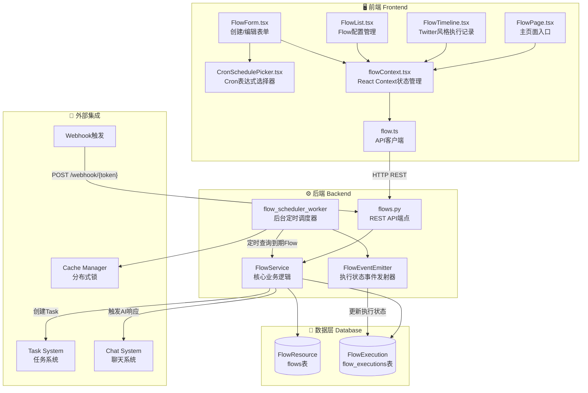
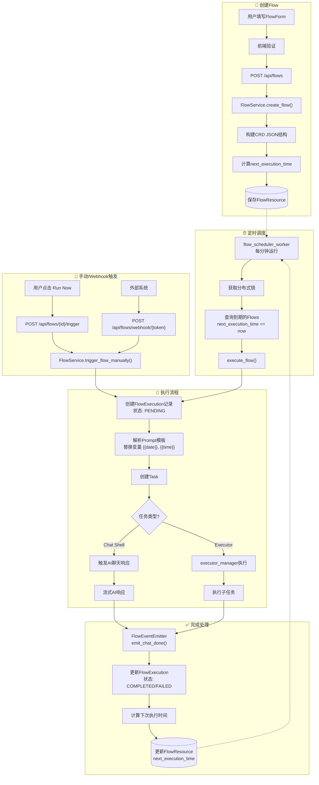
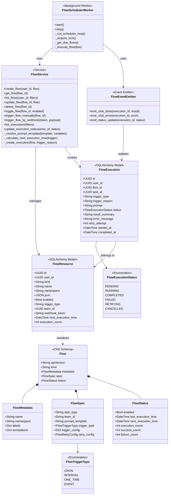
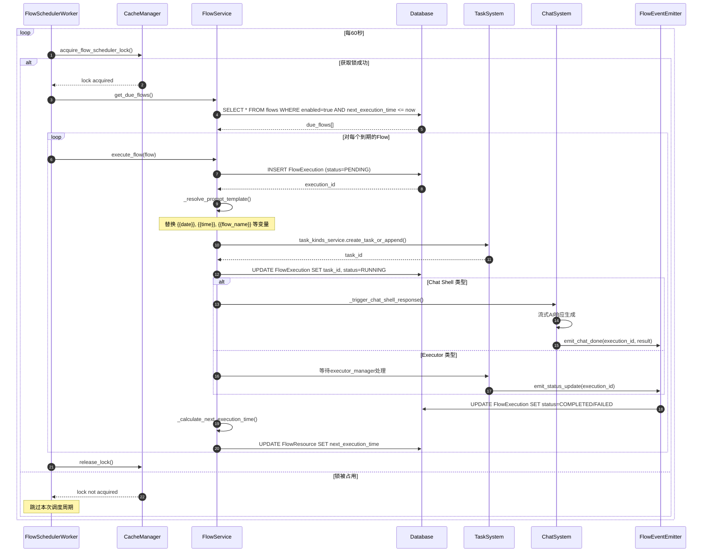
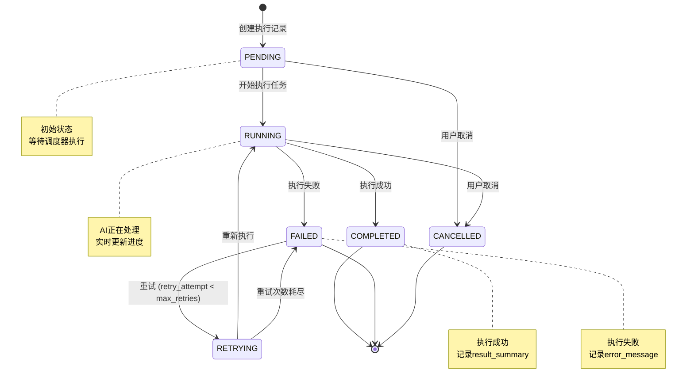

# AI Flow 智能流 - 架构设计文档

> 本文档描述 Wegent 项目中 AI Flow（智能流）功能的完整架构设计、流程图和 UML 图。

---

## 目录

1. [功能概述](#功能概述)
2. [目录结构](#目录结构)
3. [系统架构图](#系统架构图)
4. [数据流程图](#数据流程图)
5. [类图 (UML)](#类图-uml)
6. [时序图](#时序图)
7. [状态图](#状态图)
8. [API 端点](#api-端点)
9. [触发类型配置](#触发类型配置)
10. [模板变量](#模板变量)

---

## 功能概述

AI Flow 是一个自动化任务调度和执行系统，允许用户创建定时工作流来触发 AI Agent 任务。该功能以 Twitter/微博风格的社交媒体信息流展示 AI Agent 的活动，使 AI 自动化变得直观易用。

### 核心能力

- **多种触发方式**：支持 Cron 定时、间隔执行、一次性执行、Webhook/Git Push 事件触发
- **模板变量**：Prompt 模板支持动态变量替换（日期、时间、Webhook 数据等）
- **执行追踪**：完整的执行记录和状态追踪
- **分布式调度**：支持多实例部署的分布式锁机制

---

## 目录结构

```
Wegent/
├── frontend/
│   └── src/
│       ├── features/flows/
│       │   ├── components/
│       │   │   ├── FlowPage.tsx          # 主页面组件
│       │   │   ├── FlowList.tsx          # Flow 配置列表
│       │   │   ├── FlowTimeline.tsx      # Twitter 风格执行记录
│       │   │   ├── FlowForm.tsx          # 创建/编辑对话框
│       │   │   ├── CronSchedulePicker.tsx # Cron 表达式选择器
│       │   │   └── index.ts              # 组件导出
│       │   └── contexts/
│       │       └── flowContext.tsx        # React Context 状态管理
│       ├── apis/
│       │   └── flow.ts                    # API 客户端
│       ├── types/
│       │   └── flow.ts                    # TypeScript 类型定义
│       └── i18n/locales/
│           ├── en/flow.json               # 英文翻译
│           └── zh/flow.json               # 中文翻译
│
├── backend/
│   └── app/
│       ├── models/
│       │   └── flow.py                    # SQLAlchemy ORM 模型
│       ├── schemas/
│       │   └── flow.py                    # Pydantic Schemas (CRD 风格)
│       ├── services/
│       │   ├── flow.py                    # 核心 Flow 服务
│       │   ├── flow_scheduler.py          # 后台调度器
│       │   └── chat/trigger/
│       │       └── emitter.py             # 事件发射器
│       ├── api/endpoints/adapter/
│       │   └── flows.py                   # FastAPI REST 端点
│       └── tests/api/endpoints/
│           └── test_flows.py              # API 端点测试
│
└── backend/alembic/versions/
    └── q7r8s9t0u1v2_add_flow_tables.py    # 数据库迁移
```

---

## 系统架构图



---

## 数据流程图



---

## 类图 (UML)



---

## 时序图

### 定时调度执行流程



---

## 状态图

### FlowExecution 状态转换



---

## API 端点

| 方法 | 端点 | 描述 |
|------|------|------|
| GET | `/api/flows` | 获取用户的 Flow 列表（分页） |
| POST | `/api/flows` | 创建新 Flow |
| GET | `/api/flows/{id}` | 获取指定 Flow 详情 |
| PUT | `/api/flows/{id}` | 更新 Flow |
| DELETE | `/api/flows/{id}` | 软删除 Flow |
| POST | `/api/flows/{id}/toggle` | 启用/禁用 Flow |
| POST | `/api/flows/{id}/trigger` | 手动触发执行 |
| GET | `/api/flows/executions` | 获取执行记录列表（时间线） |
| GET | `/api/flows/executions/{id}` | 获取执行记录详情 |
| POST | `/api/flows/webhook/{token}` | Webhook 触发（无需认证） |

---

## 触发类型配置

### Cron 触发

```json
{
  "trigger_type": "cron",
  "trigger_config": {
    "expression": "0 9 * * *",
    "timezone": "UTC"
  }
}
```

### 间隔触发

```json
{
  "trigger_type": "interval",
  "trigger_config": {
    "value": 2,
    "unit": "hours"
  }
}
```

支持的单位：`minutes` | `hours` | `days`

### 一次性触发

```json
{
  "trigger_type": "one_time",
  "trigger_config": {
    "execute_at": "2025-01-15T10:00:00Z"
  }
}
```

### 事件触发

```json
{
  "trigger_type": "event",
  "trigger_config": {
    "event_type": "webhook"
  }
}
```

支持的事件类型：`webhook` | `git_push`

---

## 模板变量

Prompt 模板支持以下变量替换：

| 变量 | 说明 | 示例值 |
|------|------|--------|
| `{{date}}` | 当前日期 | `2025-01-15` |
| `{{time}}` | 当前时间 | `10:30:00` |
| `{{datetime}}` | 当前日期时间 | `2025-01-15 10:30:00` |
| `{{timestamp}}` | Unix 时间戳 | `1736937000` |
| `{{flow_name}}` | Flow 显示名称 | `每日报告` |
| `{{webhook_data}}` | Webhook 载荷（JSON） | `{"event": "push"}` |

### 使用示例

```
请根据 {{date}} 的数据生成日报。
当前时间：{{datetime}}
Flow 名称：{{flow_name}}
```

---

## 关键技术点

1. **CRD 风格数据模型**：借鉴 Kubernetes CRD 设计，使用 `apiVersion`、`kind`、`metadata`、`spec`、`status` 结构

2. **分布式锁**：使用 CacheManager 实现分布式锁，确保多实例部署时只有一个调度器实例运行

3. **事件发射器**：FlowEventEmitter 继承 NoOpEventEmitter，在 AI 聊天完成/失败时更新执行状态

4. **模板解析**：支持动态变量替换，Webhook 触发时可注入外部数据

5. **增量调度**：使用 `next_execution_time` 字段进行高效查询，避免全表扫描

---

## 集成点

1. **API Router**：在 `/api/flows` 注册，位于 `backend/app/api/api.py`

2. **后台任务**：通过 `start_flow_scheduler()` 和 `stop_flow_scheduler()` 管理调度器生命周期

3. **任务系统**：通过 `task_kinds_service.create_task_or_append()` 创建 Task

4. **聊天系统**：Chat Shell 类型的 Team 通过聊天触发系统触发 AI 响应
