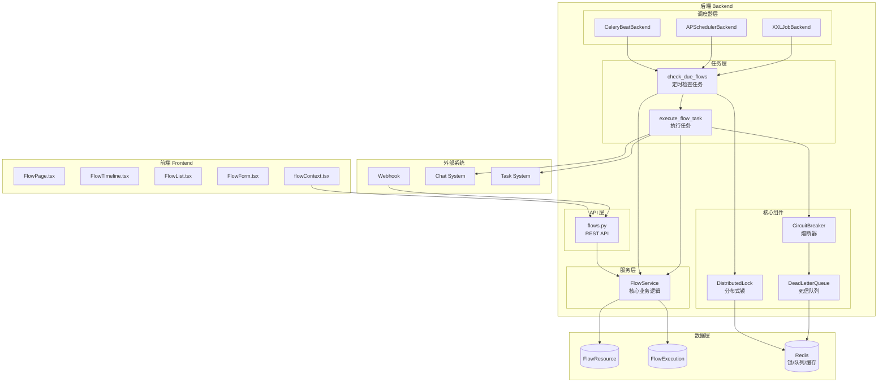
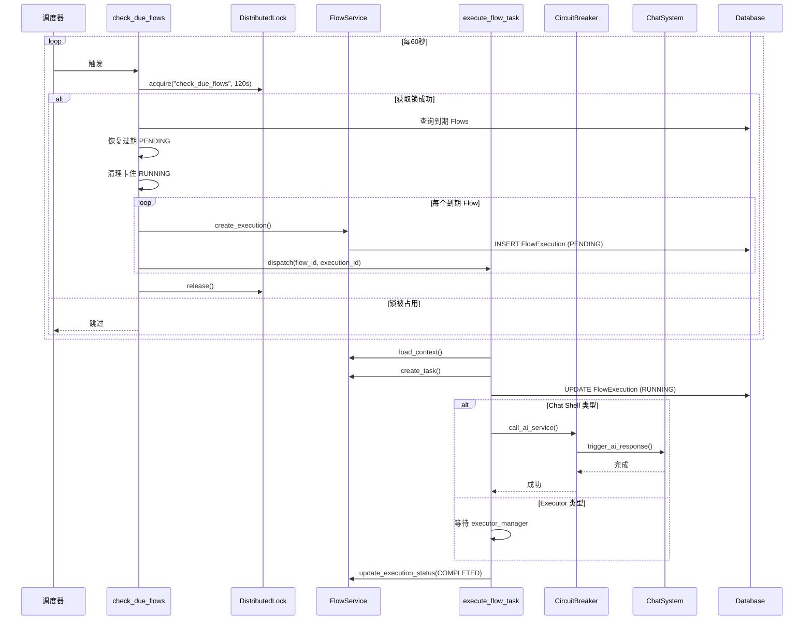
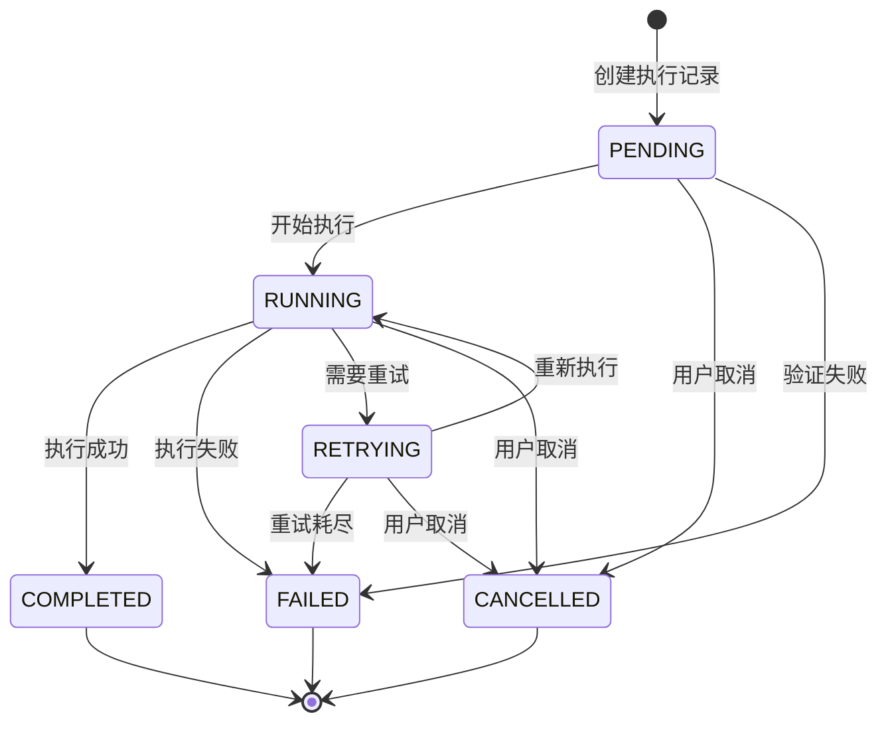

# AI Flow 智能流 - 架构设计文档

> 本文档描述 Wegent 项目中 AI Flow（智能流）功能的完整架构设计，基于实际代码实现。

---

## 目录

1. [功能概述](#功能概述)
2. [目录结构](#目录结构)
3. [系统架构图](#系统架构图)
4. [核心组件详解](#核心组件详解)
5. [数据流程图](#数据流程图)
6. [状态机设计](#状态机设计)
7. [调度器架构](#调度器架构)
8. [可靠性机制](#可靠性机制)
9. [API 端点](#api-端点)
10. [数据模型](#数据模型)
11. [配置参数](#配置参数)

---

## 功能概述

AI Flow 是一个自动化任务调度和执行系统，允许用户创建定时工作流来触发 AI Agent 任务。

### 核心能力

- **多种触发方式**：支持 Cron 定时、间隔执行、一次性执行、Webhook/Git Push 事件触发
- **模板变量**：Prompt 模板支持动态变量替换（日期、时间、Webhook 数据等）
- **执行追踪**：完整的执行记录和状态追踪（支持乐观锁和状态机）
- **分布式调度**：支持多实例部署的分布式锁机制
- **多后端支持**：支持 Celery Beat、APScheduler、XXL-JOB 三种调度后端
- **可靠性保障**：熔断器、死信队列、过期任务清理

---

## 目录结构

```
Wegent/
├── backend/
│   └── app/
│       ├── models/
│       │   └── flow.py                    # SQLAlchemy ORM 模型 (FlowResource, FlowExecution)
│       ├── schemas/
│       │   └── flow.py                    # Pydantic Schemas (CRD 风格)
│       ├── services/
│       │   └── flow.py                    # 核心 Flow 服务 (FlowService)
│       ├── tasks/
│       │   └── flow_tasks.py              # Celery 任务 (check_due_flows, execute_flow_task)
│       ├── core/
│       │   ├── celery_app.py              # Celery 应用配置
│       │   ├── circuit_breaker.py         # 熔断器实现
│       │   ├── dead_letter_queue.py       # 死信队列
│       │   ├── distributed_lock.py        # 分布式锁
│       │   └── scheduler/                 # 多后端调度器
│       │       ├── __init__.py            # 统一入口
│       │       ├── base.py                # 基类定义
│       │       ├── factory.py             # 工厂模式
│       │       ├── celery_backend.py      # Celery Beat 后端
│       │       ├── apscheduler_backend.py # APScheduler 后端
│       │       └── xxljob_backend.py      # XXL-JOB 后端
│       ├── api/endpoints/adapter/
│       │   └── flows.py                   # FastAPI REST 端点
│       └── services/chat/trigger/
│           └── emitter.py                 # 事件发射器 (FlowEventEmitter)
│
├── frontend/src/
│   ├── features/flows/
│   │   ├── components/
│   │   │   ├── FlowPage.tsx               # 主页面组件
│   │   │   ├── FlowList.tsx               # Flow 配置列表
│   │   │   ├── FlowTimeline.tsx           # 执行记录时间线
│   │   │   ├── FlowForm.tsx               # 创建/编辑表单
│   │   │   └── CronSchedulePicker.tsx     # Cron 表达式选择器
│   │   └── contexts/
│   │       └── flowContext.tsx            # React Context 状态管理
│   ├── apis/flow.ts                       # API 客户端
│   └── types/flow.ts                      # TypeScript 类型定义
│
└── backend/alembic/versions/
    ├── q7r8s9t0u1v2_add_flow_tables.py         # flows 表迁移
    ├── r8s9t0u1v2w3_add_webhook_secret_to_flows.py  # webhook secret 字段
    └── s9t0u1v2w3x4_add_version_to_flow_executions.py   # 乐观锁 version 字段
```

---

## 系统架构图



---

## 核心组件详解

### 1. FlowService (flow.py)

核心业务逻辑服务，负责：
- Flow CRUD 操作
- 执行记录管理
- 状态机转换验证
- 乐观锁并发控制
- Prompt 模板变量解析
- 下次执行时间计算

**关键方法**：
```python
class FlowService:
    def create_flow(db, flow_in, user_id) -> FlowInDB
    def update_flow(db, flow_id, flow_in, user_id) -> FlowInDB
    def trigger_flow_manually(db, flow_id, user_id) -> FlowExecutionInDB
    def trigger_flow_by_webhook(db, webhook_token, payload) -> FlowExecutionInDB
    def update_execution_status(db, execution_id, status, ...) -> bool
    def create_execution(db, flow, user_id, trigger_type, ...) -> FlowExecutionInDB
```

### 2. Celery Tasks (flow_tasks.py)

**check_due_flows**：每 60 秒运行一次的定时任务
- 获取分布式锁防止多实例重复执行
- 恢复过期的 PENDING 执行记录
- 清理卡住的 RUNNING 执行记录
- 批量处理到期的 Flow（每批 100 条）
- 分发 execute_flow_task 任务

**execute_flow_task**：实际执行 Flow 的任务
- 加载执行上下文（flow, team, user, workspace）
- 创建 Task 和 Subtasks
- 触发 AI 响应（Chat Shell 类型）
- 支持超时和重试
- 更新执行状态和统计数据

### 3. 调度器后端 (scheduler/)

支持三种调度后端：

| 后端 | 特点 | 适用场景 |
|------|------|----------|
| Celery Beat | 分布式，依赖 Redis | 生产环境多实例部署 |
| APScheduler | 轻量级，内存/SQLite 存储 | 单实例开发环境 |
| XXL-JOB | 企业级，独立调度中心 | 大规模企业部署 |

### 4. 可靠性组件

**CircuitBreaker**：防止 AI 服务故障级联
- 连续 5 次失败后断开
- 60 秒后尝试恢复
- 支持同步和异步调用

**DeadLetterQueue**：失败任务存储
- 存储在 Redis，7 天 TTL
- 支持查询和重试
- Prometheus 指标监控

**DistributedLock**：防止并发冲突
- Redis SET NX 实现
- 支持锁延期
- 降级模式（Redis 不可用时允许执行）

---

## 数据流程图

### Flow 执行流程



---

## 状态机设计

### FlowExecution 状态转换



**状态转换表**（来自 flow.py）：

| 当前状态 | 允许的下一状态 |
|----------|----------------|
| PENDING | RUNNING, CANCELLED, FAILED |
| RUNNING | COMPLETED, FAILED, RETRYING, CANCELLED |
| RETRYING | RUNNING, FAILED, CANCELLED |
| COMPLETED | (终态) |
| FAILED | (终态) |
| CANCELLED | (终态) |

---

## 调度器架构

### 统一接口

```python
class SchedulerBackend(ABC):
    @property
    def backend_type(self) -> str: ...
    @property
    def state(self) -> SchedulerState: ...
    def start(self) -> None: ...
    def stop(self, wait: bool = True) -> None: ...
    def pause(self) -> None: ...
    def resume(self) -> None: ...
    def schedule_job(...) -> ScheduledJob: ...
    def remove_job(job_id: str) -> bool: ...
    def get_job(job_id: str) -> Optional[ScheduledJob]: ...
    def list_jobs() -> List[ScheduledJob]: ...
```

### 配置选择

```python
# 在 settings 中配置
SCHEDULER_BACKEND = "celery"      # 默认
SCHEDULER_BACKEND = "apscheduler" # 轻量级
SCHEDULER_BACKEND = "xxljob"      # 企业级
```

---

## 可靠性机制

### 1. 过期执行恢复

**PENDING 恢复**（默认 2 小时阈值）：
- 检测 `created_at < now - 2h` 且 `task_id IS NULL` 的 PENDING 记录
- 重新分发 execute_flow_task

**RUNNING 清理**（默认 3 小时阈值）：
- 检测 `started_at < now - 3h` 的 RUNNING 记录
- 标记为 FAILED 并记录超时原因

### 2. 熔断器保护

```python
ai_service_breaker = CircuitBreaker(
    fail_max=5,           # 5 次失败后断开
    reset_timeout=60,     # 60 秒后尝试恢复
)
```

### 3. 乐观锁并发控制

FlowExecution 表包含 `version` 字段：
- 每次更新时检查版本
- 版本不匹配抛出 OptimisticLockError
- 防止并发更新冲突

---

## API 端点

| 方法 | 端点 | 描述 |
|------|------|------|
| GET | `/api/flows` | 获取 Flow 列表（分页） |
| POST | `/api/flows` | 创建新 Flow |
| GET | `/api/flows/{id}` | 获取 Flow 详情 |
| PUT | `/api/flows/{id}` | 更新 Flow |
| DELETE | `/api/flows/{id}` | 软删除 Flow |
| POST | `/api/flows/{id}/toggle` | 启用/禁用 Flow |
| POST | `/api/flows/{id}/trigger` | 手动触发执行 |
| GET | `/api/flows/executions` | 执行记录列表 |
| GET | `/api/flows/executions/{id}` | 执行记录详情 |
| DELETE | `/api/flows/executions/{id}/cancel` | 取消执行 |
| GET | `/api/flows/executions/stale` | 获取过期执行（调试用） |
| POST | `/api/flows/webhook/{token}` | Webhook 触发 |

---

## 数据模型

### FlowResource 表

| 字段 | 类型 | 说明 |
|------|------|------|
| id | Integer (PK) | 主键 |
| user_id | Integer | 所属用户 |
| kind | String(50) | 固定 "Flow" |
| name | String(255) | Flow 名称 |
| namespace | String(255) | 命名空间 |
| json | JSON | 完整 CRD 结构 |
| is_active | Boolean | 软删除标记 |
| enabled | Boolean | 启用状态 |
| trigger_type | String(50) | 触发类型 |
| team_id | Integer | 关联 Team |
| workspace_id | Integer | 关联 Workspace |
| webhook_token | String(255) | Webhook 令牌 |
| webhook_secret | String(255) | HMAC 签名密钥 |
| next_execution_time | DateTime | 下次执行时间 |
| execution_count | Integer | 总执行次数 |
| success_count | Integer | 成功次数 |
| failure_count | Integer | 失败次数 |

### FlowExecution 表

| 字段 | 类型 | 说明 |
|------|------|------|
| id | Integer (PK) | 主键 |
| user_id | Integer | 所属用户 |
| flow_id | Integer (FK) | 关联 Flow |
| task_id | Integer | 关联 Task |
| trigger_type | String(50) | 触发类型 |
| trigger_reason | String(500) | 触发原因 |
| prompt | Text | 解析后的 Prompt |
| status | String(50) | 执行状态 |
| result_summary | Text | 结果摘要 |
| error_message | Text | 错误信息 |
| retry_attempt | Integer | 重试次数 |
| version | Integer | 乐观锁版本 |
| started_at | DateTime | 开始时间 |
| completed_at | DateTime | 完成时间 |

---

## 配置参数

| 配置项 | 默认值 | 说明 |
|--------|--------|------|
| SCHEDULER_BACKEND | "celery" | 调度后端类型 |
| FLOW_SCHEDULER_INTERVAL_SECONDS | 60 | 调度检查间隔 |
| FLOW_DEFAULT_TIMEOUT_SECONDS | 600 | 默认执行超时 |
| FLOW_DEFAULT_RETRY_COUNT | 1 | 默认重试次数 |
| FLOW_STALE_PENDING_HOURS | 2 | PENDING 过期阈值 |
| FLOW_STALE_RUNNING_HOURS | 3 | RUNNING 过期阈值 |
| CIRCUIT_BREAKER_FAIL_MAX | 5 | 熔断失败次数 |
| CIRCUIT_BREAKER_RESET_TIMEOUT | 60 | 熔断恢复时间 |
| EMBEDDED_CELERY_ENABLED | True | 嵌入式 Celery 开关 |

---

## 模板变量

| 变量 | 说明 | 示例值 |
|------|------|--------|
| `{{date}}` | 当前日期 | `2025-01-15` |
| `{{time}}` | 当前时间 | `10:30:00` |
| `{{datetime}}` | 日期时间 | `2025-01-15 10:30:00` |
| `{{timestamp}}` | Unix 时间戳 | `1736937000` |
| `{{flow_name}}` | Flow 显示名称 | `每日报告` |
| `{{webhook_data}}` | Webhook 载荷 | `{"event": "push"}` |

---

## Flow 任务可见性

Flow 触发的任务默认不显示在用户历史对话列表：

1. **创建时**：`type='flow'`, `userInteracted='false'`
2. **用户交互后**：`userInteracted='true'`，任务显示在历史列表
3. **查询过滤**：`type != 'flow' OR userInteracted = 'true'`
