# Canvas 画布架构设计文档

> 版本: 1.2
> 分支: human/20260115_panda
> 日期: 2026-01-16
> 更新: v1.2 修复artifact存储冗余和页面刷新加载问题

---

## 目录

1. [架构概述](#1-架构概述)
2. [系统架构图](#2-系统架构图)
3. [核心组件详解](#3-核心组件详解)
4. [数据模型设计](#4-数据模型设计)
5. [全链路数据流分析](#5-全链路数据流分析)
6. [时序图分析](#6-时序图分析)
7. [类图与UML设计](#7-类图与uml设计)
8. [代码调用路径详解](#8-代码调用路径详解)
9. [设计思想与原则](#9-设计思想与原则)
10. [技术亮点](#10-技术亮点)

---

## 1. 架构概述

### 1.1 什么是Canvas?

Canvas（画布）是一个用于展示AI生成的代码/文档内容的"工作台"功能。它提供了一个独立的面板，用户可以在其中查看、编辑、版本管理AI生成的内容，类似于Claude Artifacts或ChatGPT Canvas的设计理念。

### 1.2 核心功能

| 功能 | 描述 |
|------|------|
| **内容创建** | AI通过工具调用创建代码/文档artifact |
| **实时预览** | 流式传输过程中实时更新Canvas内容 |
| **版本管理** | 基于Diff的版本历史，支持版本回溯 |
| **快捷操作** | 添加注释、修复Bug、转换语言等快捷操作 |
| **导出功能** | 支持复制、下载生成的内容 |

### 1.3 技术栈

```
前端: React + TypeScript + TailwindCSS
后端: Python FastAPI
AI Agent: LangChain + Custom Tools
存储: PostgreSQL (JSON字段)
通信: SSE (Server-Sent Events) / WebSocket
```

### 1.4 代码变更统计

本次Canvas功能共涉及 **32个文件**，新增约 **3000行代码**：

- 前端: 11个文件 (+1266行)
- 后端: 10个文件 (+1040行)
- Chat Shell: 11个文件 (+706行)

---

## 2. 系统架构图

### 2.1 整体架构

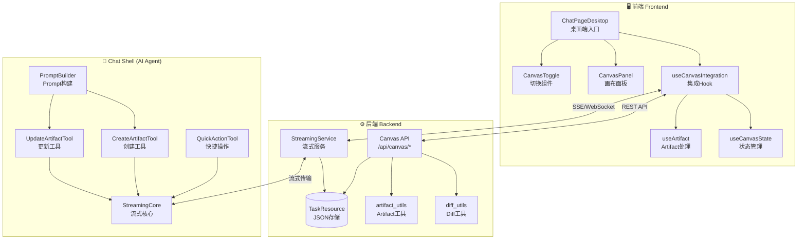

### 2.2 三层架构说明

#### 第一层：前端展示层 (Frontend)

负责用户交互、状态管理、UI渲染：

| 组件 | 职责 |
|------|------|
| `ChatPageDesktop` | 桌面端主页面，集成Canvas面板 |
| `useCanvasIntegration` | Canvas与Chat的深度集成 |
| `useCanvasState` | Canvas本地状态管理 |
| `useArtifact` | 从流数据中提取Artifact |
| `CanvasPanel` | Canvas内容展示面板 |
| `CanvasToggle` | Canvas功能开关 |

#### 第二层：业务服务层 (Backend)

负责API处理、版本管理、数据持久化：

| 组件 | 职责 |
|------|------|
| `Canvas API` | REST API端点 |
| `StreamingService` | 流式传输服务 |
| `diff_utils` | Diff生成与应用 |
| `artifact_utils` | Artifact格式化工具 |

#### 第三层：AI Agent层 (Chat Shell)

负责AI工具调用、Prompt构建：

| 组件 | 职责 |
|------|------|
| `CreateArtifactTool` | 创建Artifact的LLM工具 |
| `UpdateArtifactTool` | 更新Artifact的LLM工具 |
| `QuickActionTool` | 快捷操作工具 |
| `PromptBuilder` | 系统Prompt构建器 |

---

## 3. 核心组件详解

### 3.1 前端核心组件

#### 3.1.1 ChatPageDesktop.tsx

**文件位置**: `frontend/src/app/(tasks)/chat/ChatPageDesktop.tsx`

**核心职责**: 桌面端Chat页面主入口，集成Canvas面板

**关键代码结构**:

```typescript
// 状态管理
const [canvasEnabled, setCanvasEnabled] = useState(false)  // Canvas功能开关
const [isCanvasOpen, setIsCanvasOpen] = useState(false)    // 面板可见性

// Canvas集成Hook
const canvas = useCanvasIntegration({
  taskId: selectedTaskDetail?.id,
  onReset: handleCanvasReset,
})

// 从thinking steps中提取artifact (流式过程)
const extractArtifactFromThinking = useCallback((thinking: unknown[]) => {
  // 倒序遍历finding最新的artifact
  for (let i = thinking.length - 1; i >= 0; i--) {
    const step = thinking[i]
    if (step.type === 'tool_result' &&
        ['create_artifact', 'update_artifact'].includes(step.tool_name)) {
      // 解析output获取artifact
      return parseArtifact(step.output)
    }
  }
  return null
}, [])

// 监听流状态变化
useEffect(() => {
  const messages = currentTaskStreamState?.messages
  // 提取artifact并更新Canvas
  const artifact = extractArtifactFromThinking(messages[0].thinking)
  if (artifact) {
    canvas.processSubtaskResult({ artifact })
  }
}, [currentTaskStreamState])

// 布局渲染
return (
  <div className="flex">
    <ChatArea className={isCanvasOpen ? 'w-[60%]' : 'w-full'} />
    {isCanvasOpen && <CanvasPanel className="w-[40%]" />}
  </div>
)
```

#### 3.1.2 useCanvasState.ts

**文件位置**: `frontend/src/features/canvas/hooks/useCanvasState.ts`

**核心职责**: 管理Canvas UI层面的所有状态

**状态设计**:

```typescript
interface CanvasStateReturn {
  // 功能状态
  canvasEnabled: boolean
  setCanvasEnabled: (enabled: boolean) => void
  toggleCanvas: () => void

  // Artifact状态
  artifact: Artifact | null
  setArtifact: (artifact: Artifact | null) => void

  // 版本信息 (派生状态)
  currentVersion: number
  versions: ArtifactVersion[]

  // 内容操作
  updateContent: (content: string) => void
  updateTitle: (title: string) => void

  // UI状态
  isLoading: boolean
  error: string | null
  isFullscreen: boolean
  toggleFullscreen: () => void

  // 重置
  reset: () => void
}
```

#### 3.1.3 useCanvasIntegration.ts

**文件位置**: `frontend/src/features/tasks/components/chat/useCanvasIntegration.ts`

**核心职责**: 将Canvas状态与Chat功能深度集成

**关键方法**:

```typescript
function useCanvasIntegration(options: UseCanvasIntegrationOptions) {
  const canvasState = useCanvasState()

  // 版本恢复 - 调用后端API
  const handleVersionRevert = async (version: number) => {
    const response = await fetch(
      `/api/canvas/tasks/${taskId}/artifact/revert/${version}`,
      { method: 'POST' }
    )
    const data = await response.json()
    canvasState.setArtifact(data.artifact)
  }

  // 快捷操作 - 发送特殊消息
  const handleQuickAction = (actionId: string, optionValue?: string) => {
    // 发送格式: "[canvas:actionId] optionValue"
    sendMessage(`[canvas:${actionId}] ${optionValue || ''}`)
  }

  // 处理subtask结果
  const processSubtaskResult = (result: unknown) => {
    const artifact = extractArtifact(result)
    if (artifact) {
      canvasState.setArtifact(artifact)
      canvasState.setCanvasEnabled(true)  // 自动启用
    }
  }

  // 获取完整版本历史
  const fetchArtifactWithVersions = async () => {
    const response = await fetch(`/api/canvas/tasks/${taskId}/artifact`)
    const data = await response.json()
    canvasState.setArtifact(data)
  }

  return {
    ...canvasState,
    handleVersionRevert,
    handleQuickAction,
    processSubtaskResult,
    fetchArtifactWithVersions,
  }
}
```

#### 3.1.4 CanvasPanel.tsx

**文件位置**: `frontend/src/features/canvas/components/CanvasPanel.tsx`

**核心职责**: Canvas内容展示UI组件

**UI结构**:

```
┌─────────────────────────────────────────┐
│ Header                                   │
│ ┌─────────────────┬────────────────────┐│
│ │ 标题 (可编辑)    │ 工具按钮 (复制/下载) ││
│ └─────────────────┴────────────────────┘│
├─────────────────────────────────────────┤
│ Tab切换: [内容] [版本]                    │
├─────────────────────────────────────────┤
│ Content Area                             │
│                                          │
│  (代码高亮显示或文本内容)                  │
│                                          │
├─────────────────────────────────────────┤
│ Footer                                   │
│ ┌─────────────────┬────────────────────┐│
│ │ ◄ 上一版本      │ v2/3  │  下一版本 ► ││
│ └─────────────────┴────────────────────┘│
└─────────────────────────────────────────┘
```

### 3.2 后端核心组件

#### 3.2.1 canvas.py (Canvas API)

**文件位置**: `backend/app/api/endpoints/canvas.py`

**API端点设计**:

| 方法 | 路径 | 功能 |
|------|------|------|
| GET | `/tasks/{task_id}/artifact` | 获取当前artifact(含版本历史) |
| POST | `/tasks/{task_id}/artifact` | 创建新artifact |
| PUT | `/tasks/{task_id}/artifact` | 更新artifact(创建新版本) |
| POST | `/tasks/{task_id}/artifact/revert/{version}` | 恢复到指定版本 |
| GET | `/tasks/{task_id}/artifact/version/{version}` | 获取指定版本内容 |
| GET | `/tasks/{task_id}/canvas-settings` | 获取Canvas设置 |
| PUT | `/tasks/{task_id}/canvas-settings` | 更新Canvas设置 |

**版本恢复核心逻辑**:

```python
@router.post("/tasks/{task_id}/artifact/revert/{version}")
async def revert_artifact_version(
    task_id: int,
    version: int,
    db: Session = Depends(get_db),
    current_user: User = Depends(get_current_user),
):
    # 1. 权限检查
    task = check_task_access(db, task_id, current_user.id)
    canvas_data = get_canvas_data(task)

    # 2. 重建目标版本内容
    current_content = canvas_data["artifact"]["content"]
    history = canvas_data["history"]
    target_content = get_version_content(current_content, history, version)

    # 3. 创建新版本 (diff从当前→目标)
    new_diff = create_diff(current_content, target_content)
    new_version = canvas_data["artifact"]["version"] + 1

    # 4. 更新数据
    canvas_data["artifact"]["content"] = target_content
    canvas_data["artifact"]["version"] = new_version
    canvas_data["history"].append({
        "version": new_version,
        "diff": new_diff,
        "created_at": datetime.utcnow().isoformat()
    })

    # 5. 保存并返回
    save_canvas_data(db, task, canvas_data)
    return artifact_to_response(canvas_data["artifact"], history, task_id)
```

#### 3.2.2 diff_utils.py

**文件位置**: `backend/app/utils/diff_utils.py`

**核心功能**: 实现基于Unified Diff的版本历史管理

**关键函数**:

```python
def create_diff(old_content: str, new_content: str) -> str:
    """
    生成unified diff

    Args:
        old_content: 旧内容
        new_content: 新内容

    Returns:
        Unified diff字符串，如果内容相同返回空字符串
    """
    diff = difflib.unified_diff(
        old_content.splitlines(keepends=True),
        new_content.splitlines(keepends=True),
        lineterm=''
    )
    return ''.join(diff)


def apply_diff(content: str, diff: str, reverse: bool = False) -> str | None:
    """
    应用diff到内容

    Args:
        content: 原始内容
        diff: Unified diff字符串
        reverse: 是否逆向应用 (用于版本回溯)

    Returns:
        应用diff后的内容，失败返回None
    """
    hunks = _parse_unified_diff(diff.splitlines())
    lines = content.splitlines()
    return _apply_hunks(lines, hunks, reverse)


def get_version_content(
    current_content: str,
    history: list,
    target_version: int
) -> str | None:
    """
    从当前内容和历史重建目标版本

    算法: 从当前版本开始，逆向应用diff直到目标版本

    Example:
        current_version = 5, target_version = 2
        需要逆向应用: diff_5 → diff_4 → diff_3
        最终得到version 2的内容
    """
    current_version = len(history)
    if target_version > current_version or target_version < 1:
        return None

    content = current_content
    # 从当前版本倒推到目标版本
    for i in range(current_version, target_version, -1):
        diff = history[i - 1].get("diff")
        if diff:
            content = apply_diff(content, diff, reverse=True)
            if content is None:
                return None

    return content
```

#### 3.2.3 streaming/core.py

**文件位置**: `backend/app/services/streaming/core.py`

**核心职责**: 统一的流式传输基础设施

**StreamingState设计**:

```python
@dataclass
class StreamingState:
    """流式会话状态容器"""
    task_id: int
    subtask_id: int
    user_id: int
    shell_type: str = "Chat"

    # 内容累积
    full_response: str = ""
    thinking: list[dict] = field(default_factory=list)  # 工具调用步骤
    sources: list[dict] = field(default_factory=list)   # 知识库来源
    reasoning_content: str = ""  # DeepSeek R1推理内容

    def get_current_result(
        self,
        include_value: bool = True,
        include_thinking: bool = True,
        slim_thinking: bool = False,
        for_storage: bool = False
    ) -> dict:
        """
        获取当前结果

        Args:
            for_storage: True时truncate artifact content
                        (完整artifact存在task.json["canvas"])
        """
        result = {
            "value": self.full_response if include_value else None,
            "sources": self.sources,
        }

        if include_thinking:
            thinking = self._slim_thinking_data(
                self.thinking, for_storage
            ) if slim_thinking else self.thinking
            result["thinking"] = thinking

        return result

    @staticmethod
    def _slim_thinking_data(thinking: list, for_storage: bool) -> list:
        """
        精简thinking数据

        对create_artifact/update_artifact:
        - streaming时: 保留完整output (前端需要显示Canvas)
        - storage时: truncate content (完整数据在canvas字段)
        """
        slim_thinking = []
        for step in thinking:
            tool_name = step.get("details", {}).get("tool_name")

            if tool_name in ("create_artifact", "update_artifact"):
                if for_storage:
                    # 截断content节省存储
                    output = step["details"].get("output", {})
                    if "artifact" in output:
                        output["artifact"]["content"] = "[truncated]"
                else:
                    # 保留完整用于前端
                    pass

            slim_thinking.append(step)

        return slim_thinking
```

### 3.3 Chat Shell核心组件

#### 3.3.1 canvas_artifact.py

**文件位置**: `chat_shell/chat_shell/tools/builtin/canvas_artifact.py`

**LLM工具定义**:

```python
class CreateArtifactInput(BaseModel):
    """创建Artifact的输入参数"""
    artifact_type: Literal["code", "text"]
    title: str
    content: str
    language: str | None = None


class CreateArtifactTool(BaseTool):
    """创建Canvas Artifact的工具"""
    name: str = "create_artifact"
    display_name: str = "创建画布内容"
    description: str = """
    创建一个新的Canvas artifact用于展示代码或文档内容。
    适用场景:
    - 生成完整的代码文件
    - 创作文章、报告、故事
    - 生成结构化文档
    """
    args_schema: Type[BaseModel] = CreateArtifactInput

    def _run(
        self,
        artifact_type: str,
        title: str,
        content: str,
        language: str | None = None,
    ) -> str:
        artifact = {
            "id": str(uuid.uuid4()),
            "artifact_type": artifact_type,
            "title": title,
            "content": content,
            "version": 1,
            "created_at": datetime.utcnow().isoformat(),
        }

        if language and artifact_type == "code":
            artifact["language"] = language

        return json.dumps({
            "type": "artifact",
            "artifact": artifact,
            "message": f"Created {artifact_type} artifact: {title}"
        })


class UpdateArtifactTool(BaseTool):
    """更新已有Artifact的工具"""
    name: str = "update_artifact"
    display_name: str = "更新画布内容"

    def _run(
        self,
        artifact_id: str,
        content: str,
        title: str | None = None,
    ) -> str:
        update_data = {
            "id": artifact_id,
            "content": content,
            "updated_at": datetime.utcnow().isoformat(),
        }

        if title:
            update_data["title"] = title

        return json.dumps({
            "type": "artifact_update",
            "artifact": update_data,
            "message": f"Updated artifact: {artifact_id}"
        })
```

#### 3.3.2 builder.py (Prompt构建器)

**文件位置**: `chat_shell/chat_shell/prompts/builder.py`

**Canvas Prompt模板**:

```python
CANVAS_ARTIFACT_PROMPT = """
## Canvas Artifact 使用指南

你可以使用Canvas工具来创建和管理代码/文档内容。

### 何时使用 create_artifact:
1. **写作/创作**: 文章、故事、报告、邮件
2. **代码生成**: 完整的代码文件、脚本、配置
3. **结构化内容**: 表格、文档、设计文档
4. **技术文档**: API文档、README、教程

### 何时使用 update_artifact:
1. **扩充/扩写**: 扩展某个段落或功能
2. **删除/移除**: 移除不需要的内容
3. **修改/编辑**: 修改特定部分
4. **重写**: 重新组织或改写内容

### 识别已有Artifact:
在对话历史中，已创建的artifact会以如下格式标识:
```
[Created Artifact: <title> (artifact_id: <uuid>)]
<content>
```

当用户要求修改已有内容时，请使用update_artifact工具并提供完整的新内容。

### 注意事项:
- 始终提供完整内容，不要使用省略号或"保持不变"
- 代码类型需指定language参数
- 选择合适的artifact_type: "code" 或 "text"
"""


def build_system_prompt(
    base_prompt: str,
    enable_clarification: bool = False,
    enable_deep_thinking: bool = True,
    enable_canvas: bool = True,  # 默认启用Canvas
    skills: list[dict] | None = None,
) -> str:
    """
    构建完整的系统Prompt

    注入顺序:
    1. Base prompt
    2. Clarification mode (if enabled)
    3. Deep thinking mode (if enabled)
    4. Canvas artifact mode (if enabled)
    5. Skill metadata
    """
    parts = [base_prompt]

    if enable_clarification:
        parts.append(CLARIFICATION_PROMPT)

    if enable_deep_thinking:
        parts.append(DEEP_THINKING_PROMPT)

    if enable_canvas:
        parts.append(CANVAS_ARTIFACT_PROMPT)

    if skills:
        parts.append(format_skills_metadata(skills))

    return "\n\n".join(parts)
```

---

## 4. 数据模型设计

### 4.1 Artifact数据结构

```typescript
// 前端类型定义
interface Artifact {
  id: string;                    // UUID
  artifact_type: 'code' | 'text'; // 类型
  title: string;                 // 标题
  content: string;               // 当前内容
  language?: string;             // 编程语言 (仅code类型)
  version: number;               // 当前版本号
  versions: ArtifactVersion[];   // 版本历史
  created_at: string;            // 创建时间
  updated_at?: string;           // 更新时间
}

interface ArtifactVersion {
  version: number;               // 版本号
  diff: string | null;           // Unified diff (v1为null)
  created_at: string;            // 创建时间
}
```

### 4.2 Canvas存储结构

**存储位置**: `TaskResource.json["canvas"]`

```json
{
  "canvas": {
    "enabled": true,
    "artifact": {
      "id": "550e8400-e29b-41d4-a716-446655440000",
      "artifact_type": "code",
      "title": "Python脚本",
      "content": "def hello():\n    print('Hello, World!')\n\nhello()",
      "language": "python",
      "version": 3
    },
    "history": [
      {
        "version": 1,
        "diff": null,
        "created_at": "2026-01-16T10:00:00Z"
      },
      {
        "version": 2,
        "diff": "@@ -1,2 +1,3 @@\n def hello():\n-    print('Hello')\n+    print('Hello, World!')\n+\n+hello()",
        "created_at": "2026-01-16T10:05:00Z"
      },
      {
        "version": 3,
        "diff": "@@ -1,4 +1,4 @@\n def hello():\n     print('Hello, World!')\n \n-hello()\n+if __name__ == '__main__':\n+    hello()",
        "created_at": "2026-01-16T10:10:00Z"
      }
    ]
  }
}
```

### 4.3 ER图

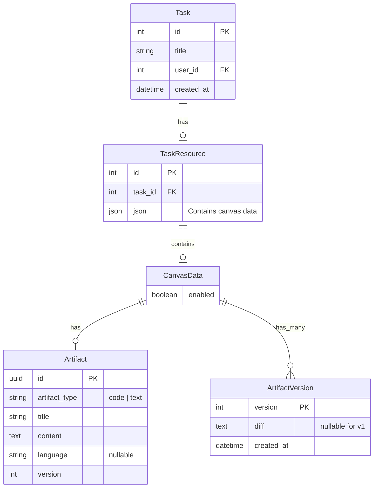

---

## 5. 全链路数据流分析

### 5.1 Artifact创建流程

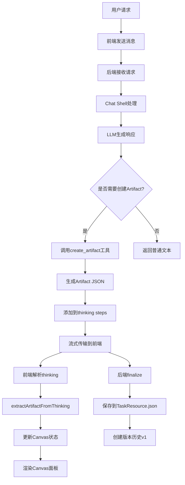

### 5.2 Artifact更新流程

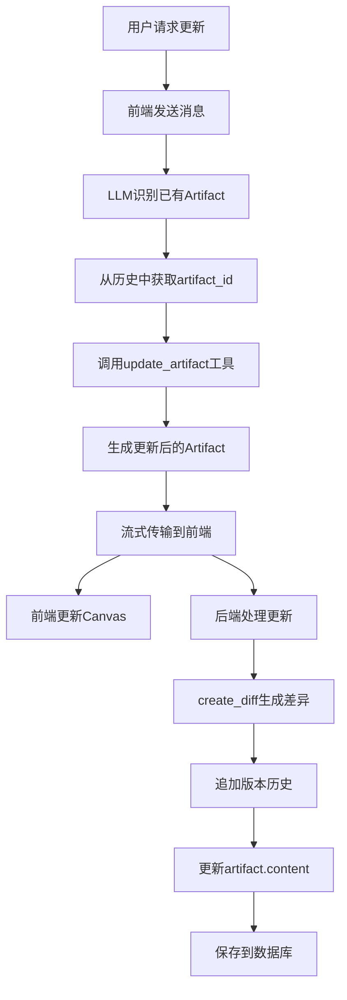

### 5.3 版本恢复流程

```mermaid
flowchart TD
    A[用户点击历史版本] --> B[调用handleVersionRevert]
    B --> C[POST /artifact/revert/{version}]

    C --> D[后端get_version_content]
    D --> E[逆向应用diff重建内容]
    E --> F[创建新版本diff]
    F --> G[更新artifact为目标内容]
    G --> H[追加新版本到历史]
    H --> I[保存数据库]

    I --> J[返回更新后的Artifact]
    J --> K[前端setArtifact]
    K --> L[Canvas显示恢复的内容]
```

### 5.4 数据流向汇总图

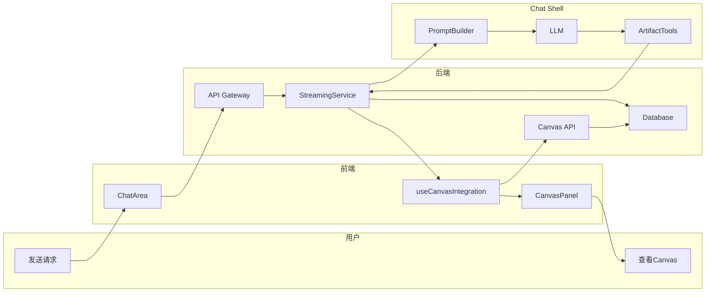

---

## 6. 时序图分析

### 6.1 Artifact创建完整时序

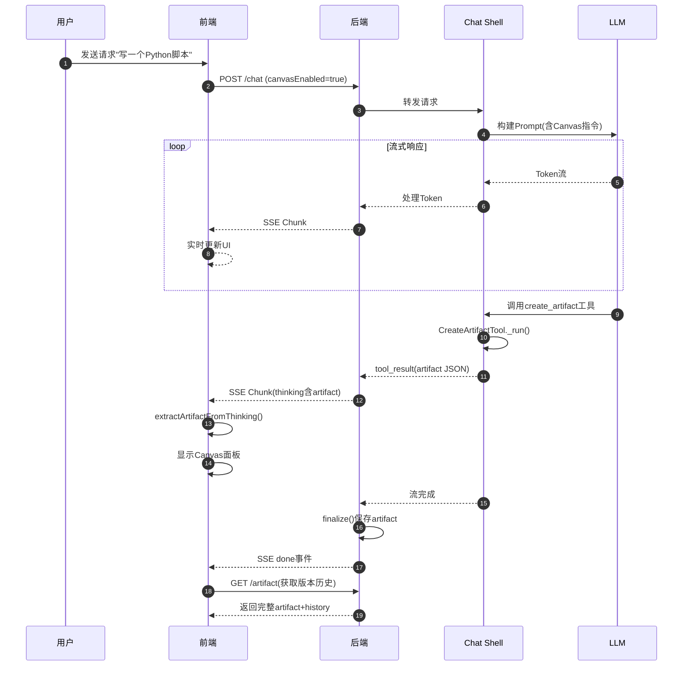

### 6.2 版本恢复时序

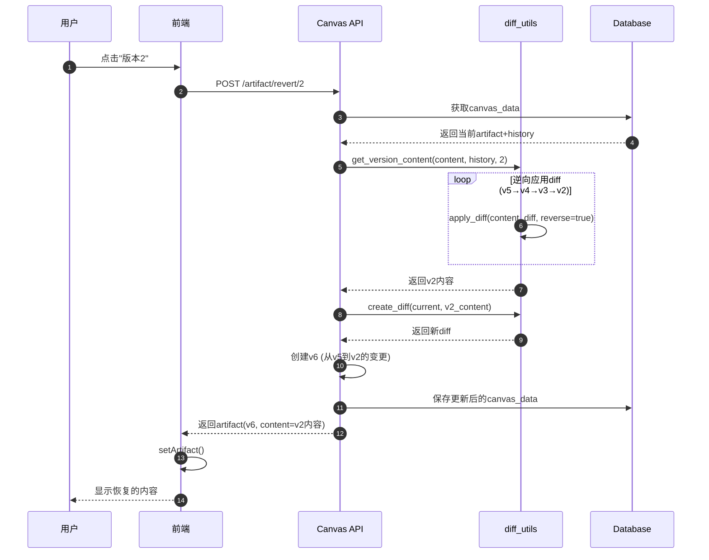

### 6.3 快捷操作时序

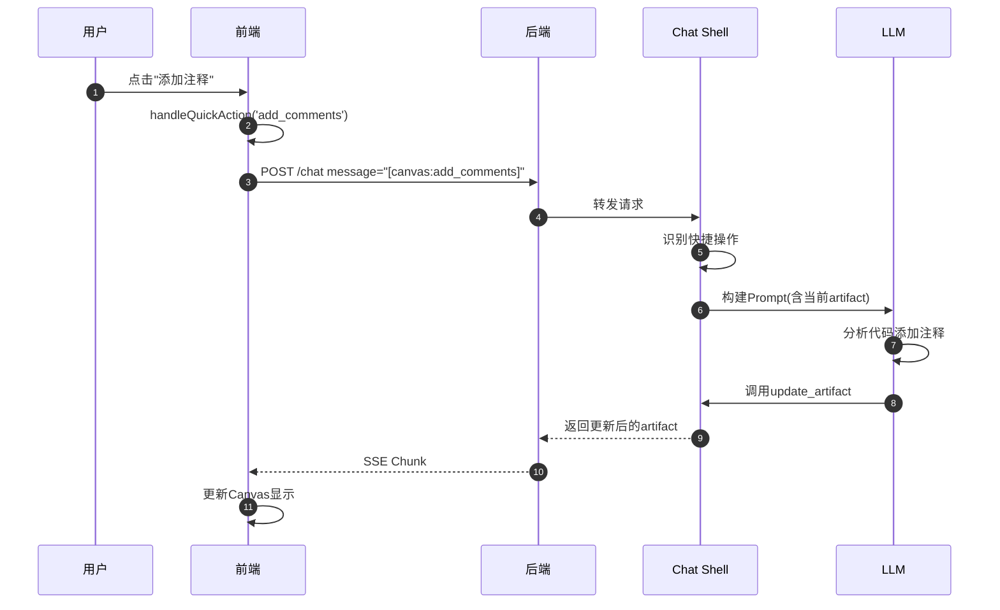

---

## 7. 类图与UML设计

### 7.1 前端类图

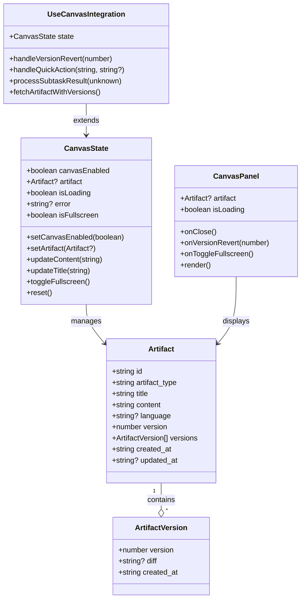

### 7.2 后端类图

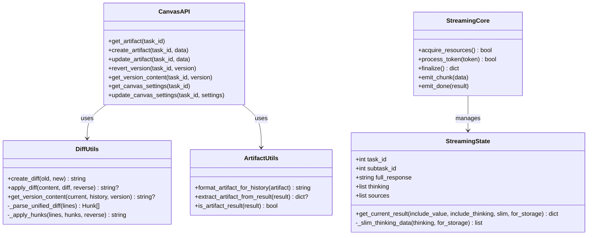

### 7.3 Chat Shell类图

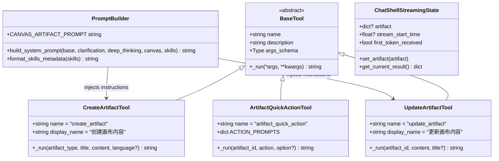

---

## 8. 代码调用路径详解

### 8.1 创建Artifact的完整调用链

```
用户输入 "帮我写一个Python脚本"
    │
    ▼
[前端] ChatPageDesktop.handleSendMessage()
    │ POST /api/chat/send
    ▼
[后端] chat_router.send_message()
    │ 创建StreamingState
    ▼
[Chat Shell] graph_builder.build_graph()
    │ 注入Canvas工具
    ▼
[Chat Shell] prompts/builder.build_system_prompt()
    │ 注入CANVAS_ARTIFACT_PROMPT
    ▼
[LLM] 生成响应，决定调用create_artifact
    │
    ▼
[Chat Shell] CreateArtifactTool._run()
    │ 生成artifact JSON
    │ {type: "artifact", artifact: {...}}
    ▼
[Chat Shell] streaming/core.StreamingState.add_thinking_step()
    │ 添加tool_result到thinking
    ▼
[后端] streaming/core.StreamingCore.emit_chunk()
    │ 发送SSE chunk (包含thinking)
    ▼
[前端] ChatPageDesktop useEffect (监听streamState变化)
    │
    ▼
[前端] extractArtifactFromThinking(thinking)
    │ 遍历thinking找tool_result
    │ 解析output获取artifact
    ▼
[前端] canvas.processSubtaskResult({artifact})
    │
    ▼
[前端] useCanvasIntegration.processSubtaskResult()
    │ extractArtifact(result)
    │ setArtifact(artifact)
    │ setCanvasEnabled(true)
    ▼
[前端] CanvasPanel 渲染 artifact.content
```

### 8.2 版本恢复的完整调用链

```
用户点击版本历史中的"版本2"
    │
    ▼
[前端] CanvasPanel.handleVersionClick(2)
    │
    ▼
[前端] useCanvasIntegration.handleVersionRevert(2)
    │ POST /api/canvas/tasks/{taskId}/artifact/revert/2
    ▼
[后端] canvas.revert_artifact_version(task_id=123, version=2)
    │
    ├─▶ check_task_access(db, 123, user_id)
    │       验证用户权限
    │
    ├─▶ get_canvas_data(task)
    │       获取当前canvas数据
    │
    ├─▶ diff_utils.get_version_content(current, history, 2)
    │       │
    │       ├─▶ 获取history[4].diff (v5的diff)
    │       │   apply_diff(v5_content, diff, reverse=True) → v4_content
    │       │
    │       ├─▶ 获取history[3].diff (v4的diff)
    │       │   apply_diff(v4_content, diff, reverse=True) → v3_content
    │       │
    │       └─▶ 获取history[2].diff (v3的diff)
    │           apply_diff(v3_content, diff, reverse=True) → v2_content
    │
    ├─▶ diff_utils.create_diff(v5_content, v2_content)
    │       生成从v5到v2的diff
    │
    ├─▶ 更新canvas_data:
    │       artifact.content = v2_content
    │       artifact.version = 6
    │       history.append({version: 6, diff: new_diff})
    │
    └─▶ save_canvas_data(db, task, canvas_data)
    │
    ▼
[后端] 返回 artifact_to_response(artifact, history, task_id)
    │
    ▼
[前端] handleVersionRevert 接收响应
    │ canvasState.setArtifact(response.artifact)
    ▼
[前端] CanvasPanel 重新渲染，显示v2内容
```

### 8.3 流式传输的完整调用链

```
[后端] StreamingCore.process_token(token)
    │
    ├─▶ 检查取消标志
    │
    ├─▶ 处理reasoning marker
    │       if "__REASONING__" in token:
    │           extract reasoning_content
    │
    ├─▶ 累积content
    │       state.full_response += token
    │
    ├─▶ emit_chunk()
    │       │
    │       ├─▶ result = state.get_current_result(slim_thinking=True)
    │       │
    │       └─▶ SSE: {"type": "chunk", "data": result}
    │
    └─▶ periodic_save() (每5秒)
            │
            ├─▶ Redis: 保存streaming状态
            │
            └─▶ DB: 保存subtask result

[后端] StreamingCore.finalize()
    │
    ├─▶ 生成两份result:
    │       result_for_frontend = state.get_current_result(for_storage=False)
    │       result_for_storage = state.get_current_result(for_storage=True)
    │
    ├─▶ 保存artifact到canvas:
    │       if artifact in result:
    │           canvas_data["artifact"] = artifact
    │           canvas_data["history"].append(new_version)
    │
    ├─▶ 保存到Redis/DB
    │
    └─▶ emit_done(result_for_frontend)
            SSE: {"type": "done", "data": result}
```

### 8.4 前端状态流转图

```
┌─────────────────────────────────────────────────────────────────┐
│                      前端状态流转                                │
├─────────────────────────────────────────────────────────────────┤
│                                                                 │
│  初始状态                                                        │
│  ┌─────────────────────────────────────┐                       │
│  │ canvasEnabled: false                │                       │
│  │ artifact: null                      │                       │
│  │ isCanvasOpen: false                 │                       │
│  └─────────────────────────────────────┘                       │
│       │                                                         │
│       │ 用户开启Canvas开关                                       │
│       ▼                                                         │
│  ┌─────────────────────────────────────┐                       │
│  │ canvasEnabled: true                 │ ◄─── Canvas功能启用    │
│  │ artifact: null                      │                       │
│  │ isCanvasOpen: false                 │                       │
│  └─────────────────────────────────────┘                       │
│       │                                                         │
│       │ AI创建artifact (流式传输)                                │
│       ▼                                                         │
│  ┌─────────────────────────────────────┐                       │
│  │ canvasEnabled: true                 │                       │
│  │ artifact: {id, content, v1}         │ ◄─── Artifact创建     │
│  │ isCanvasOpen: true                  │ ◄─── 面板自动打开      │
│  └─────────────────────────────────────┘                       │
│       │                                                         │
│       │ AI更新artifact                                          │
│       ▼                                                         │
│  ┌─────────────────────────────────────┐                       │
│  │ canvasEnabled: true                 │                       │
│  │ artifact: {id, new_content, v2}     │ ◄─── 版本更新         │
│  │ isCanvasOpen: true                  │                       │
│  └─────────────────────────────────────┘                       │
│       │                                                         │
│       │ 用户恢复到v1                                             │
│       ▼                                                         │
│  ┌─────────────────────────────────────┐                       │
│  │ canvasEnabled: true                 │                       │
│  │ artifact: {id, old_content, v3}     │ ◄─── 恢复创建新版本    │
│  │ isCanvasOpen: true                  │                       │
│  └─────────────────────────────────────┘                       │
│       │                                                         │
│       │ 切换Task                                                │
│       ▼                                                         │
│  ┌─────────────────────────────────────┐                       │
│  │ canvasEnabled: false                │ ◄─── reset()          │
│  │ artifact: null                      │                       │
│  │ isCanvasOpen: false                 │                       │
│  └─────────────────────────────────────┘                       │
│                                                                 │
└─────────────────────────────────────────────────────────────────┘
```

---

## 9. 设计思想与原则

### 9.1 核心设计原则

#### 原则一：关注点分离 (Separation of Concerns)

```
┌─────────────────────────────────────────────────────────────────┐
│                                                                 │
│  前端层: 只负责UI展示和用户交互                                   │
│  ├─ useCanvasState: 纯本地状态管理                              │
│  ├─ useCanvasIntegration: API调用和业务逻辑                     │
│  └─ CanvasPanel: 纯展示组件                                     │
│                                                                 │
│  后端层: 只负责数据持久化和版本管理                               │
│  ├─ Canvas API: RESTful接口                                    │
│  ├─ diff_utils: 纯函数，无副作用                                │
│  └─ streaming: 统一的流式基础设施                                │
│                                                                 │
│  AI层: 只负责内容生成                                            │
│  ├─ Tools: 定义清晰的输入输出                                    │
│  ├─ Prompt: 指导LLM何时使用工具                                  │
│  └─ Streaming: 传输生成的内容                                    │
│                                                                 │
└─────────────────────────────────────────────────────────────────┘
```

#### 原则二：单一数据源 (Single Source of Truth)

```
数据存储策略:
┌─────────────────────────────────────────┐
│         TaskResource.json["canvas"]      │
│  ┌─────────────────────────────────────┐│
│  │ artifact: 当前完整内容               ││ ◄─── 唯一真相来源
│  │ history: 版本diff列表               ││
│  └─────────────────────────────────────┘│
└─────────────────────────────────────────┘
         │
         │ 派生
         ▼
┌─────────────────────────────────────────┐
│           前端展示状态                   │
│  ┌─────────────────────────────────────┐│
│  │ artifact: 从API获取                 ││
│  │ currentVersion: 从artifact派生      ││
│  │ versions: 从artifact派生            ││
│  └─────────────────────────────────────┘│
└─────────────────────────────────────────┘
```

#### 原则三：流式优先 (Streaming First)

```
传统模式:
用户请求 ──────────────────────────────────▶ 完整响应
                    等待...

流式模式 (Canvas采用):
用户请求 ─▶ chunk1 ─▶ chunk2 ─▶ ... ─▶ chunkN ─▶ done
              │         │               │
              ▼         ▼               ▼
           实时更新  实时更新        最终状态
```

### 9.2 架构决策记录 (ADR)

#### ADR-001: 为什么使用Diff存储版本历史?

**背景**: 需要支持版本历史功能

**选项**:
1. 存储每个版本的完整内容
2. 存储当前内容 + 历史diff

**决策**: 选择方案2 (Diff-based)

**理由**:
- 存储效率: 节省约75%存储空间
- 语义清晰: diff直观展示每次变更内容
- 版本恢复: 可以精确重建任意历史版本

**代价**:
- 重建历史版本需要计算 (逆向应用diff)
- diff解析有一定复杂度

---

#### ADR-002: 为什么前端不直接操作版本?

**背景**: 版本恢复功能的实现位置

**选项**:
1. 前端直接修改版本状态
2. 通过后端API进行版本操作

**决策**: 选择方案2 (后端API)

**理由**:
- 数据一致性: 后端作为单一真相来源
- 原子操作: 版本恢复涉及多步骤，需要事务保证
- 审计追踪: 所有版本变更都有记录

---

#### ADR-003: 为什么使用两份result (frontend/storage)?

**背景**: 流完成后需要保存结果

**选项**:
1. 统一使用完整数据
2. 区分前端展示和存储两份数据

**决策**: 选择方案2 (两份数据)

**理由**:
- 存储优化: 完整artifact内容已存在canvas字段，subtask result中不需要重复存储
- 前端需求: 流式过程中需要完整artifact用于Canvas展示
- 灵活性: 可以独立优化两种场景

```python
# 实现示例
result_for_frontend = state.get_current_result(for_storage=False)
# thinking中包含完整artifact

result_for_storage = state.get_current_result(for_storage=True)
# thinking中artifact.content = "[truncated]"
```

---

#### ADR-004: 为什么Canvas功能默认启用?

**背景**: Canvas功能的启用策略

**选项**:
1. 默认关闭，用户手动开启
2. 默认开启，用户可关闭
3. 根据对话内容智能判断

**决策**: 选择方案2 (默认开启)

**理由**:
- 用户体验: 减少用户操作步骤
- 功能发现: 让用户自然发现Canvas功能
- 成本低: 不使用时不会产生额外开销

### 9.3 设计模式应用

#### 9.3.1 状态管理模式

```typescript
// Custom Hook Pattern - 封装状态逻辑
function useCanvasState() {
  const [artifact, setArtifact] = useState<Artifact | null>(null)

  // 派生状态
  const currentVersion = artifact?.version ?? 0
  const versions = artifact?.versions ?? []

  // 封装操作
  const updateContent = useCallback((content: string) => {
    setArtifact(prev => prev ? {...prev, content} : null)
  }, [])

  return { artifact, currentVersion, versions, updateContent }
}

// Composition Pattern - 组合多个Hook
function useCanvasIntegration(options) {
  const canvasState = useCanvasState()  // 基础状态
  const { taskId } = options

  // 扩展API操作
  const handleVersionRevert = async (version: number) => {
    const response = await revertVersion(taskId, version)
    canvasState.setArtifact(response.artifact)
  }

  return { ...canvasState, handleVersionRevert }
}
```

#### 9.3.2 工厂模式 (Tool创建)

```python
# 工具注册工厂
def create_canvas_tools(context: AgentContext) -> list[BaseTool]:
    """创建Canvas相关的所有工具"""
    tools = []

    if context.canvas_enabled:
        tools.append(CreateArtifactTool())
        tools.append(UpdateArtifactTool())

        if context.current_artifact:
            tools.append(ArtifactQuickActionTool(
                artifact_id=context.current_artifact.id
            ))

    return tools
```

#### 9.3.3 策略模式 (Diff应用)

```python
class DiffStrategy:
    """Diff应用策略"""

    @staticmethod
    def forward(content: str, diff: str) -> str:
        """正向应用: old + diff → new"""
        return apply_diff(content, diff, reverse=False)

    @staticmethod
    def reverse(content: str, diff: str) -> str:
        """逆向应用: new + diff → old"""
        return apply_diff(content, diff, reverse=True)


def get_version_content(current: str, history: list, target: int) -> str:
    """使用逆向策略重建历史版本"""
    content = current
    for i in range(len(history), target, -1):
        diff = history[i - 1].get("diff")
        if diff:
            content = DiffStrategy.reverse(content, diff)
    return content
```

---

## 10. 技术亮点

### 10.1 Diff-based版本存储

**问题**: 如何高效存储版本历史?

**解决方案**: 只存储当前完整内容 + 历史diff

```
传统方案 (每版本完整存储):
┌─────────┐  ┌─────────┐  ┌─────────┐
│ v1 100KB│  │ v2 102KB│  │ v3 105KB│  = 307KB
└─────────┘  └─────────┘  └─────────┘

Diff方案:
┌─────────┐  ┌─────────┐  ┌─────────┐
│ v1 null │  │ v2 2KB  │  │ v3 3KB  │
└─────────┘  └─────────┘  └─────────┘
      +
┌─────────────────────────────────────┐
│         current: 105KB              │  = 110KB (节省64%)
└─────────────────────────────────────┘
```

### 10.2 实时流式更新

**问题**: 如何在AI生成过程中实时更新Canvas?

**解决方案**: 从thinking steps中实时提取artifact

```typescript
// 监听流状态变化
useEffect(() => {
  const thinking = currentTaskStreamState?.messages[0]?.thinking
  if (thinking) {
    const artifact = extractArtifactFromThinking(thinking)
    if (artifact && artifact.id !== lastArtifactId) {
      canvas.processSubtaskResult({ artifact })
      setLastArtifactId(artifact.id)
    }
  }
}, [currentTaskStreamState])
```

### 10.3 智能Prompt注入

**问题**: 如何让LLM知道何时使用Canvas?

**解决方案**: 通过PromptBuilder动态注入Canvas使用指南

```python
def build_system_prompt(..., enable_canvas: bool = True):
    if enable_canvas:
        # 注入详细的使用指南
        prompt += CANVAS_ARTIFACT_PROMPT

        # 如果有已存在的artifact，注入上下文
        if current_artifact:
            prompt += f"""
            当前已有Artifact:
            [Created Artifact: {current_artifact.title} (artifact_id: {current_artifact.id})]
            """
```

### 10.4 双状态设计

**问题**: 如何区分"Canvas功能启用"和"Canvas面板可见"?

**解决方案**: 两个独立的状态

```typescript
// Canvas功能开关 (session级别)
const [canvasEnabled, setCanvasEnabled] = useState(false)
// 影响: 是否在prompt中注入Canvas指令

// Canvas面板可见性 (UI级别)
const [isCanvasOpen, setIsCanvasOpen] = useState(false)
// 影响: 只控制面板显示/隐藏

// 关系:
// - canvasEnabled=false 时，isCanvasOpen 无意义
// - canvasEnabled=true 时，用户可以自由切换 isCanvasOpen
// - 创建artifact时，自动 isCanvasOpen=true
```

### 10.5 版本恢复的非破坏性设计

**问题**: 恢复历史版本是否会丢失当前版本?

**解决方案**: 恢复操作创建新版本

```
恢复前:
v1 ──▶ v2 ──▶ v3 ──▶ v4 ──▶ v5 (current)

用户恢复到v2后:
v1 ──▶ v2 ──▶ v3 ──▶ v4 ──▶ v5 ──▶ v6 (current, content=v2)
                                    │
                                    └── diff = v5 → v2

优点:
- 不丢失任何历史
- 可以继续恢复到v5
- 完整的审计追踪
```

---

## 附录

### A. 问题修复记录 (v1.1)

本节记录了在代码审查中发现的问题及其修复方案。

#### A.1 P0级问题 (严重)

##### A.1.1 Diff算法Bug修复

**问题**: `_apply_hunks`函数在处理多个hunk时偏移量计算错误，导致版本恢复失败。

**修复位置**: `backend/app/utils/diff_utils.py`

**修复方案**:
```python
def _apply_hunks(lines: list[str], hunks: list[dict], reverse: bool) -> list[str]:
    result = lines.copy()
    offset = 0  # 累积偏移量

    for hunk in hunks:
        # 根据方向确定起始位置
        if reverse:
            start_line = hunk["new_start"] - 1 + offset
        else:
            start_line = hunk["old_start"] - 1 + offset

        # 正确计算要删除的行数和新内容
        lines_to_remove = 0
        new_section = []

        for change_type, content in hunk["changes"]:
            if reverse:
                if change_type == "+":
                    lines_to_remove += 1
                elif change_type == "-":
                    new_section.append(content)
                else:  # context
                    lines_to_remove += 1
                    new_section.append(content)
            else:
                # 正向应用逻辑...

        # 更新偏移量
        offset += len(new_section) - lines_to_remove
```

##### A.1.2 前端状态统一

**问题**: `canvasEnabled`状态在`ChatPageDesktop`和`useCanvasState`中重复定义，导致状态不一致。

**修复位置**: `frontend/src/app/(tasks)/chat/ChatPageDesktop.tsx`

**修复方案**: 移除`ChatPageDesktop`中的本地状态，统一使用hook的状态：
```typescript
// 修复前 (重复状态)
const [canvasEnabled, setCanvasEnabled] = useState(false)

// 修复后 (统一使用hook)
// Note: canvasEnabled is now managed by useCanvasIntegration
<ChatArea
  canvasEnabled={canvas.canvasEnabled}
  onCanvasEnabledChange={canvas.setCanvasEnabled}
/>
```

##### A.1.3 版本并发锁

**问题**: 并发更新可能导致版本覆盖丢失。

**修复位置**: `backend/app/api/endpoints/canvas.py`

**修复方案**: 添加乐观锁机制：
```python
class UpdateArtifactRequest(BaseModel):
    content: str
    title: Optional[str] = None
    create_version: bool = True
    expected_version: Optional[int] = None  # 乐观锁

# 在update_task_artifact中:
if request.expected_version is not None:
    if request.expected_version != current_version:
        raise HTTPException(
            status_code=409,
            detail=f"Version conflict: expected {request.expected_version}, "
                   f"but current is {current_version}. Please refresh and try again."
        )
```

#### A.2 P1级问题 (中等)

##### A.2.1 Artifact大小限制

**问题**: 无内容大小限制，可能导致存储/性能问题。

**修复位置**:
- `backend/app/utils/diff_utils.py` - 添加配置常量
- `backend/app/api/endpoints/canvas.py` - 添加验证
- `chat_shell/chat_shell/tools/builtin/canvas_artifact.py` - 添加验证

**配置**:
```python
MAX_CONTENT_SIZE = 1024 * 1024  # 1MB
MAX_TITLE_LENGTH = 200
MAX_VERSION_HISTORY = 100
```

##### A.2.2 错误处理改进

**问题**: API调用失败时缺少重试和用户友好的错误提示。

**修复位置**: `frontend/src/features/tasks/components/chat/useCanvasIntegration.ts`

**修复方案**: 添加重试机制和中文错误消息：
```typescript
const ERROR_MESSAGES = {
  NETWORK_ERROR: '网络错误，请检查网络连接后重试',
  VERSION_NOT_FOUND: '版本不存在',
  REVERT_FAILED: '恢复版本失败，请稍后重试',
  FETCH_FAILED: '获取内容失败，请稍后重试',
  TIMEOUT: '请求超时，请稍后重试',
} as const

async function fetchWithRetry(
  url: string,
  options: RequestInit,
  retries: number = 2
): Promise<Response> {
  // 带指数退避的重试逻辑
}
```

##### A.2.3 Artifact输入验证

**问题**: LLM工具缺少输入验证。

**修复位置**: `chat_shell/chat_shell/tools/builtin/canvas_artifact.py`

**修复方案**: 使用Pydantic验证器：
```python
class CreateArtifactInput(BaseModel):
    artifact_type: Literal["code", "text"]
    title: str = Field(max_length=MAX_TITLE_LENGTH)
    content: str
    language: str | None = None

    @field_validator("content")
    @classmethod
    def validate_content(cls, v: str) -> str:
        if len(v.encode("utf-8")) > MAX_CONTENT_SIZE:
            raise ValueError(f"Content too large. Maximum: {MAX_CONTENT_SIZE // 1024}KB")
        return v

    @field_validator("artifact_id")  # for UpdateArtifactInput
    @classmethod
    def validate_artifact_id(cls, v: str) -> str:
        uuid.UUID(v)  # Validate UUID format
        return v
```

#### A.3 P2级问题 (轻微)

##### A.3.1 版本历史清理

**问题**: 版本历史无限增长。

**修复方案**: 添加自动清理机制：
```python
def should_trim_history(history: list[dict]) -> bool:
    return len(history) > MAX_VERSION_HISTORY

def trim_history(history: list[dict]) -> list[dict]:
    if len(history) <= MAX_VERSION_HISTORY:
        return history
    sorted_history = sorted(history, key=lambda x: x["version"], reverse=True)
    return sorted(sorted_history[:MAX_VERSION_HISTORY], key=lambda x: x["version"])
```

##### A.3.2 useEffect依赖优化

**问题**: useEffect依赖整个`canvas`对象，导致不必要的重新执行。

**修复位置**: `frontend/src/app/(tasks)/chat/ChatPageDesktop.tsx`

**修复方案**: 使用精确的依赖项：
```typescript
// 修复前
useEffect(() => { ... }, [currentTaskStreamState, canvas])

// 修复后
useEffect(() => { ... }, [
  selectedTaskDetail?.id,
  currentTaskStreamState?.messages,
  canvas.processSubtaskResult
])
```

#### A.4 修复总结

| 问题 | 严重程度 | 状态 | 影响范围 |
|------|----------|------|----------|
| Diff算法Bug | P0 | 已修复 | 版本恢复功能 |
| 前端状态重复 | P0 | 已修复 | UI状态一致性 |
| 版本并发锁 | P0 | 已修复 | 数据完整性 |
| 内容大小限制 | P1 | 已修复 | 存储/性能 |
| 错误处理 | P1 | 已修复 | 用户体验 |
| 输入验证 | P1 | 已修复 | 安全性 |
| 历史清理 | P2 | 已修复 | 长期存储 |
| useEffect依赖 | P2 | 已修复 | 性能 |
| **顶层artifact冗余存储** | P1 | 已修复 (v1.2) | 存储空间 |
| **页面刷新后artifact不加载** | P0 | 已修复 (v1.2) | 用户体验 |

#### A.5 v1.2 新增修复 (2026-01-16)

##### A.5.1 顶层artifact内容冗余存储

**问题**: 在 `trigger/core.py` 中，保存到数据库时 `result["artifact"]` 包含完整内容，与 `task.json["canvas"]` 中的数据形成冗余。

**修复位置**: `backend/app/services/chat/trigger/core.py`

**修复方案**:
```python
# 修复前: 直接保存完整result
await db_handler.update_subtask_status(
    subtask_id=subtask_id,
    status="COMPLETED",
    result=result,  # artifact.content 是完整内容
)

# 修复后: 截断artifact内容后保存
result_for_storage = result.copy()
if result_for_storage.get("artifact"):
    artifact = result_for_storage["artifact"]
    content = artifact.get("content", "")
    if len(content) > 10:
        result_for_storage["artifact"] = {
            **artifact,
            "content": content[:10] + "...",
        }

await db_handler.update_subtask_status(
    subtask_id=subtask_id,
    status="COMPLETED",
    result=result_for_storage,  # artifact.content 已截断
)
```

##### A.5.2 页面刷新后artifact不加载

**问题**: 页面刷新或切换task后，没有从后端加载已保存的artifact，导致版本历史不显示。

**修复位置**:
- `frontend/src/features/tasks/components/chat/useCanvasIntegration.ts`
- `frontend/src/app/(tasks)/chat/ChatPageDesktop.tsx`

**修复方案**:

1. **useCanvasIntegration.ts** - 添加taskId变化时加载已保存artifact:
```typescript
// Load saved artifact when taskId changes
useEffect(() => {
  reset()

  const loadSavedArtifact = async () => {
    if (!taskId) return

    const response = await fetch(`/api/canvas/tasks/${taskId}/artifact`)
    if (response.ok) {
      const data = await response.json()
      if (data.artifact) {
        canvasState.setArtifact(data.artifact)
        canvasState.setCanvasEnabled(true)
      }
    }
  }

  loadSavedArtifact()
}, [taskId])
```

2. **ChatPageDesktop.tsx** - 添加artifact加载时自动打开面板:
```typescript
// Auto-open canvas panel when artifact is loaded
useEffect(() => {
  if (canvas.artifact && !isCanvasOpen) {
    setIsCanvasOpen(true)
  }
}, [canvas.artifact])
```

---

### B. 文件清单

| 文件路径 | 类型 | 行数 | 说明 |
|----------|------|------|------|
| frontend/src/features/canvas/types/index.ts | 新增 | 109 | 类型定义 |
| frontend/src/features/canvas/hooks/useCanvasState.ts | 新增 | 156 | 状态管理Hook |
| frontend/src/features/canvas/hooks/useArtifact.ts | 新增 | 73 | Artifact处理 |
| frontend/src/features/canvas/components/CanvasPanel.tsx | 新增 | 327 | 画布面板组件 |
| frontend/src/features/canvas/components/CanvasToggle.tsx | 新增 | 95 | 切换组件 |
| frontend/src/features/tasks/components/chat/useCanvasIntegration.ts | 新增 | 226 | 集成Hook |
| frontend/src/app/(tasks)/chat/ChatPageDesktop.tsx | 修改 | +196 | 桌面端入口 |
| backend/app/api/endpoints/canvas.py | 新增 | 474 | Canvas API |
| backend/app/utils/diff_utils.py | 新增 | 300 | Diff工具 |
| backend/app/utils/artifact_utils.py | 新增 | 94 | Artifact工具 |
| backend/app/services/streaming/core.py | 修改 | +91 | 流式服务 |
| chat_shell/chat_shell/tools/builtin/canvas_artifact.py | 新增 | 357 | Artifact工具 |
| chat_shell/chat_shell/prompts/builder.py | 修改 | +168 | Prompt构建 |

### B. API文档

#### GET /api/canvas/tasks/{task_id}/artifact

获取当前artifact及版本历史

**响应**:
```json
{
  "id": "550e8400-e29b-41d4-a716-446655440000",
  "artifact_type": "code",
  "title": "Python脚本",
  "content": "def hello(): ...",
  "language": "python",
  "version": 3,
  "versions": [
    {"version": 1, "diff": null, "created_at": "..."},
    {"version": 2, "diff": "@@ ...", "created_at": "..."},
    {"version": 3, "diff": "@@ ...", "created_at": "..."}
  ],
  "task_id": 123
}
```

#### POST /api/canvas/tasks/{task_id}/artifact/revert/{version}

恢复到指定版本

**响应**: 同GET artifact

### C. 快捷操作列表

| 操作ID | 显示名称 | 说明 |
|--------|----------|------|
| add_comments | 添加注释 | 为代码添加文档注释 |
| add_logs | 添加日志 | 添加调试日志语句 |
| fix_bugs | 修复Bug | 分析并修复代码问题 |
| convert_language | 转换语言 | 转换为其他编程语言 |
| improve | 优化改进 | 提升代码质量 |
| simplify | 简化代码 | 减少复杂度 |
| expand | 扩展功能 | 添加更多功能 |
| read_aloud | 朗读准备 | 准备文本用于语音朗读 |
| shorten | 精简内容 | 缩短文本保留关键信息 |
| change_tone | 改变语气 | 调整文本语气风格 |

---

> 文档版本: 1.2
> 最后更新: 2026-01-16
> 作者: AI Assistant
