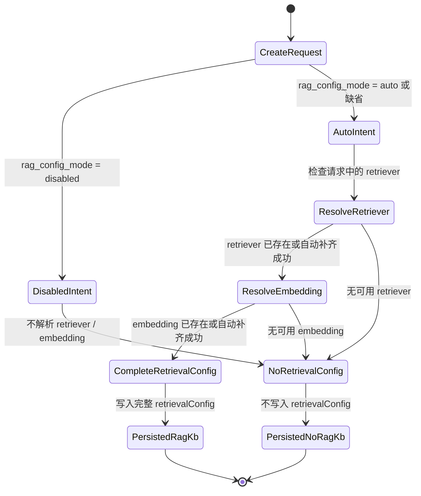
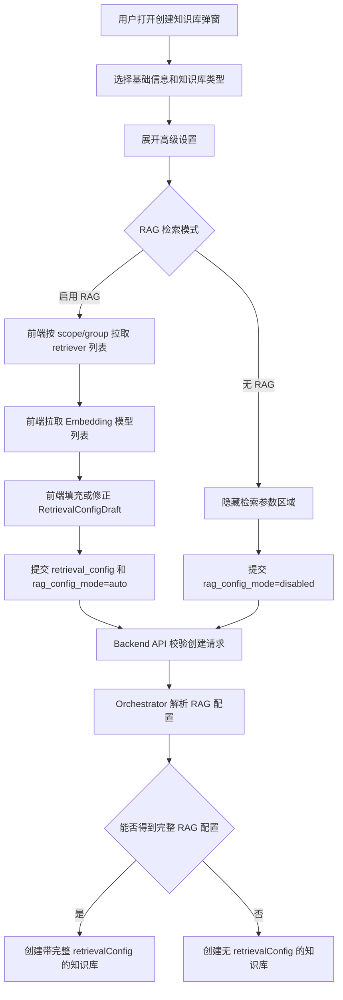

# 知识库 RAG 创建配置模式设计

## 背景

知识库创建链路需要同时支持两类场景：

1. 用户希望创建后立即启用 RAG 检索，系统应自动选择可用的检索器和 Embedding 模型。
2. 用户希望创建无 RAG 知识库，只保存文档和元数据，后续由探索工具读取内容。

过去创建请求和持久化配置共用同一类 `retrievalConfig` 语义，容易产生“只填了部分字段”的中间状态。例如有检索参数但缺少 `retriever_name`，或有检索器但缺少 Embedding 模型。这样的半配置会推迟到索引阶段才暴露问题，导致文档看似创建成功，但实际无法进入 RAG 索引。

当前分支的核心设计是把“创建时意图”和“持久化状态”分离：

- 创建请求允许表达自动配置或无 RAG。
- 创建请求允许携带部分检索参数。
- 后端统一归一化，最终只持久化两种稳定状态：完整 RAG 配置，或没有 RAG 配置。

## 目标

### 功能目标

- 创建知识库时显式支持 `auto` 和 `disabled` 两种 RAG 模式。
- `auto` 模式下自动补齐缺失的检索器和 Embedding 模型。
- `disabled` 模式下创建无 RAG 知识库，不写入 `retrievalConfig`。
- 持久化后的 KnowledgeBase 不再保存半配置的 `retrievalConfig`。
- 前端创建表单提供清晰的“启用 RAG / 无 RAG”选择。

### 工程目标

- 后端在单一入口收敛 RAG 配置解析逻辑。
- 前端区分草稿配置和完整配置，避免用同一个类型表达不同生命周期。
- 文档、类型和测试覆盖新不变量。

## 非目标

- 不改造知识库编辑接口的启用/关闭 RAG 能力。
- 不改变文档上传、转换、索引任务的调度模型。
- 不引入新的检索器选择策略，当前自动选择仍使用现有默认资源发现逻辑。
- 不把 `rag_config_mode` 写入 KnowledgeBase YAML 或持久化 spec。
- 不修复历史已经存在的半配置 `retrievalConfig` 数据。

## 核心概念

### 创建意图

`rag_config_mode` 是创建请求字段，只用于表达本次创建的意图：

| 模式 | 含义 | 持久化结果 |
|------|------|------------|
| `auto` | 自动补齐 RAG 所需核心字段 | 有可用 retriever 和 embedding 时写入完整 `retrievalConfig` |
| `disabled` | 明确创建无 RAG 知识库 | 不写入 `retrievalConfig` |

### 持久化不变量

KnowledgeBase 持久化后的 `spec.retrievalConfig` 只有两种稳定状态：

| 状态 | 说明 |
|------|------|
| 不存在或为空 | 无 RAG 知识库，上传文档不会进入 RAG 索引 |
| 完整对象 | RAG 知识库，必须包含 `retriever_name` 和 `embedding_config.model_name` |

不存在“部分 RAG 配置”的稳定状态。

## 分层架构

```text
+--------------------------------------------------------------+
| 前端创建表单                                                  |
| - RAG 模式选择：启用 RAG / 无 RAG                             |
| - RetrievalConfigDraft：允许未完成的 UI 草稿                  |
| - 根据 scope/group 预取 retriever 和 embedding 列表            |
+-----------------------------+--------------------------------+
                              |
                              | createKnowledgeBase 请求
                              v
+--------------------------------------------------------------+
| Backend API                                                   |
| - KnowledgeBaseCreate                                         |
| - rag_config_mode 是请求意图                                  |
| - retrieval_config 使用创建专用 schema，允许部分字段           |
+-----------------------------+--------------------------------+
                              |
                              | 调用 orchestrator
                              v
+--------------------------------------------------------------+
| KnowledgeOrchestrator                                         |
| - _resolve_retrieval_config                                   |
| - disabled 直接返回 None                                      |
| - auto 补齐 retriever / embedding                             |
| - _build_complete_retrieval_config 输出唯一持久化形态          |
+-----------------------------+--------------------------------+
                              |
                              | 创建 KnowledgeBase
                              v
+--------------------------------------------------------------+
| 持久化 KnowledgeBase spec                                     |
| - 无 retrievalConfig                                          |
| - 或完整 retrievalConfig                                      |
+-----------------------------+--------------------------------+
                              |
                              | 后续上传文档
                              v
+--------------------------------------------------------------+
| 索引阶段                                                      |
| - 无 retrievalConfig：跳过 RAG 索引                            |
| - 完整 retrievalConfig：解析运行时配置并提交索引               |
+--------------------------------------------------------------+
```

## 数据契约

### 创建请求

创建请求新增 `rag_config_mode`：

- 默认值：`auto`
- 可选值：`auto`、`disabled`
- 仅表示创建意图，不进入 KnowledgeBase spec

创建请求中的 `retrieval_config` 使用创建专用结构，允许部分字段为空。这样前端可以只提交用户已调整的检索参数，也可以提交已自动选中的 retriever 和 Embedding 模型。

当前代码中，如果 API 请求包含 `retrieval_config` 对象，`RetrievalConfigCreate` 会先应用自身默认值：`retrieval_mode=vector`、`top_k=5`、`score_threshold=0.5`。如果 API 请求完全不包含 `retrieval_config`，则 orchestrator 会从空字典开始解析，并在构造完整配置时补齐同样的默认值。

前端创建弹窗在 `auto` 模式下总是维护一个 `RetrievalConfigDraft`，默认值是 `retrieval_mode=vector`、`top_k=5`、`score_threshold=0.5` 和 0.7/0.3 的混合检索权重；提交时只要不是 `disabled` 模式，就会把该草稿作为 `retrieval_config` 传给后端。

### 持久化配置

持久化 `RetrievalConfig` 被收紧为完整结构：

| 字段 | 要求 |
|------|------|
| `retriever_name` | 必填，非空字符串 |
| `retriever_namespace` | 可省略，默认 `default` |
| `embedding_config.model_name` | 必填，非空字符串 |
| `embedding_config.model_namespace` | 可省略，默认 `default` |
| `retrieval_mode` | 可省略，默认 `vector` |
| `top_k` | 可省略，orchestrator 构造完整配置时补齐为 `5` |
| `score_threshold` | 可省略，默认 `0.5` |
| `hybrid_weights` | 混合检索时使用 |

## 状态模型



## 创建流程



## 后端设计

### API 层

`KnowledgeBaseCreate` 增加创建意图字段 `rag_config_mode`，并把创建请求的 `retrieval_config` 改为创建专用结构。API 层只负责把请求字段传入 orchestrator，不在 endpoint 中实现配置补齐逻辑。

这样 API 层保持薄入口，真正的 RAG 配置决策集中在业务服务层。

### Schema 层

后端区分两类 schema：

- 创建请求 schema：允许部分字段为空，服务于 UI 草稿和自动补齐。
- 持久化 schema：核心字段必填，表达 KnowledgeBase 的稳定状态。

这个拆分避免了一个 schema 同时承担“输入草稿”和“持久化事实”两种语义。

### Orchestrator 层

`KnowledgeOrchestrator` 新增统一解析函数，职责是把创建输入归一化为最终持久化值：

1. 如果模式是 `disabled`，直接返回空配置。
2. 读取请求中已有的 retriever 和 Embedding 信息。
3. 对缺失的核心字段调用默认资源发现逻辑。
4. 如果 retriever 或 Embedding 任一缺失，返回空配置。
5. 如果两者都存在，构造完整 `retrievalConfig`。

构造完整配置时会补齐 namespace、检索模式、结果数量和分数阈值等默认值。

当前创建函数随后会再次构造一个 `KnowledgeBaseCreate` 对象，把解析后的 `resolved_retrieval_config` 传给 `KnowledgeService.create_knowledge_base`。因此实际写入数据库的仍然是 `KnowledgeService` 根据 `data.retrieval_config` 生成的 `spec.retrievalConfig`，`rag_config_mode` 不参与持久化。

## 前端设计

### 类型模型

前端新增 `RagConfigMode` 和 `RetrievalConfigDraft`：

- `RagConfigMode` 对应创建时的 `auto` / `disabled`。
- `RetrievalConfigDraft` 用于表单草稿，允许 retriever 和 Embedding 尚未选择完成。
- `RetrievalConfig` 用于完整配置，核心字段不再可选。

### 创建弹窗

创建弹窗维护两个关键状态：

- `ragConfigMode`：当前 RAG 模式。
- `retrievalConfig`：当前检索配置草稿。

当模式为 `auto` 时，创建弹窗将检索配置草稿传给 `KnowledgeBaseForm`，由 `RetrievalSettingsSection` 根据当前创建范围获取 retriever 和 Embedding 模型列表，并在当前选择无效或为空时自动填入第一个可用项。当模式为 `disabled` 时，提交请求不携带 `retrieval_config`。

当前默认选择入口已经收敛到检索设置组件和后端兜底两层：前端 `RetrievalSettingsSection` 通过 `useRetrievers` / `useEmbeddingModels` 按资源类型优先级和名称排序后选择第一项；后端 `get_default_retriever` / `get_default_embedding_model` 在 API 调用未带完整配置时取服务返回的第一项。创建弹窗父组件不再重复拉取 retriever 或 Embedding 列表。后端仍是最终兜底来源，因此前端未加载到默认项或提交了半配置时，后端会再次尝试补齐。

### 表单结构

知识库表单调整为分段式结构：

- 基础设置：归属、类型、名称、描述。
- 摘要设置：摘要开关和摘要模型。
- 引导问题：仅 notebook 类型展示。
- 高级设置：调用限制和 RAG 检索模式。

高级设置内部将 RAG 模式选择和检索参数放在同一行组里，减少用户对“跳过检索配置”和“无 RAG”的歧义。

### 编辑弹窗

当前分支没有为编辑弹窗增加 RAG 启用/关闭模式。编辑弹窗的变化主要是类型和布局对齐：

- `retrievalConfig` 状态改用 `RetrievalConfigDraft`。
- 只有知识库已有 `retrieval_config` 时才展示检索设置。
- 检索器和 Embedding 模型仍通过 `partialReadOnly` 保持只读。
- 保存时只提交 `retrieval_mode`、`top_k`、`score_threshold`、`hybrid_weights` 这些可更新字段。

因此，无 RAG 知识库不能通过当前编辑弹窗直接启用 RAG；已有 RAG 知识库也不能通过编辑弹窗关闭 RAG。

## 索引行为

文档上传后的索引阶段仍以持久化 `retrievalConfig` 为准：

- 如果知识库没有 `retrievalConfig`，索引阶段跳过 RAG 索引。
- 如果知识库有完整 `retrievalConfig`，索引阶段使用其中的 retriever 和 Embedding 模型解析运行时配置。

因此创建时的 `rag_config_mode` 不需要在索引阶段再次出现。索引阶段只关心持久化事实，而不是创建意图。

## 测试覆盖

当前分支增加了 orchestrator 层单元测试，覆盖以下场景：

- 显式传入部分配置时，后端补齐缺失 retriever。
- 完全不传配置时，`auto` 模式自动选择默认 retriever 和 Embedding。
- 默认资源不可用时，创建无 RAG 配置。
- `disabled` 模式不触发默认资源查询。
- 显式完整配置不会再次触发自动选择。

这些测试重点验证后端不变量：创建结果只能是完整配置或无配置。

## 兼容性与迁移

### API 兼容性

未传 `rag_config_mode` 的旧请求默认按 `auto` 处理。旧客户端如果仍传完整 `retrieval_config`，后端会保留核心字段，并补齐缺省值。

旧客户端如果传入半配置，请求仍可被接受，但最终持久化时会被后端补齐；无法补齐时转为无 RAG 配置。

### 数据兼容性

当前改动不包含历史数据迁移。为避免历史半配置直接打挂响应模型，`KnowledgeBaseResponse.from_kind()` 会在构造响应前归一化 `spec.retrievalConfig`：只有同时存在 `retriever_name` 和 `embedding_config.model_name` 时才保留该配置；如果缺少任一核心字段，会记录 warning，并在响应中返回 `retrieval_config=None`。

这属于响应层容错，不会修复数据库中的历史数据。下游索引和运行时解析仍以持久化 `spec.retrievalConfig` 为准；如果某条历史半配置绕过响应层并直接进入运行时解析，仍会被视为不完整配置并报错或跳过 RAG 行为。该分支主要保证新创建知识库不再产生新的半配置，并保证列表、详情等响应不会因为历史半配置失败。

### 部署配置

当前分支还移除了 `docker-compose.yml` 中 frontend 服务的 `working_dir: /app`。这是独立于 RAG 配置模式的容器启动修正，不参与知识库配置链路。

## 风险与待确认点

### 创建时成员授权入口

当前分支中，创建弹窗不再提交初始成员列表；后端创建接口仍保留 `members` 字段和添加初始成员的逻辑。这是产品需求：创建时不再提供初始成员授权入口，成员授权由后续权限管理流程承接。

### 默认分数阈值一致性

创建请求 schema、orchestrator、前端创建弹窗、检索设置和运行时 fallback 当前都使用 `0.5` 作为默认 `score_threshold`。后续如果调整默认值，应同步修改这些入口，避免 API 客户端因是否传入 `retrieval_config` 对象而得到不同阈值。

### 历史半配置读取行为

持久化响应模型要求 `retriever_name` 和 `embedding_config.model_name` 必填。当前分支只采用响应层容错策略：不完整 `retrievalConfig` 在响应中被过滤为 `None`，不会导致列表、详情或创建后回读的模型校验失败。该策略不修改历史数据，也不补齐缺失 retriever 或 Embedding，因此历史半配置知识库在 UI 上会表现为无 RAG 配置。

如果后续希望历史数据恢复可检索能力，需要另行补充数据清理或迁移脚本；这不属于当前分支的代码行为。

### 前后端默认选择一致性

前端默认选择只保留在 `RetrievalSettingsSection` 中，创建弹窗父组件不再重复拉取资源列表。后端仍会在缺失时选择默认资源，用于兜底 API/MCP 调用。两端依赖的排序和资源过滤仍需要保持一致，否则用户看到的默认项可能与后端补齐结果不同。

### 无默认资源时的用户反馈

`auto` 模式下如果系统没有可用 retriever 或 Embedding，后端会创建无 RAG 知识库。该行为保证创建不中断，但用户可能以为已经启用 RAG。后续可以考虑在前端提前提示“当前环境无可用 RAG 资源，将创建无 RAG 知识库”。

## 结论

当前分支通过 `rag_config_mode`、创建专用 retrieval config schema 和 orchestrator 归一化逻辑，把知识库创建链路从“允许半配置流入持久化”调整为“请求可宽松、落库必须稳定”。这使索引阶段的判断更简单，也让无 RAG 知识库成为显式能力，而不是依赖用户跳过配置形成的隐式结果。
