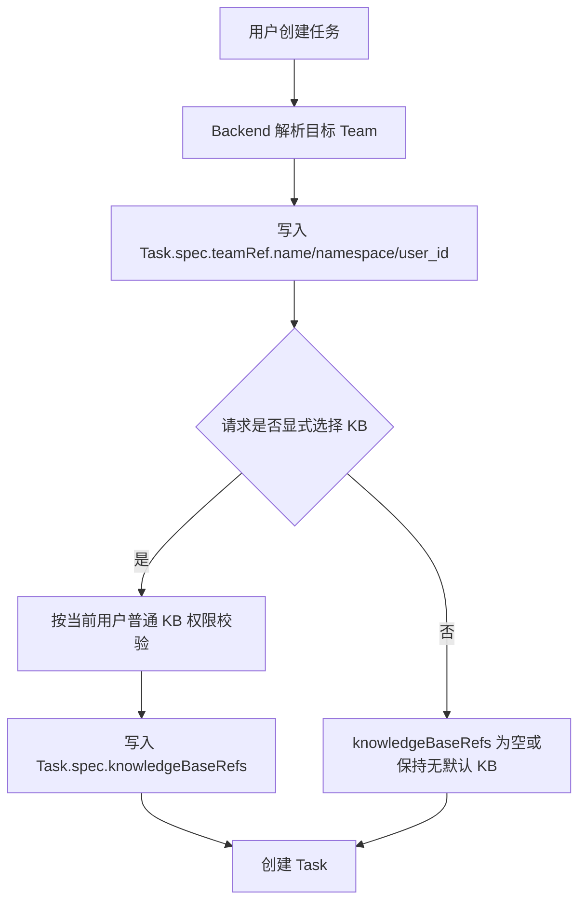
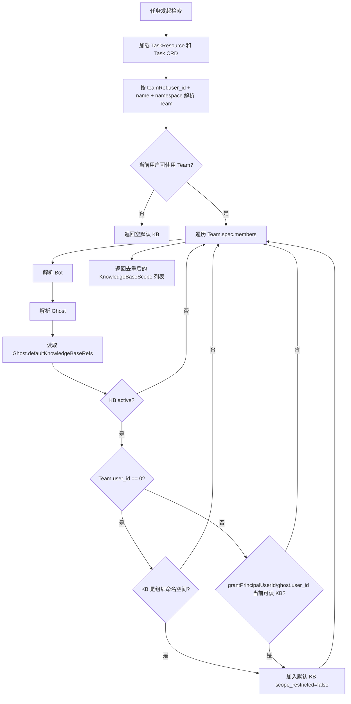
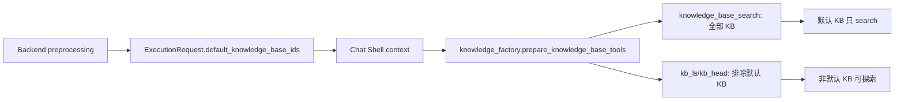
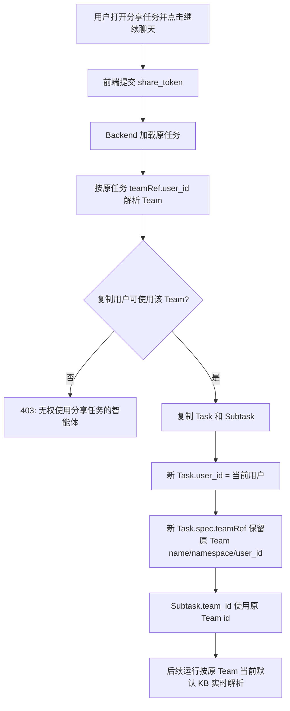
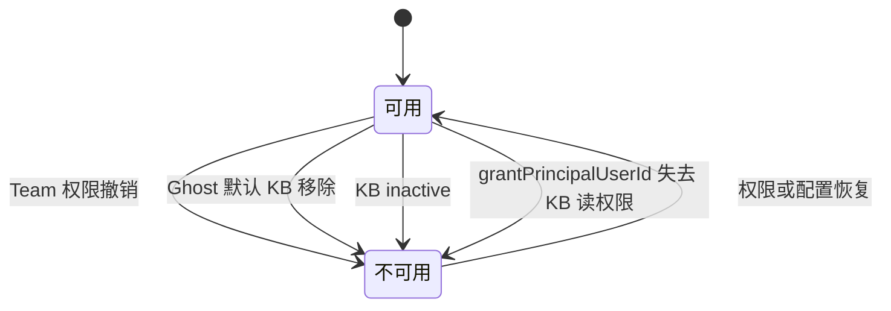

# 智能体默认知识库任务作用域权限改造实现设计

## 1. 背景

当前分支把“智能体默认知识库”的授权模型从“创建任务时写入任务绑定知识库”调整为“任务运行时根据任务所用智能体实时解析”。这次改造的核心目标是：

- 智能体可以配置默认知识库，用户在使用该智能体执行任务时可以获得任务内检索能力。
- 默认知识库不写入 `Task.spec.knowledgeBaseRefs`，避免被普通任务绑定知识库逻辑放大成用户的全局知识库可见/管理权限。
- 默认知识库权限随当前智能体配置、当前智能体使用权限、KB active 状态、授权主体读权限实时变化。
- 跨用户复制分享任务时不再替换智能体，复制后的任务继续指向原任务智能体，并按原智能体当前默认知识库实时计算。

本文只描述当前分支代码实际实现。

## 2. 术语和判定规则

| 概念 | 当前实现中的判定 |
| --- | --- |
| 智能体 | 代码中的 `Team`，前端中文显示为“智能体” |
| Bot | `Team.spec.members[].botRef` 指向的机器人 |
| Ghost | Bot 的提示词与工具配置，默认知识库配置在 `Ghost.spec.defaultKnowledgeBaseRefs` |
| 任务绑定知识库 | `Task.spec.knowledgeBaseRefs` / `Task.spec.knowledgeBaseScopes`，只服务用户显式选择 KB 和 OpenAPI scoped knowledge |
| 默认知识库 | `Ghost.spec.defaultKnowledgeBaseRefs`，任务运行时按当前 Team 聚合 |
| 公共智能体 | `team.user_id == 0` |
| 公司/组织知识库 | `is_organization_namespace(db, kb.namespace)` 返回真 |
| 授权主体 | `KnowledgeBaseDefaultRef.grantPrincipalUserId`，缺失时运行时 fallback 到 `ghost.user_id` |

## 3. 最终产品规则

1. 用户显式选择的知识库仍写入 `Task.spec.knowledgeBaseRefs`，并按用户普通 KB 权限校验。
2. OpenAPI scoped knowledge 仍写入 `Task.spec.knowledgeBaseScopes`，并按 scope 裁剪检索范围。
3. 智能体默认知识库不写入 `Task.spec.knowledgeBaseRefs` 或 `Task.spec.knowledgeBaseScopes`。
4. 每次任务运行时，Backend 根据 `Task.spec.teamRef` 解析当前智能体，再聚合 Team members 对应 Ghost 的 `defaultKnowledgeBaseRefs`。
5. 普通/团队智能体默认 KB 的运行时可用条件：
   - 当前任务存在且可解析到 Team。
   - 当前用户可以使用该 Team：Team owner、公共 Team，或通过 Team ResourceMember 授权。
   - KB 是 active 的 `KnowledgeBase`。
   - `grantPrincipalUserId` 当前仍能通过普通知识库权限读该 KB；如果字段为空，则 fallback 到 `ghost.user_id`。
6. 公共智能体默认 KB 的运行时可用条件：
   - Team 是公共智能体，即 `team.user_id == 0`。
   - KB 是 active 的组织/公司知识库。
   - 不要求当前用户单独拥有该 KB 的个人授权，因为公司知识库本身全员可见。
7. 默认 KB 在任务内只提供检索能力，不提供 `kb_ls` / `kb_head` 这类列文档或读取文档片段的探索能力。
8. 分享任务复制后继续使用原任务智能体，不允许前端选择替换智能体；如果复制用户没有原智能体使用权限，复制失败。
9. 历史任务里已经写入的 `knowledgeBaseRefs` 不在本次实现中迁移或清理，仍按普通任务绑定知识库处理。

## 4. 分层架构

```text
前端层
  TaskShareHandler
    - 分享任务复制弹窗
    - 不再请求/选择目标智能体
    - 只提交 share_token 和代码任务的仓库/分支信息

Backend API 层
  /tasks/share/join
    - 接收复制请求
    - team_id 字段保留为 deprecated，但不用于替换智能体

Backend 业务层
  SharedTaskService
    - 复制任务时解析原任务 teamRef.user_id
    - 校验复制用户是否能使用原智能体
    - 新任务保留原 Team 引用

  BotKindsService / admin public_bots
    - 保存默认 KB 配置
    - 普通/团队 Bot 写入 grantPrincipalUserId
    - 公共 Bot 只允许绑定组织知识库

  task_default_knowledge_bases
    - 创建任务时只写显式 KB
    - 运行时解析 Team -> Bot -> Ghost 默认 KB
    - 输出 KnowledgeBaseScope(scope_restricted=false)

  chat preprocessing contexts
    - 合并显式/scoped KB 与运行时默认 KB
    - 对非默认 KB 计算当前用户普通 KB 工具访问模式
    - 将 default_knowledge_base_ids 放入工具和 ExecutionRequest

Chat Shell 层
  knowledge_factory
    - search 工具接收全部 KB
    - kb_ls/kb_head 只接收非默认 KB

  KnowledgeBaseTool
    - 默认 KB 存在时忽略模型传入的 document_ids/document_names

Shared 模型层
  KnowledgeBaseToolsResult / ExecutionRequest / openai_converter
    - 传递 default_knowledge_base_ids
```

## 5. 数据模型变化

### 5.1 KnowledgeBaseDefaultRef

`backend/app/schemas/kind.py` 的 `KnowledgeBaseDefaultRef` 新增：

| 字段 | 含义 |
| --- | --- |
| `grantPrincipalUserId` | 保存/更新默认 KB 的授权主体用户 ID，用于普通/团队智能体运行时校验该主体当前是否仍可读 KB |

普通/团队 Bot 保存时由 Backend 写入该字段，前端传入值不作为最终可信来源。更新时如果同一个 KB 已存在旧授权主体，则保留旧值；新增或替换 KB 时使用当前编辑者。

公共智能体路径不依赖该字段。公共 Bot 的 Ghost 归属是 `user_id=0`，运行时只允许组织 KB，因此不会用 `grantPrincipalUserId` 去校验系统用户 0 的知识库权限。

### 5.2 Task.spec.teamRef.user_id

当前分支要求新建任务路径补齐 `teamRef.user_id`，用来区分跨用户共享智能体和同名智能体。已覆盖的创建路径包括：

- 常规 runtime work 创建任务。
- background chat executor 创建任务。
- template instantiation 创建任务。
- 分享任务复制。

运行时解析 Team 时优先使用 `task.spec.teamRef.user_id`，缺失时 fallback 到 `task.user_id`。

### 5.3 default_knowledge_base_ids

`shared.models` 新增 `default_knowledge_base_ids` 传递链路：

- `KnowledgeBaseToolsResult.default_knowledge_base_ids`
- `ExecutionRequest.default_knowledge_base_ids`
- OpenAI converter metadata round-trip

该字段不表达普通 KB 权限，只用于让 Chat Shell 知道哪些 KB 来自默认 KB 路径，从而过滤 list/head 类工具和忽略定向文档过滤。

## 6. 任务创建流程

创建任务时只处理用户显式选择的 KB，不读取 Ghost 默认 KB。



这个流程的关键点是：Ghost 默认 KB 不参与创建时写入，因此 `_source_group_chat_binding` 继续可以从 `Task.spec.knowledgeBaseRefs` 推导普通 Reporter 权限，但只会覆盖显式绑定 KB，不会覆盖默认 KB。

## 7. 运行时默认 KB 解析流程

运行时由 `get_task_default_knowledge_base_scopes(db, task_id, user_id)` 负责聚合默认 KB。



默认 KB 输出为 `KnowledgeBaseScope(scope_restricted=false, document_ids=[])`。这表示它可以参与全文检索，不使用任务 scope 裁剪。

## 8. 显式 KB、scoped KB 与默认 KB 的合并

Backend preprocessing 的合并顺序：

1. 如果当前 subtask 有显式 KB context，则先构造 subtask-level scope。
2. 否则读取 task-level `knowledgeBaseRefs/knowledgeBaseScopes`。
3. 只要存在 `task_id`，再追加运行时默认 KB scope。
4. `knowledge_base_ids` 来自合并后的 scope 列表。
5. `default_knowledge_base_ids` 单独记录默认 KB ID 集合。
6. `kb_tool_access_mode` 只对非默认 KB 计算当前用户普通权限；默认 KB 不因为当前用户没有普通 KB 权限而降级。

当前实现的同 KB 合并规则是：如果某个 KB 同时出现在默认 KB 和显式/scoped KB 中，显式/scoped scope 会覆盖默认 scope。也就是说，当前代码会让显式或 OpenAPI scoped 的文档范围对同一个 KB 生效，而不是默认 KB 优先覆盖 scope。

这个规则来自 `_merge_knowledge_base_scopes(default_scopes, requested_scopes)`：先放默认 scope，再用 requested scope 按 KB ID 覆盖。

同时，`kb_tool_access_mode` 的普通权限检查会排除 `default_knowledge_base_ids` 中的 KB。因此当同一个 KB 同时来自默认路径和显式/scoped 路径时，当前实现会把它视为默认 KB 子集，不再额外按当前用户普通 KB 权限降级工具访问模式。

## 9. Chat Shell 工具暴露

Backend 把合并后的 KB 信息传给 Chat Shell：

```text
knowledge_base_ids            = 默认 KB + 显式 KB + scoped KB
knowledge_base_scopes         = 每个 KB 的 scope 信息
default_knowledge_base_ids    = 默认 KB ID 子集
```

Chat Shell 工具创建规则：

- `knowledge_base_search` 接收全部 `knowledge_base_ids`，因此默认 KB 可以参与 RAG search。
- `kb_ls` / `kb_head` 只接收排除默认 KB 后的 `exploration_knowledge_base_ids`。
- 如果本轮只有默认 KB，工具集只有 search，没有 list/head。
- 如果存在默认 KB 且模型传入 `document_ids` 或 `document_names`，`KnowledgeBaseTool` 会忽略这些定向过滤，避免把默认 KB search-only 变成文档定向读取。该判断当前是工具级全局判断，不区分过滤目标属于默认 KB 还是非默认 KB。



## 10. 分享任务复制

分享任务复制的行为改为保留原智能体，不再让用户选择新智能体。



前端 `TaskShareHandler` 已移除：

- Team 列表请求。
- 目标智能体选择。
- 模型覆盖选择。
- `team_id`、`model_id`、`force_override_bot_model` 参数提交。

代码任务复制仍保留仓库和分支选择，因为复制后的任务归属当前用户，代码工作区必须使用当前用户可访问的仓库。

## 11. 公共智能体默认 KB

公共智能体的判定是 `team.user_id == 0`。当前实现对公共 Bot 的默认 KB 做保存时和运行时双重约束：

- 保存公共 Bot 时，`defaultKnowledgeBaseRefs` 中的 KB 必须是 active 的组织/公司知识库。
- 运行时如果公共智能体配置中出现非组织 KB，默认 KB resolver 会直接跳过。

这个路径下“用户看不到默认 KB”的目标不适用。公司知识库本来就是全员可见，公共智能体默认 KB 的价值是自动注入检索，而不是隐藏授权。

## 12. 权限状态变化

普通/团队智能体默认 KB 是实时授权，不是任务创建时快照。



因此历史任务不会因为创建时曾经能用默认 KB 而永久保留权限；也会因为智能体后续新增默认 KB，而在下一次运行时自动获得新的默认 KB 检索能力。

## 13. 当前实现不处理的范围

1. 不迁移历史任务中已写入 `Task.spec.knowledgeBaseRefs` 的默认 KB。
2. 不改变 `_source_group_chat_binding` 从 `Task.spec.knowledgeBaseRefs` 推导普通 Reporter 权限的现有行为。
3. 不提供默认 KB 的文件下载、文档列表、文档定向读取能力。
4. 不新增 Team visibility 或 KB is_public 字段，继续使用 `team.user_id == 0` 与 namespace 判定。
5. 不在 Knowledge Runtime 内重新解析任务权限；权限裁剪在 Backend preprocessing 和 Chat Shell 工具构造层完成。

## 14. 测试覆盖

当前分支新增或调整的测试覆盖了以下场景：

- 创建任务时只写用户显式 KB，不写智能体默认 KB。
- 运行时默认 KB 从当前 Team/Ghost 配置解析。
- 当前用户没有 Team 使用权限时，默认 KB 不可用。
- 公共智能体绑定组织 KB 可用，绑定个人私有 KB 被拒或运行时跳过。
- 普通/团队 Bot 保存默认 KB 时写入 `grantPrincipalUserId`。
- 群组 Bot 默认 KB 限定为当前群组或组织 KB。
- 分享任务复制保留原 Team 引用和 Subtask team_id。
- Chat Shell 只有默认 KB 时只创建 search 工具。
- 默认 KB 被排除出 `kb_ls` / `kb_head`。
- 默认 KB search-only 路径忽略模型传入的 document filters。
- `ExecutionRequest.default_knowledge_base_ids` 在 OpenAI converter 中 round-trip。

已执行的相关验证：

- Backend 相关测试：47 passed。
- Chat Shell 相关测试：27 passed。
- Shared 相关测试：9 passed。
- Frontend lint 通过，只有仓库既有 warning。

## 15. 文档方案自审

### 15.1 与代码一致性

当前文档与代码一致的关键点：

- 默认 KB 不在创建任务时写入 `knowledgeBaseRefs`。
- 运行时按 `teamRef.user_id` 解析 Team。
- 普通/团队默认 KB 通过 `grantPrincipalUserId` 或 `ghost.user_id` 校验当前读权限。
- 公共智能体只允许组织 KB。
- Chat Shell search 使用全部 KB，list/head 排除默认 KB。
- 分享复制前端不再选择智能体，后端保留原 Team。

### 15.2 设计风险和待确认点

1. **同 KB 合并优先级可能与“默认 KB 不被 scope 收窄”的产品期望不同。**
   当前代码是显式/scoped scope 覆盖默认 scope；如果期望同一个 KB 只要是默认 KB 就整库检索，则需要调整 `_merge_knowledge_base_scopes` 为默认 scope 优先。并且，因为普通权限检查会排除 `default_knowledge_base_ids`，同 KB 混合来源时也不会对显式/scoped 路径额外做用户普通 KB 工具权限降级。本文按当前代码记录，不在文档中伪造默认优先语义。

2. **默认 KB 存在时 document filters 的忽略粒度偏粗。**
   当前 `KnowledgeBaseTool` 只要发现本轮存在默认 KB，就会忽略模型传入的 `document_ids/document_names`。这能保证默认 KB search-only，但在“默认 KB + 非默认 KB”混合请求中，也会让本可用于非默认 KB 的定向过滤失效。如果后续需要更细粒度能力，需要在请求中表达过滤目标 KB 或拆分工具。

3. **运行时默认 KB 解析没有显式缓存。**
   每次 preprocessing 会读取 Task、Team、Bot、Ghost、KB 和权限。当前实现简单直接，适合当前阶段；如果 Team members 多或消息频率高，可以按 Team/Ghost 更新时间增加短期缓存。

4. **`/share/join` 后端 schema 仍保留 `team_id/model_id/force_override_bot_model` 兼容字段。**
   前端已不再传这些字段；后端仍支持模型覆盖标签写入。若产品要彻底禁止复制时模型覆盖，后端也应忽略或拒绝这些字段。

5. **历史数据不会清理。**
   存量任务里已经存在的默认 KB refs 仍可能被普通任务绑定权限源识别。本次按“不处理历史数据”执行。

6. **默认 KB 的 active 文档范围依赖 RAG 层现有检索能力。**
   默认 KB 不提供未索引文件下载；未索引的大文件不会通过默认 KB search 命中，需要文档状态或前端提示解释。

### 15.3 结论

当前实现满足本次改造主目标：默认 KB 不再通过 Task refs 放大成普通 KB 权限，任务运行时按当前智能体配置和权限实时计算，并通过 Chat Shell 工具层限制默认 KB 为 search-only。文档中已明确记录当前实现的合并优先级、兼容字段和历史数据边界，避免实现者按更复杂或不同的模型重新发明。
