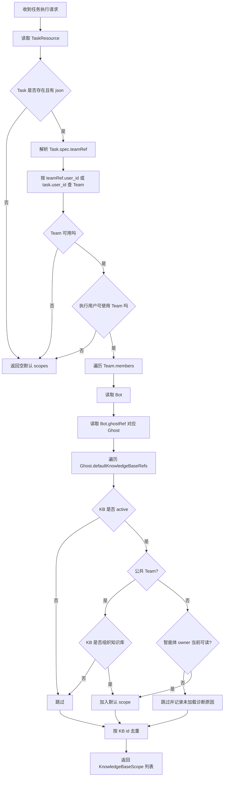
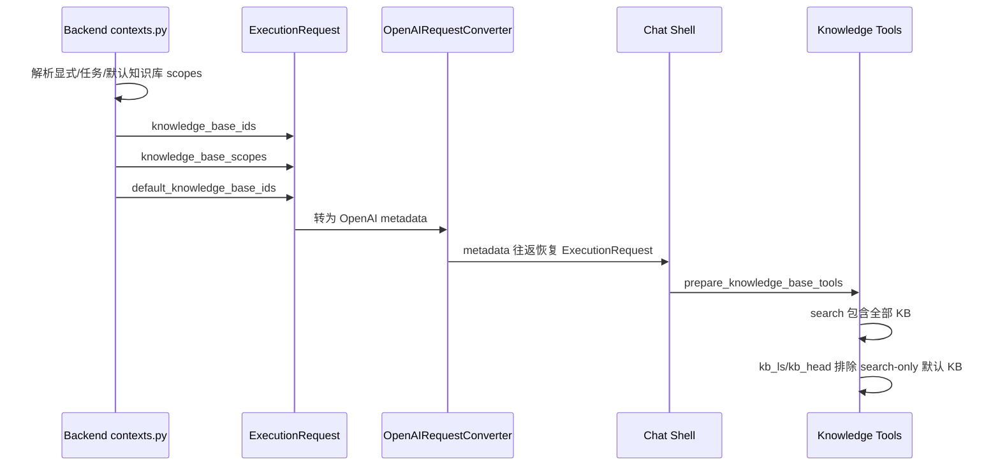
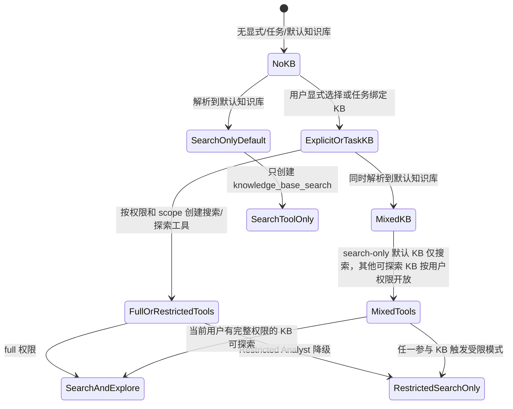

# 智能体默认知识库任务作用域权限实现设计

## 背景

当前分支围绕“智能体默认知识库在任务作用域内如何生效”做了权限和运行时链路调整。旧行为容易把智能体 Ghost 上配置的默认知识库在任务创建时复制到 `Task.spec.knowledgeBaseRefs`，后续任务执行只看任务快照，无法准确反映智能体默认知识库的最新配置，也容易把默认知识库误当成用户在某次任务中显式绑定的知识库。

本方案将默认知识库从“任务持久绑定”改为“运行时解析”：

- 任务创建或任务级 API 显式绑定的知识库仍写入 `Task.spec.knowledgeBaseRefs`；当前消息临时选择的知识库仍保存在 `SubtaskContext`。
- 智能体 Ghost 的默认知识库保留在 `Ghost.spec.defaultKnowledgeBaseRefs`。
- 任务执行时根据 `Task.spec.teamRef` 找到当前智能体，先校验执行用户是否可使用该 Team；普通智能体默认知识库按智能体资源 owner 的当前权限确认是否可用，公共智能体只允许组织知识库。
- 默认知识库先按智能体 owner 判定是否可生效；生效后工具能力按当前执行用户对该知识库的权限决定，当前用户无完整权限时才降级为只搜索。
- 分享任务复制后继续使用原任务智能体，复制者必须有该智能体使用权限。

## 方案改动范围

相对 `wecode-ai/main`，本方案涉及的主要改动如下：

| 模块 | 主要变化 |
| --- | --- |
| Backend 默认知识库解析 | 新增运行时默认知识库 scope 解析，任务创建不再自动固化 Ghost 默认知识库 |
| Backend Team/Bot 保存 | 默认知识库只能在明确 Team 编辑上下文中保存，保存时同时校验编辑者可读和 Team owner 可读；运行时授权不依赖绑定编辑者，而按智能体资源 owner 当前权限判定 |
| Backend 公共资源 | 公共 Bot、公共 Ghost 以及 public Bot raw JSON 引用已有 Ghost 的路径都会校验默认知识库只能来自组织知识库 |
| Backend Task / Team 引用 | 默认知识库解析、任务复制、任务校验、任务列表、任务成员和任务技能解析等路径补充 `teamRef.user_id` 作为跨用户智能体归属依据 |
| Backend 分享任务 | 复制分享任务时保留原智能体，不再让复制者选择自己的智能体 |
| Chat Shell | ExecutionRequest 透传 `default_knowledge_base_ids`，标记当前用户不可探索的默认知识库；当前用户有完整权限的默认知识库保留正常探索工具 |
| Frontend 分享任务 | 移除智能体和模型选择器，仅保留代码任务仓库/分支选择和原智能体权限提示 |
| Tests | 覆盖默认知识库运行时解析、公共 Bot 已接入保存路径限制、分享任务复制、OpenAI request 往返透传等 |

## 目标语义

本次设计把知识库来源拆成三类，避免权限和交互语义混在一起。

| 来源 | 存储位置 | 谁配置 | 运行时语义 | 工具能力 |
| --- | --- | --- | --- | --- |
| 用户本次消息显式选择 | `SubtaskContext` | 当前发送消息的用户 | 严格模式，优先级最高 | 搜索，可按 scoped 文档限制 |
| 任务级显式绑定 | `Task.spec.knowledgeBaseRefs` / OpenAPI scope refs | 创建任务或 OpenAPI 调用者 | 任务继承知识库，优先级低于本次消息选择 | 搜索；非受限时可探索 |
| 智能体默认知识库 | `Ghost.spec.defaultKnowledgeBaseRefs` | Bot/Ghost 编辑者或管理员 | 每次执行时从当前智能体配置解析，普通智能体按智能体 owner 权限生效；工具能力再按当前执行用户权限判定 | 当前用户有完整权限时可搜索和探索；否则仅搜索，不允许文档级探索过滤 |

## 分层架构

```text
Frontend
  TaskShareHandler
    - 分享任务复制时不再选择智能体/模型
    - 代码任务仍要求选择仓库和分支

Backend API
  adapter/tasks.py
    - join_shared_task 直接转发 team_id（已废弃）
    - 不再强制复制者拥有自己的 Team

Backend Domain Services
  BotKindsService / public_bots.py
    - 保存默认知识库引用
    - 要求默认知识库保存请求带有明确 Team 编辑上下文
    - 校验编辑者和上下文 Team owner 都可读，但不把编辑者作为运行时授权主体
    - 校验个人/群组/公共智能体默认知识库范围

  public_resource_validation.py / public_ghosts.py
    - 统一校验公共资源默认知识库范围
    - public Ghost create/update 只允许组织知识库
    - public Bot raw JSON 引用已有 Ghost 时递归校验 Ghost 默认知识库

  SharedTaskService / TaskKindService
    - 通过 teamRef.user_id 找到原智能体
    - 校验当前用户是否能使用该智能体
    - 复制任务时保留原 teamRef

  task_default_knowledge_bases.py
    - 执行时解析 Team -> Bot -> Ghost -> defaultKnowledgeBaseRefs
    - 过滤无效、不可读、公共智能体不允许的默认知识库
    - 输出 KnowledgeBaseScope

Chat Preprocessing
  contexts.py
    - 合并显式选择、任务绑定、默认知识库 scopes
    - 将默认知识库 id 单独放入 default_knowledge_base_ids
    - 对所有实际参与的知识库计算 restricted_search_only；同时单独标记当前用户不可探索的默认知识库

Execution Request Boundary
  shared/models/execution.py
  shared/models/openai_converter.py
    - 在 Backend 与 Chat Shell 之间透传 default_knowledge_base_ids

Chat Shell
  knowledge_factory.py
  KnowledgeBaseTool
    - 所有 KB 仍进入 knowledge_base_search
    - 当前用户不可探索的默认知识库从 kb_ls / kb_head 探索集合中排除
    - 只有本次工具配置全是 search-only default KB 时才忽略 per-call document filters
    - 混合 search-only default KB 和可探索 KB 时拆分检索，可探索 KB 保留 filters
```

## 保存时权限设计

### 智能体 owner 定义

本文里的“智能体 owner”指当前任务通过 `Task.spec.teamRef` 解析到的 Team 资源 owner，也就是 Team 对应 `Kind.user_id` 所代表的单个资源 owner。Bot/Ghost 是 Team 的组成资源，不作为默认知识库运行时授权的独立 owner 来源。

群组 `Namespace` 可能有多个 `Owner` 角色成员，也有一个 `Namespace.owner_user_id` 主 owner。默认知识库运行时不采用“任一群组 Owner 有权限即通过”的规则，避免权限边界随群组角色成员变化而变得不可审计。普通智能体的默认知识库能力应跟随智能体资源 owner 的能力边界。

默认知识库是智能体的当前能力，不是历史授权快照。Team owner 发生变更或资源归属被转移后，旧任务下一次执行应按新的 Team owner 权限重新解析默认知识库；新 owner 无权读取的默认知识库不再生效。

### 普通用户和群组智能体

默认知识库配置实际存储在 `Ghost.spec.defaultKnowledgeBaseRefs`，但保存时的授权主体来自当前编辑上下文中的 Team。因此默认知识库保存请求必须带有明确的 Team 编辑上下文，例如 Team 编辑页保存 leader Bot 配置、或 Bot 保存 API 显式传入当前 Team 上下文。纯 Bot/Ghost 独立编辑入口如果无法确定当前编辑所服务的 Team，不允许修改默认知识库。

共享 Ghost/Bot 场景继续允许存在，本期不在保存时枚举或校验所有引用方。保存时只校验当前 Team 编辑上下文下的编辑者和 Team owner；同一个 Ghost/Bot 被其他 Team 复用时，跨 Team 的 owner 权限差异由运行时按当前任务 Team owner 逐个过滤默认 KB。这个取舍不会扩大权限，但可能导致“配置存在，某些 Team 使用时部分默认 KB 不可用”的体验。

`BotKindsService` 在 Team 编辑上下文中创建或更新 Bot 默认知识库时会规范化 `default_knowledge_base_refs`：

1. 如果没有传入默认知识库，保存为空数组。
2. 对每个引用校验编辑者是否能读取该知识库。
3. 群组 Bot 只能绑定当前群组知识库或组织知识库。
4. 对每个引用校验当前 Team 上下文的 Team owner 是否也能读取该知识库。

保存阶段保证“配置者可见”和“当前 Team owner 可用”同时成立。非 owner 编辑者可以维护智能体默认知识库，但不能把 Team owner 无权访问的知识库保存为默认知识库。这样配置页保存成功就代表默认知识库在当前 owner 权限下可运行，避免“配置成功但运行时必然不生效”的体验。

运行时仍然按智能体 owner 当前权限再次校验。这个运行时校验用于覆盖保存后发生的权限撤销、知识库迁移、owner 变更等状态变化，不用于给绑定编辑者权限兜底。

因此不再保留“绑定编辑者授权主体”字段。默认知识库配置只记录知识库 `id/name`，运行时授权完全来自当前任务 Team owner 的实时权限，不再保存或读取绑定编辑者身份。

### 公共智能体

公共 Bot 的默认知识库限制更严格：只能绑定组织知识库。这里的“组织知识库”不仅是 namespace 归属判断，也代表可被公共智能体使用的组织级治理安全域。

原因是公共智能体可被更广泛的用户使用，如果允许绑定个人或普通群组知识库，会把私有知识库引用挂到公共资源上。当前代码通过 `public_resource_validation.py` 统一校验公共资源默认知识库引用：

- public Bot 表单创建、表单更新 `default_knowledge_base_refs`、以及创建或更新 public Bot 时同步创建/更新 Ghost 默认知识库字段的路径会拒绝非组织知识库。
- `admin/public-ghosts` 创建或更新 public Ghost 时会校验 `ghost_json.spec.defaultKnowledgeBaseRefs`。
- public Bot raw JSON 模式会校验 `ghostRef` 指向的已有 public Ghost，并递归校验该 Ghost 的默认知识库。
- 如果 raw JSON 自身携带内嵌 `spec.ghost.defaultKnowledgeBaseRefs`，也会按同一条组织知识库规则校验。

公共智能体默认知识库不依赖创建者、编辑者或使用者的个人权限。若未来组织 namespace 内引入“仅部分成员可用”的受限知识库，仅靠 namespace 判断就不够，需要额外的可公共使用标记或治理审批状态，避免把组织内受限 KB 暴露给公共智能体。

## 运行时解析流程

运行时默认知识库解析入口是 `get_task_default_knowledge_base_scopes(db, task_id, user_id)`。



默认知识库 scope 当前全部是：

- `scope_restricted=false`
- `document_ids=[]`

也就是说默认知识库以整库搜索方式加入当前请求，不表达“只允许某几个文档”的限制。

非公共 Team 中，如果某个默认知识库对当前任务 Team owner 不可读，该 KB 会被跳过，不进入本轮 `KnowledgeBaseScope`，同时生成“部分默认知识库未加载”的诊断原因。共享 Ghost/Bot 下不同 Team 的 owner 权限不同，因此同一份 Ghost 默认知识库配置在不同 Team 的任务中可能得到不同的运行时过滤结果。

## 知识库优先级和合并

`_prepare_kb_tools_from_contexts` 的优先级仍分两段：

1. 如果当前消息显式选择了知识库，使用本次消息的 `SubtaskContext` 作为基础知识库集合。
2. 否则使用任务级绑定知识库或 task-level scoped refs。

在上述基础集合之后，运行时默认知识库总是尝试追加。合并规则是：

- 默认知识库先进入 map。
- 显式选择或任务绑定 scope 后写入同一个 map。
- 如果同一个知识库同时来自默认和显式来源，显式 scope 覆盖默认 scope。
- `default_knowledge_base_ids` 只记录合并后仍需按 search-only 默认知识库处理的 KB id；如果同一个 KB 也来自显式选择或任务绑定，或当前执行用户对该默认 KB 有完整权限，该 id 会从 `default_knowledge_base_ids` 中剔除。

这意味着默认知识库不是最高优先级，它只是运行时补充项。用户显式选择同一个知识库且带 scoped 文档限制时，以用户显式选择为准。

## 工具能力设计

知识库工具分成搜索工具和探索工具：

| 工具 | 作用 | 默认知识库是否可用 |
| --- | --- | --- |
| `knowledge_base_search` | 按 query 检索知识库 | 可用 |
| `kb_ls` | 列出知识库文档/目录 | 当前执行用户有完整权限时可用 |
| `kb_head` | 读取文档开头内容 | 当前执行用户有完整权限时可用 |

Chat Shell 创建工具时，会把所有 `knowledge_base_ids` 传给 `KnowledgeBaseTool`，因此默认知识库能被搜索。同时它会根据 `default_knowledge_base_ids` 构造 exploration 集合，只把当前执行用户不可探索的默认知识库从 `kb_ls` / `kb_head` 的候选里排除。

如果当前请求只有 search-only 默认知识库，没有任何可探索知识库，则只创建 `knowledge_base_search`。

`KnowledgeBaseTool` 只有在本次 search 工具配置的 KB 全部都是 search-only default KB，且模型传入 `document_ids` 或 `document_names` 时，才会忽略这些 per-call filters，避免模型借不可探索默认知识库通道做文档级探索。

如果 search-only default KB 没有启用检索器，当前实现不会降级开放 `kb_ls` / `kb_head`。这种情况下默认 KB 虽然接入了 `knowledge_base_search` 工具，但搜索工具无法从该 KB 取回内容；模型提示词和工具错误信息都会按 search-only 不可检索处理，提示启用检索器或显式选择可探索的知识库，而不是引导模型调用不存在的探索工具。

如果同一次请求同时存在 search-only default KB 和可探索 KB，Chat Shell 会把一次 `knowledge_base_search` 内部拆成两组 retrieval：

- search-only default KB：不带 per-call document filters，整库 search-only。
- 显式/任务 KB：保留 per-call document filters 或 scoped search 语义。

如果混合请求中的所有 KB 都没有启用检索器，错误提示只会把可探索 KB 作为 `kb_ls` 示例目标，不会推荐对 search-only default KB 调用探索工具。

两组 retrieval 的结果会合并后按 `score` 排序，并截断到本次 `max_results`。这个实现保持一个对外搜索工具，避免增加 LLM 工具选择复杂度；代价是一次工具调用可能触发两次后端 retrieval，且不同检索批次的 score 会被直接比较。当前实现接受这一取舍，没有为显式/任务 KB 预留固定结果配额。工具调用限额仍按一次 `knowledge_base_search` 计算，内部拆分只增加后端检索次数、延迟和检索成本，不增加用户可见的 tool call 次数。

## 默认知识库加载失败处理

运行时默认知识库解析被放在聊天 preprocessing 阶段。为了避免单次默认 KB 解析异常阻断聊天，当前实现会：

1. 记录 `runtime_default_kb_scope_resolution_failed` 异常日志，并带上 `task_id`、`user_id`、异常类型。
2. 本轮默认知识库 scopes 置为空。
3. 在系统提示中追加 `<knowledge_base_status>`，说明任务默认知识库本轮未能加载；模型应继续使用显式选择的知识库，并在答案依赖默认知识库时提示加载失败。

这里区分了“正常无默认知识库”和“解析异常”。前者不会增加提示；后者会让失败对模型和最终回答可见，避免默认知识库静默失效。

## 任务创建和分享任务复制

### 新任务创建

任务创建阶段仍支持用户显式选择知识库，但不再把智能体 Ghost 默认知识库复制进 `Task.spec.knowledgeBaseRefs`。

因此：

- `Task.spec.knowledgeBaseRefs` 表示任务本身显式绑定的知识库。
- `Ghost.spec.defaultKnowledgeBaseRefs` 表示智能体默认知识库配置。
- 默认知识库变更后，后续任务执行会按最新 Ghost 配置解析。

### 分享任务复制

分享任务复制语义也相应调整：

- 前端不再让复制者选择自己的智能体。
- 后端复制任务时读取原任务 `teamRef`，通过 `teamRef.user_id` 找到原智能体。
- 复制者必须对原智能体有使用权限；当前实现中，原智能体 owner、`team.user_id == 0` 的公共 Team、以及通过共享授权可访问的 Team 都视为有使用权限。
- 新任务继续写入原智能体的 `teamRef.name`、`teamRef.namespace`、`teamRef.user_id`。
- 复制出的 subtasks 的 `team_id` 使用原智能体 id。

这样复制后的任务继续使用原智能体配置，默认知识库也会按同一套运行时规则生效。若复制者没有原智能体权限，复制直接失败，而不是静默换成自己的智能体。

## 执行请求字段流转

本次新增 `default_knowledge_base_ids` 作为 ExecutionRequest 字段，用于跨 Backend 和 Chat Shell 标记当前用户不可探索的默认知识库。



如果这个字段丢失，Chat Shell 仍能搜索默认知识库，但无法识别哪些 KB 只能搜索，进而可能错误暴露探索工具。因此 shared model、OpenAI converter 和 Chat Shell context 都必须同步维护该字段。

## 状态图



## 权限边界

### 目标权限边界

- Bot 默认知识库保存时，编辑者必须可读。
- Bot 默认知识库保存时，Team owner 也必须可读。
- 群组 Bot 只能保存当前群组或组织知识库。
- 公共 Bot 表单保存、字段更新、raw JSON 引用已有 Ghost、以及 public Ghost 原始 JSON 创建/更新路径都只能保存组织知识库。
- 运行时会确认任务执行者可使用当前任务的 Team。
- 非公共 Team 的默认知识库会检查智能体资源 owner 是否仍可读；执行用户和绑定编辑者的权限都不作为默认 KB 生效依据。
- 默认知识库不会被持久化为任务显式绑定知识库。
- 分享任务复制不会绕过原智能体权限。

### 需要明确的非目标

- 默认知识库目前不支持文档级 scoped 默认配置。
- 默认知识库是否开放 `kb_ls` / `kb_head` 取决于当前执行用户是否对该 KB 有完整权限。
- 当前实现不在任务创建时冻结默认知识库快照。
- 当前实现不把复制任务时传入的 `team_id` 作为新智能体选择依据，该字段已是兼容遗留参数。
- 当前阶段不处理 Team owner 变更与历史任务 `teamRef.user_id` 同步的原子性。若 Team owner 被转移，旧任务可能因 `teamRef.user_id` 仍指向旧 owner 而解析不到 Team，表现为默认知识库不加载。该问题不扩大权限边界，但会造成默认 KB 可用性下降；本期通过日志和诊断提示暴露，后续在资源 owner 转移机制统一处理时再做补偿迁移。
- 本期不禁止共享 Ghost/Bot，也不在保存时保证所有引用该 Ghost/Bot 的 Team 都能使用同一组默认知识库。保存只校验当前 Team 编辑上下文；其他 Team 的可用性由运行时按各自 Team owner 权限过滤。这是可用性和体验问题，不是权限扩大问题。

### 可观测提示

默认知识库因 Team owner 权限不足未加载时，需要提示，但提示粒度按观看者权限区分：

- 普通任务使用者只看到汇总提示，例如“部分默认知识库因智能体所有者权限不足未加载”，不暴露具体 KB 名称或 ID。
- 智能体 owner、具备智能体配置权限的编辑者、管理员可以看到具体 KB 名称、ID 和未加载原因，用于修复配置。
- 系统日志可以记录完整 KB id、Team id、owner user id 和原因，便于排障，但日志不应直接进入普通用户可见消息。

聊天运行时的 LLM system prompt 只放汇总、非敏感提示。具体 KB 名称、ID、失败原因应进入任务诊断、智能体配置页、管理 API 或结构化日志，不直接注入普通对话上下文，避免模型向无权限用户转述管理视角信息。

智能体配置页或任务诊断页应基于当前 Team owner 对默认知识库做一次只读预检。对当前 Team owner 不可读的默认 KB，页面应展示为不可用状态；普通成员不展示具体敏感信息，有配置权限的用户可以看到具体 KB 名称、ID 和原因。

## 与代码一致性 review

本节按当前分支代码反向校验文档描述，并标出仍需按本方案调整的点。

| 校验点 | 代码事实 | 文档结论 |
| --- | --- | --- |
| 默认知识库不再写入任务绑定 | `build_initial_task_knowledge_base_refs` 只处理显式 `knowledge_base_id` | 已对齐 |
| 运行时从任务 Team 解析默认知识库 | `get_task_default_knowledge_base_scopes` 读取 `Task.spec.teamRef`、Team、Bot、Ghost | 已对齐 |
| `teamRef.user_id` 参与 Team 归属解析 | 默认 KB 解析、TaskKindService、SharedTaskService、task skills resolver、任务列表 batch helper、任务成员 service、runtime/background/template 等路径均补充或读取 `teamRef.user_id`，并保留缺失时 fallback 到 `task.user_id` 的 legacy 兼容 | 已对齐 |
| 保存默认知识库不以编辑者作为运行时授权主体 | 默认 KB 保存必须有明确 Team 编辑上下文；`BotKindsService` 同时校验编辑者可读和该 Team owner 可读；默认 KB 配置不保存绑定编辑者身份，运行时默认 KB 按 Team `Kind.user_id` 对应的智能体 owner 权限判定 | 已对齐 |
| 独立 Bot/Ghost 编辑不修改默认 KB | 普通 Bot 独立编辑入口没有 Team 上下文时，前端禁用默认知识库选择器并且保存请求不提交 `default_knowledge_base_refs`；Team 编辑页、内嵌 Bot 编辑和 public 管理入口才会提交默认 KB 配置 | 已对齐 |
| 公共智能体默认知识库限制 | public Bot 表单/字段更新、public Bot raw JSON 引用已有 Ghost、public Ghost create/update 均通过公共校验函数限制为组织知识库 | 已对齐 |
| 默认知识库工具能力按当前用户权限 | Backend 只把当前用户不可探索的默认 KB 写入 `default_knowledge_base_ids`，Chat Shell 据此排除 exploration KB | 已对齐 |
| 默认知识库来源字段可跨边界透传 | ExecutionRequest 和 OpenAIRequestConverter 都包含 `default_knowledge_base_ids` | 已对齐 |
| 分享任务保留原智能体 | SharedTaskService 复制时保留原 `teamRef`，前端移除 Team/Model 选择 | 已对齐 |
| 默认 KB 解析异常可观测 | preprocessing 捕获异常后记录结构化异常日志，并向 system prompt 注入默认 KB 加载失败状态 | 已对齐 |
| 配置页按当前 Team owner 预检默认 KB | `GET /bots/{bot_id}` 支持 `default_knowledge_base_team_id` 查询参数，返回默认 KB 的 `available/unavailableReason`；Team 编辑和内嵌 Bot 编辑会传当前 Team id，选择器将不可用默认 KB 标记为不可用 | 已对齐 |

### 方案边界说明

1. 运行时解析默认知识库不是要求执行用户本人直接拥有 KB 普通权限。执行用户需要能使用当前任务的 Team；非公共 Team 的默认 KB 可用性由智能体资源 owner 当前是否仍可读该 KB 决定。非 owner 编辑者只影响配置能否保存，不影响运行时授权。
2. Restricted Analyst 的工具降级基于本轮实际参与的知识库集合计算。默认知识库生效后仍按当前执行用户权限判定工具能力；如果当前用户对默认知识库是 Restricted Analyst，则该 KB 会进入 search-only 默认列表，且整体工具提示会采用受限模式。
3. 默认知识库搜索 scope 当前是整库级别，文档未描述文档级默认 scope。
4. 分享任务复制接口仍接收 `team_id`，但后端不再用它选择新智能体；文档按“已废弃兼容参数”描述。公共 Team 的复制权限当前只是按 `team.user_id == 0` 直接放行，没有额外检查市场可见范围、启停策略或白名单。
5. 默认知识库加载失败不会中断聊天，而是通过日志和 `<knowledge_base_status>` 提示变成可观测降级；这意味着极端异常下本轮回答可能不包含默认知识库内容，但不再静默失败。
6. Team owner 转移后的历史任务引用同步是本期已知限制，不作为当前实现要求；其影响是默认知识库不可用，不是权限扩大。

## 测试覆盖要求

本方案需要新增或更新测试覆盖以下行为：

- Bot 创建/更新会校验编辑者可读默认知识库；默认知识库运行时不依赖绑定编辑者权限。
- Bot 创建/更新会校验 Team owner 也可读默认知识库；owner 无权的 KB 不能保存为普通智能体默认知识库。
- Bot/Ghost 独立编辑入口没有明确 Team 上下文时，不能修改默认知识库。
- 共享 Ghost/Bot 被多个 Team 引用时，保存只校验当前 Team 编辑上下文；其他 Team 运行时按各自 owner 权限过滤不可读默认 KB，并生成诊断原因。
- 群组 Bot 非法默认知识库会被拒绝。
- 公共 Bot 表单保存、字段更新、raw JSON 引用已有 Ghost、以及 public Ghost create/update 路径只允许组织知识库作为默认知识库。
- 公共智能体默认知识库不依赖个人权限；若组织知识库引入受限可见性，需要额外公共可用标记或治理状态测试。
- 任务创建不再把默认知识库固化进 `Task.spec.knowledgeBaseRefs`。
- 运行时可从当前 Team/Ghost 解析默认知识库 scopes。
- 公共 Team 会过滤非组织知识库。
- 无 Team 使用权限时默认知识库 scopes 为空。
- 分享任务复制保留原 `teamRef` 和原 `team_id`。
- OpenAI request 转换能保留 `default_knowledge_base_ids`。
- Chat Shell 只为当前用户可探索的知识库创建探索工具。
- Backend 在默认 KB 与显式/任务 KB 重叠时，或当前用户对默认 KB 有完整权限时，不把该 KB 写入 `default_knowledge_base_ids`。
- Chat Shell 混合 search-only default KB 与可探索 KB 时会拆分检索，确保可探索 KB 的 document filters 不被默认 KB 全局清空，并覆盖合并排序截断行为。
- search-only default KB 没有启用检索器时，不会使用提示模型调用 `kb_ls` / `kb_head` 的 no-RAG 探索提示，搜索工具错误信息也不会建议不存在的探索工具；混合 search-only default 与可探索 KB 且全部无检索器时，`kb_ls` 示例只指向可探索 KB。
- 默认知识库解析异常时会向系统提示注入加载失败状态，避免静默失效。
- Team owner 变更后的历史任务引用同步作为已知限制记录；若旧任务因 `teamRef.user_id` 过期解析不到 Team，需要日志和诊断可见。
- 智能体 owner 无权读取某个默认知识库时，该 KB 不进入本轮默认 scopes；普通用户只看到汇总提示，有配置权限的用户才能看到具体 KB 名称和原因。
- 配置页或诊断页会基于当前 Team owner 预检默认知识库可用性，对当前 Team 不可用的默认 KB 展示不可用状态，并按观看者权限控制细节可见性。

## 结论

本方案把“智能体默认知识库”从任务快照中移出，改为执行时按原智能体配置和授权边界动态解析。目标权限语义是：任务使用哪个智能体，就在运行时按那个智能体 owner 的默认知识库能力边界解析；用户没有智能体权限时不能通过任务复制绕过；公共智能体只允许组织知识库；默认知识库生效后，工具能力继续按当前执行用户对知识库的真实权限判定。
