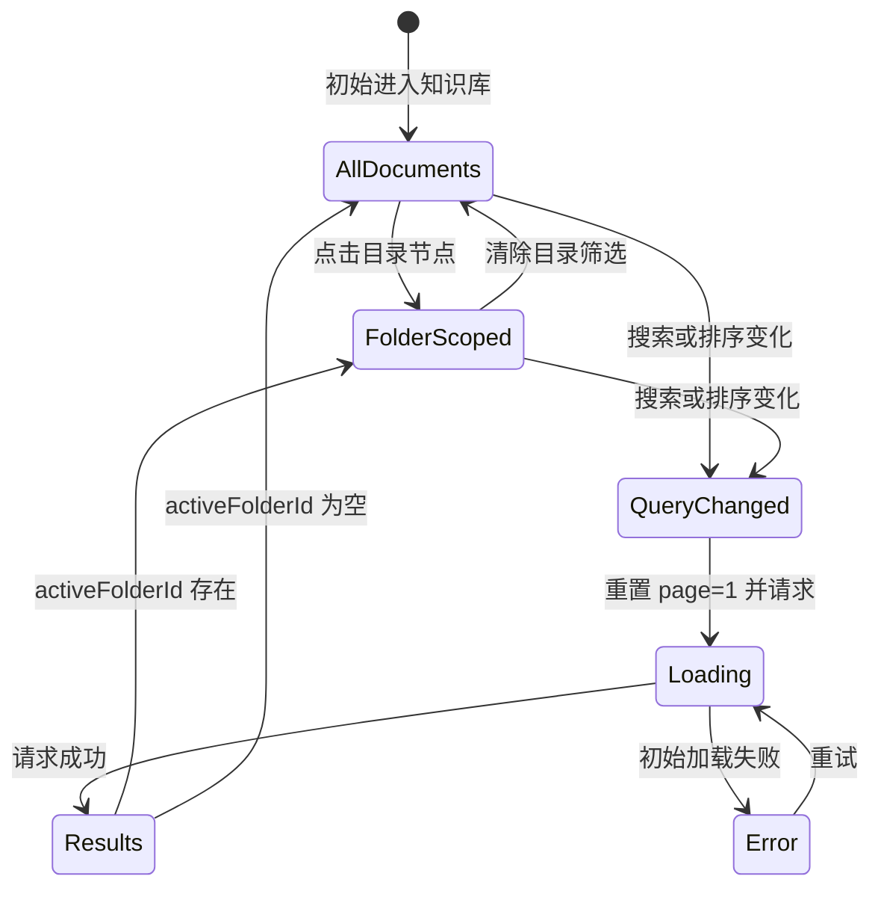
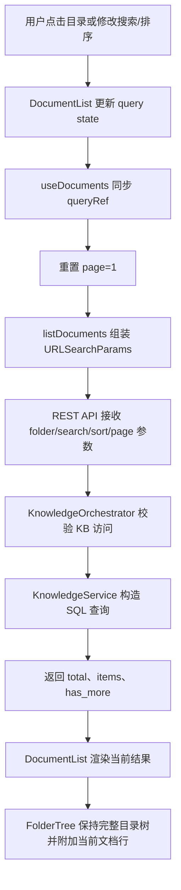
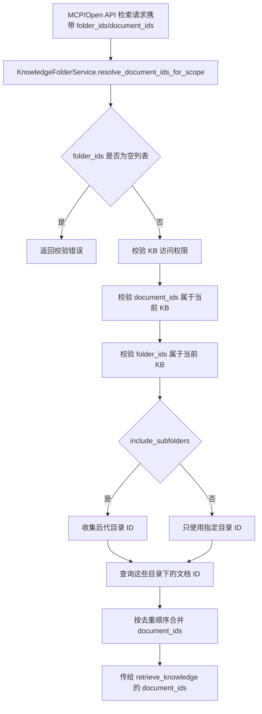

# 知识库目录导航与文档查询解耦设计

## 背景

当前分支相对 `wecode-ai/main` 的核心改动是将知识库文档页从“目录树直接承载文档集合”调整为“目录树负责稳定导航，文档列表负责当前查询结果”。这次改动同时补齐后端文档列表查询能力，使 REST API、Open API、MCP 工具和前端页面都能使用同一套 folder、subfolder、keyword、sort、pagination 查询语义。

原有实现容易把三个概念混在一起：

- 目录结构：知识库里的真实文件夹层级。
- 文档查询结果：当前筛选、搜索、排序、分页后的文档集合。
- 批量操作范围：用户选择的当前页文档，或由后端解析的文件夹范围。

当知识库文档数量较大、服务端分页开启，或用户按文件夹筛选时，如果目录树继续尝试在前端本地挂载、搜索、排序所有文档，就会出现“目录看起来像全量树，但文档实际只是当前页”的语义错位。

## 设计目标

1. 目录树只表达真实文件夹结构，不再从文档名里的 `/` 推导虚拟目录。
2. 文档列表始终展示当前服务端查询结果，查询条件包含 folder、include_subfolders、keyword、sort、pagination。
3. 点击文件夹是激活查询条件，展开/收起只改变目录树可见性。
4. 文件夹批量选择表示后端解析的 scope，不再等价于当前页面里可见文档的勾选状态。
5. REST API、Open API、MCP 工具共享同一套文档列表查询语义；检索和转移场景各自把 folder scope 解析成文档范围。

## 非目标

- 不重做知识库权限模型。
- 不改变文档上传、索引、转换、重建索引的主流程。
- 不在前端恢复全量文档本地搜索或全量排序。
- 不把文件名里的 `/` 当作历史兼容目录继续渲染。

## 改动范围

### 后端

- `backend/app/api/endpoints/knowledge.py`
  - `GET /knowledge-bases/{knowledge_base_id}/documents` 增加 `include_subfolders`、`keyword`、`sort_by`、`sort_order`。
- `backend/app/api/endpoints/knowledge_open.py`
  - `GET /api/knowledge/documents` 使用同样查询参数。
  - 保留 folder 与 knowledge base 归属校验。
- `backend/app/schemas/knowledge.py`
  - 增加 `KnowledgeDocumentSortField`、`SortOrder`。
  - `KnowledgeFolderResponse` 增加 `direct_document_count` 与 `total_document_count`。
- `backend/app/services/knowledge/folder_service.py`
  - 目录树返回直接文档数与子树文档数。
  - `resolve_document_ids_for_scope` 支持 folder_ids、document_ids 合并解析。
- `backend/app/services/knowledge/knowledge_service.py`
  - 文档列表分页查询支持子目录、关键字和排序。
- `backend/app/services/knowledge/orchestrator.py`
  - 将新增查询参数透传到 service 层。
- `backend/app/mcp_server/tools/knowledge.py`
  - `wegent_kb_list_documents` 支持 folder/search/sort 参数。
  - `wegent_kb_search_knowledge_base` 支持 folder_ids scope，并在调用 RAG 前解析为 document_ids。

### 前端

- `frontend/src/apis/knowledge.ts`
  - `listDocuments` 增加查询参数。
- `frontend/src/features/knowledge/document/hooks/useDocuments.ts`
  - hook 持有 query ref，将 folder/search/sort/pagination 统一提交给 API。
  - 查询条件变化时重置到第一页并刷新。
- `frontend/src/features/knowledge/document/components/DocumentList.tsx`
  - 持有 `activeFolderId`、`searchQuery`、`sortField`、`sortOrder`。
  - 点击目录节点只改变 active folder。
  - 当前筛选目录用可清除按钮展示。
  - 批量选择在 query 变化时清空，避免跨范围误操作。
- `frontend/src/features/knowledge/document/components/FolderTree.tsx`
  - 目录树只由 API folders 构建。
  - 当前 documents 作为查询结果附加显示，不再挂到目录节点下做本地树形归类。
  - 文件名里的 `/` 保持为普通文件名。
- `frontend/src/features/knowledge/document/components/DocumentItem.tsx`
  - 表格行改为共享 grid column template，保证 header 与 row 对齐。

## 分层架构

```text
前端交互层
  DocumentList
    - activeFolderId / searchQuery / sortField / sortOrder
    - selectedIds / selectedFolderIds
    - pagination state

前端数据层
  useDocuments
    - 将当前查询条件转换为 listDocuments params
    - 根据 query 变化重置页码并刷新
  useFolders
    - 读取稳定目录树
    - 执行目录 CRUD、移动文档、批量移动

前端展示层
  FolderTree
    - 展示真实 folder tree
    - 展示当前 documents 查询结果
    - 点击 folder 激活查询，不负责查询本身
  DocumentItem
    - 表格行和 compact 卡片展示

API 层
  REST /knowledge-bases/{id}/documents
  Open API /api/knowledge/documents
  MCP wegent_kb_list_documents
  MCP wegent_kb_search_knowledge_base

业务编排层
  KnowledgeOrchestrator
    - 权限校验
    - 参数归一
    - response 组装

服务层
  KnowledgeService
    - 文档分页、folder filter、keyword、sort
  KnowledgeFolderService
    - 目录树计数
    - 检索场景 folder/document scope 解析
  KnowledgeTransferService
    - 转移场景 folder/document scope 解析
    - 目标知识库目录复建

数据层
  knowledge_folders
  knowledge_documents
  kinds(KnowledgeBase)
```

## 核心数据契约

### 文档列表查询

文档列表查询现在是一等后端能力：

| 参数 | 语义 |
| --- | --- |
| `folder_id` | `None` 表示全知识库，`0` 表示根目录文档，正整数表示指定目录 |
| `include_subfolders` | 仅在指定正整数 folder 时扩展到后代目录 |
| `keyword` | 按文档名做服务端搜索，空白会被前端裁剪为空 |
| `sort_by` | `name`、`size`、`createdAt`、`updatedAt` |
| `sort_order` | `asc` 或 `desc` |
| `limit` / `offset` | 服务端分页 |

排序会追加 `id desc` 作为稳定次序，避免同值字段下分页结果抖动。

### 目录树计数

目录节点返回三类计数：

| 字段 | 语义 |
| --- | --- |
| `document_count` | 当前兼容字段，等于直接文档数 |
| `direct_document_count` | 当前目录直接包含的文档数 |
| `total_document_count` | 当前目录及所有子目录文档总数 |

前端目录行优先展示 `total_document_count`，因为用户点击目录时默认查询包含子目录。

### 选择与批量范围

前端同时维护两种选择，但它们不会被所有批量操作同等消费：

| 选择类型 | 前端状态 | 当前消费方 | 后端语义 |
| --- | --- | --- |
| 当前查询结果里的文档 | `selectedIds` | 批量删除、批量移动、转移知识库 | 精确 document_ids |
| 文件夹 scope | `selectedFolderIds` | 转移知识库 | `KnowledgeTransferService` 解析 folder_ids，并包含子目录 |

文件夹 checkbox 不再根据当前页文档自动推导半选状态。它代表一个后端 scope，避免分页场景下“当前页全选”被误解为“目录全选”。

当前实现中，批量删除和批量移动仍只对 `selectedIds` 生效；如果用户只选择文件夹，批量移动和批量删除按钮会保持不可用，转移知识库按钮可用。若同时选择文档和文件夹，批量移动只移动显式选择的文档，并在成功后清空文件夹选择，避免后续转移操作带上旧 scope。

## 前端状态模型



状态含义：

- `AllDocuments`：未指定目录，文档列表展示全知识库范围下的查询结果。
- `FolderScoped`：指定目录，文档列表请求 `folder_id` 与 `include_subfolders=true`。
- `QueryChanged`：搜索、排序、目录变化都会清空当前选择，避免跨查询范围执行批量操作。
- `Results`：目录树仍然完整展示，文档行只展示当前查询结果。

## 查询流程



这个流程的关键点是目录树与文档结果分开刷新：

- `useFolders` 负责目录结构，目录新增、重命名、删除、移动后刷新。
- `useDocuments` 负责当前查询结果，目录激活、搜索、排序、分页后刷新。

## 检索 scope 流程



这里没有让 RAG 层直接理解 folder 结构，而是在进入检索前解析成稳定的 document scope。这样可以复用已有按 document_ids 限定检索范围的能力。

转移知识库不是走 `resolve_document_ids_for_scope`。它由 `KnowledgeTransferService.collect_transfer_doc_and_folder_ids` 解析 `document_ids` 和 `folder_ids`：显式选择文件夹时会转移整个子树内的文档，并在目标知识库复建相关目录；只选择文档时，会复建这些文档所在的直接目录及祖先目录，但不会自动带上同目录下未选中的文档。

## 关键设计决策

### 1. 目录树不再承载文档查询逻辑

`FolderTree` 现在只做两件事：

- 将 API 返回的真实 folders 转换成导航节点。
- 将当前 documents 查询结果追加为文档节点。

它不再做：

- 根据文件名 `/` 创建虚拟目录。
- 根据当前文档列表计算目录树下的完整文档集合。
- 在前端按目录、搜索、排序过滤所有文档。

这让组件职责更清晰，也避免服务端分页下的“局部数据伪装成全量树”。

### 2. 点击目录默认包含子目录

前端在 `activeFolderId` 存在时传 `includeSubfolders=true`。原因是目录导航的用户预期通常是“看这个目录下的所有内容”，而不仅是直接子项。

同时后端仍保留 `include_subfolders=false`，供 Open API、MCP 和未来更细粒度 UI 使用。

### 3. 文件夹选择代表转移 scope，而不是当前页文档集合

分页开启后，一个目录里的文档可能分布在多页。用当前页文档推导文件夹选择状态会产生错误含义。因此本次改动把 folder checkbox 变成独立 scope：

- 勾选文件夹：记录 folder id。
- 取消文件夹：移除该文件夹及其后代选择。
- 取消某个文档：移除该文档所在目录的祖先 folder scope，避免后端 transfer 时又通过 folder_ids 把它带回来。

这个 scope 当前只进入转移知识库流程；删除、移动仍保持文档级操作，避免一个目录 checkbox 在不同操作里产生过宽的破坏范围。

### 4. 后端统一查询契约

REST API、Open API、MCP 工具都透传到 `KnowledgeOrchestrator.list_documents`，再进入 `KnowledgeService.list_documents_paginated`。这样可以避免同一个功能在多个入口里各自实现一套过滤逻辑。

### 5. 表格布局使用共享 grid 模板

`DocumentItem` 提供 `getDocumentTableGridTemplate`，表头和行共用列定义。这个改动不是业务核心，但它解决了目录行、文档行、选择列、操作列组合变化时的列对齐问题。

## 权限与边界

- 文档列表仍先校验用户对知识库的访问权限。
- Open API 指定正整数 `folder_id` 时，会额外校验 folder 属于当前 knowledge base。
- 检索场景的 `resolve_document_ids_for_scope` 会拒绝空数组 `folder_ids=[]`、`document_ids=[]`，避免调用方传入“显式空 scope”却被误解为全量。
- `folder_ids=[0]` 只表示根目录文档，不会展开成全知识库。
- 未指定 `folder_ids` 和 `document_ids` 时，MCP 检索保持原全知识库检索语义。

## 兼容性影响

### 保留

- `folder_id=None` 仍表示全知识库文档。
- `folder_id=0` 仍表示根目录文档。
- `document_count` 字段仍存在。
- 显式传入 `paginationEnabled={false}` 时，前端仍通过同一个 list API 读取文档，只是不显式传 `limit` / `offset`，因此会使用后端默认分页参数。

### 改变

- 文件名中的 `/` 不再生成虚拟目录。
- 文件夹 checkbox 不再展示基于当前页文档推导的半选状态。
- 搜索和排序从前端本地行为下沉为服务端查询行为。
- 当前 active folder、search、sort 变化会清空已有选择。
- 文件夹选择不再参与批量删除或批量移动，只参与转移知识库。

## 测试覆盖

本分支新增或扩展了以下测试方向：

- Open API 文档列表支持子目录、关键字、排序和目录计数。
- MCP `list_documents` 正确透传 folder/search/sort 参数。
- MCP `search_knowledge_base` 能将 folder scope 解析成 document_ids。
- `useDocuments` 能把 folder、search、sort、pagination 传给 `listDocuments`。
- `FolderTree` 勾选文件夹不会触发当前页文档选择。
- 带 `/` 的文档名保持为普通文件名。
- 表格行使用共享 grid column template。

## 风险与后续关注

1. `include_subfolders=true` 会在后端加载当前知识库所有 folder row 来构建后代集合。对于超大目录树，后续可以考虑数据库递归 CTE 或缓存目录闭包。
2. `keyword` 当前只搜索文档名，不搜索内容或 summary。UI 文案应避免让用户误解为全文检索。
3. `document_count` 继续保留为直接文档数，前端展示使用 total count。后续如果对外 API 要减少歧义，可以在文档中明确推荐使用 `direct_document_count` / `total_document_count`。
4. 当前 folder scope 的 checkbox 没有半选态，语义更安全，但用户可能少了“子目录部分已选”的视觉提示。后续可以在不依赖当前页文档的前提下，用 selectedFolderIds 的祖先/后代关系计算纯 folder scope 半选态。
5. 自动打开 `?doc=` 和 `initialDocPath` 仍按文档名跨页扫描，与 active folder 查询无关。未来如果 URL 要表达 folder scope，需要单独设计 query 参数。
6. `DocumentList` 与 `useDocuments` 默认启用分页；非分页模式只保留为显式兼容路径。该路径不显式传 `limit` / `offset`，实际会落到后端默认 `limit=50`，所以它不是严格意义上的全量加载。若还有调用方依赖“一次拿全量文档”的旧语义，需要显式调整 API 参数或继续推进全链路分页化。
7. 上传弹窗已移除废弃的 `currentDocumentCount` prop。上传组件只处理本次上传批次与目标 folder，不再接收容易被误解为“知识库总文档数”的当前列表数量。若未来需要上传额度，应新增后端强制校验的 quota 模型，而不是复用文档列表计数。

## 总结

这次重构把知识库文档页拆成两个稳定边界：目录树是结构导航，文档列表是服务端查询结果。后端提供统一的 folder/search/sort/pagination 查询契约，前端只维护当前查询状态并请求结果。批量操作进一步区分当前页 document_ids 与转移场景 folder_ids scope，避免分页和目录选择混用造成误操作。

整体设计降低了前端本地全量数据依赖，也让 REST、Open API、MCP 的文档查询入口，以及 Open API/MCP 的检索 scope，使用更一致的知识库文档范围模型。
