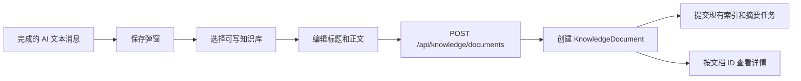

# “保存到知识库”MVP 轻量技术设计

## 1. 文档信息

| 项目 | 内容 |
|------|------|
| 状态 | 待审阅 |
| 创建时间 | 2026-07-26 |
| 关联产品设计 | `docs/discussions/260726_1032_保存到知识库产品设计.md` |
| 技术范围 | Web 前端、现有知识库 API、现有文档创建与索引链路 |

## 2. 结论

MVP 可以直接复用现有知识库能力完成：

1. 在 AI 消息工具栏增加“保存到知识库”；
2. `MessagesArea` 统一维护一个保存弹窗；
3. 复用 `GET /api/knowledge-bases/all-grouped` 获取并筛选可写知识库；
4. 复用 `POST /api/knowledge/documents` 创建 Markdown 文档；
5. 保存成功后复用 `DocumentDetailDialog` 按文档 ID 精确查看。

预计不需要：

- 后端生产代码改动；
- 数据库迁移；
- 消息与文档关系表；
- 专用“聊天消息保存”接口；
- 来源追踪和重复保存判断。



## 3. 已核实的现有能力

| 能力 | 代码事实 | 结论 |
|------|----------|------|
| 消息正文 | `MessageBubble.tsx` 已为复制和下载生成最终 Markdown | 保存复用同一正文 |
| blocks 消息 | `getCopyableContentFromBlocks()` 只合并 TextBlock | 不保存 thinking 和工具输出 |
| 消息状态 | 流式阶段不渲染 `BubbleTools` | 只需补充 completed、非空等条件 |
| 知识库列表 | `all-grouped` 返回个人、群组、组织和 `my_role` | 不新增列表接口 |
| 前端权限 | `canManageKnowledgeBaseDocuments()` 允许 Owner、Maintainer、Developer | 用于选择器筛选 |
| 后端权限 | `KnowledgeService.create_document()` 再次校验文档新增权限 | 前端筛选不是安全边界 |
| 文本创建 | `KnowledgeDocumentCreateV1` 支持 text、content、md、根目录 | 复用现有创建接口 |
| 鉴权 | `get_auth_context()` 支持 JWT Bearer Token | Web 登录态可调用 |
| 索引 | `create_document_with_content()` 创建后提交现有异步任务 | 不新增索引流程 |
| 文档查看 | `DocumentDetailDialog` 按文档 ID读取详情 | 避免同名文档路由歧义 |

关键代码：

- `frontend/src/features/tasks/components/message/MessageBubble.tsx`
- `frontend/src/features/tasks/components/message/BubbleTools.tsx`
- `frontend/src/features/tasks/components/message/MessagesArea.tsx`
- `frontend/src/apis/knowledge-base.ts`
- `frontend/src/utils/namespace-permissions.ts`
- `backend/app/api/endpoints/knowledge_open.py`
- `backend/app/services/knowledge/orchestrator.py`
- `backend/app/services/knowledge/knowledge_service.py`

## 4. 核心技术决策

### 4.1 直接创建知识库文档

用户可以在保存前任意修改正文，服务端无需读取或验证原消息。该动作的真实语义是“创建一篇 Markdown 知识文档”。

因此不新增消息专用接口，直接复用：

```http
POST /api/knowledge/documents
Authorization: Bearer <session-token>
Content-Type: application/json
```

```json
{
  "knowledge_base_id": 123,
  "name": "项目部署说明",
  "source_type": "text",
  "content": "# 项目部署说明\n\n...",
  "file_extension": "md",
  "folder_id": 0
}
```

不传递：

- message ID；
- task ID；
- subtask ID；
- source references；
- 来源 `source_config`；
- `idempotency_key`。

每次用户主动提交都创建一篇新文档。

### 4.2 保存与复制共用正文

`MessageBubble` 当前已经处理两类正文：

- 普通消息：去除外层 Markdown fence 后的 `rawMarkdownResult`；
- blocks 消息：所有 TextBlock 按顺序合并。

保存入口直接使用 `BubbleTools.contentToCopy`，不再实现新的提取函数，保证复制、下载、保存使用同一份 Markdown。

建议给 `BubbleTools` 增加：

```ts
onSaveToKnowledge?: (content: string) => void
showSaveToKnowledge?: boolean
```

入口条件：

```text
AI 消息
+ status = completed
+ 非流式
+ 非 incomplete
+ contentToCopy.trim() 非空
```

按钮增加：

```text
data-testid="message-save-to-knowledge-button"
```

### 4.3 全部消息共用一个弹窗

`MessageBubble` 只提供正文和点击事件，不负责加载知识库。

`MessagesArea` 维护：

```ts
interface SaveKnowledgeDraft {
  title: string
  content: string
}
```

以及：

- 当前保存草稿；
- 新创建的文档；
- 新文档所属知识库；
- 文档详情弹窗状态。

这样避免每条消息各自维护 API、弹窗和编辑器状态。

### 4.4 标题生成

`MessagesArea` 从当前 AI 消息向前寻找最近一条用户消息：

1. 取第一行非空文本；
2. 清理首尾空白；
3. 截断到 255 字符；
4. 为空时使用“对话保存内容”。

不调用模型，不解析 AI 回答标题。

### 4.5 可写知识库筛选

复用 `GET /api/knowledge-bases/all-grouped`，将所有知识库展平后调用：

```ts
canManageKnowledgeBaseDocuments({
  currentUserId: user.id,
  knowledgeBase: kb,
  knowledgeRole: kb.my_role,
})
```

可选角色为：

- Owner；
- Maintainer；
- Developer；
- 知识库创建者。

Reporter、RestrictedAnalyst 不展示。

选择器显示知识库名称和 `group_name`，并统一提示：

> 保存后，内容将遵循目标知识库现有权限，对该知识库有权成员可见。

不计算精确成员人数，不新增共享状态接口。

### 4.6 Notebook 默认目标

`ChatArea` 已持有 `taskType` 和 `knowledgeBaseId`，新增参数链路：

```text
ChatArea
  -> MessagesArea.defaultSaveKnowledgeBaseId
  -> SaveToKnowledgeDialog.defaultKnowledgeBaseId
```

仅当 `taskType === 'knowledge'` 时传递当前知识库 ID。

弹窗筛选出可写列表后：

- 当前知识库可写：默认选中；
- 当前知识库只读：不选中并提示；
- 普通对话：不默认选中。

### 4.7 固定保存到根目录

MVP 固定提交：

```json
{
  "folder_id": 0
}
```

不加载目录树，不提供目录选择。用户保存后可用现有知识库能力移动文档。

### 4.8 精确查看新文档

文档名称当前没有唯一约束，按名称 URL 跳转可能在重复保存后打开错误副本。

保存接口已返回完整 `KnowledgeDocument`，因此：

1. `MessagesArea` 保留返回对象；
2. 成功提示提供“查看文档”；
3. 点击后打开现有 `DocumentDetailDialog`；
4. 详情组件按文档 ID加载内容。

不新增路由，不离开当前对话。

### 4.9 成功语义

接口返回只表示：

- attachment context 已创建；
- `KnowledgeDocument` 已创建；
- 索引和摘要任务已提交或按现有规则跳过。

成功文案：

> 已保存到「知识库名称」，文档正在处理。

MVP 不在保存弹窗中轮询索引状态。

## 5. 前端设计

### 5.1 新增组件

新增：

```text
frontend/src/features/tasks/components/message/SaveToKnowledgeDialog.tsx
```

```ts
interface SaveToKnowledgeDialogProps {
  open: boolean
  onOpenChange: (open: boolean) => void
  initialTitle: string
  initialContent: string
  defaultKnowledgeBaseId?: number
  onCreated: (
    document: KnowledgeDocument,
    knowledgeBase: KnowledgeBaseWithGroupInfo
  ) => void
}
```

组件负责：

- 打开时加载知识库；
- 筛选可写目标；
- 设置 Notebook 默认值；
- 编辑标题和 Markdown；
- 校验并提交；
- 失败时保留表单。

关闭弹窗即丢弃本次编辑，不保存草稿。

### 5.2 编辑器

动态加载现有：

```text
frontend/src/components/common/WysiwygEditor.tsx
```

限制与后端一致：

- 标题：1～255 字符；
- 正文：1～500,000 字符；
- 目标知识库必选；
- 提交期间按钮禁用。

### 5.3 API 封装

在 `frontend/src/apis/knowledge.ts` 新增固定语义封装：

```ts
export async function createTextKnowledgeDocument(data: {
  knowledge_base_id: number
  name: string
  content: string
}): Promise<KnowledgeDocument> {
  return apiClient.post('/knowledge/documents', {
    ...data,
    source_type: 'text',
    file_extension: 'md',
    folder_id: 0,
  })
}
```

调用方不能覆盖 `source_type`、`file_extension` 和 `folder_id`。

### 5.4 错误处理

| 状态 | 前端行为 |
|------|----------|
| 400/422 | 保留表单并展示字段或创建错误 |
| 401 | 走现有登录失效流程 |
| 403 | 保留标题和正文，清空目标并提示重新选择 |
| 404 | 保留表单并刷新目标列表 |
| 5xx/网络失败 | 保留表单并允许再次保存 |

### 5.5 国际化

同时修改：

- `frontend/src/i18n/locales/zh-CN/chat.json`
- `frontend/src/i18n/locales/en/chat.json`

覆盖保存入口、字段、权限提示、只读提示、空状态、保存中、成功、失败、查看文档和兜底标题。

## 6. 后端设计

### 6.1 生产代码

预计不修改后端生产代码。

现有 `POST /api/knowledge/documents` 已完成：

- JWT 鉴权；
- 字段长度校验；
- 知识库文档新增权限校验；
- Markdown attachment context 创建；
- 根目录 `KnowledgeDocument` 创建；
- 索引和摘要任务提交。

### 6.2 回归测试

建议在 `backend/tests/api/test_knowledge_open_scope.py` 增加 JWT 场景，验证：

- 可写用户成功创建 text/md/root 文档；
- Reporter 返回 403；
- 空正文或超长正文返回 422；
- 响应包含文档 ID和初始索引状态。

只增加回归覆盖，不修改业务实现。

## 7. 文件改动

### 7.1 必须修改

| 文件 | 改动 |
|------|------|
| `frontend/src/features/tasks/components/message/BubbleTools.tsx` | 保存按钮和测试标识 |
| `frontend/src/features/tasks/components/message/MessageBubble.tsx` | 入口条件和正文回调 |
| `frontend/src/features/tasks/components/message/MessagesArea.tsx` | 唯一弹窗、建议标题和详情状态 |
| `frontend/src/features/tasks/components/chat/ChatArea.tsx` | 下传 Notebook 当前知识库 ID |
| `frontend/src/features/tasks/components/message/SaveToKnowledgeDialog.tsx` | 新增保存弹窗 |
| `frontend/src/apis/knowledge.ts` | 文本知识文档 API 封装 |
| `frontend/src/i18n/locales/zh-CN/chat.json` | 中文文案 |
| `frontend/src/i18n/locales/en/chat.json` | 英文文案 |

### 7.2 测试

| 文件 | 覆盖 |
|------|------|
| `BubbleTools.test.tsx` | 保存按钮和正文回传 |
| `MessageBubble.test.tsx` | completed、streaming、error、incomplete、空正文 |
| `SaveToKnowledgeDialog.test.tsx` | 权限筛选、默认目标、提交和失败保留 |
| `test_knowledge_open_scope.py` | JWT 文本创建和权限 |

## 8. 验证范围

### 8.1 自动化测试

- 普通消息、`${$$}$` 消息和 blocks 消息保存正文正确；
- 仅 completed、非空、完整 AI 消息显示入口；
- Owner、Maintainer、Developer 和创建者可选；
- Reporter、RestrictedAnalyst 不可选；
- Notebook 仅在当前知识库可写时默认选择；
- 请求固定为 text、md、folder_id=0；
- 403 和网络失败保留用户编辑；
- 重复主动保存产生多次创建请求；
- 新文档详情按返回 ID打开。

### 8.2 手工验收

- 未使用知识库的普通对话；
- 使用一个或多个知识库的普通对话；
- Notebook 当前知识库可写和只读；
- 个人、共享、群组和组织知识库；
- 桌面端和移动端；
- 网络失败后再次保存；
- 同一回答重复保存。

## 9. 风险

| 风险 | 处理 |
|------|------|
| `knowledge_open.py` 原定位为外部 API | 它已支持 JWT 且复用统一编排，MVP 直接复用，避免重复接口 |
| 弹窗打开后权限变化 | 后端再次校验，403 时保留正文 |
| 超长 Markdown 实时预览开销 | 编辑器动态加载；出现真实问题后再按长度降级 |
| 同名文档按名称路由歧义 | 使用返回文档 ID和 `DocumentDetailDialog` 查看 |
| 异步索引后续失败 | 保存只反馈“文档已创建、正在处理”，后续状态由现有知识库页面展示 |

## 10. 实施顺序

1. 增加文本创建 API 封装；
2. 实现可写知识库筛选和保存弹窗；
3. 接入消息工具栏和单一弹窗状态；
4. 下传 Notebook 默认知识库；
5. 接入成功提示和文档详情；
6. 补齐中英文文案；
7. 完成前端测试和后端 JWT 回归测试；
8. 执行普通对话、Notebook、权限和移动端验收。

## 11. 审阅决策

进入实现前只需确认以下事项：

1. Web 前端复用现有 `POST /api/knowledge/documents`；
2. MVP 固定保存到知识库根目录；
3. 所有消息共用 `MessagesArea` 中的一个保存弹窗；
4. 保存后使用 `DocumentDetailDialog` 原地查看；
5. 后端生产代码不改，只补充回归测试。

确认后即可进入代码实现，不需要进一步的架构设计。
