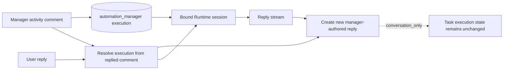
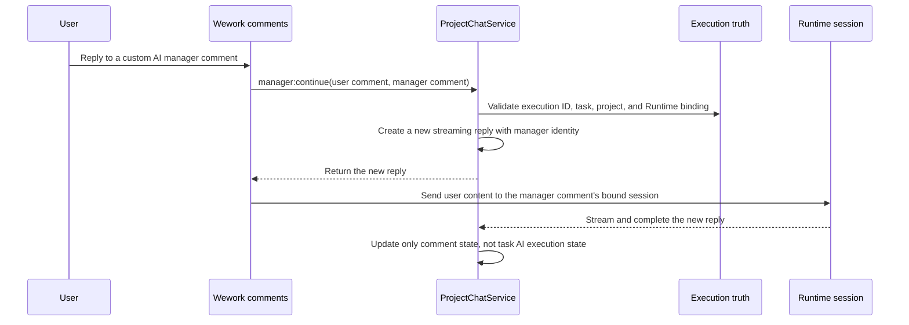

# Custom AI manager comment continuation

| Boundary | Code ownership |
| --- | --- |
| Comment detection and routing | `wework/src/features/todo/TaskActivityView.tsx` |
| Socket contract | `wework/src/api/backend/projectChatSocket.ts`, `backend/app/api/ws/wework_runtime_namespace.py` |
| Execution and comment validation | `backend/app/services/project_chat/service.py` |
| Runtime-session continuation | `wework/src/features/workbench/` |

Invariants: continuation is selected from the replied comment's bound execution and Runtime session, never from the task's current assignee; only custom `automation_manager` executions may enter this path; the user reply and manager answer are separate new comments, and an existing comment's author identity is immutable; continuation reuses the original manager session; conversation replies must not overwrite the task's current robot execution state, assignee, or board status.
