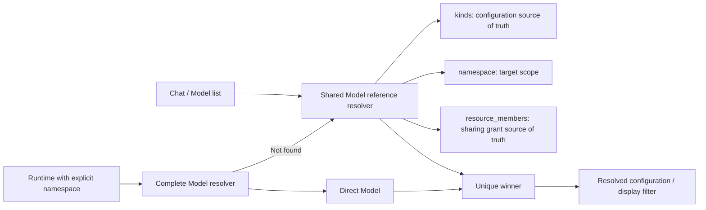
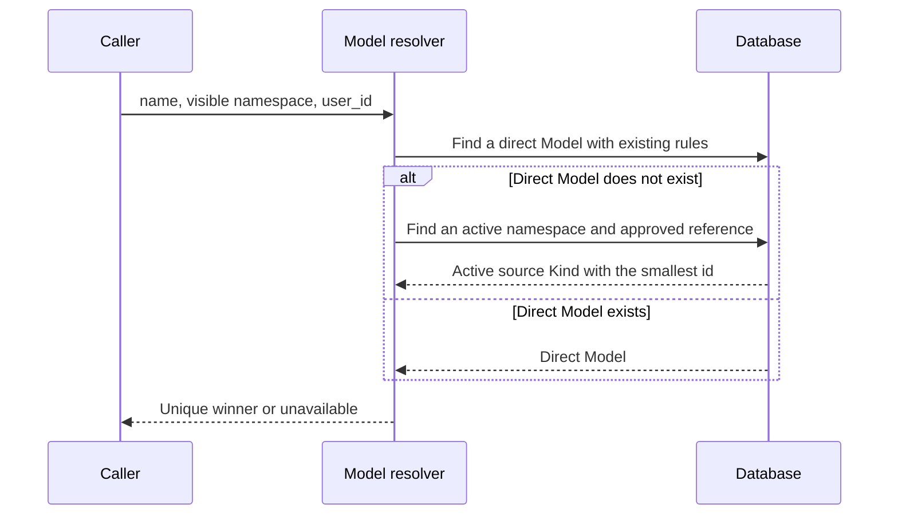

# Shared Model reference resolution

## Scope

This flow governs how every caller resolves a shared Model reference to one
source Kind. Runtime callers with an explicit visible namespace must also use
the same direct-first resolver.

## Connection graph

## Sequence diagram

## Code ownership

| Responsibility | Owner |
| --- | --- |
| Select one direct or referenced Model winner | `shared/db/capability_reference.py` |
| Create, remove, list, and delegate Backend sharing access | `backend/app/services/capability_reference_service.py` |
| Build Backend RAG configuration | `backend/app/services/rag/runtime_resolver.py` |
| Build Knowledge Runtime configuration | `knowledge_runtime/knowledge_runtime/services/config_resolver.py` |
| Select Model-list winners and apply display filters | `backend/app/services/model_aggregation_service.py` |

## Essential invariants

- `Kind` is the only source of truth for capability configuration; sharing must not copy configuration or secrets.
- `ResourceMember` is the source of truth for sharing grants; a reference resolves only when its target namespace is active and its grant is approved.
- The namespace in a reference is the caller-visible scope and does not have to match the source Kind namespace.
- When a visible scope has multiple referenced Models with the same name, select the `Kind` with the smallest id.
- When a group namespace contains legacy direct Models with the same name, select the `Kind` with the smallest id; the namespace, not the current caller, is their ownership boundary.
- Callers retain their existing direct Model lookup and resolve a shared reference only when it is not found.
- Backend RAG and Knowledge Runtime must use the same complete Model resolver; removing a grant or disabling its source makes it unavailable immediately.
- A Model list must select the same-name winner before applying category, Shell compatibility, or client-visibility filters; filtering must never promote a larger-id Model with the same name.
