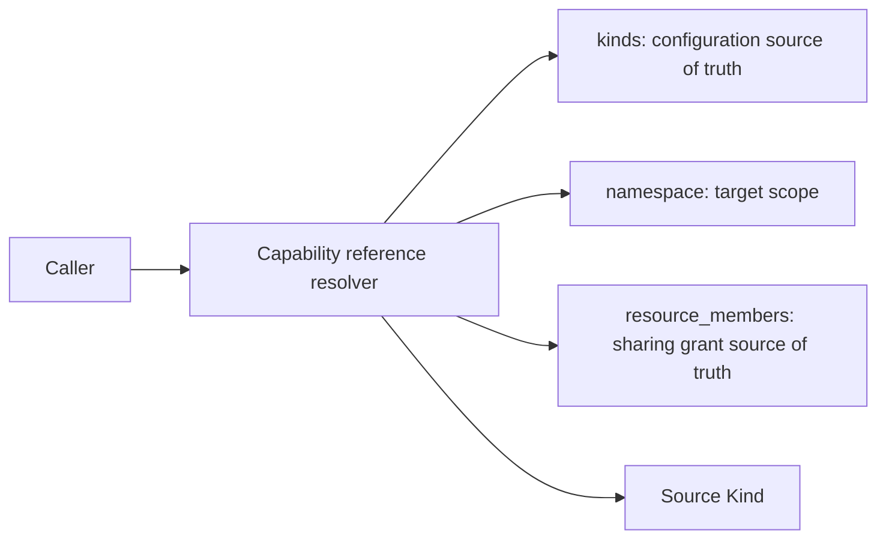
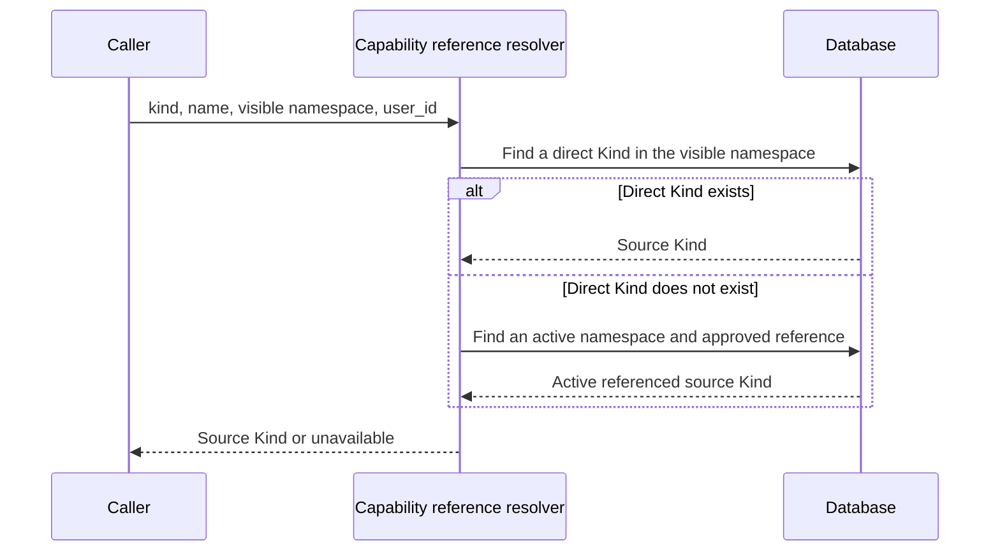

# Shared capability reference resolution

## Scope

This flow governs how visible personal or group references to capabilities such
as Model, Retriever, and Shell resolve to their source Kind.

## Connection graph

## Sequence diagram

## Code ownership

| Responsibility | Owner |
| --- | --- |
| Resolve one direct or referenced capability | `shared/db/capability_reference.py` |
| Create, remove, and list sharing grants | `backend/app/services/capability_reference_service.py` |
| Build Backend RAG configuration | `backend/app/services/rag/runtime_resolver.py` |
| Build Knowledge Runtime configuration | `knowledge_runtime/knowledge_runtime/services/config_resolver.py` |

## Essential invariants

- `Kind` is the only source of truth for capability configuration; sharing must not copy configuration or secrets.
- `ResourceMember` is the source of truth for sharing grants; a reference resolves only when its target namespace is active and its grant is approved.
- The namespace in a reference is the caller-visible scope and does not have to match the source Kind namespace.
- A direct Kind wins over a referenced Kind with the same name.
- Backend and every Runtime must use the same resolver; removing a grant or disabling its source makes it unavailable immediately.
