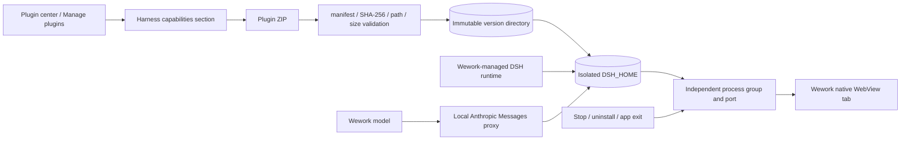
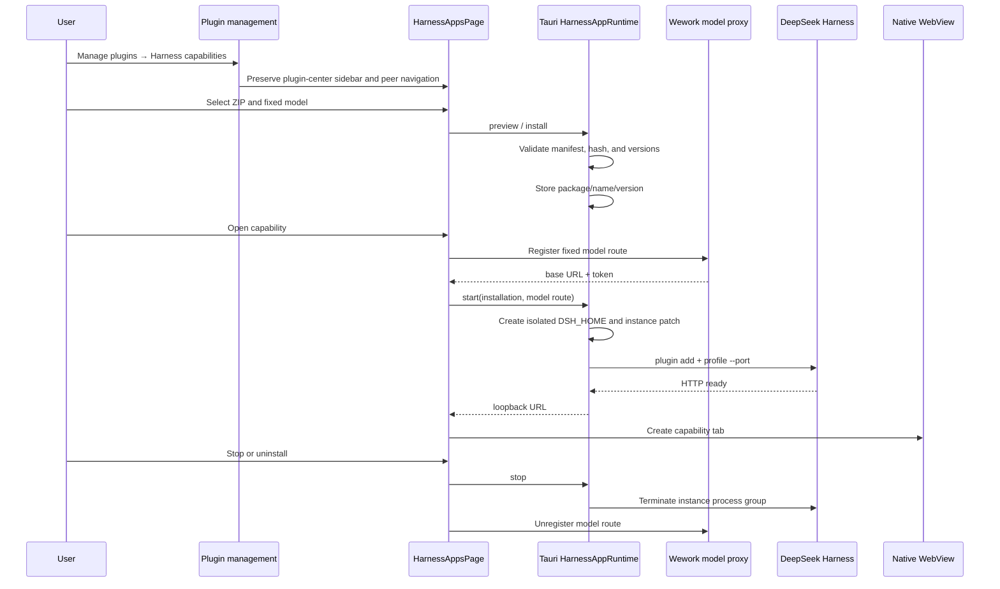

# DeepSeek Harness capability apps

Scope: Wework imports a local DeepSeek Harness plugin package, binds it to one Wework model without modifying Harness source, and runs it in an independent workspace tab.

| Edge | Code ownership |
| --- | --- |
| ZIP, manifest, version, and storage validation | `wework/src-tauri/src/harness_apps.rs` |
| Runtime resolution, instance directories, process groups, and ports | `wework/src-tauri/src/harness_apps.rs` |
| Wework model to Anthropic Messages proxy | `wework/src/features/local-harness/localHarnessModels.ts` |
| Plugin-center entry, sidebar, and management section navigation | `wework/src/pages/PluginManagementPage.tsx`, `wework/src/components/plugins/PluginManagementSectionNav.tsx` |
| Installation, management, and lifecycle UI | `wework/src/pages/HarnessAppsPage.tsx` |
| Workspace tabs and native WebViews | `wework/src/App.tsx`, `wework/src/features/workspace-tabs/workspaceTabs.ts` |

Invariants: Harness capability management remains inside the plugin-center management shell and provides explicit routes back to plugin management and the plugin marketplace; DeepSeek Harness source remains read-only; packages are validated before being written to immutable `name/version` directories; the package DSH version range must contain the actual runtime version; every capability instance owns an isolated `DSH_HOME`, port, and process group; the selected model is fixed in the installation record while credentials exist only in the runtime proxy and child environment; starting, stopping, or failing one instance cannot affect another; when no activity API exists, the instance remains resident until an explicit lifecycle event; stop, uninstall, and Wework exit reclaim the complete process group; a tab is created only after HTTP readiness.
