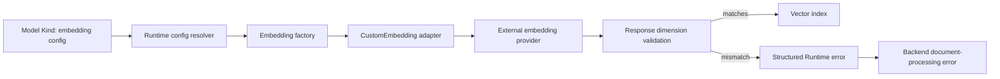
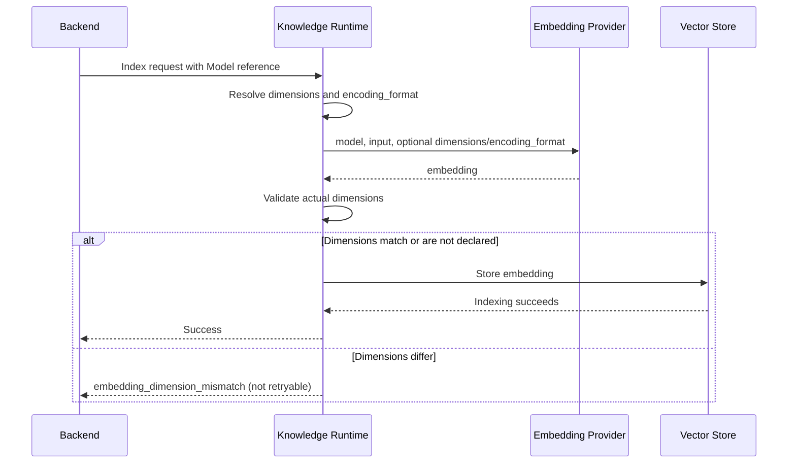

# Embedding dimension contract

## Scope

This flow governs how embedding configuration declared on a Model travels through
Backend and Knowledge Runtime resolution into `CustomEmbedding` provider requests,
response validation, and document-indexing failure projection. Native SDK adapter
response contracts and physical-index isolation are out of scope.

## Connection graph

## Sequence diagram

## Code ownership

| Responsibility | Owner |
| --- | --- |
| Model embedding configuration schema | `backend/app/schemas/kind.py` |
| Backend RAG config construction | `backend/app/services/rag/runtime_resolver.py` |
| Backend local CRD config construction | `backend/app/services/rag/embedding/factory.py` |
| Knowledge Runtime config construction | `knowledge_runtime/knowledge_runtime/services/config_resolver.py` |
| Provider request and response-dimension guarantee | `knowledge_engine/knowledge_engine/embedding/custom.py` |
| Embedding adapter selection | `knowledge_engine/knowledge_engine/embedding/factory.py` |
| Structured Runtime error response | `knowledge_runtime/knowledge_runtime/main.py` |
| Backend indexing-failure projection | `backend/app/services/knowledge/processing_errors.py` |

## Essential invariants

- `embeddingConfig` is the source of truth for expected output format; config resolution must preserve `dimensions` and `encoding_format`.
- When routed through `CustomEmbedding`, optional configured request parameters must be sent to the provider; absent parameters must not acquire invented defaults.
- When routed through `CustomEmbedding` with declared `dimensions`, every provider response vector must have exactly that length.
- A dimension mismatch must fail immediately inside the provider adapter and must never reach the vector index.
- A dimension mismatch is a non-retryable configuration error; Runtime and Backend must preserve its stable error code.
- Error logs may include the model and expected/actual dimensions, but never credentials, input text, or vector contents.
