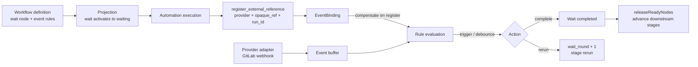
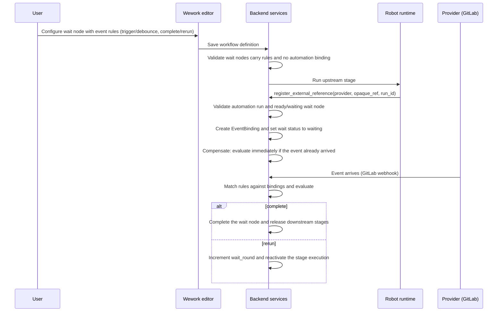

# External event subscription and wait nodes

Scope: wait-node state machine, event-rule matching, external reference registration, GitLab event ingestion, wait rounds, and compensation.

| Edge | Code ownership |
| --- | --- |
| Wait-node and event-rule definition | Issue workflow schema, Wework workflow editor |
| Registration and binding | `external_events/registration.py`, `binding.py`, `wework-space` MCP, Executor `mcp.rs` |
| Provider event ingestion | `external_events/adapters.py`, `project_incoming_hooks.py` |
| Buffering and rule evaluation | `external_events/buffer.py`, `evaluate.py` |
| Wait projection and advancement | `project_workflow_projection.py`, `issueWorkflow.ts` |

Essential invariants:

- A wait node must define at least one rule with a non-empty event type and must not bind an automation rule; the start node cannot depend on others, and the end node cannot be depended on.
- Only an automation execution of a preset workflow with a `ready`/`waiting` wait node may register external references; registration is scoped by `automation_run_id`.
- The (provider, opaque_ref, workflow node + automation run) binding triple is unique; repeated registration is idempotent and never advances twice.
- Only event types matching a bound rule change wait state; unmatched events are recorded but never advance or rerun.
- `trigger` evaluates immediately on arrival; `debounce` aggregates within its window first.
- `complete` finishes the wait node and releases downstream stages; `rerun` increments `wait_round` and reruns only that stage.
- Registration compensates immediately when the event already arrived, so no waiting window is missed.
- start/end are structural DAG boundaries that never execute; deletion and rewiring must preserve the boundaries.
