# External event subscription and wait nodes

Scope: wait-node state machine, event-rule matching, external reference registration (manual and delivery-derived), GitLab event ingestion, wait rounds, and compensation.

```mermaid
flowchart LR
    DEFINITION[Workflow definition<br/>wait node + event rules] --> PROJECTION[Projection<br/>wait activates to waiting]
    PROJECTION --> RUN[Automation execution]
    RUN -->|manual path| REGISTER[register_external_reference<br/>provider + opaque_ref + run_id]
    RUN -->|automatic path| DELIVER[Upstream stage delivery<br/>reference deliverable pull_request]
    DELIVER --> ADAPTER2[Provider reference adapter<br/>derives opaque_ref]
    ADAPTER2 --> REGISTER
    REGISTER --> BINDING[EventBinding]
    BINDING -->|compensate on register| EVALUATE[Rule evaluation]
    ADAPTER[Provider adapter<br/>GitLab webhook] --> BUFFER[Event buffer]
    BUFFER --> EVALUATE
    EVALUATE -->|event-type policy| ACTION{Action}
    ACTION -->|complete| DONE[Wait completed]
    ACTION -->|rerun| ROUND[wait_round + 1<br/>wait-node repair run]
    DONE --> RELEASE[releaseReadyNodes<br/>advance downstream stages]
```



```mermaid
sequenceDiagram
    participant U as User
    participant E as Wework editor
    participant B as Backend services
    participant R as Robot runtime
    participant P as Provider (GitLab)

    U->>E: Configure wait node with event rules (event type, complete/rerun)
    E->>B: Save workflow definition
    B->>B: Validate wait nodes carry rules; rules may declare a provider
    B->>R: Run upstream stage
    alt Automatic path (rules declare a provider)
        B->>B: Upstream stage gets an injected reference deliverable (pull_request)
        R->>B: finalize_delivery with the structured MR reference
        B->>B: Provider reference adapter derives opaque_ref from the delivery
        B->>B: Register the EventBinding automatically (no prompt or manual tool)
    else Manual path (custom or provider-less rules)
        R->>B: register_external_reference(provider, opaque_ref, run_id[, workflow_node_id])
    end
    B->>B: Validate automation run and ready/waiting wait node
    B->>B: Create EventBinding and set wait status to waiting
    B->>B: Compensate: evaluate immediately if the event already arrived
    P->>B: Event arrives (GitLab webhook)
    B->>B: Match rules against bindings and evaluate
    alt complete
        B->>B: Complete the wait node and release downstream stages
    else rerun
        B->>B: Increment wait_round and create a wait-node-scoped repair run
        B->>B: Bind the repair execution to the wait node; the gate stays waiting and updates repair_status
    end
```

| Edge | Code ownership |
| --- | --- |
| Wait-node and event-rule definition | Issue workflow schema, Wework workflow editor |
| Registration and binding (incl. delivery-derived) | `external_events/registration.py`, `binding.py`, `reference.py`, `wework-space` MCP, Executor `mcp.rs` |
| Provider event ingestion and event-type delivery policy | `external_events/adapters.py`, `project_incoming_hooks.py` |
| Provider reference adapters and opaque_ref derivation | `external_events/adapters.py` (`PROVIDER_REFERENCE_ADAPTERS`) |
| Buffering, rule evaluation and window settle | `external_events/buffer.py`, `evaluate.py`, `tasks/external_event_tasks.py` |
| Wait projection and advancement | `project_workflow_projection.py`, `issueWorkflow.ts` |

Essential invariants:

- A wait node must define at least one rule with a non-empty event type and must not bind an automation rule.
- A rule may declare a `provider` (auto-set when picked from the event catalog); matching is by (provider, event_type), and a provider-less rule matches any provider. One wait node may declare rules from multiple providers.
- Only an automation execution of a preset workflow with a `ready`/`waiting` wait node may register external references; registration is scoped by `automation_run_id`.
- The (provider, opaque_ref, workflow node + automation run) binding triple is unique; repeated registration is idempotent and never advances twice.
- Delivery-derived binding: a wait node whose rules declare a provider dynamically injects a reference deliverable into its directly upstream stage (the provider reference adapter declares the delivery kind, e.g. `pull_request` for GitLab). The requirement is recomputed live from the wait rules, never persisted and never author-configured; finalize rejects a delivery without it. On finalize the system derives opaque_ref via the provider reference adapter and registers the binding automatically; the binding is archived when the wait node completes.
- The provider reference adapter registry is the single extension point for delivery-derived binding: adding a provider (including exotic reference shapes such as a video link) only registers one `ProviderReferenceAdapter` (declared delivery kind + opaque_ref derivation); routing, delivery, and workflow code stay untouched. Providers without an adapter keep the manual path.
- External reference providers fall into two classes: native adapters (currently only `gitlab`; gitlab.com and self-hosted instances send identical webhook payloads, opaque_ref is `group/project!<iid>`) and the generic envelope (any other name; the webhook must send the same `x-event-provider` header and carry opaque_ref/event_type, `generic` when none is set). The native set is derived from `PROVIDER_EVENT_TYPES`; registering a new adapter is registering its event types.
- Only event types matching a bound rule change wait state; unmatched events are recorded but never advance or rerun.
- The delivery policy is declared per event type in the provider catalog (`window_seconds` + `merge_while_running`); wait-node rules no longer carry a trigger policy. Event types outside the catalog (custom/generic) fall back to the default immediate policy.
- `merged` declares immediate (leading edge): an event starts a round on arrival when idle, and events arriving while a round runs queue and settle one per round, never merged.
- `ci_failed` declares merge-while-running (`merge_while_running`): the first event fires immediately when idle; events arriving while a repair round runs merge and fire together when the round ends.
- `review_comment` declares a 5s short-window plus merge-while-running (`window_seconds=5`, `merge_while_running=true`): comments arriving inside the window on the same wait node merge into one round, and comments outside it open a new window. If a repair round is still active when the window expires, the comments park and fire together when that round ends.
- Settling is grouped by (provider, event_type); each type drains with its own declared policy: immediate fires one round per event serially, merge fires one round for the whole group, and the other types stay parked until the next settle.
- A wait node never runs two repair rounds concurrently: events arriving while a repair round runs are always buffered first instead of starting a second round.
- `complete` finishes the wait node and releases downstream stages; `rerun` increments `wait_round` and creates a wait-node-scoped repair run (`workflow_node_id` points to the wait node, and the stage input's `target_stage` is the wait node with the rerun instruction as its prompt). The wait node stays `waiting` for the whole repair round, updating only `repair_status` and its task/delivery ownership; it never re-activates a completed upstream stage.
- Registration compensates immediately when the event already arrived, so no waiting window is missed.
- The stage DAG has no structural start/end nodes and renders no end marker: a stage without predecessors is the entry, and the flow simply ends at the last stage. After `complete` finishes a wait node, every required stage completing carries the Issue into review.
