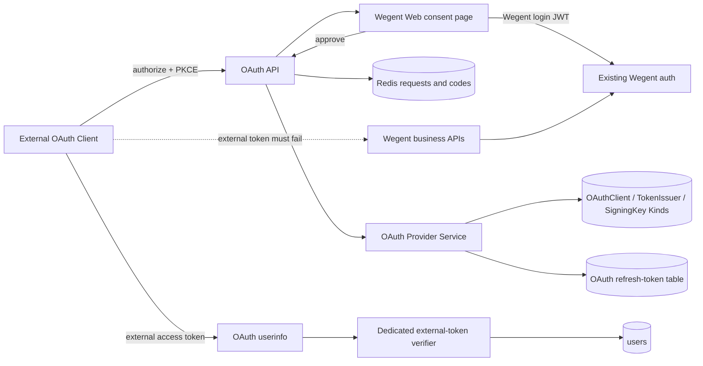
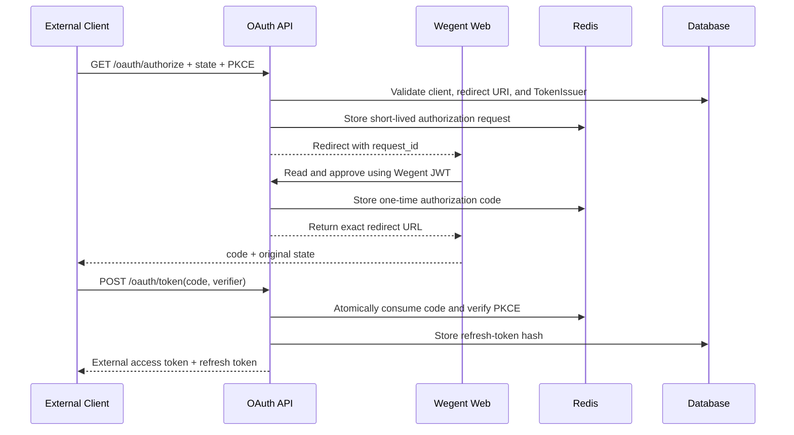
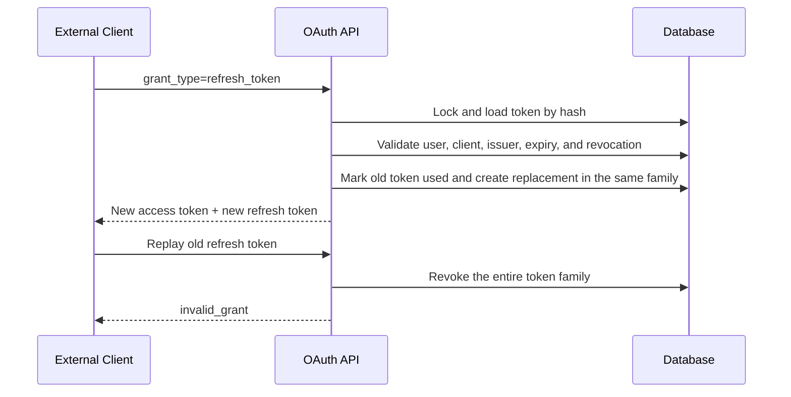

# External OAuth identity tokens

## Scope

Wegent acts as a constrained OAuth 2 authorization server that proves the current user's identity to registered external clients. External access tokens may read only the dedicated userinfo resource and grant no Wegent API or downstream business permissions.

## Connection graph

## Authorization-code sequence

## Refresh sequence

## Code ownership

| Responsibility | Owner |
| --- | --- |
| OAuth protocol endpoints and errors | `backend/app/api/endpoints/oauth_provider.py` |
| Clients, codes, JWTs, and refresh rotation | `backend/app/services/auth/oauth_provider.py` |
| OAuth request, response, and Kind schemas | `backend/app/schemas/oauth_provider.py` |
| Refresh-token persistence | `backend/app/models/oauth_refresh_token.py` |
| Client administration API | `backend/app/api/endpoints/admin/oauth_clients.py` |
| Client administration and consent UI | `frontend/src/features/admin/`, `frontend/src/app/auth/oauth/authorize/` |

## Essential invariants

- External access tokens may access OAuth userinfo only; existing Wegent JWT, API-key, and task-token authentication must reject them.
- Userinfo returns only `id`, `user_name`, and `email`; it never returns roles, auth sources, preferences, Git data, or resource permissions.
- Audience is fixed to `wegent-userinfo`, scope is fixed to `userinfo.read`, and clients cannot expand either.
- Redirect URIs match registered values exactly; authorization codes require well-formed PKCE S256, expire quickly, and are consumed once.
- A client's access-token TTL cannot exceed its TokenIssuer limit; a referenced TokenIssuer cannot be deleted or changed to another audience.
- Authorization errors may redirect with the original `state` only after both the client and redirect URI are trusted; otherwise the provider returns a local error to prevent open redirects.
- Refresh tokens are stored only as hashes and rotate on every use; replay revokes the entire family.
- Disabling or deleting a client, rotating its secret, changing its type, or changing its TokenIssuer revokes its existing refresh tokens.
- Disabled users, clients, TokenIssuers, or SigningKeys cannot issue or refresh tokens.
- Logs never contain access tokens, refresh tokens, authorization codes, client secrets, or Authorization headers.
