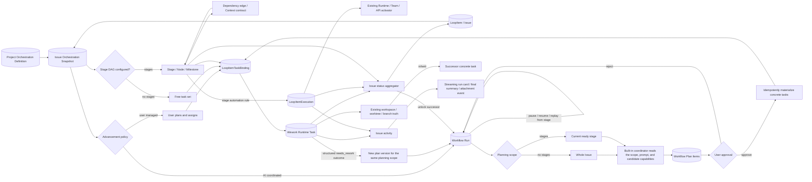
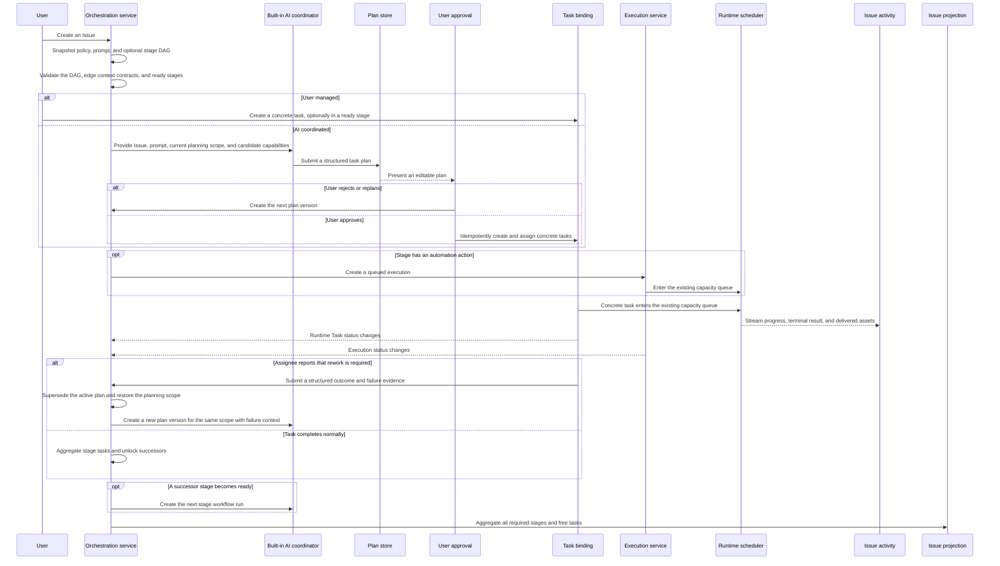

# Issue, task, and workflow orchestration

Scope: Issue task organization, advancement policy, project stage DAGs, Issue stage snapshots, AI plan drafts and approval, references to concrete tasks and executions, dependency readiness, recovery and replay, workspace inheritance, activity projection, and aggregated Issue status.

| Edge                                                | Code ownership                                                               |
| --------------------------------------------------- | ---------------------------------------------------------------------------- |
| Project orchestration definition and Issue snapshot | Backend workflow schemas/services; Wework Automation DAG UI                  |
| AI coordination to plan versions and approval       | Backend workflow run/plan service; Wework Issue orchestration-plan UI        |
| Approved plan to concrete tasks                     | Backend workflow materializer; standard LoopItem creation/assignment         |
| Dependency edge to successor context                | Workflow node dependency context; Composer / automation instruction          |
| User/AI coordination to concrete tasks              | Standard Wework Composer, AI manager, `LoopItemTaskBinding`                  |
| Stage to automated execution                        | `project_automation_execution.py`, `loop_item_executions/service.py`         |
| Workspace and successor-task inheritance            | Runtime Task summary and Wework project work controls                        |
| DAG readiness, stage, and Issue aggregation         | Backend workflow service; local ProjectSpace service; live Wework projection |
| Execution truth to Issue activity                   | Project chat stream, task activity cards, delivery/attachment projection     |

Invariants:

- `LoopItem` is the Issue and business aggregate, not one execution.
- A Stage / Node / Milestone is a logical task category and dependency node, not an execution and not an executor type.
- Wework Runtime Tasks, Wegent Tasks, and `LoopItemExecution` remain the concrete task and execution truths. Stages only reference them and never duplicate state, directories, worktrees, branches, or queue fields.
- The stage DAG and advancement policy are orthogonal. User management and AI coordination both work with or without stages.
- Stage-free AI coordination uses an internal Issue-level planning scope. It does not persist a virtual stage or node in the Issue snapshot, and `current_stage_id` remains unset.
- A dependency edge is both a readiness constraint and a context contract from the predecessor stage to the successor. Core Issue context is always included; the edge controls whether predecessor final results, delivered assets, and execution activity are added.
- Edge context policy is stored as the successor node's input declaration for a direct predecessor. Removing a dependency must remove its policy as well.
- AI advances an Issue only by creating, assigning, and starting concrete tasks. With stages, every AI-created task belongs to a stage and follows its dependencies. Without stages, AI may decompose work from the Issue and prompt.
- The AI coordinator is a built-in cloud role. A project stores one cloud model identifier, not a user-visible coordinator entity or model credentials.
- AI may only submit a structured plan draft. It cannot create, assign, or start concrete tasks before approval; approved plans materialize through the standard LoopItem creation and assignment paths.
- When an assignee finds that rework is required, it must submit a structured outcome. `needs_rework` supersedes only the active plan and creates a new version for the same stage when a DAG exists or for the Issue-level scope without a DAG; it does not rewrite historical tasks or add a back edge to the stage DAG.
- Repeated submission of the same rework outcome for one task must be idempotent and must not create duplicate plan versions or dispatch the coordinator twice.
- Every plan version is immutable and every plan item has a stable idempotency key. Repeated approval, service restart, or event replay may only fill missing tasks and must not create duplicates.
- The Issue snapshot stores only the current orchestration summary and active run/version pointers. Plan history and plan items are separate durable resources rather than an ever-growing Issue JSON document.
- An active run pointer must be validated against both its owning Issue and project. A client-supplied snapshot must never expose or operate another Issue's plan.
- AI orchestration may reference only an enabled cloud coordinator in the same project. Entering a new plan version, recovering failed planning, or advancing to the next stage must dispatch exactly one coordinator; dispatch failure moves planning to `failed` instead of leaving it stuck in `planning`.
- Parent-Issue advancement and plan-version creation hold a row lock on the parent. Concurrent task completion and repeated events must not create duplicate next-stage runs.
- Pausing stops new planning and materialization only; existing executions continue to project their trusted state. Resume starts at the first incomplete checkpoint.
- Replaying from a stage preserves trusted upstream results, marks that stage and downstream active plans superseded, and creates a new version only after affected active executions are stopped.
- One Issue may bind multiple heterogeneous tasks, and one stage may aggregate multiple concrete tasks. Tasks remain discoverable in Wework's task list.
- Stage automation controls when and how a concrete execution is created or started; it is not an entity type parallel to Task.
- `inherit` reads a confirmed workspace/worktree/branch only from an explicit predecessor Runtime Task. Without an inheritable source, the standard Composer must request a selection instead of guessing.
- Queued, approval-pending, and dependency-blocked work projects to Pending. Only Runtime-confirmed running work projects to In Progress.
- A stage completes from the trusted terminal state of all required tasks/executions in that stage. An Issue completes from all required stages and free tasks. Completing one task cannot complete a stage or Issue with remaining work.
- The DAG must be acyclic. A referenced stage must exist, dependencies must be satisfied before a stage starts, edge context may reference direct predecessors only, and the UI must never write running directly.
- Issue Activity is the unified execution projection. Streaming cards show compact Runtime truth, completed cards show a final-content summary, and attachment events reference real delivery assets.
