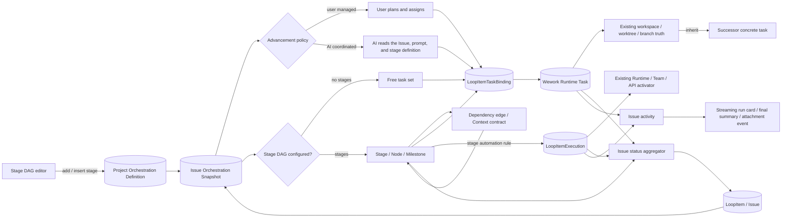
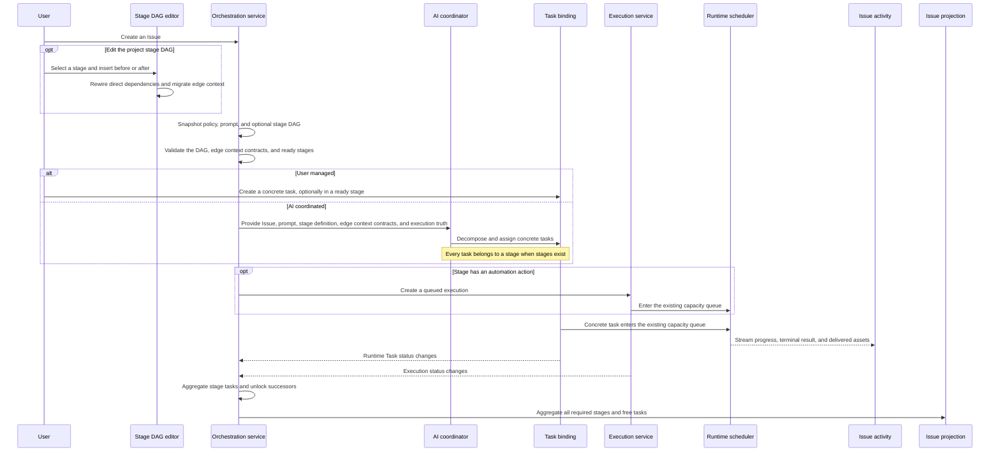

# Issue, task, and workflow orchestration

Scope: Issue task organization, advancement policy, project stage DAGs, Issue stage snapshots, references to concrete tasks and executions, dependency readiness, workspace inheritance, activity projection, and aggregated Issue status.

| Edge                                                  | Code ownership                                                           |
| ----------------------------------------------------- | ------------------------------------------------------------------------ |
| Project orchestration definition and Issue snapshot   | Backend workflow schemas/services; Wework Automation DAG UI              |
| Stage DAG editing and adjacent insertion              | Wework `ProjectWorkflowEditor`; workflow node dependency context          |
| Dependency edge to successor context                  | Workflow node dependency context; Composer / automation instruction      |
| User/AI coordination to concrete tasks                | Standard Wework Composer, AI manager, `LoopItemTaskBinding`               |
| Stage to automated execution                          | `project_automation_execution.py`, `loop_item_executions/service.py`      |
| Workspace and successor-task inheritance              | Runtime Task summary and Wework project work controls                    |
| DAG readiness, stage, and Issue aggregation           | Backend workflow service; local ProjectSpace service; live Wework projection |
| Execution truth to Issue activity                     | Project chat stream, task activity cards, delivery/attachment projection |

Invariants:

- `LoopItem` is the Issue and business aggregate, not one execution.
- A Stage / Node / Milestone is a logical task category and dependency node, not an execution and not an executor type.
- Wework Runtime Tasks, Wegent Tasks, and `LoopItemExecution` remain the concrete task and execution truths. Stages only reference them and never duplicate state, directories, worktrees, branches, or queue fields.
- The stage DAG and advancement policy are orthogonal. User management and AI coordination both work with or without stages.
- A dependency edge is both a readiness constraint and a context contract from the predecessor stage to the successor. Core Issue context is always included; the edge controls whether predecessor final results, delivered assets, and execution activity are added.
- Edge context policy is stored as the successor node's input declaration for a direct predecessor. Removing a dependency must remove its policy as well.
- Inserting before a stage transfers its incoming dependencies and edge-context declarations to the new stage, then makes the selected stage depend on it. Inserting after a stage places the new stage between it and every direct successor, preserving each successor's edge-context declaration.
- AI advances an Issue only by creating, assigning, and starting concrete tasks. With stages, every AI-created task belongs to a stage and follows its dependencies. Without stages, AI may decompose work from the Issue and prompt.
- One Issue may bind multiple heterogeneous tasks, and one stage may aggregate multiple concrete tasks. Tasks remain discoverable in Wework's task list.
- Stage automation controls when and how a concrete execution is created or started; it is not an entity type parallel to Task.
- `inherit` reads a confirmed workspace/worktree/branch only from an explicit predecessor Runtime Task. Without an inheritable source, the standard Composer must request a selection instead of guessing.
- Queued, approval-pending, and dependency-blocked work projects to Pending. Only Runtime-confirmed running work projects to In Progress.
- A stage completes from the trusted terminal state of all required tasks/executions in that stage. An Issue completes from all required stages and free tasks. Completing one task cannot complete a stage or Issue with remaining work.
- The DAG must be acyclic. A referenced stage must exist, dependencies must be satisfied before a stage starts, edge context may reference direct predecessors only, and the UI must never write running directly.
- Issue Activity is the unified execution projection. Streaming cards show compact Runtime truth, completed cards show a final-content summary, and attachment events reference real delivery assets.
