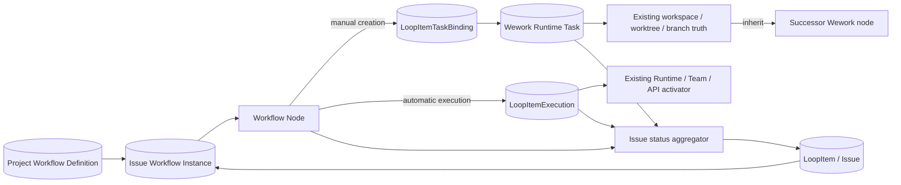
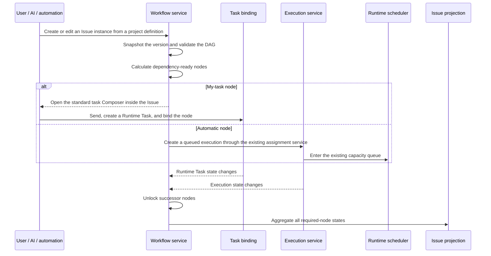

# Issue, task, and workflow orchestration

Scope: project workflow definitions, Issue workflow instances, references to existing tasks and executions, dependency readiness, workspace inheritance, and aggregated Issue status.

| Edge                              | Code ownership                                                         |
| --------------------------------- | ---------------------------------------------------------------------- |
| Project definition and Issue copy | Backend workflow schemas/services; Wework project-space workflow UI     |
| Node to my task                   | Standard Wework Composer, Runtime Task creation, `LoopItemTaskBinding`  |
| Node to automatic execution       | `project_automation_execution.py`, `loop_item_executions/service.py`    |
| Workspace and successor inherit   | Runtime Task summary and Wework project work controls                   |
| DAG readiness and Issue aggregate | Backend workflow service; local ProjectSpace service; live Wework projection |

Invariants:

- `LoopItem` is the Issue and business aggregate, not one execution.
- Wework Runtime Tasks, Wegent Tasks, and `LoopItemExecution` remain the task and execution truths. Workflow nodes only reference them and never duplicate state, directories, worktrees, branches, or queue fields.
- One Issue may bind multiple heterogeneous tasks. A my-task node only creates a task owned by the current user and visible in Wework's task list.
- Manual nodes and automation/AI-generated nodes use the same DAG, executor, dependency, and workspace-policy structure.
- `inherit` reads a confirmed workspace/worktree/branch only from an explicit predecessor Runtime Task. Without an inheritable source, the standard Composer must request a selection instead of guessing.
- Queued, approval-pending, and dependency-blocked work projects to Pending. Only Runtime-confirmed running work projects to In Progress.
- Issue completion is aggregated from every required node's trusted terminal state. Completing one task must not complete an Issue that has other required nodes.
- The DAG must be acyclic, dependencies must be satisfied before execution, and the UI must never write running directly.
