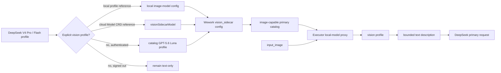
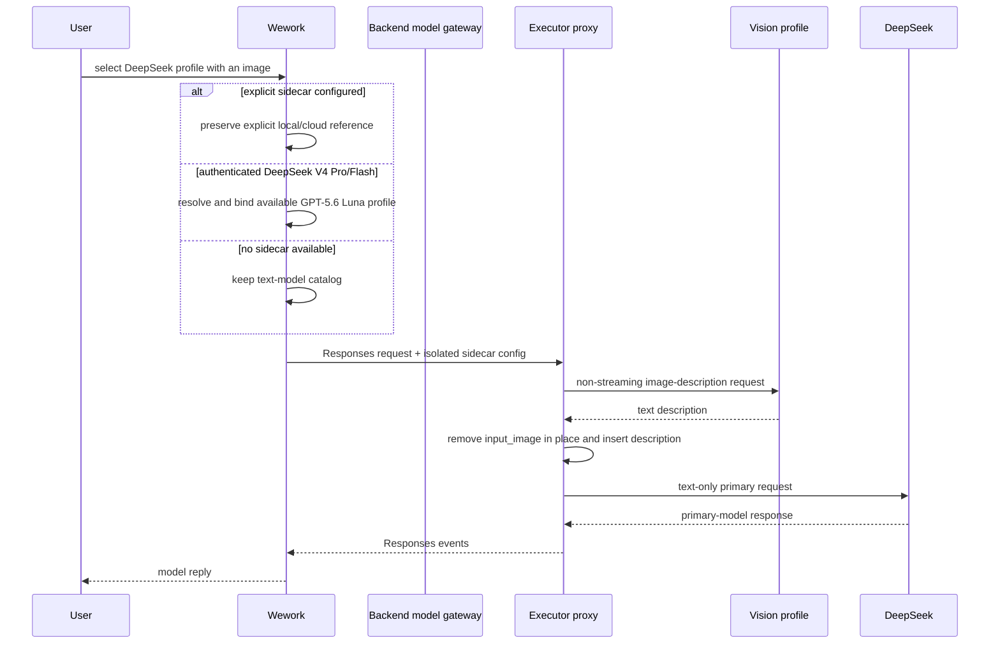

# Text-model vision delegation

Scope: selecting a vision profile, building the sidecar upstream, and replacing images with descriptions before the primary request when Wework runs a DeepSeek V4 Pro/Flash Responses profile through local or cloud Codex execution.

| Edge                                      | Code owner                                                 |
| ----------------------------------------- | ---------------------------------------------------------- |
| Save and validate explicit local profile  | `wework/src/features/model-settings/localModelSettings.ts` |
| DeepSeek default in authenticated catalog | `wework/src/api/hybrid/hybridServices.ts`                  |
| Local/cloud reference serialization       | `wework/src/features/workbench/runtimeModelSelection.ts`   |
| Local/cloud sidecar upstream config       | `wework/src/api/local/localServices.ts`                    |
| Catalog image capability                  | `executor/src/server/codex_model_catalog.rs`               |
| Description, cache, limits, replacement   | `executor/src/server/local_model_proxy/vision.rs`          |
| Proxy registration and primary forwarding | `executor/src/server/local_model_proxy/mod.rs`             |
| Local and cloud desktop regressions       | `wework/e2e/desktop/modules/conversation-navigation.mjs`   |

Invariants: an explicit vision profile always overrides the default; the authenticated default applies only to confirmed `deepseek-v4-pro` and `deepseek-v4-flash` Responses models; the default profile must be resolved from the current authenticated cloud catalog by `modelId=gpt-5.6-luna` plus declared image-input capability, preferring a public profile while preserving its actual name, type, namespace, and resource owner; signed-out execution or a catalog without an eligible Luna profile must not synthesize cloud identity or routing; only a primary model with a valid sidecar uses an image-capable catalog, with DeepSeek-specific variants inheriting the primary model's reasoning, tool, context, and output metadata and the generic `wework-vision-sidecar` reserved for other models; the raw image goes only to the vision profile and the DeepSeek primary request receives text only; a sidecar timeout, invalid image, or upstream failure must remove the image and insert an explicit failure description; logs must not contain images, keys, or prompt bodies.

See [Wework settings](../wework/settings.md) for configuration and limits.
