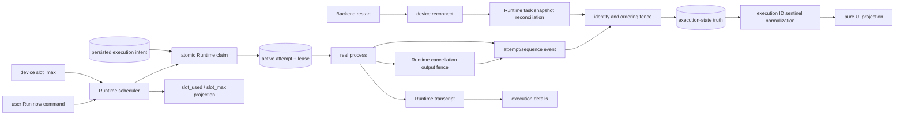
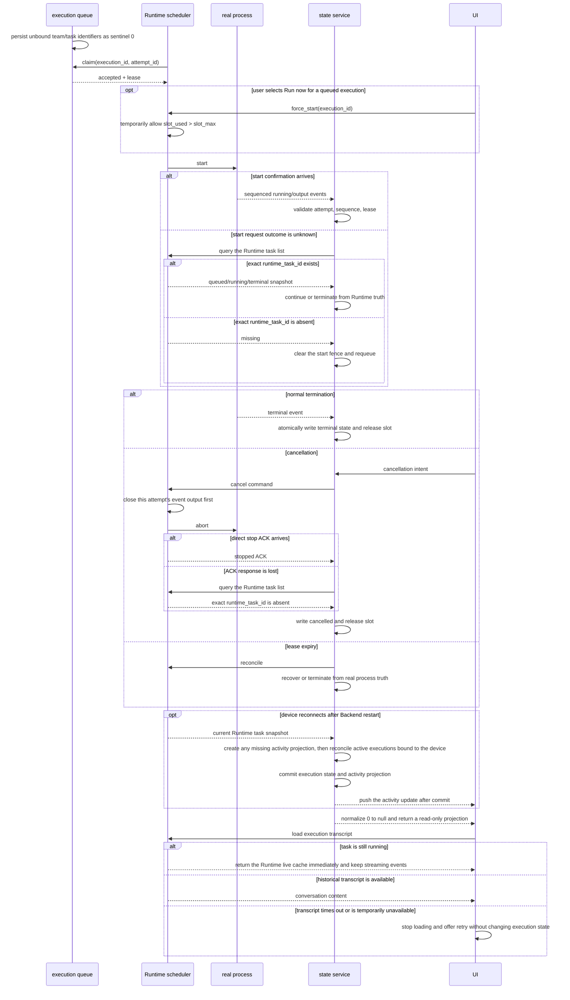

# Project execution state and Runtime capacity

Scope: execution claim, event ordering, cancellation, late events, lease reconciliation, device concurrency capacity, and UI projection.

| Edge                                                         | Code owner                                                                                  |
| ------------------------------------------------------------ | ------------------------------------------------------------------------------------------- |
| Claim, attempt, and state transitions                        | `backend/app/services/loop_item_executions/service.py`                                      |
| Execution ID storage and normalization                       | `backend/app/models/loop_item_execution.py`, execution API/schema                           |
| Scheduler, slots, real process, and cancellation event fence | `executor/src/runner/`, `executor/src/runtime_work/`, `executor/src/local/backend/tasks.rs` |
| Local IPC and Runtime RPC                                    | `executor/src/local/app_ipc.rs`, Backend device runtime service                             |
| Transcript loading and UI projection                         | Wework runtime IPC, pane session, and execution-detail components                           |

Invariants: attempt identity and event sequence must match; late events cannot overwrite a newer attempt; terminal state and slot release are atomic; sending cancellation is not cancellation success. Runtime atomically closes that attempt's event output before aborting the task and emits exactly one cancellation terminal event; detached streaming callbacks cannot project more content after cancellation begins, and Runtime scope exit still guarantees the stopped acknowledgement. A delivered Start whose confirmation was lost must never be resent blindly; only an authoritative Runtime task list proving that the exact `runtime_task_id` is absent may clear the start fence and requeue the same execution intent. Cancelled plus slot release requires either the stop ACK or, after `cancel_requested`, an authoritative Runtime task list proving that the exact `runtime_task_id` is absent. After a Backend restart, the first device reconnect proactively queries the Runtime task snapshot and reconciles active executions bound to that device instead of waiting only for an old lease to expire. Reconnect reconciliation creates any missing activity projection before applying a running or terminal snapshot, then pushes that activity only after commit; Runtime RPC and activity publishing never hold a SQL transaction open. `loop_item_executions.team_id/backend_task_id=0` means unbound only, existence checks must use positive-ID semantics, and APIs/UI must normalize the sentinel to `null`; capacity belongs to each device Runtime scheduler and aggregate capacity is not execution truth; persisted queue state and queued task IDs come from one scheduler snapshot; Run now may temporarily push a selected queued execution beyond `slot_max`, in which case `slot_used` is projected exactly from active task IDs and no other queued execution starts automatically until active usage drops below the limit; a running transcript must prefer the Runtime live cache instead of waiting on a Provider history API that the active turn may occupy; transcript availability is not execution-state truth, so detail-load timeout stops loading, preserves existing content, and offers retry without failing or stopping the execution; UI never derives or writes runtime state.

See [project execution state-of-truth refactoring](../wework/developer-guide/wework-project-execution-state-truth-refactoring.md) for the detailed state matrix and acceptance coverage.
