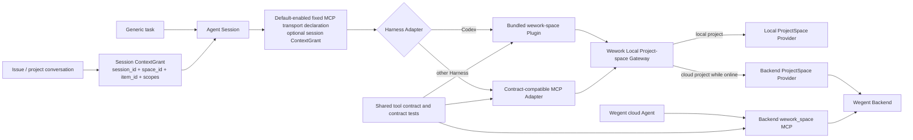
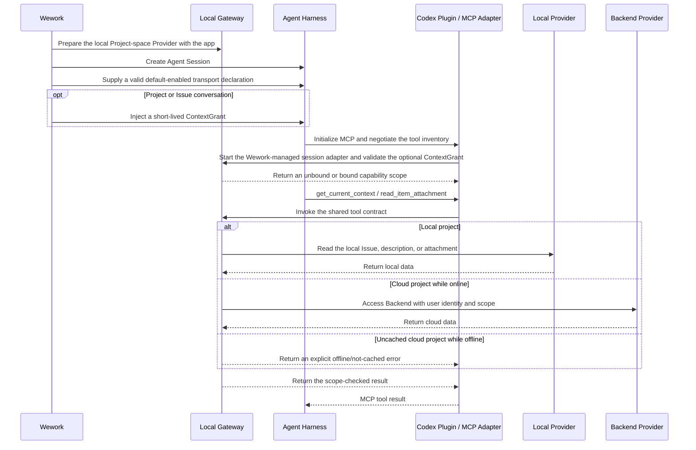

# Project-space Agent capability

Scope: installation, session enablement, Issue-context binding, local offline access, cloud routing, and Agent Harness adaptation for project-space tools in Wework.

| Edge                                                 | Code ownership                                                      |
| ---------------------------------------------------- | ------------------------------------------------------------------- |
| Wework startup to Local Provider lifecycle           | Wework Tauri local executor; Executor local ProjectSpace provider   |
| Agent Session to ContextGrant                        | Wework Runtime message metadata; Executor session context registry  |
| Agent Session to default-enabled fixed MCP transport | Executor Codex adapter; harness-specific MCP adapter                |
| Codex to project-space capability                    | Bundled Wework `wework-space` Codex Plugin; Executor Codex adapter  |
| Other Harness to project-space capability            | Harness-specific MCP adapter                                        |
| Gateway to Local Provider                            | Executor `task_runtime` and local ProjectSpace provider             |
| Gateway to Backend Provider                          | Executor authenticated Backend ProjectSpace client                  |
| Cloud Agent to Backend MCP                           | Backend `wework_space` MCP                                          |
| Shared tool contract to every Adapter                | Shared schema, tool names, permission semantics, and contract tests |

Invariants:

- MCP installation and service declaration are stable configuration; `space_id`, `item_id`, and permissions are session data. Issue context must not be represented by mutating the task's complete MCP Server list.
- Local-project Issues, descriptions, and attachments remain available when Wework is disconnected from Backend. Backend is the cloud-project Provider, not a prerequisite for local capability.
- The Plugin is only the Codex Adapter. Gateway, ContextGrant, and tool contracts must not depend on Codex-specific types.
- The Plugin MCP declaration is the product packaging entry point. Runtime supplies the default-enabled state, actual Executor path, and optional session ContextGrant, so correctness cannot depend on opening the plugin marketplace UI or on asynchronous installation timing.
- The project-space MCP is enabled by default for every Agent session. Generic tasks remain unbound and may select a project explicitly; project or Issue conversations receive default `space_id/item_id` values and out-of-scope protection through ContextGrant.
- A ContextGrant is Agent-session scoped and hidden from the model. Its one-hour validity only limits bootstrap of a new MCP session; once accepted, the lease follows the session adapter lifecycle, so a long-running turn is not interrupted and adapter exit revokes access. Model arguments, prompt text, and a global current-project value are never authorization sources.
- Generic tasks do not bind project context. Project conversations may bind only `space_id`; Issue conversations bind `space_id + item_id`.
- `get_current_context` returns an explicit unbound result when no context exists. MCP startup failure, missing permission, cloud-project offline, and uncached data are distinct errors.
- The Gateway rejects explicit `space_id/item_id` outside the ContextGrant scope and never trusts identifiers supplied by the model.
- Before the first model turn, Runtime validates only the fixed capability configuration and ContextGrant; it must not block the model on a global MCP inventory request. Tool-inventory diagnostics run asynchronously, and capability failures must produce an explicit error while the conversation UI preserves both the user message and failed assistant response.
- Local, remote, and Backend MCP implementations share the same tool schema and contract tests. Providers choose data location without changing tool semantics.
- After migration, the per-task `ensure_space_mcp_server` service-injection path is removed; two primary paths must not remain.
