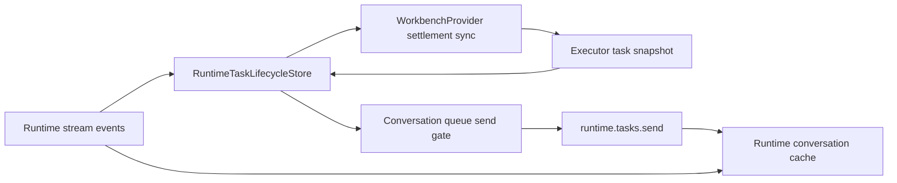

# Runtime conversation queue and execution settlement

## Scope

Governs how Wework distinguishes a terminal turn from an idle Executor task, serializes follow-up delivery, and preserves message-to-turn ownership when stream events arrive before the send response.

## Connection graph



## Sequence

```mermaid
sequenceDiagram
    participant X as Executor
    participant S as Runtime stream
    participant L as LifecycleStore
    participant P as WorkbenchProvider
    participant Q as Conversation queue
    participant C as Conversation cache

    X-->>L: task snapshot running=true
    S-->>L: turn_settled(turn A)
    L->>L: Settle only the turn; keep execution running
    P->>X: Poll task snapshot with a bounded schedule
    X-->>P: running=false
    P->>L: Apply idle task snapshot
    L-->>Q: Allow one queued message to send
    Q->>C: Capture turn IDs that existed before send
    Q->>X: runtime.tasks.send(message B)
    S-->>C: turn B started / output / settled
    X-->>Q: send accepted
    Q->>C: Bind message B to new turn B before assistant output
```

## Code ownership

| Responsibility                                      | Code                                                                                                                              |
| --------------------------------------------------- | --------------------------------------------------------------------------------------------------------------------------------- |
| Runtime execution, turn, and snapshot reduction     | `wework/src/features/workbench/runtimeTaskLifecycle/`                                                                             |
| Executor idle synchronization after terminal events | `wework/src/features/workbench/WorkbenchProvider.tsx`                                                                             |
| Queue gating and delivery                           | `wework/src/components/layout/useWorkbenchPaneSession.ts`, `wework/src/components/layout/workspace-panels/TemporaryChatPanel.tsx` |
| Turn merging and message projection                 | `wework/src/features/workbench/runtimeConversationTurns.ts`                                                                       |
| Shared task-scoped conversation cache               | `wework/src/features/workbench/runtimeConversationCache.ts`                                                                       |

## Essential invariants

- `turn_settled` proves only that the current turn is terminal. It must not project Executor execution as idle while the authoritative task snapshot remains `running=true`.
- After a terminal stream event, bounded snapshot synchronization waits for Executor settlement. The regular queue sends only when the authoritative snapshot is `running=false`.
- At most one queued message per task is sending at a time. A later message also waits until the accepted message's new turn is confirmed.
- An Executor busy response preserves the original queue item and client message ID. It does not trigger blind timer retries or render the message as sent.
- Turn IDs that exist before the request are captured. After acceptance, the user message binds first to a userless turn created during the send, even if that turn completed before the response returned.
- An accepted user message projects before its turn's assistant content and is deduplicated by client message ID.
