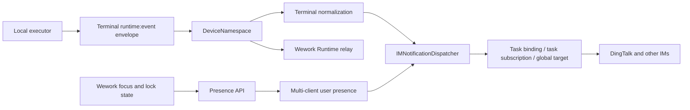
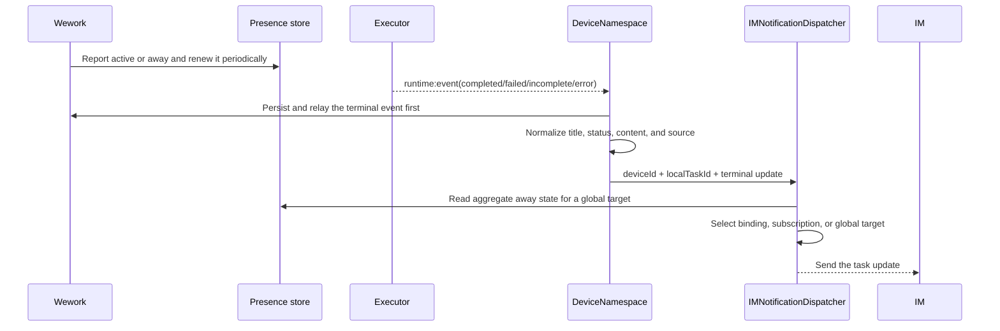

# Runtime task IM notifications

Scope: how a local Runtime task terminal update is delivered to a configured IM session after the user leaves Wework. It excludes streaming an IM-originated continuation back into its card.

| Boundary                         | Code ownership                                                 |
| -------------------------------- | -------------------------------------------------------------- |
| Focus, lock, and heartbeat report | `wework/src/features/workbench/awayImNotificationPresence.ts` |
| Presence and target state        | `backend/app/services/im/session_service.py`                   |
| Runtime terminal envelope        | `executor/src/runtime_work/events.rs`, Runtime handler         |
| Terminal normalization and relay | `backend/app/api/ws/device_namespace.py`                       |
| Session selection and sending    | `backend/app/services/im/notification_dispatcher.py`           |

Invariants: `runtime:event` is the terminal-notification primary path for new executors, while `runtime.tasks.updated` remains only for older executors; the notification entry point accepts only the four terminal types `response.completed`, `response.failed`, `response.incomplete`, and `error`; notification identity is always `deviceId + localTaskId` and never `workspacePath`; an active task binding takes precedence over a task subscription, which takes precedence over the global target; only the global target is gated by aggregate away state, and it must not send while any fresh client is active; a turn with `source.source == "im"` must not echo a notification; a successful terminal update requires non-empty answer content, while failures and cancellations may omit answer text; IM failures must not block Runtime persistence or the Wework relay; logs must not contain answer text, tokens, or channel secrets.
