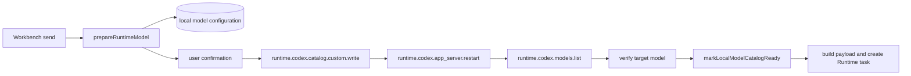
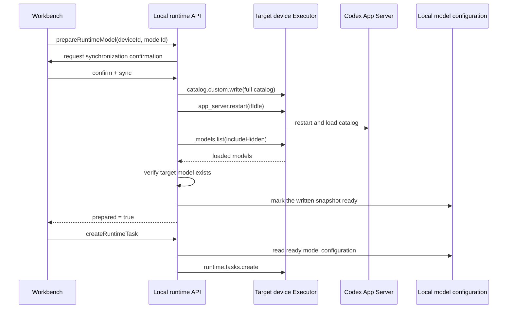

# Runtime model catalog synchronization

Scope: Wework synchronizes locally configured models into the target device's Codex catalog and immediately creates a Runtime task after synchronization.

| Edge                                         | Code owner                                                      |
| -------------------------------------------- | --------------------------------------------------------------- |
| Model preparation before Workbench send      | `wework/src/features/workbench/useWorkbenchRuntimeMessaging.ts` |
| Catalog write, restart, verification, create | `wework/src/api/local/localServices.ts`                         |
| Model configuration versions and ready state | `wework/src/features/model-settings/localModelSettings.ts`      |
| Cloud-device Runtime RPC forwarding          | `backend/app/services/device/runtime_rpc_service.py`            |
| Real-desktop protocol-matrix regression      | `wework/e2e/desktop/modules/desktop-build-flows.mjs`            |

Invariants: catalog synchronization is serialized per device and deduplicated by catalog version; the written snapshot becomes ready only after the catalog write succeeds, Codex restarts successfully, and the target model is queryable; ready updates use `id + updatedAt` and must not overwrite configuration created during synchronization; task payloads may use only ready local models; synchronization failure or cancellation must not create a Runtime task.
