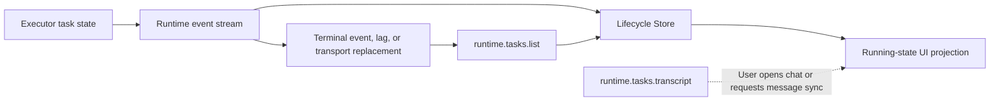
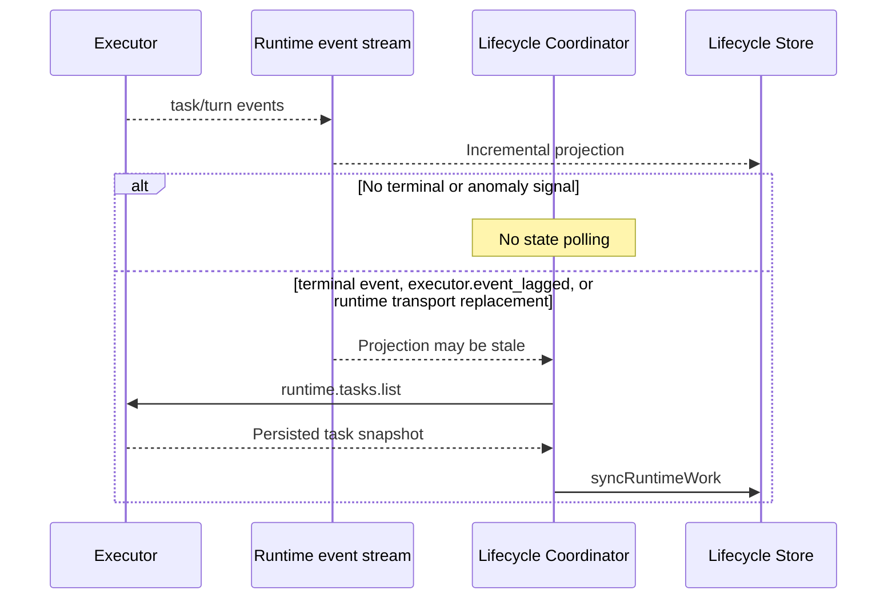

# Runtime task lifecycle reconciliation

## Scope

Governs how Wework consumes Runtime task events, detects a potentially stale local projection, and recovers authoritative task state without polling transcripts.

## Connection graph

## Sequence

## Code ownership

| Responsibility                     | Code                                                                                           |
| ---------------------------------- | ---------------------------------------------------------------------------------------------- |
| Local Executor event parsing       | `wework/src/api/runtime/runtimeChatStream.ts`                                                  |
| Hybrid stream handler routing      | `wework/src/api/hybrid/hybridServices.ts`                                                      |
| Event-driven reconciliation coordinator | `wework/src/features/workbench/runtimeTaskLifecycle/RuntimeTaskLifecycleStreamCoordinator.tsx` |
| Lifecycle truth projection         | `wework/src/features/workbench/runtimeTaskLifecycle/RuntimeTaskLifecycleStore.ts`              |
| Executor task list and transcript  | `executor/src/runtime_work/handler/queries.rs`                                                 |

## Essential invariants

- The normal lifecycle consumes only the event stream and never reads task lists or transcripts on a timer.
- The task pane normally consumes a terminal event and refreshes its task snapshot. If that task is still running after the event loop completes, the resident coordinator performs one fallback `runtime.tasks.list` reconciliation to cover an absent or mismatched pane subscription.
- `executor.event_lagged` and runtime transport replacement also trigger reconciliation because they explicitly indicate that the local projection may be stale.
- Concurrent terminal or anomaly signals share one in-flight reconciliation request; new signals during that request coalesce into at most one serial trailing reconciliation and never create a concurrent request burst or timed retry loop.
- Terminal task state is projected from Executor persistence fields, never inferred from transcripts, turn items, or rollout JSONL.
- Transcript reads serve only user-visible chat loading or explicit message synchronization; they are not lifecycle heartbeats.
