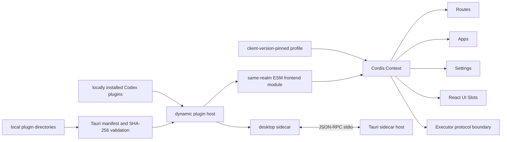
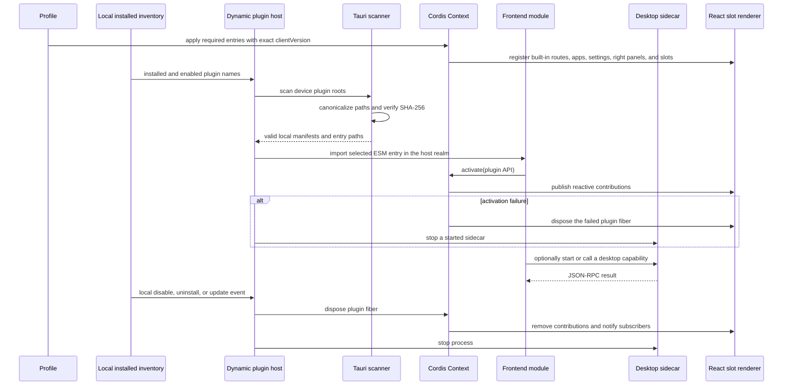

# Wework host plugin runtime

Scope: local product composition, plugin lifecycle, UI contributions, desktop sidecars, and failure recovery for Wework React and Tauri, excluding the Executor implementation. This flow does not depend on Backend or handle cloud plugin distribution.

| Edge                                                                          | Code owner                                                         |
| ----------------------------------------------------------------------------- | ------------------------------------------------------------------ |
| Context, services, and plugin fibers                                          | Pinned `@deepseek-ai/cordis`                                       |
| Wework routes, apps, settings, right panels, slots, and SDK                   | `wework/src/plugin-runtime/`                                       |
| React slot contracts and React 19 renderer                                    | `wework/src/plugin-runtime/slots.tsx`                              |
| Built-in required profile and product entrypoints                             | `wework/src/plugins/`                                              |
| Manifest scan, path/SHA-256 checks, sidecar lifecycle                         | `wework/src-tauri/src/workbench_plugins.rs`                        |
| Local installed inventory and plugin change events                            | Wework local Codex plugin API and plugin workspace                  |
| Executor startup and protocol transport                                       | Existing Executor bridge; Executor internals are outside this flow |

Invariants: the product entrypoint loads only a profile and never enumerates concrete features; every registration belongs to a Cordis effect, and unloading may leave no route, slot, setting, app, right panel, listener, or process behind; React, ReactDOM, Cordis, and the Wework Plugin SDK have exactly one host instance across frontend plugins; required plugins must be pinned by the client profile to an exactly matching `clientVersion`; optional plugins load only when locally installed and enabled and when the device has a valid manifest with matching content hashes; local install, disable, uninstall, or update operations must trigger serialized rescans; dynamic registration and unloading must notify React subscribers; packages without `.wework-plugin/plugin.json` remain valid Executor capability plugins; frontend plugins execute in the same JavaScript realm with host-page authority, so SHA-256 proves content integrity but not publisher identity or permission isolation; sidecars may start only from verified files under approved local plugin directories and inside their package root, and the requested plugin ID must match the manifest; each JSON-RPC method requires an identically named manifest `capabilities` entry, requests are serialized per plugin, notifications and unrelated responses are ignored, and the sidecar is terminated after a 30-second timeout or process exit; this flow does not read cloud desired state, and Backend never loads or executes plugin code.
