```mermaid
graph LR
    Task["📋 Task Input"] --> Bot1["🤖 Bot 1<br/>Developer"]
    Bot1 -->|Code| Bot2["🤖 Bot 2<br/>Reviewer"]
    Bot2 -->|Review Result| Bot3["🤖 Bot 3<br/>Tester"]
    Bot3 -->|Test Report| Bot4["🤖 Bot 4<br/>Deployer"]
    Bot4 --> Result["✅ Final Result"]

    classDef botBox fill:#e8f5e9,stroke:#388e3c,stroke-width:2px
    classDef taskBox fill:#fff3e0,stroke:#f57c00,stroke-width:2px
    class Bot1,Bot2,Bot3,Bot4 botBox
    class Task,Result taskBox
```

```mermaid
graph TD
    Task["📋 Task Input"] --> Leader["👑 Leader Bot<br/>Routing Decision Maker"]
    Leader -->|"Frontend Issue"| FrontendBot["🎨 Frontend Bot"]
    Leader -->|"Backend Issue"| BackendBot["⚙️ Backend Bot"]
    Leader -->|"Database Issue"| DBBot["💾 Database Bot"]
    Leader -->|"DevOps Issue"| DevOpsBot["🔧 DevOps Bot"]
    FrontendBot --> Result["✅ Result"]
    BackendBot --> Result
    DBBot --> Result
    DevOpsBot --> Result

    classDef leaderBox fill:#fff3e0,stroke:#f57c00,stroke-width:2px
    classDef expertBox fill:#e8f5e9,stroke:#388e3c,stroke-width:2px
    classDef taskBox fill:#e3f2fd,stroke:#1976d2,stroke-width:2px
    class Leader leaderBox
    class FrontendBot,BackendBot,DBBot,DevOpsBot expertBox
    class Task,Result taskBox
```

```mermaid
graph TD
    Task["📋 Task Input"] --> Leader1["👑 Leader Bot<br/>Task Decomposition"]

    Leader1 --> Bot1["🤖 Analyst Bot"]
    Leader1 --> Bot2["🤖 Data Bot"]
    Leader1 --> Bot3["🤖 Research Bot"]

    Bot1 --> Leader2["👑 Leader Bot<br/>Result Aggregation"]
    Bot2 --> Leader2
    Bot3 --> Leader2

    Leader2 --> Result["✅ Comprehensive Result"]

    classDef leaderBox fill:#fff3e0,stroke:#f57c00,stroke-width:2px
    classDef workerBox fill:#e8f5e9,stroke:#388e3c,stroke-width:2px
    classDef taskBox fill:#e3f2fd,stroke:#1976d2,stroke-width:2px
    class Leader1,Leader2 leaderBox
    class Bot1,Bot2,Bot3 workerBox
    class Task,Result taskBox
```

```mermaid
graph TD
    Task["📋 Task Input"] --> Context["💬 Shared Context Space"]

    Context <--> Bot1["🤖 Bot 1<br/>Architect"]
    Context <--> Bot2["🤖 Bot 2<br/>Developer"]
    Context <--> Bot3["🤖 Bot 3<br/>Tester"]
    Context <--> Bot4["🤖 Bot 4<br/>Product Manager"]

    Context --> Result["✅ Collaborative Output"]

    classDef contextBox fill:#fff3e0,stroke:#f57c00,stroke-width:2px
    classDef botBox fill:#e8f5e9,stroke:#388e3c,stroke-width:2px
    classDef taskBox fill:#e3f2fd,stroke:#1976d2,stroke-width:2px
    class Context contextBox
    class Bot1,Bot2,Bot3,Bot4 botBox
    class Task,Result taskBox
```

# 🤝 Collaboration Models

This document provides an in-depth introduction to the four collaboration models in Wegent, helping you choose the most suitable pattern for building your agent teams.

---

## 📋 Table of Contents

- [Collaboration Models Overview](#collaboration-models-overview)
- [Pipeline](#pipeline)
- [Route](#route)
- [Coordinate](#coordinate)
- [Collaborate](#collaborate)
- [Model Comparison](#model-comparison)
- [Best Practices](#best-practices)

---

## 🌐 Collaboration Models Overview

Collaboration models define how multiple Bots interact and work together within a Team. Choosing the right collaboration model can significantly improve team efficiency and task completion quality.

### Four Collaboration Models

| Model | Icon | Characteristics | Use Cases |
|-------|------|-----------------|-----------|
| **Pipeline** | 🔄 | Sequential execution, linear flow | Code development workflow, content production pipeline |
| **Route** | 🎯 | Intelligent routing, on-demand assignment | Customer service, problem classification |
| **Coordinate** | 👥 | Parallel coordination, result aggregation | Multi-perspective analysis, parallel task processing |
| **Collaborate** | 💬 | Free collaboration, shared context | Brainstorming, complex problem solving |

### Selection Decision Tree


---

## 🔄 Pipeline

### Overview

Pipeline is the simplest and most intuitive collaboration model. Bots execute sequentially in a predefined order, with each Bot's output becoming the input for the next, forming a complete processing pipeline.

### Workflow Diagram



### Core Features

- ✅ **Sequential Execution**: Strictly follows defined order
- ✅ **Data Passing**: Previous Bot's output automatically passes to next
- ✅ **Simple and Clear**: Easy to understand and maintain
- ✅ **Error Isolation**: Failures can be quickly localized

### Use Cases

#### 1. Software Development Workflow
```
Requirements Analysis → Design → Implementation → Code Review → Testing → Deployment
```

#### 2. Content Production Pipeline
```
Content Creation → Editing → Formatting → Quality Review → Publication
```

#### 3. Data Processing Pipeline
```
Data Collection → Data Cleaning → Data Transformation → Data Analysis → Report Generation
```

### Complete YAML Configuration Example

```yaml
apiVersion: agent.wecode.io/v1
kind: Team
metadata:
  name: dev-pipeline-team
  namespace: default
spec:
  # Collaboration model: pipeline
  collaborationModel: "pipeline"

  # Team members (defined in execution order)
  members:
    # Step 1: Developer
    - name: "developer"
      role: "leader"
      botRef:
        name: developer-bot
        namespace: default
      prompt: |
        You are a senior software developer.
        Your task is to implement the feature based on the requirements.
        Write clean, well-documented code following best practices.

    # Step 2: Code Reviewer
    - name: "reviewer"
      role: "member"
      botRef:
        name: reviewer-bot
        namespace: default
      prompt: |
        You are a code reviewer.
        Review the code for:
        - Code quality and style
        - Potential bugs and security issues
        - Performance optimization opportunities
        Provide constructive feedback.

    # Step 3: Test Engineer
    - name: "tester"
      role: "member"
      botRef:
        name: tester-bot
        namespace: default
      prompt: |
        You are a QA engineer.
        Create comprehensive tests including:
        - Unit tests
        - Integration tests
        - Edge case scenarios
        Execute tests and report results.

    # Step 4: Deployment Expert
    - name: "deployer"
      role: "member"
      botRef:
        name: deployer-bot
        namespace: default
      prompt: |
        You are a DevOps engineer.
        Prepare the deployment:
        - Build the application
        - Create deployment configuration
        - Document deployment steps
```

### Real-World Case

#### Case 1: Blog Article Production Pipeline

```yaml
apiVersion: agent.wecode.io/v1
kind: Team
metadata:
  name: blog-production-pipeline
  namespace: default
spec:
  collaborationModel: "pipeline"
  members:
    - name: "writer"
      role: "leader"
      botRef:
        name: content-writer-bot
        namespace: default
      prompt: "Write an engaging blog post on the given topic with proper structure and flow."

    - name: "editor"
      role: "member"
      botRef:
        name: content-editor-bot
        namespace: default
      prompt: "Edit the content for grammar, clarity, and readability. Improve sentence structure and flow."

    - name: "seo-optimizer"
      role: "member"
      botRef:
        name: seo-bot
        namespace: default
      prompt: "Optimize the content for SEO: add meta descriptions, keywords, and improve headings."

    - name: "publisher"
      role: "member"
      botRef:
        name: publisher-bot
        namespace: default
      prompt: "Format the content for publication and create a publishing checklist."
```

**Execution Flow**:
1. Writer Bot creates initial draft
2. Editor Bot edits and improves article
3. SEO Optimizer Bot performs SEO optimization
4. Publisher Bot prepares for publication

---

## 🎯 Route

### Overview

Route model uses a Leader Bot to intelligently route tasks to the most suitable expert Bot based on task content. Ideal for scenarios requiring different handling paths based on varying conditions.

### Workflow Diagram



### Core Features

- ✅ **Intelligent Routing**: Leader Bot analyzes task and selects best expert
- ✅ **Specialized Roles**: Each Bot focuses on specific domain
- ✅ **Flexible and Efficient**: Dynamically selects execution path based on needs
- ✅ **Extensible**: Easy to add new expert Bots

### Use Cases

#### 1. Intelligent Customer Service
```
Customer Question → Classification → {Technical Support|After-Sales|Sales|Complaints}
```

#### 2. Technical Support Platform
```
Technical Issue → Analysis → {Frontend Expert|Backend Expert|Database Expert|DevOps Expert}
```

#### 3. Content Distribution System
```
Content Submission → Classification → {News|Tech|Entertainment|Sports} Channel
```

### Complete YAML Configuration Example

```yaml
apiVersion: agent.wecode.io/v1
kind: Team
metadata:
  name: tech-support-route-team
  namespace: default
spec:
  # Collaboration model: route
  collaborationModel: "route"

  # Team members
  members:
    # Leader: Routing Decision Maker
    - name: "router"
      role: "leader"
      botRef:
        name: router-bot
        namespace: default
      prompt: |
        You are a technical support router.
        Analyze the user's question and route it to the appropriate specialist:
        - Frontend issues → frontend-expert
        - Backend issues → backend-expert
        - Database issues → database-expert
        - DevOps/Infrastructure issues → devops-expert

        Provide a brief analysis of why you chose this specialist.

    # Expert 1: Frontend Specialist
    - name: "frontend-expert"
      role: "member"
      botRef:
        name: frontend-specialist-bot
        namespace: default
      prompt: |
        You are a frontend development expert specializing in:
        - React, Vue, Angular
        - HTML, CSS, JavaScript/TypeScript
        - UI/UX best practices
        - Browser compatibility

        Provide detailed, actionable solutions to frontend problems.

    # Expert 2: Backend Specialist
    - name: "backend-expert"
      role: "member"
      botRef:
        name: backend-specialist-bot
        namespace: default
      prompt: |
        You are a backend development expert specializing in:
        - Python, Java, Node.js
        - RESTful API design
        - Microservices architecture
        - Performance optimization

        Provide detailed, actionable solutions to backend problems.

    # Expert 3: Database Specialist
    - name: "database-expert"
      role: "member"
      botRef:
        name: database-specialist-bot
        namespace: default
      prompt: |
        You are a database expert specializing in:
        - SQL and NoSQL databases
        - Query optimization
        - Database design and normalization
        - Indexing strategies

        Provide detailed, actionable solutions to database problems.

    # Expert 4: DevOps Specialist
    - name: "devops-expert"
      role: "member"
      botRef:
        name: devops-specialist-bot
        namespace: default
      prompt: |
        You are a DevOps expert specializing in:
        - Docker and Kubernetes
        - CI/CD pipelines
        - Cloud infrastructure (AWS, GCP, Azure)
        - Monitoring and logging

        Provide detailed, actionable solutions to DevOps problems.
```

### Real-World Case

#### Case 1: Multi-Language Programming Q&A Platform

```yaml
apiVersion: agent.wecode.io/v1
kind: Team
metadata:
  name: programming-qa-route-team
  namespace: default
spec:
  collaborationModel: "route"
  members:
    - name: "language-router"
      role: "leader"
      botRef:
        name: language-router-bot
        namespace: default
      prompt: |
        Analyze the programming question and route to the appropriate language expert:
        - Python questions → python-expert
        - JavaScript/TypeScript → js-expert
        - Java/Kotlin → jvm-expert
        - Go → go-expert

    - name: "python-expert"
      role: "member"
      botRef:
        name: python-bot
        namespace: default
      prompt: "You are a Python expert. Answer Python-related questions with code examples and best practices."

    - name: "js-expert"
      role: "member"
      botRef:
        name: javascript-bot
        namespace: default
      prompt: "You are a JavaScript/TypeScript expert. Provide modern ES6+ solutions and TypeScript types."

    - name: "jvm-expert"
      role: "member"
      botRef:
        name: java-bot
        namespace: default
      prompt: "You are a JVM expert. Answer Java and Kotlin questions with attention to performance."

    - name: "go-expert"
      role: "member"
      botRef:
        name: go-bot
        namespace: default
      prompt: "You are a Go expert. Provide idiomatic Go solutions emphasizing concurrency."
```

---

## 👥 Coordinate

### Overview

Coordinate model has a Leader Bot decompose tasks and assign them to multiple Bots for parallel processing, then collect and aggregate all Bot results to form the final comprehensive output.

### Workflow Diagram



### Core Features

- ✅ **Parallel Processing**: Multiple Bots work simultaneously for efficiency
- ✅ **Task Decomposition**: Leader breaks down complex tasks
- ✅ **Result Aggregation**: Leader integrates multiple perspective outputs
- ✅ **Comprehensive and In-depth**: Analyzes problems from multiple angles

### Use Cases

#### 1. Market Research Analysis
```
Market Research Task → {Competitor Analysis|User Research|Trend Analysis|Data Statistics} → Comprehensive Report
```

#### 2. Code Review
```
Code Review Task → {Security Review|Performance Review|Code Quality|Test Coverage} → Review Report
```

#### 3. Content Creation
```
Article Topic → {Material Collection|Case Study|Data Analysis|Expert Opinion} → Complete Article
```

### Complete YAML Configuration Example

```yaml
apiVersion: agent.wecode.io/v1
kind: Team
metadata:
  name: market-research-coordinate-team
  namespace: default
spec:
  # Collaboration model: coordinate
  collaborationModel: "coordinate"

  # Team members
  members:
    # Leader: Coordinator
    - name: "coordinator"
      role: "leader"
      botRef:
        name: coordinator-bot
        namespace: default
      prompt: |
        You are a market research coordinator.

        PHASE 1 - Task Decomposition:
        Break down the market research task into parallel workstreams:
        1. Competitor analysis
        2. Customer sentiment analysis
        3. Market trend analysis
        4. Data collection and statistics

        Assign each workstream to the appropriate specialist.

        PHASE 2 - Result Synthesis:
        After receiving all reports, synthesize them into a comprehensive
        market research report with:
        - Executive summary
        - Key findings from each area
        - Strategic recommendations
        - Data visualizations and insights

    # Expert 1: Competitor Analyst
    - name: "competitor-analyst"
      role: "member"
      botRef:
        name: competitor-analyst-bot
        namespace: default
      prompt: |
        You are a competitor analysis specialist.
        Analyze:
        - Main competitors and market share
        - Competitor strategies and positioning
        - Strengths and weaknesses
        - Competitive advantages

        Provide a detailed competitor analysis report.

    # Expert 2: Customer Insights Analyst
    - name: "customer-analyst"
      role: "member"
      botRef:
        name: customer-analyst-bot
        namespace: default
      prompt: |
        You are a customer insights specialist.
        Analyze:
        - Customer demographics and segments
        - Customer pain points and needs
        - Customer satisfaction and feedback
        - Buying behavior patterns

        Provide a detailed customer analysis report.

    # Expert 3: Trend Analyst
    - name: "trend-analyst"
      role: "member"
      botRef:
        name: trend-analyst-bot
        namespace: default
      prompt: |
        You are a market trend specialist.
        Analyze:
        - Industry trends and future outlook
        - Emerging technologies and innovations
        - Regulatory and policy changes
        - Market opportunities and threats

        Provide a detailed trend analysis report.

    # Expert 4: Data Analyst
    - name: "data-analyst"
      role: "member"
      botRef:
        name: data-analyst-bot
        namespace: default
      prompt: |
        You are a data analytics specialist.
        Analyze:
        - Market size and growth rates
        - Statistical trends and patterns
        - Revenue forecasts
        - Key performance indicators

        Provide a detailed data analysis report with visualizations.
```

### Real-World Case

#### Case 1: Comprehensive Code Review Team

```yaml
apiVersion: agent.wecode.io/v1
kind: Team
metadata:
  name: comprehensive-code-review-team
  namespace: default
spec:
  collaborationModel: "coordinate"
  members:
    - name: "review-coordinator"
      role: "leader"
      botRef:
        name: review-coordinator-bot
        namespace: default
      prompt: |
        Coordinate a comprehensive code review:
        1. Distribute code to specialized reviewers
        2. Collect all review feedback
        3. Synthesize into a final review report with prioritized action items

    - name: "security-reviewer"
      role: "member"
      botRef:
        name: security-bot
        namespace: default
      prompt: "Review code for security vulnerabilities, injection risks, and authentication issues."

    - name: "performance-reviewer"
      role: "member"
      botRef:
        name: performance-bot
        namespace: default
      prompt: "Review code for performance issues, optimization opportunities, and scalability."

    - name: "quality-reviewer"
      role: "member"
      botRef:
        name: quality-bot
        namespace: default
      prompt: "Review code quality, maintainability, design patterns, and best practices."

    - name: "test-reviewer"
      role: "member"
      botRef:
        name: test-bot
        namespace: default
      prompt: "Review test coverage, test quality, and identify missing test scenarios."
```

---

## 💬 Collaborate

### Overview

Collaborate model allows all Bots to freely discuss and collaborate in a shared context, without fixed execution order or clear role divisions. All Bots can see each other's messages and respond based on the overall conversation.

### Workflow Diagram



### Core Features

- ✅ **Shared Context**: All Bots see complete conversation history
- ✅ **Free Discussion**: No fixed order, Bots can participate anytime
- ✅ **Collective Intelligence**: Promotes creativity and multi-perspective thinking
- ✅ **Dynamic Interaction**: Bots can respond to others' viewpoints

### Use Cases

#### 1. Brainstorming Sessions
```
Creative Topic → [Product Manager ↔ Designer ↔ Engineer ↔ Marketing] → Creative Solutions
```

#### 2. Technical Solution Design
```
Technical Challenge → [Architect ↔ Developer ↔ DBA ↔ DevOps] → Technical Solution
```

#### 3. Complex Problem Diagnosis
```
System Issue → [Backend ↔ Frontend ↔ DBA ↔ DevOps] → Root Cause
```

### Complete YAML Configuration Example

```yaml
apiVersion: agent.wecode.io/v1
kind: Team
metadata:
  name: product-brainstorm-team
  namespace: default
spec:
  # Collaboration model: collaborate
  collaborationModel: "collaborate"

  # Team members (all participate equally)
  members:
    # Product Manager Perspective
    - name: "product-manager"
      role: "member"
      botRef:
        name: pm-bot
        namespace: default
      prompt: |
        You are a product manager participating in a brainstorming session.
        Focus on:
        - User needs and market fit
        - Feature prioritization
        - Business value and ROI
        - User experience

        Engage actively with other team members' ideas and build upon them.

    # Technical Architect Perspective
    - name: "architect"
      role: "member"
      botRef:
        name: architect-bot
        namespace: default
      prompt: |
        You are a software architect participating in a brainstorming session.
        Focus on:
        - Technical feasibility
        - System design and scalability
        - Integration challenges
        - Technical debt considerations

        Provide technical insights and collaborate with the team.

    # UX Designer Perspective
    - name: "ux-designer"
      role: "member"
      botRef:
        name: ux-bot
        namespace: default
      prompt: |
        You are a UX designer participating in a brainstorming session.
        Focus on:
        - User interface and interaction design
        - User journey and experience
        - Accessibility and usability
        - Visual design principles

        Contribute design perspectives and iterate on ideas.

    # Data Analyst Perspective
    - name: "data-analyst"
      role: "member"
      botRef:
        name: data-bot
        namespace: default
      prompt: |
        You are a data analyst participating in a brainstorming session.
        Focus on:
        - Data-driven insights
        - Metrics and KPIs
        - User behavior analysis
        - A/B testing opportunities

        Provide analytical perspective and support decisions with data.

    # Marketing Expert Perspective
    - name: "marketing-expert"
      role: "member"
      botRef:
        name: marketing-bot
        namespace: default
      prompt: |
        You are a marketing expert participating in a brainstorming session.
        Focus on:
        - Market positioning
        - Target audience
        - Go-to-market strategy
        - Competitive differentiation

        Contribute marketing insights and collaborate on strategy.
```

### Real-World Case

#### Case 1: System Incident Response Team

```yaml
apiVersion: agent.wecode.io/v1
kind: Team
metadata:
  name: incident-response-team
  namespace: default
spec:
  collaborationModel: "collaborate"
  members:
    - name: "backend-engineer"
      role: "member"
      botRef:
        name: backend-sre-bot
        namespace: default
      prompt: |
        You are a backend engineer responding to a system incident.
        Check: API services, application logs, error rates, service dependencies.
        Share findings and collaborate to identify root cause.

    - name: "database-admin"
      role: "member"
      botRef:
        name: dba-bot
        namespace: default
      prompt: |
        You are a database administrator responding to a system incident.
        Check: Database performance, query performance, connections, locks, replication status.
        Share findings and collaborate to identify root cause.

    - name: "frontend-engineer"
      role: "member"
      botRef:
        name: frontend-sre-bot
        namespace: default
      prompt: |
        You are a frontend engineer responding to a system incident.
        Check: Client-side errors, network requests, browser console, CDN status.
        Share findings and collaborate to identify root cause.

    - name: "devops-engineer"
      role: "member"
      botRef:
        name: devops-bot
        namespace: default
      prompt: |
        You are a DevOps engineer responding to a system incident.
        Check: Infrastructure health, container status, network connectivity, resource usage.
        Share findings and collaborate to identify root cause.
```

#### Case 2: Innovation Product Design Workshop

```yaml
apiVersion: agent.wecode.io/v1
kind: Team
metadata:
  name: innovation-workshop-team
  namespace: default
spec:
  collaborationModel: "collaborate"
  members:
    - name: "creative-thinker"
      role: "member"
      botRef:
        name: creative-bot
        namespace: default
      prompt: "Generate innovative and out-of-the-box ideas. Challenge assumptions and explore possibilities."

    - name: "practical-analyst"
      role: "member"
      botRef:
        name: analyst-bot
        namespace: default
      prompt: "Evaluate ideas for feasibility, cost, and practicality. Provide realistic assessments."

    - name: "customer-advocate"
      role: "member"
      botRef:
        name: customer-bot
        namespace: default
      prompt: "Represent the customer perspective. Ensure ideas truly solve user problems."

    - name: "tech-innovator"
      role: "member"
      botRef:
        name: tech-bot
        namespace: default
      prompt: "Explore cutting-edge technologies that could enable innovative solutions."
```

---

## 📊 Model Comparison

### Feature Comparison Table

| Feature | Pipeline | Route | Coordinate | Collaborate |
|---------|----------|-------|------------|-------------|
| **Execution Order** | Fixed sequence | Dynamic single path | Parallel execution | No fixed order |
| **Bot Interaction** | Unidirectional passing | Leader → Expert | Leader coordination | Full interaction |
| **Context Sharing** | Partial (sequential) | Independent context | Leader aggregation | Fully shared |
| **Team Size** | 3-6 Bots | 1 Leader + N experts | 1 Leader + 3-5 experts | 3-8 Bots |
| **Execution Efficiency** | Medium (serial) | High (single path) | High (parallel) | Medium (discussion) |
| **Result Complexity** | Linear accumulation | Single expert output | Comprehensive report | Consensus result |
| **Ease of Use** | ⭐⭐⭐⭐⭐ | ⭐⭐⭐⭐ | ⭐⭐⭐ | ⭐⭐⭐ |
| **Flexibility** | ⭐⭐ | ⭐⭐⭐⭐ | ⭐⭐⭐⭐ | ⭐⭐⭐⭐⭐ |

### Use Case Comparison


### Performance Comparison

| Model | Average Time | Parallelism | Resource Consumption | Predictability |
|-------|--------------|-------------|----------------------|----------------|
| **Pipeline** | N × T | Low (serial) | Low | High |
| **Route** | T + routing time | Low (single path) | Low | High |
| **Coordinate** | T + aggregation time | High (parallel) | High | Medium |
| **Collaborate** | Uncertain | High (concurrent) | High | Low |

*Note: N = Number of Bots, T = Average processing time per Bot*

---

## 💡 Best Practices

### 1. Pipeline Best Practices

#### ✅ Recommended
- Each stage has single clear responsibility
- Control pipeline length (max 6 steps recommended)
- Clear input/output expectations in each Bot's prompt
- Add error handling and validation steps

#### ❌ Avoid
- Overly long pipelines (more than 8 steps)
- Overlapping responsibilities between steps
- Missing intermediate validation
- Illogical Bot ordering

#### Example: Optimized Pipeline Design
```yaml
members:
  - name: "validator"        # First validate input
  - name: "processor"        # Then process
  - name: "quality-check"    # Quality check
  - name: "finalizer"        # Finally complete
```

### 2. Route Best Practices

#### ✅ Recommended
- Clear and accurate routing logic in Leader Bot
- Well-defined expert domains without overlap
- Detailed routing rules for Leader
- Include default routing for unknown cases

#### ❌ Avoid
- Ambiguous routing rules
- Expert domain overlap causing selection difficulty
- Missing default handling path
- Overly complex routing decisions

#### Example: Clear Routing Rules
```yaml
- name: "router"
  prompt: |
    Route questions based on clear criteria:
    - If about UI/UX/styling → frontend-expert
    - If about API/database/server → backend-expert
    - If about deployment/infrastructure → devops-expert
    - If unclear or mixed → general-expert (default)
```

### 3. Coordinate Best Practices

#### ✅ Recommended
- Leader has clear task decomposition strategy
- Expert Bot responsibilities don't overlap
- Leader needs strong aggregation capability
- Control parallel Bot count (3-5 optimal)

#### ❌ Avoid
- Unbalanced task decomposition
- Too many parallel Bots (more than 7)
- Leader lacks aggregation guidance
- Inconsistent expert output formats

#### Example: Structured Coordination
```yaml
- name: "coordinator"
  prompt: |
    STEP 1: Decompose task into 4 parallel workstreams
    STEP 2: Assign to specialists
    STEP 3: Collect all reports in structured format
    STEP 4: Synthesize into unified report with:
      - Executive summary
      - Key findings per specialist
      - Recommendations
```

### 4. Collaborate Best Practices

#### ✅ Recommended
- Define clear collaboration goals
- Each Bot has clear perspective/role
- Set discussion rounds or stopping conditions
- Encourage Bots to reference and respond to each other

#### ❌ Avoid
- Lack of clear goals causing divergence
- Vague role definitions
- No discussion termination conditions
- Bots talking past each other without interaction

#### Example: Effective Collaboration Setup
```yaml
members:
  - name: "architect"
    prompt: |
      Role: Technical Architect
      Goal: Design scalable solution
      Interaction: Build on others' ideas, raise technical concerns

  - name: "product"
    prompt: |
      Role: Product Manager
      Goal: Ensure user value
      Interaction: Connect features to user needs, prioritize

  # Include facilitation instructions
  - name: "facilitator"
    role: "leader"
    prompt: |
      Guide discussion towards concrete action items.
      Summarize when reaching consensus.
      Keep discussion focused on the goal.
```

### 5. General Best Practices

#### Prompt Design
```yaml
prompt: |
  # Good Prompt Structure:
  1. Role definition: You are a [role]...
  2. Responsibilities: Your responsibilities include...
  3. Input description: You will receive...
  4. Output requirements: Provide output in the format...
  5. Quality criteria: Ensure [quality criteria]...
```

#### Team Size Recommendations
- **Pipeline**: 3-6 Bots
- **Route**: 1 Leader + 3-8 experts
- **Coordinate**: 1 Leader + 3-5 experts
- **Collaborate**: 3-8 Bots

#### Performance Optimization
- For simple tasks, prefer Pipeline or Route
- For in-depth tasks, choose Coordinate
- For creative tasks, choose Collaborate
- Avoid over-engineering, start with simple models

---

## 🎓 Real-World Case Library

### Case 1: News Insights Platform (Coordinate)

```yaml
apiVersion: agent.wecode.io/v1
kind: Team
metadata:
  name: news-insight-team
  namespace: default
spec:
  collaborationModel: "coordinate"
  members:
    - name: "coordinator"
      role: "leader"
      botRef: {name: coordinator-bot, namespace: default}
      prompt: "Coordinate news analysis: assign data collection, sentiment analysis, and trend identification. Synthesize comprehensive news report."

    - name: "news-collector"
      role: "member"
      botRef: {name: collector-bot, namespace: default}
      prompt: "Collect news from multiple sources on the given topic. Provide summaries with sources and timestamps."

    - name: "sentiment-analyzer"
      role: "member"
      botRef: {name: sentiment-bot, namespace: default}
      prompt: "Analyze sentiment and tone of news articles. Identify positive, negative, and neutral coverage."

    - name: "trend-identifier"
      role: "member"
      botRef: {name: trend-bot, namespace: default}
      prompt: "Identify emerging trends and patterns in news coverage. Highlight key themes and developments."
```

### Case 2: Full-Stack Development Team (Pipeline)

```yaml
apiVersion: agent.wecode.io/v1
kind: Team
metadata:
  name: fullstack-dev-team
  namespace: default
spec:
  collaborationModel: "pipeline"
  members:
    - name: "requirements-analyst"
      role: "leader"
      botRef: {name: analyst-bot, namespace: default}
      prompt: "Analyze requirements and create detailed technical specifications."

    - name: "backend-developer"
      role: "member"
      botRef: {name: backend-bot, namespace: default}
      prompt: "Implement backend API based on specifications. Use Python FastAPI."

    - name: "frontend-developer"
      role: "member"
      botRef: {name: frontend-bot, namespace: default}
      prompt: "Build frontend interface using React. Integrate with backend API."

    - name: "integration-tester"
      role: "member"
      botRef: {name: tester-bot, namespace: default}
      prompt: "Test full-stack integration. Report any issues or bugs."
```

---

## 🔗 Related Resources

- [Core Concepts](./core-concepts.md) - Understand Bot, Team, and other core concepts
- [System Architecture](./architecture.md) - Learn about Wegent's architecture design
- [YAML Specification](../reference/yaml-specification.md) - Complete configuration format guide
- [Agent Settings Guide](../guides/user/agent-settings.md) - Configure agents and collaboration modes

---

<p align="center">Choosing the right collaboration model is key to success! 🚀</p>
