# Core Concepts

This document introduces the core concepts of the Wegent platform to help you understand each component and their relationships.

---

## 🚀 Platform Features Overview

Wegent is an open-source AI-native operating system that provides five core feature modules:

### 💬 Chat - AI Conversation

A fully open-source chat agent supporting:

- **Multi-model compatibility**: DeepSeek, GLM, GPT, Claude, and other protocol-compatible models
- **Conversation history**: Create new conversations, multi-turn dialogues, save and share history
- **Group chat**: AI group conversations where AI responds based on chat history
- **Attachment parsing**: Send txt, pdf, ppt, doc, and image attachments in single/group chats
- **Follow-up mode**: Model helps clarify your thoughts through heuristic questions
- **Correction mode**: Automatically invoke multiple models to correct answers
- **Long-term memory**: Support mem0 integration for conversation memory
- **Sandbox execution**: Execute commands or modify files via sandbox (E2B protocol compatible)
- **Customization**: Configure prompts, MCP servers, and Skills (includes chart drawing skill)

### 💻 Code - Cloud Coding Engine

A cloud-based Claude Code execution engine supporting:

- **Model configuration**: Configure various Claude protocol-compatible models
- **Parallel execution**: Execute multiple coding tasks simultaneously in the cloud
- **Requirements clarification**: AI analyzes code and questions to generate specification documents
- **Git integration**: Integrate with GitHub/GitLab/Gitea/Gerrit for cloning, modifying, and creating PRs
- **MCP/Skill integration**: Configure MCP servers and Skills for agents
- **Multi-turn conversations**: Continue conversations with follow-up questions

### 📡 Follow - AI Task Trigger

A cloud-based AI task trigger supporting:

- **Full capabilities**: Tasks can use all Chat and Code features
- **Scheduled/Event triggers**: Execute AI tasks on schedule or based on events (e.g., summarize AI news daily at 9 AM)
- **Information feed**: Display AI-generated information streams
- **Event filtering**: Filter events (e.g., "only notify me if it will rain tomorrow")

### 📚 Knowledge - AI Document Repository

A cloud-based AI document repository supporting:

- **Document management**: Upload and manage txt/doc/ppt/xls and other format documents
- **Import sources**: Import web pages and DingTalk multi-dimensional tables
- **NotebookLM mode**: Select documents directly in notebooks for Q&A
- **Online editing**: Edit text files online in notebook mode
- **Knowledge reference**: Let AI reference knowledge base in single/group chats

### ⚙️ Customization - Fully Configurable

All features above are customizable:

- **Web-based agent creation**: Create custom agents with prompts, MCP, Skills, and multi-agent collaboration
- **Agent wizard**: Automatically generate and fine-tune prompts based on requirements
- **Group sharing**: Create and join groups to share agents, models, Skills, and more

---

## 🤖 Understanding Agents and Bots

### What is an Agent?

An **Agent** is the AI assistant you interact with directly. When you create a task or start a conversation, you're working with an Agent. Think of it as your personal AI team that can help you with various tasks.

### What is a Bot?

A **Bot** is a building block that makes up an Agent. Each Bot is configured with:
- **Persona (Ghost)**: Defines the Bot's personality, expertise, and available tools
- **Executor (Shell)**: The engine that executes tasks (Chat, Code, etc.)
- **Model**: The AI model powering the Bot (GPT, Claude, etc.)

### How They Work Together

```
Bot = Persona + Executor + Model
Agent = One or more Bots working together
Task = Agent + Your request
```

**Example:**
- A simple chat Agent might have just one Bot
- A development Agent might have multiple Bots: one for coding, one for code review, one for testing

---

## 🔄 Concept Relationship Diagram

```mermaid
graph LR
    subgraph Main["Task Execution Flow"]
        direction TB
        User["👤 You"]
        Web["🌐 Web"]
        API["🔌 API"]
        IM["💬 IM"]
        Task["🎯 Task"]
        Wegent["🌐 Wegent System"]
        
        User --> Web
        User --> API
        User --> IM
        Web --> Task
        API --> Task
        IM --> Task
        Task --> Wegent
        
        subgraph Workspace["💼 Workspace"]
            subgraph Cloud["☁️ Cloud Host"]
                ClaudeCode1["🐚 Claude Code"]
                WegentChat1["💬 Wegent Chat"]
            end
            
            subgraph PC["💻 Personal Computer"]
                ClaudeCode2["🐚 Claude Code"]
                WegentChat2["💬 Wegent Chat"]
            end
        end
        
        Wegent --> Cloud
        Wegent --> PC
    end
    
    subgraph AgentDetail["📋 Agent Structure"]
        direction TB
        AgentNote["🤖 Agent"]
        Bot1["🔧 Bot 1"]
        Bot2["🔧 Bot 2"]
        Ghost1["👻 Persona"]
        Model1["🧠 Model"]
        Ghost2["👻 Persona"]
        Model2["🧠 Model"]
        Prompt1["📝 Prompt"]
        Skill1["🎯 Skill 1"]
        Skill2["🎯 Skill 2"]
        
        AgentNote --> Bot1
        AgentNote --> Bot2
        Bot1 --> Ghost1
        Bot1 --> Model1
        Bot2 --> Ghost2
        Bot2 --> Model2
        Ghost1 --> Prompt1
        Ghost1 -.-> Skill1
        Ghost1 -.-> Skill2
        Ghost2 -.-> Skill1
    end
```



> **Note:**
> - Users can submit tasks via Web, API, or IM.
> - Tasks are submitted to the Wegent system, which dispatches them to Workspaces (Cloud Host or Personal Computer).
> - Workspaces run Claude Code or Wegent Chat executors.
> - Agents consist of multiple Bots, each containing a Persona and Model. Skills (dotted lines) are loaded on-demand.

---

## 🎯 Key Components Explained

### 👻 Persona (Ghost)

The **Persona** defines what your AI assistant knows and how it behaves. It includes:
- System instructions (e.g., "You are a helpful coding assistant")
- Available tools and MCP servers
- Skills that can be loaded on-demand
- Behavioral guidelines

### 🐚 Executor (Shell)

The **Executor** determines how and where your AI executes tasks. It includes:

| Executor | Best For |
|----------|----------|
| **Chat** | Quick conversations, Q&A |
| **Code** | Programming tasks, code generation |
| **Agno** | Multi-agent collaboration |
| **Dify** | Workflow automation |

### 🧠 Model

The **Model** is the AI brain powering your assistant:
- Configure API keys and endpoints
- Choose from various providers (OpenAI, Anthropic, etc.)
- Adjust model parameters

### 💼 Workspace

For coding tasks, a **Workspace** connects your Agent to a code repository:
- Clone from GitHub/GitLab/Gitea/Gerrit
- Make changes and create pull requests
- Work on specific branches

### 🎯 Skill

**Skills** are special capabilities that can be added to your AI assistant on-demand. Instead of loading all instructions at once, Skills are loaded only when needed.

**Why use Skills?**
- **Efficiency**: Only load detailed instructions when needed
- **Modularity**: Package related capabilities together
- **Extensibility**: Add new abilities without changing the core agent

**Examples of Skills:**
- **Chart Drawing**: Generate diagrams and charts using Mermaid.js
- **Code Analysis**: Specialized code review capabilities
- **Data Processing**: Handle specific data formats

**How Skills Work:**
1. You configure which Skills are available to your Agent
2. During a conversation, the AI decides when a Skill is needed
3. The Skill is loaded on-demand, providing specialized instructions and tools

> 📖 For detailed information about Skills, see [Skill System](./skill-system.md)

---

## 🤝 Collaboration Modes

When an Agent has multiple Bots, they can work together in different ways:

### Pipeline
Bots work in sequence, each passing results to the next.
```
Developer → Reviewer → Tester
```

### Route
A leader Bot assigns tasks to the most suitable Bot.
```
Leader → {Frontend Bot | Backend Bot | Database Bot}
```

### Coordinate
A leader Bot coordinates parallel work and combines results.
```
Leader → [Analyst, Data, Report] → Leader (combine)
```

### Collaborate
All Bots share context and discuss freely.
```
[Bot A ↔ Bot B ↔ Bot C]
```

---

## 🔗 Related Resources

- [Collaboration Models](./collaboration-models.md) - Detailed explanation of collaboration patterns
- [Quick Start](../getting-started/quick-start.md) - Get started with Wegent

---

<p align="center">Understanding these core concepts is fundamental to using Wegent! 🚀</p>
