# 🧠 Core Concepts

This document introduces the core concepts of the Wegent platform to help you understand each component and their relationships.

---

## 🚀 Platform Features Overview

Wegent is an open-source AI-native operating system that provides five core feature modules:

### 💬 Chat - AI Conversation

A fully open-source chat agent supporting:

- **Multi-model compatibility**: DeepSeek, GLM, GPT, Claude, and other protocol-compatible models
- **Conversation history**: Create new conversations, multi-turn dialogues, save and share history
- **Group chat**: AI group conversations where AI responds based on chat history
- **Attachment parsing**: Send txt, pdf, ppt, doc, and image attachments in single/group chats
- **Follow-up mode**: Model helps clarify your thoughts through heuristic questions
- **Correction mode**: Automatically invoke multiple models to correct answers
- **Long-term memory**: Support mem0 integration for conversation memory
- **Sandbox execution**: Execute commands or modify files via sandbox (E2B protocol compatible)
- **Customization**: Configure prompts, MCP servers, and Skills (includes chart drawing skill)

### 💻 Code - Cloud Coding Engine

A cloud-based Claude Code execution engine supporting:

- **Model configuration**: Configure various Claude protocol-compatible models
- **Parallel execution**: Execute multiple coding tasks simultaneously in the cloud
- **Requirements clarification**: AI analyzes code and questions to generate specification documents
- **Git integration**: Integrate with GitHub/GitLab/Gitea/Gerrit for cloning, modifying, and creating PRs
- **MCP/Skill integration**: Configure MCP servers and Skills for agents
- **Multi-turn conversations**: Continue conversations with follow-up questions

### 📡 Follow - AI Task Trigger

A cloud-based AI task trigger supporting:

- **Full capabilities**: Tasks can use all Chat and Code features
- **Scheduled/Event triggers**: Execute AI tasks on schedule or based on events (e.g., summarize AI news daily at 9 AM)
- **Information feed**: Display AI-generated information streams
- **Event filtering**: Filter events (e.g., "only notify me if it will rain tomorrow")

### 📚 Knowledge - AI Document Repository

A cloud-based AI document repository supporting:

- **Document management**: Upload and manage txt/doc/ppt/xls and other format documents
- **Import sources**: Import web pages and DingTalk multi-dimensional tables
- **NotebookLM mode**: Select documents directly in notebooks for Q&A
- **Online editing**: Edit text files online in notebook mode
- **Knowledge reference**: Let AI reference knowledge base in single/group chats

### ⚙️ Customization - Fully Configurable

All features above are customizable:

- **Web-based agent creation**: Create custom agents with prompts, MCP, Skills, and multi-agent collaboration
- **Agent wizard**: Automatically generate and fine-tune prompts based on requirements
- **Group sharing**: Create and join groups to share agents, models, Skills, and more

---

## 🔗 Features and CRD Mapping

| Feature | Related CRDs | Description |
|---------|--------------|-------------|
| **Chat** | Chat Shell + Team | Direct LLM conversation via Chat Shell |
| **Code** | ClaudeCode Shell + Team + Workspace | Cloud coding execution with Git integration |
| **Follow** | Subscription + Team | Scheduled/event-triggered AI tasks |
| **Knowledge** | KnowledgeBase + Retriever | Document storage and RAG retrieval |
| **Customization** | Ghost + Bot + Team | Configure prompts, tools, and collaboration |

---

## ⚠️ Terminology Note: Team vs Bot

> **Important:** Please note the distinction between code-level terminology and user interface display names.

| Code/CRD Level | UI Display | Description |
|----------------|------------|-------------|
| **Team** | **Agent** | The user-facing AI agent that executes tasks |
| **Bot** | **Bot** | A building block component that makes up a Team |

**Simple Understanding:**
- **Bot** = A configured AI worker unit (includes prompt, runtime, model)
- **Team** = A "working team" composed of one or more Bots - this is what users interact with to execute tasks

---

## 📋 CRD Architecture Overview

Wegent is built on Kubernetes-style declarative API and CRD (Custom Resource Definition) design patterns, providing a standardized framework for creating and managing AI agent ecosystems.

### Core Resource Types

| Icon | Code Name | Description | Analogy |
|------|-----------|-------------|---------|
| 👻 | **Ghost** | The "soul" of an agent | Defines personality and capabilities |
| 🧠 | **Model** | AI model configuration | Brain configuration parameters |
| 🐚 | **Shell** | Runtime environment | Executable program container |
| 🤖 | **Bot** | Agent building block | Ghost + Shell + Model |
| 👥 | **Team** | User-facing agent | Combination of multiple Bots |
| 🤝 | **Collaboration** | Collaboration mode | Interaction pattern between Bots |
| 💼 | **Workspace** | Work environment | Isolated code workspace |
| 🎯 | **Task** | Task | Work unit assigned to a Team |

---

## 👻 Ghost - Soul of the Agent

Ghost represents the "soul" of an agent, defining its personality, capabilities, and behavior patterns.

### YAML Configuration Example

```yaml
apiVersion: agent.wecode.io/v1
kind: Ghost
metadata:
  name: developer-ghost
  namespace: default
spec:
  systemPrompt: "You are a professional software developer, skilled in using TypeScript and React to develop frontend applications."
  mcpServers:
    github:
      env:
        GITHUB_PERSONAL_ACCESS_TOKEN: ghp_xxxxx
      command: docker
      args:
        - run
        - -i
        - --rm
        - -e
        - GITHUB_PERSONAL_ACCESS_TOKEN
        - ghcr.io/github/github-mcp-server
status:
  state: "Available"
```

---

## 🧠 Model - AI Model Configuration

Model defines AI model configuration, including environment variables and model parameters.

### YAML Configuration Example

```yaml
apiVersion: agent.wecode.io/v1
kind: Model
metadata:
  name: claude-model
  namespace: default
spec:
  modelConfig:
    env:
      ANTHROPIC_MODEL: "openrouter,anthropic/claude-sonnet-4"
      ANTHROPIC_AUTH_TOKEN: "sk-xxxxxx"
      ANTHROPIC_BASE_URL: "http://xxxxx"
      ANTHROPIC_DEFAULT_HAIKU_MODEL: "openrouter,anthropic/claude-haiku-4.5"
status:
  state: "Available"
```

---

## 🐚 Shell - Runtime Environment

Shell is the container where agents run, specifying the runtime environment.

### Shell Types

| Type | Description | Use Case |
|------|-------------|----------|
| **Chat** | Direct LLM API (no Docker) | Lightweight conversations |
| **ClaudeCode** | Claude Code SDK in Docker | Cloud coding tasks |
| **Agno** | Agno framework in Docker | Multi-agent collaboration |
| **Dify** | External Dify API proxy | Dify workflow integration |

### YAML Configuration Example

```yaml
apiVersion: agent.wecode.io/v1
kind: Shell
metadata:
  name: claude-shell
  namespace: default
spec:
  runtime: "ClaudeCode"
  supportModel:
    - "openai"
    - "anthropic"
status:
  state: "Available"
```

---

## 🤖 Bot - Complete Agent Instance

Bot is a complete agent instance combining Ghost (soul), Shell (container), and Model (configuration).

### YAML Configuration Example

```yaml
apiVersion: agent.wecode.io/v1
kind: Bot
metadata:
  name: developer-bot
  namespace: default
spec:
  ghostRef:
    name: developer-ghost
    namespace: default
  shellRef:
    name: claude-shell
    namespace: default
  modelRef:
    name: claude-model
    namespace: default
status:
  state: "Available"
```

---

## 👥 Team - Collaborative Team

Team defines a collection of Bots working together with specific roles and collaboration patterns.

### YAML Configuration Example

```yaml
apiVersion: agent.wecode.io/v1
kind: Team
metadata:
  name: dev-team
  namespace: default
spec:
  members:
    - name: "developer"
      botRef:
        name: developer-bot
        namespace: default
      prompt: "You are the developer in the team, responsible for implementing features..."
      role: "leader"
    - name: "reviewer"
      botRef:
        name: reviewer-bot
        namespace: default
      prompt: "You are the code reviewer in the team, responsible for reviewing code quality..."
      role: "member"
  collaborationModel: "pipeline"
status:
  state: "Available"
```

---

## 🤝 Collaboration Models

Four collaboration patterns define how Bots interact within a Team:

### 1. **Pipeline**
Sequential execution where each Bot's output feeds into the next.
```
Developer Bot → Reviewer Bot → Tester Bot → Deployer Bot
```

### 2. **Route**
Leader assigns tasks to appropriate Bots based on content.
```
User Query → Leader Bot → {Frontend Bot | Backend Bot | DB Bot}
```

### 3. **Coordinate**
Leader coordinates parallel Bot execution and aggregates results.
```
Leader Bot → [Analyst Bot, Data Bot, Report Bot] → Leader Bot (aggregate)
```

### 4. **Collaborate**
All Bots share context and freely discuss.
```
[Bot A ↔ Bot B ↔ Bot C] (shared context)
```

---

## 💼 Workspace - Work Environment

Workspace defines the team's work environment, including repository and branch information.

### YAML Configuration Example

```yaml
apiVersion: agent.wecode.io/v1
kind: Workspace
metadata:
  name: project-workspace
  namespace: default
spec:
  repository:
    gitUrl: "https://github.com/user/repo.git"
    gitRepo: "user/repo"
    gitRepoId: 12345
    branchName: "main"
    gitDomain: "github.com"
status:
  state: "Available"
```

---

## 🎯 Task - Executable Work Unit

Task is an executable work unit assigned to a Team, associating Team and Workspace.

### YAML Configuration Example

```yaml
apiVersion: agent.wecode.io/v1
kind: Task
metadata:
  name: implement-feature
  namespace: default
spec:
  title: "Implement new feature"
  prompt: "Please implement a user authentication feature with JWT tokens"
  teamRef:
    name: dev-team
    namespace: default
  workspaceRef:
    name: project-workspace
    namespace: default
status:
  state: "Available"
  status: "PENDING"
  progress: 0
```

---

## 🔄 Concept Relationship Diagram

```mermaid
graph LR
    Ghost["👻 Ghost"] --> Bot["🤖 Bot"]
    Model["🧠 Model"] --> Bot
    Shell["🐚 Shell"] --> Bot
    Bot --> Team["👥 Team"]
    Collaboration["🤝 Collaboration"] --> Team
    Team --> TeamInstance["👥 Team Instance"]
    Workspace["💼 Workspace"] --> TeamInstance
    User["👤 User"] --> Task["🎯 Task"]
    Task --> TeamInstance
    TeamInstance --> Task
```



---

## 💡 Best Practices

### 1. Ghost Design
- ✅ Clearly define the agent's expertise
- ✅ Provide clear behavioral guidelines
- ✅ Configure necessary MCP tools

### 2. Bot Composition
- ✅ Create specialized Bots for different tasks
- ✅ Reuse Ghost and Model configurations
- ✅ Choose appropriate Shell types

### 3. Team Building
- ✅ Select suitable collaboration models
- ✅ Define clear member roles
- ✅ Provide clear task prompts for each member

---

## 🔗 Related Resources

- [YAML Specification](../reference/yaml-specification.md) - Complete YAML configuration format
- [Collaboration Models](./collaboration-models.md) - Detailed explanation of collaboration patterns
- [Creating Bots](../guides/user/creating-bots.md) - How to create and configure Bots
- [Creating Teams](../guides/user/creating-teams.md) - How to build collaborative teams

---

<p align="center">Understanding these core concepts is fundamental to using Wegent! 🚀</p>
